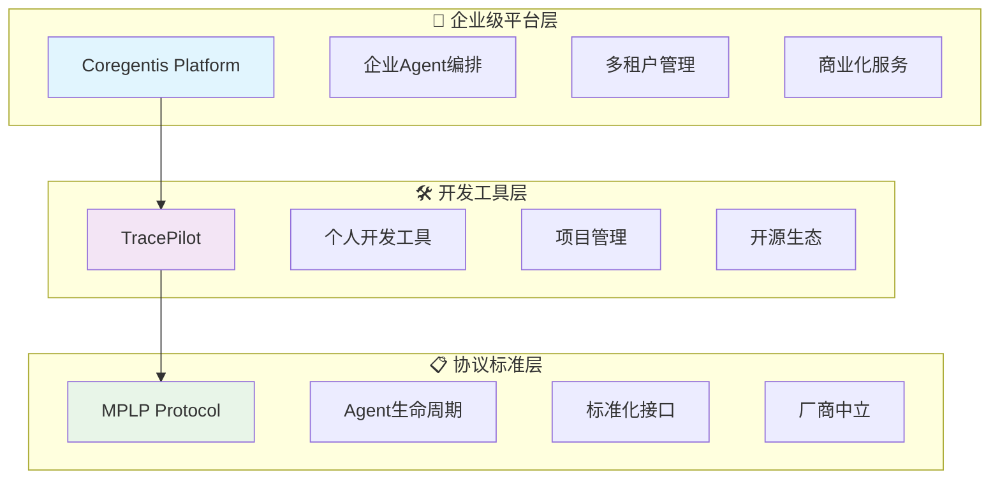
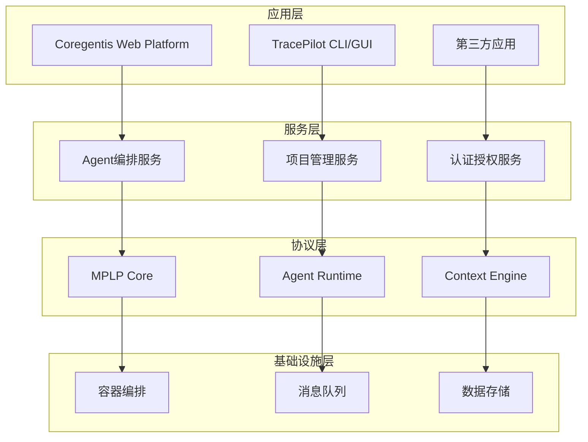
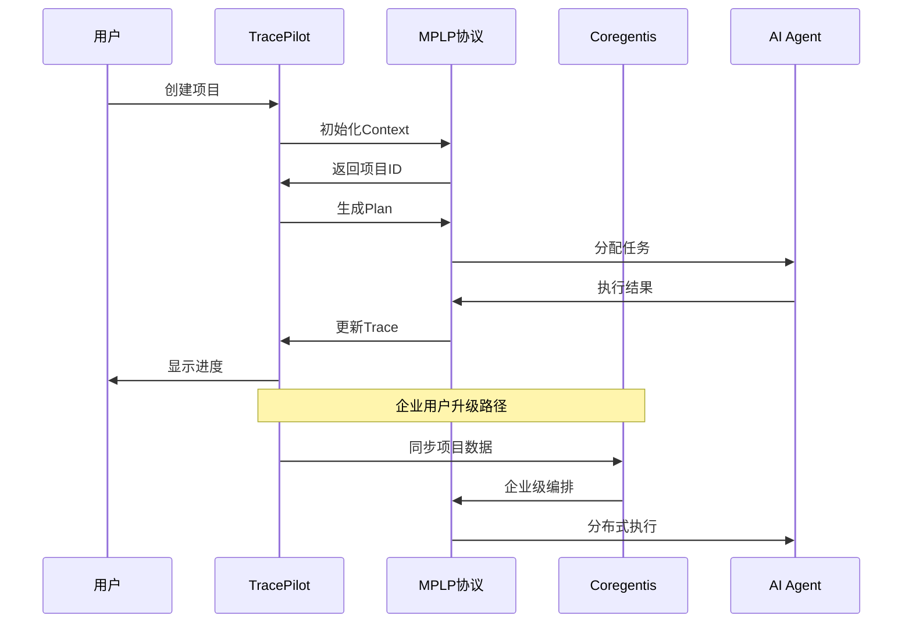

# Coregentis × TracePilot × MPLP 多Agent协作生态系统 1.0 架构总论

**文档版本**: v2.0  
**更新日期**: 2024年12月  
**更新说明**: 完善三大业务生态1.0业务架构总论，新增风险管理、竞争分析和总结展望

---

## 📋 目录

1. [生态系统概览](#生态系统概览)
2. [核心业务模块架构](#核心业务模块架构)
3. [技术架构设计](#技术架构设计)
4. [分阶段实施路径](#分阶段实施路径)
5. [商业化策略与变现路径](#商业化策略与变现路径)
6. [成功指标体系](#成功指标体系)
7. [各业务的功能边界与组成板块](#各业务的功能边界与组成板块)
8. [风险管理与应对策略](#风险管理与应对策略)
9. [竞争优势与差异化](#竞争优势与差异化)
10. [愿景与使命](#愿景与使命)
11. [总结与展望](#总结与展望)

---

## 🌟 一、生态系统概览

### 1.1 整体战略定位

**Coregentis × TracePilot × MPLP** 构建了一个完整的多Agent协作生态系统，通过**协议标准化 → 工具普及化 → 平台商业化**的三层架构，实现从个人开发者到企业用户的全覆盖。



### 1.2 角色层级定位

| 层级 | 产品/协议 | 核心功能 | 对应用户 | 商业模式 |
|------|-----------|----------|----------|----------|
| **平台层** | Coregentis | 企业级Agent编排与管理 | 企业客户、团队 | SaaS订阅、私有部署 |
| **工具层** | TracePilot | 个人开发工具与项目管理 | 个人开发者、小团队 | 开源免费、Pro版本 |
| **协议层** | MPLP | Agent生命周期标准化 | 平台厂商、开发者 | 生态授权、认证服务 |

### 1.3 生态价值主张

- **技术标准化**: 建立多Agent协作的行业标准
- **工具普及化**: 降低AI Agent开发和使用门槛
- **平台商业化**: 为企业提供完整的Agent运营解决方案
- **生态协同化**: 构建开放、协作、共赢的AI生态系统

---

## 🏗️ 二、核心业务模块架构

### 2.1 MPLP协议层（生态底座）

**定位**: 厂商中立的Agent生命周期标准协议

#### 核心模块组成
- **Context管理**: 项目上下文与长期记忆
- **Plan规划**: 任务分解与执行计划
- **Execute执行**: 多Agent协作执行
- **Trace追踪**: 全流程审计与监控
- **Learn学习**: 基于反馈的自我优化

#### 技术特性
- 协议标准化，支持多种实现
- 厂商中立，促进生态开放
- 可扩展架构，适应不同场景

### 2.2 TracePilot工具层（开发入口）

**定位**: MPLP协议的首个落地实现，个人开发者的AI助手

#### 核心模块组成
- **项目管理器**: 基于MPLP的项目生命周期管理
- **Agent执行器**: 本地化的AI Agent运行环境
- **插件生态**: 可扩展的工具和集成
- **社区平台**: 开源协作与知识分享

#### 技术特性
- 本地化部署，保护隐私
- 轻量级架构，快速启动
- 开源生态，社区驱动

### 2.3 Coregentis平台层（企业枢纽）

**定位**: 企业级AI Agent协作与管理平台

#### 核心模块组成
- **多租户管理**: 企业级权限与资源隔离
- **Agent编排**: 大规模Agent协作调度
- **能力市场**: Agent模板与服务交易
- **集成中心**: 企业系统深度集成

#### 技术特性
- 云原生架构，弹性扩展
- 企业级安全，合规认证
- 商业化服务，持续运营

---

## 🔧 三、技术架构设计

### 3.1 分层技术栈



### 3.2 数据流架构



---

## 📅 四、分阶段实施路径

### 4.1 第一阶段：基础建设 (0-6个月)

**目标**: 建立技术基础，验证核心概念

#### MPLP协议开发
- [ ] 完成核心协议规范设计
- [ ] 实现TypeScript参考实现
- [ ] 建立协议测试套件
- [ ] 发布v1.0协议标准

#### TracePilot MVP开发
- [ ] 核心功能实现（项目管理、AI代码生成）
- [ ] MPLP协议集成
- [ ] Claude API集成
- [ ] GitHub开源发布

#### Coregentis原型验证
- [ ] 核心架构设计
- [ ] 多租户基础框架
- [ ] MPLP协议服务端实现
- [ ] 内部测试版本

### 4.2 第二阶段：生态扩展 (6-12个月)

**目标**: 建立用户基础，扩展生态合作

#### TracePilot社区建设
- [ ] 达到1000+ GitHub Stars
- [ ] 建立开发者社区
- [ ] 发布插件生态
- [ ] 集成主流开发工具

#### MPLP生态推广
- [ ] 与主流AI平台合作
- [ ] 第三方实现支持
- [ ] 开发者文档完善
- [ ] 协议认证体系

#### Coregentis Beta测试
- [ ] 邀请企业用户测试
- [ ] 完善企业级功能
- [ ] 建立能力市场
- [ ] 商业模式验证

### 4.3 第三阶段：商业化突破 (12-24个月)

**目标**: 实现商业变现，建立市场地位

#### 商业化里程碑
- [ ] Coregentis正式商业化
- [ ] 获得100+企业客户
- [ ] 实现月度经常性收入
- [ ] 建立合作伙伴网络

#### 技术领先性
- [ ] AI感知与自进化系统
- [ ] 行业解决方案模板
- [ ] 企业级安全认证
- [ ] 国际化部署

### 4.4 第四阶段：生态主导 (24-36个月)

**目标**: 成为行业标准，建立生态护城河

#### 生态主导地位
- [ ] MPLP成为行业标准
- [ ] TracePilot达到10万+用户
- [ ] Coregentis成为头部平台
- [ ] 建立技术专利池

---

## 💰 五、商业化策略与变现路径

### 5.1 分层变现模型

| 层级 | 产品 | 变现方式 | 目标收入 | 时间节点 |
|------|------|----------|----------|----------|
| **协议层** | MPLP | 生态授权、认证服务 | $1M ARR | 18个月 |
| **工具层** | TracePilot | 开源免费、Pro版本 | $5M ARR | 24个月 |
| **平台层** | Coregentis | SaaS订阅、企业定制 | $50M ARR | 36个月 |

### 5.2 用户转化漏斗

```
开源用户 (TracePilot) ──► 个人Pro用户 ──► 团队用户 ──► 企业客户 (Coregentis)
   100,000                    10,000           1,000           100
     ↓                          ↓                ↓               ↓
   免费使用                   $29/月          $99/月        $10,000/年
```

### 5.3 收入结构预测

**Year 1**: 主要投入期，专注产品开发和用户获取
- TracePilot: 开源免费，建立用户基础
- MPLP: 协议推广，建立标准地位
- Coregentis: 内测阶段，验证商业模式

**Year 2**: 商业化启动期
- TracePilot Pro: $5M ARR (10,000用户 × $29/月 × 12月)
- Coregentis: $10M ARR (100企业 × $10万/年)
- MPLP授权: $1M ARR

**Year 3**: 规模化增长期
- TracePilot生态: $15M ARR
- Coregentis平台: $50M ARR
- MPLP生态: $5M ARR
- **总计**: $70M ARR

---

## 📊 六、成功指标体系

### 6.1 技术指标

| 指标类别 | 具体指标 | Year 1目标 | Year 2目标 | Year 3目标 |
|----------|----------|------------|------------|------------|
| **协议采用** | MPLP实现数量 | 3个 | 10个 | 50个 |
| **工具使用** | TracePilot活跃用户 | 1万 | 5万 | 20万 |
| **平台规模** | Coregentis企业客户 | 10家 | 100家 | 500家 |

### 6.2 商业指标

| 指标类别 | 具体指标 | Year 1目标 | Year 2目标 | Year 3目标 |
|----------|----------|------------|------------|------------|
| **收入规模** | 年度经常性收入 | $0.5M | $16M | $70M |
| **用户价值** | 平均客户价值 | $1,000 | $5,000 | $20,000 |
| **增长速度** | 月度增长率 | 20% | 15% | 10% |

### 6.3 生态指标

| 指标类别 | 具体指标 | Year 1目标 | Year 2目标 | Year 3目标 |
|----------|----------|------------|------------|------------|
| **社区活跃** | GitHub Stars | 1,000 | 5,000 | 20,000 |
| **开发者** | 活跃开发者数量 | 100 | 1,000 | 5,000 |
| **合作伙伴** | 生态合作伙伴 | 5家 | 20家 | 100家 |

---

## 🧱 七、各业务的功能边界与组成板块

### 1️⃣ MPLP — **多 Agent 项目生命周期协议**

#### 🧭 战略定位

> 定义 Agent 协作全生命周期的基础协议，构建可复用、可治理的 AI 系统协作标准。

#### 🧩 协议板块

| 模块       | 功能描述                      |
| -------- | ------------------------- |
| Context  | 管理共享上下文（如项目背景、长期记忆）       |
| Plan     | 任务规划与子任务拆解                |
| Execute  | 实际执行任务，支持嵌套、并行、多 Agent 执行 |
| Confirm  | 任务完成后的确认与状态流转             |
| Trace    | 项目过程的追踪与审计                |
| Learn    | 基于执行结果的自我改进机制             |
| Role     | 定义 Agent 的职责边界与权限模型       |
| Workflow | 编排任务执行顺序与依赖关系             |
| Delivery | 定义交付标准与验收要求               |
| Test     | 支持任务输出的验证机制与覆盖率报告         |

#### 📦 输出物

* 协议文档（Markdown + 架构图）
* JSON Schema / YAML Schema
* TypeScript + Python SDK
* 示例工作流定义 / Playground DSL

---

### 2️⃣ TracePilot — **MPLP 协议的项目化实现工具**

#### 🧭 战略定位

> 作为 MPLP 的第一个落地实现，帮助个人用户通过 MCP 工具完成项目闭环。未来成为多 Agent 多项目的任务协调中枢。

#### 🧩 产品阶段与功能模块

##### ✅ MVP 阶段（v1.0）：本地单用户版本

| 模块                      | 功能说明                  |
| ----------------------- | --------------------- |
| `task_planner`          | 自动补全任务的输入/输出/验收/预估时间  |
| `agent_task_runner`     | 本地化 Agent 执行器，连接多任务流程 |
| `memory_card_generator` | 为每个任务生成上下文卡片，便于记忆与追溯  |
| `project_packager`      | 将项目按目录结构打包发布          |
| `project_doc_generator` | 自动生成 README、接口文档等     |
| `delivery_checklist`    | 交付阶段生成完整 checklist    |
| `test_log_updater`      | 自动更新测试覆盖与日志           |

##### 🔄 演化阶段（v2.0+）：多 Agent 多项目协调枢纽

| 模块                         | 功能说明                            |
| -------------------------- | ------------------------------- |
| `multi-agent-orchestrator` | 多 Agent 调度与上下文切片管理              |
| `project_hub`              | 支持同时管理多个项目的上下文、依赖、状态            |
| `plugin_interface`         | 插件机制，支持文档生成器、测试器、Agent 插件等      |
| `CLI工具链`                   | 用于快速初始化、规划、打包、部署项目              |
| `MPLP gateway`             | 与平台 Coregentis、远程 Agent 通信的接口网关 |

#### 📦 输出物

* CLI 工具包
* 本地数据库或文件系统目录规范（如 `.tracepilot/`）
* 插件系统与文档
* AgentHub 原型（v2.0+）

---

### 3️⃣ Coregentis — **企业级 AI 项目平台**

#### 🧭 战略定位

> 以 MPLP 为底层协议、以 TracePilot 为边缘节点，构建 AI 项目的"统一协作操作系统"。支撑 SaaS / 私有部署 / AaaS 模式，服务企业的智能开发运营。

#### 🧩 核心模块（平台级）

| 板块                 | 功能说明                                    |
| ------------------ | --------------------------------------- |
| ProjectSpace       | 多项目管理、状态跟踪、Agent 分布式执行                  |
| AgentRegistry      | 管理 Agent 模板、实例权限、调用频率等                  |
| WorkspaceManager   | 多租户工作区、权限控制、团队成员分工                      |
| Audit & Delivery   | 项目追踪、交付日志、测试/验收流程                       |
| IntegrationHub     | 集成 GitHub、Notion、Jira、CI/CD 流程、AI 模型调用等 |
| SaaS Control Plane | 多租户、计费系统、服务化封装                          |
| AaaS Interface     | 向外部客户输出 Agent-as-a-Service 服务           |

#### 📦 输出物

* Web 管理平台（React + API）
* Coregentis 云服务或部署包（Docker）
* 数据接口 API / Agent 接入文档
* 商业版本发布计划（Free / Pro / Enterprise）

---

## ⚠️ 八、风险管理与应对策略

### 8.1 技术风险

| 风险类型 | 风险描述 | 影响程度 | 应对策略 |
|----------|----------|----------|----------|
| **协议标准化** | MPLP协议未被广泛采用 | 高 | 与主流平台合作，提供迁移工具 |
| **技术债务** | 快速迭代导致代码质量问题 | 中 | 建立代码审查和重构机制 |
| **安全漏洞** | 多Agent协作的安全风险 | 高 | 建立安全审计和认证体系 |
| **性能瓶颈** | 大规模Agent协作的性能问题 | 中 | 分布式架构和性能优化 |

### 8.2 市场风险

| 风险类型 | 风险描述 | 影响程度 | 应对策略 |
|----------|----------|----------|----------|
| **竞争加剧** | 大厂推出类似产品 | 高 | 专注差异化，建立技术护城河 |
| **市场教育** | 用户对多Agent协作认知不足 | 中 | 加强市场教育和案例展示 |
| **客户流失** | 企业客户转向其他平台 | 中 | 提升产品价值和客户粘性 |
| **资金短缺** | 商业化进展不及预期 | 高 | 多元化融资渠道，控制成本 |

### 8.3 运营风险

| 风险类型 | 风险描述 | 影响程度 | 应对策略 |
|----------|----------|----------|----------|
| **团队扩张** | 快速增长导致管理混乱 | 中 | 建立标准化流程和文化 |
| **开源治理** | TracePilot社区管理困难 | 低 | 建立社区治理委员会 |
| **合规风险** | 数据隐私和安全合规 | 高 | 建立合规团队和认证体系 |
| **供应链** | 第三方服务依赖风险 | 中 | 多供应商策略和备用方案 |

---

## 🏆 九、竞争优势与差异化

### 9.1 核心竞争优势

#### 技术优势
- **协议标准化**: MPLP作为行业标准的先发优势
- **全栈覆盖**: 从协议到工具到平台的完整解决方案
- **AI感知进化**: 自适应学习和优化能力
- **开源生态**: 社区驱动的创新和迭代

#### 商业优势
- **分层变现**: 多层次的商业模式和收入来源
- **用户粘性**: 从个人到企业的完整转化路径
- **生态效应**: 网络效应和平台价值
- **先发优势**: 在多Agent协作领域的领先地位

### 9.2 与竞争对手对比

| 维度 | Coregentis生态 | LangChain/LangGraph | AutoGen | CrewAI |
|------|----------------|---------------------|---------|--------|
| **协议标准** | MPLP原生支持 | 无标准协议 | 微软生态 | 简化框架 |
| **工具生态** | TracePilot完整工具 | 开发框架为主 | VS Code插件 | 命令行工具 |
| **企业平台** | Coregentis SaaS | 无企业平台 | Azure集成 | 无企业版 |
| **商业模式** | 分层变现 | 开源+咨询 | 微软生态 | 开源为主 |
| **用户覆盖** | 个人到企业 | 开发者为主 | 企业为主 | 开发者为主 |

### 9.3 护城河建设

#### 技术护城河
- **协议专利**: MPLP协议的知识产权保护
- **算法优势**: AI感知和自进化算法
- **数据优势**: 大规模Agent协作数据
- **生态集成**: 与主流AI平台的深度集成

#### 商业护城河
- **网络效应**: 用户和开发者的双边网络
- **转换成本**: 企业客户的迁移成本
- **品牌效应**: 在多Agent协作领域的品牌认知
- **规模经济**: 平台规模带来的成本优势

---

## 🎯 十、愿景与使命

### 10.1 愿景目标

**成为全球领先的多Agent协作生态系统，让AI Agent协作像HTTP协议一样普及和标准化**

- **短期愿景 (1-2年)**: 建立多Agent协作的技术标准和开发者生态
- **中期愿景 (3-5年)**: 成为企业AI Agent协作的首选平台
- **长期愿景 (5-10年)**: 构建全球领先的AI Agent生态系统

### 10.2 使命宣言

**让每个开发者都能轻松构建和协作AI Agent，让每个企业都能高效管理和编排AI能力**

通过标准化协议、工具化入口和平台化服务，我们致力于：
- 降低AI Agent开发和使用门槛
- 提升多Agent协作效率和质量
- 推动AI技术的普及和应用创新
- 构建开放、协作、共赢的AI生态系统

### 10.3 核心价值观

- **开放协作**: 拥抱开源，促进生态合作
- **标准先行**: 建立行业标准，推动技术发展
- **用户至上**: 以用户需求为导向，持续创新
- **技术驱动**: 坚持技术创新，追求卓越品质
- **生态共赢**: 与合作伙伴共同成长，实现多方共赢

---

## 📋 十一、总结与展望

### 11.1 战略总结

Coregentis × TracePilot × MPLP 三大业务生态系统通过**协议标准化 → 工具普及化 → 平台商业化**的分层策略，构建了从个人开发者到企业用户的完整覆盖体系。

**核心优势**:
- 技术领先性：MPLP协议的标准化优势
- 生态完整性：从工具到平台的全栈解决方案
- 商业可持续性：多层次的变现模式
- 市场差异化：在多Agent协作领域的独特定位

### 11.2 关键成功因素

1. **协议采用率**: MPLP协议能否成为行业标准
2. **社区建设**: TracePilot开源社区的活跃度
3. **企业客户**: Coregentis平台的企业客户获取
4. **技术创新**: AI感知和自进化能力的实现
5. **生态合作**: 与主流AI平台的合作深度

### 11.3 未来展望

**2025年**: 建立技术基础，验证商业模式
- MPLP协议v1.0发布
- TracePilot开源社区建立
- Coregentis MVP验证

**2026年**: 扩展生态规模，启动商业化
- 协议生态合作伙伴达到10+
- TracePilot用户达到5万+
- Coregentis获得100+企业客户

**2027年**: 实现规模化增长，建立行业地位
- 年度经常性收入达到$70M
- 成为多Agent协作领域的头部平台
- 建立全球化的技术和商业生态

**长期目标**: 成为AI Agent协作的基础设施，推动人工智能技术的普及和应用创新，让AI Agent协作成为数字化时代的标准能力。

---

### 📚 推荐后续输出物

为了团队协作与对外展示，建议同步生成以下资料：

| 输出物 | 用途 | 优先级 |
|--------|------|--------|
| 💡 生态系统蓝图（图形化） | 官网、融资PPT、战略汇报 | 高 |
| 📖 协议白皮书 | 发布MPLP协议，构建开发者共识 | 高 |
| 🧪 产品路线图/开发看板 | 内部团队节奏控制、开源社区规划 | 中 |
| 💼 商业化版本功能对比表 | Coregentis的Free/Pro/Enterprise版本区隔 | 中 |
| 🎨 品牌视觉识别系统 | 统一的品牌形象和视觉规范 | 低 |

---

*本文档将根据市场反馈和技术发展持续更新，确保战略的前瞻性和可执行性。*

**文档状态**: ✅ 已完成 - 三大业务生态1.0架构总论  
**下一步**: 根据优先级推进具体实施计划和详细设计文档