# MPLP AI Agent Document Reference Mapping v1.0

## 📋 **文档引用体系总览**

**目标**: 建立AI Agent执行文档集与MPLP完整文档体系的引用关系
**原则**: 确保AI Agent获得完整、一致、准确的执行指导
**维护**: 文档更新时同步维护引用关系
**CRITICAL**: 所有引用文档必须反映统一架构原则，确保10个模块使用IDENTICAL模式

## 🎯 **核心文档依赖关系图**

### **AI Agent执行文档集依赖的核心文档**

```mermaid
graph TD
    A[AI Agent执行文档集] --> B[.augment/rules/ 规则文档]
    A --> C[docs/architecture/ 架构文档]
    A --> D[docs/implementation/ 实施文档]
    A --> E[src/schemas/ Schema定义]
    
    B --> B1[MPLP-Core-Development-Rules.mdc - 核心开发规则]
    B --> B2[MPLP-Critical-Thinking-Methodology.mdc - SCTM+GLFB+ITCM方法论]
    B --> B3[MPLP-Architecture-Core-Principles.mdc - 架构核心原则]
    B --> B4[MPLP-Development-Workflow.mdc - 开发工作流]
    B --> B5[MPLP-Dual-Naming-Convention.mdc - 双重命名约定]
    B --> B6[MPLP-Module-Standardization.mdc - 模块标准化]
    B --> B7[MPLP-TypeScript-Standards.mdc - TypeScript标准]
    B --> B8[MPLP-Testing-Strategy.mdc - 测试策略]
    
    C --> C1[MPLP-Protocol-Specification-v1.0.md - 协议规范]
    C --> C2[MPLP-Architecture-Design.md - 架构设计]
    C --> C3[MPLP-Implementation-Guide.md - 实施指南]
    C --> C4[Architecture-Decision-Records.md - 架构决策记录]
    
    D --> D1[MPLP-Mapper-Implementation-Templates.md - Mapper模板]
    D --> D2[MPLP-Cross-Cutting-Concerns-Integration-Guide.md - 横切关注点集成]
    D --> D3[MPLP-Module-Refactoring-Step-by-Step-Guide.md - 重构步骤]
    D --> D4[MPLP-Reserved-Interface-Implementation-Templates.md - 预留接口模板]
    D --> D5[MPLP-Quality-Assurance-and-Validation-Framework.md - 质量保证]
    
    E --> E1[src/schemas/core-modules/ - 核心模块Schema]
    E --> E2[src/schemas/cross-cutting-concerns/ - 横切关注点Schema]
```


## 📚 **强制阅读文档清单（更新版）**

### **第一层：核心规则和方法论 (.augment/rules/)**
```markdown
□ 1. .augment/rules/MPLP-Core-Development-Rules.mdc
   目的：理解MPLP v1.0核心开发规则和零技术债务政策

□ 2. .augment/rules/MPLP-Critical-Thinking-Methodology.mdc
   目的：掌握SCTM+GLFB+ITCM标准开发方法论

□ 3. .augment/rules/MPLP-Architecture-Core-Principles.mdc
   目的：理解MPLP架构核心原则和L1-L3分层

□ 4. .augment/rules/MPLP-Development-Workflow.mdc
   目的：掌握MPLP开发工作流和质量标准

□ 5. .augment/rules/MPLP-Dual-Naming-Convention.mdc
   目的：理解Schema-TypeScript双重命名约定

□ 6. .augment/rules/MPLP-Module-Standardization.mdc
   目的：掌握MPLP协议模块标准化规则

□ 7. .augment/rules/MPLP-TypeScript-Standards.mdc
   目的：理解TypeScript严格标准和零技术债务要求

□ 8. .augment/rules/MPLP-Testing-Strategy.mdc
   目的：掌握MPLP测试策略和质量门禁
```

### **第二层：架构设计和协议规范 (docs/architecture/)**
```markdown
□ 9. docs/architecture/MPLP-Protocol-Specification-v1.0.md
   目的：理解MPLP完整协议规范和10个模块定位

□ 10. docs/architecture/MPLP-Architecture-Design.md
    目的：理解MPLP系统架构设计和组件关系

□ 11. docs/architecture/MPLP-Implementation-Guide.md
    目的：掌握MPLP实施指南和最佳实践

□ 12. docs/architecture/Architecture-Decision-Records.md
    目的：理解重要架构决策的背景和理由
```

### **第三层：Schema定义和数据结构（基于实际项目状态）**
```markdown
CRITICAL: 必须基于实际存在的Schema文件，不允许假设

□ 13. src/schemas/mplp-[目标模块].json
    目的：理解目标模块的完整Schema定义（实际文件，draft-07标准）
    要求：必须读取实际文件内容，不允许使用假设的字段名称

□ 14. src/schemas/cross-cutting-concerns/ (实际存在的横切关注点Schema)
    目的：理解实际的横切关注点Schema定义
    要求：基于实际文件结构，确保与其他6个已完成模块的集成方式一致

□ 15. 实际项目Schema结构验证
    目的：确认Schema文件的实际存在和格式
    要求：验证与其他6个已完成模块的Schema结构一致性

□ 16. 双重命名约定映射验证
    目的：确保Schema（snake_case）与TypeScript（camelCase）的映射一致性
    要求：与其他6个已完成模块使用相同的映射模式
```

### **第四层：技术实施指导 (docs/implementation/)**
```markdown
□ 17. docs/implementation/MPLP-Mapper-Implementation-Templates.md
    目的：掌握Mapper实现模板和双重命名约定

□ 18. docs/implementation/MPLP-Cross-Cutting-Concerns-Integration-Guide.md
    目的：掌握9个横切关注点的L1-L3集成架构

□ 19. docs/implementation/MPLP-Reserved-Interface-Implementation-Templates.md
    目的：掌握预留接口模式和Interface-First实现

□ 20. docs/implementation/MPLP-Module-Refactoring-Step-by-Step-Guide.md
    目的：掌握10步重构流程和质量标准

□ 21. docs/implementation/MPLP-Quality-Assurance-and-Validation-Framework.md
    目的：掌握4层验证系统和质量门禁要求
```

## 🔗 **文档间引用关系**

### **规则文档 → 执行文档的引用关系**
```markdown
import-all.mdc → 影响所有执行阶段的质量标准
critical-thinking-methodology.mdc → 影响整个执行流程的思维方式
mplp-architecture-core-principles.mdc → 影响架构理解和设计决策
development-workflow-new.mdc → 影响开发流程和质量门禁
dual-naming-convention.mdc → 影响Schema映射和Mapper实现
module-standardization.mdc → 影响模块结构和接口设计
typescript-standards-new.mdc → 影响代码质量和类型安全
testing-strategy-new.mdc → 影响测试实施和质量验证
```

### **架构文档 → 执行文档的引用关系**
```markdown
MPLP-Protocol-Specification-v1.0.md → 影响架构理解和模块定位
MPLP-Architecture-Design.md → 影响系统设计和组件关系
MPLP-Implementation-Guide.md → 影响实施策略和最佳实践
Architecture-Decision-Records.md → 影响设计决策和权衡考虑
```

### **实施文档 → 执行文档的引用关系**
```markdown
现有实施文档已被AI Agent执行文档集引用
需要确保内容一致性和同步更新
```

## 🔧 **文档一致性维护机制**

### **更新同步规则**
```markdown
✅ 当.mdc规则文档更新时：
- 检查AI Agent执行文档集是否需要同步更新
- 更新相关的约束和标准
- 验证执行流程的一致性

✅ 当架构文档更新时：
- 更新AI Agent执行文档集中的架构理解部分
- 同步协议规范和设计变更
- 验证执行结果的架构合规性

✅ 当实施文档更新时：
- 同步技术实施指导的变更
- 更新模板和示例
- 验证执行流程的技术正确性
```

### **一致性检查清单**
```markdown
□ 规则约束一致性：AI Agent执行是否遵循所有.mdc规则
□ 架构设计一致性：执行结果是否符合架构设计要求
□ 技术实施一致性：实施方法是否与技术指导一致
□ 质量标准一致性：质量门禁是否与标准要求一致
□ 文档版本一致性：所有引用文档是否为最新版本
```

## 📊 **文档引用优先级**

### **🔴 关键引用（必须阅读 - 基于6个已完成模块的统一标准）**
```markdown
- import-all.mdc (核心开发规则 - 统一架构原则)
- critical-thinking-methodology.mdc (SCTM+GLFB+ITCM方法论)
- MPLP-Protocol-Specification-v1.0.md (协议规范 - 统一架构模式)
- 目标模块的实际Schema文件 (src/schemas/mplp-[module].json)
- 所有9个横切关注点Schema文件 (与其他6个模块相同的集成方式)
- 其他6个已完成模块的架构实现参考 (Context/Plan/Confirm/Trace/Role/Extension)
```

### **🟡 重要引用（强烈建议 - 统一实施标准）**
```markdown
- mplp-architecture-core-principles.mdc (统一架构原则)
- development-workflow-new.mdc (统一开发工作流)
- dual-naming-convention.mdc (统一命名约定)
- module-standardization.mdc (统一模块标准)
- 所有技术实施文档 (基于6个已完成模块的成功模式)
- 其他6个模块的DDD架构实现 (确保架构一致性)
```

### **🟢 补充引用（建议阅读 - 统一质量标准）**
```markdown
- typescript-standards-new.mdc (统一TypeScript标准)
- testing-strategy-new.mdc (统一测试策略)
- Architecture-Decision-Records.md (统一架构决策)
- MPLP-Implementation-Guide.md (统一实施指南)
- 其他6个模块的质量实现参考 (确保质量标准一致)
```

## 🎯 **AI Agent使用指导**

### **文档阅读顺序建议**
```markdown
阶段1: 规则和方法论理解
- 阅读8个核心.mdc规则文档
- 理解SCTM+GLFB+ITCM方法论
- 掌握开发约束和质量标准

阶段2: 架构和协议理解  
- 阅读协议规范和架构设计
- 理解模块定位和系统关系
- 掌握架构决策和设计原则

阶段3: Schema和数据结构理解
- 阅读目标模块Schema定义
- 理解横切关注点Schema
- 掌握数据结构和映射关系

阶段4: 技术实施指导
- 阅读技术实施文档
- 掌握具体实施方法和模板
- 理解质量保证和验证机制
```

---

**映射版本**: 2.0.0
**维护责任**: 文档更新时同步维护，确保与其他6个已完成模块的文档引用保持一致
**检查频率**: 每次文档更新后验证一致性
**统一架构要求**: 基于Context/Plan/Confirm/Trace/Role/Extension模块的文档引用经验
**质量基准**: 与其他6个已完成模块保持完全一致的文档引用标准
**CRITICAL**: 确保所有文档引用支持统一架构原则，避免引用冲突或不一致
**兼容性验证**: 100%与其他6个模块的文档引用体系兼容
