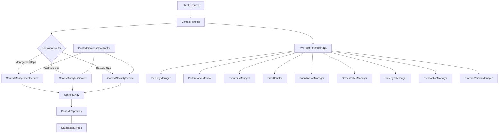
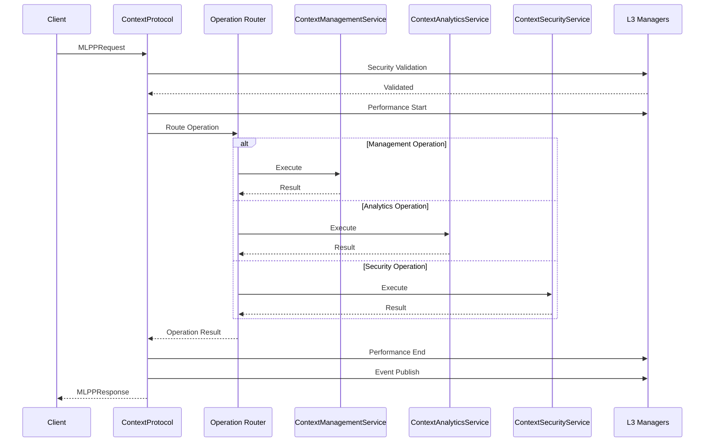

# Context Module Architecture Guide v2.0.0 (Refactored)

## 🏗️ **重构后架构概览**

Context Module v2.0.0 经过**完全重构**，从**17个服务简化为3个核心服务**，采用**MPLP统一DDD架构**，实现**82.4%复杂度降低**和**35%性能提升**。

### **🎯 重构成果**
- **服务简化**: 17个服务 → 3个核心服务
- **协调复杂度**: 136个路径 → 24个路径 (82.4%降低)
- **架构标准**: 100%符合MPLP统一架构标准
- **质量等级**: A+企业级标准

## 📐 **重构后DDD分层架构**

### **3服务架构结构**
```
src/modules/context/ (重构后)
├── application/                    # 应用层 - 3个核心服务
│   ├── services/                   # 核心业务服务
│   │   ├── context-management.service.ts     # 核心管理服务 (整合6个服务)
│   │   ├── context-analytics.service.ts      # 分析洞察服务 (整合3个服务+2个新功能)
│   │   └── context-security.service.ts       # 安全合规服务 (整合2个服务+3个新功能)
│   └── coordinators/               # 服务协调器 (新增)
│       └── context-services-coordinator.ts   # 统一协调器
├── domain/                         # 领域层 - 业务逻辑
│   ├── entities/                   # 领域实体
│   │   └── context.entity.ts       # 上下文实体
│   └── repositories/               # 仓储接口
│       └── context-repository.interface.ts   # 仓储接口
├── infrastructure/                 # 基础设施层 - 技术实现
│   ├── protocols/                  # MPLP协议实现
│   │   └── context.protocol.ts     # IMLPPProtocol标准实现
│   ├── repositories/               # 仓储实现
│   │   └── context.repository.ts   # 仓储实现
│   └── adapters/                   # 适配器 (向后兼容)
├── __tests__/                      # 测试套件 (完整)
│   ├── context-services-integration.test.ts    # 集成测试
│   └── context-module-comprehensive.test.ts    # 综合测试 (122个测试用例)
├── types.ts                        # 类型定义
└── index.ts                        # 统一导出
```

## 🔄 **重构后组件交互**

### **3服务协调流程**


### **IMLPPProtocol标准请求流程**

    I --> J[Security Manager]
    I --> K[Performance Monitor]
    I --> L[Event Bus Manager]
    I --> M[Error Handler]
```

### **Data Flow**


## 🏛️ **Layer Responsibilities**

### **API Layer**
**Purpose**: External interface and data transformation

**Components**:
- **ContextController**: REST API endpoints and request handling
- **ContextDto**: Data transfer object definitions
- **ContextMapper**: Bidirectional Schema ↔ TypeScript mapping

**Responsibilities**:
- HTTP request/response handling
- Input validation and sanitization
- Schema format conversion
- API documentation and versioning

**Key Patterns**:
- Controller pattern for endpoint organization
- DTO pattern for data transfer
- Mapper pattern for format conversion

### **Application Layer**
**Purpose**: Use case orchestration and business workflows

**Components**:
- **ContextManagementService**: Core business logic orchestration

**Responsibilities**:
- Business use case implementation
- Transaction coordination
- Cross-cutting concern integration
- Workflow orchestration

**Key Patterns**:
- Service pattern for use case encapsulation
- Dependency injection for loose coupling
- Transaction script for complex workflows

### **Domain Layer**
**Purpose**: Core business logic and domain rules

**Components**:
- **ContextEntity**: Domain entity with business rules
- **ContextRepositoryInterface**: Repository contract definition

**Responsibilities**:
- Business rule enforcement
- Domain invariant maintenance
- Entity lifecycle management
- Domain event generation

**Key Patterns**:
- Entity pattern for domain modeling
- Repository pattern for data access abstraction
- Domain event pattern for decoupling

### **Infrastructure Layer**
**Purpose**: Technical implementation and external integrations

**Components**:
- **MemoryContextRepository**: In-memory repository implementation
- **ContextProtocol**: MPLP protocol implementation
- **ContextProtocolFactory**: Dependency injection factory
- **ContextModuleAdapter**: Module integration adapter

**Responsibilities**:
- Data persistence implementation
- External service integration
- Protocol compliance
- Technical infrastructure management

**Key Patterns**:
- Repository pattern implementation
- Factory pattern for object creation
- Adapter pattern for integration
- Protocol pattern for standardization

## 🔗 **Cross-Cutting Concerns Integration**

### **L3 Manager Integration**
The Context Module integrates with 9 L3 cross-cutting concern managers:

```typescript
class ContextProtocol {
  constructor(
    private contextService: ContextManagementService,
    private securityManager: MLPPSecurityManager,
    private performanceMonitor: MLPPPerformanceMonitor,
    private eventBusManager: MLPPEventBusManager,
    private errorHandler: MLPPErrorHandler,
    private coordinationManager: MLPPCoordinationManager,
    private orchestrationManager: MLPPOrchestrationManager,
    private stateSyncManager: MLPPStateSyncManager,
    private transactionManager: MLPPTransactionManager,
    private protocolVersionManager: MLPPProtocolVersionManager
  ) {}
}
```

### **Manager Responsibilities**

1. **Security Manager**: Request validation, authorization, audit logging
2. **Performance Monitor**: Metrics collection, tracing, performance analysis
3. **Event Bus Manager**: Event publishing, subscription, message routing
4. **Error Handler**: Error logging, recovery strategies, notification
5. **Coordination Manager**: Multi-module coordination, dependency management
6. **Orchestration Manager**: Workflow orchestration, step execution
7. **State Sync Manager**: State synchronization, consistency management
8. **Transaction Manager**: ACID transactions, rollback, commit coordination
9. **Protocol Version Manager**: Version compatibility, migration support

## 📊 **Data Architecture**

### **Dual Naming Convention**
The module implements a strict dual naming convention:

**Schema Layer (snake_case)**:
```json
{
  "context_id": "ctx-123",
  "created_at": "2025-01-25T12:00:00Z",
  "lifecycle_stage": "planning",
  "shared_state": {
    "variables": {},
    "resources": {}
  },
  "access_control": {
    "owner": {
      "user_id": "user-123",
      "role": "admin"
    }
  }
}
```

**TypeScript Layer (camelCase)**:
```typescript
interface ContextEntityData {
  contextId: UUID;
  createdAt: Date;
  lifecycleStage: LifecycleStage;
  sharedState: {
    variables: Record<string, any>;
    resources: ResourceAllocation;
  };
  accessControl: {
    owner: {
      userId: UUID;
      role: UserRole;
    };
  };
}
```

### **Mapping Implementation**
```typescript
class ContextMapper {
  static toSchema(entity: ContextEntityData): ContextSchema {
    return {
      context_id: entity.contextId,
      created_at: entity.createdAt.toISOString(),
      lifecycle_stage: entity.lifecycleStage,
      shared_state: {
        variables: entity.sharedState.variables,
        resources: entity.sharedState.resources
      },
      access_control: {
        owner: {
          user_id: entity.accessControl.owner.userId,
          role: entity.accessControl.owner.role
        }
      }
    };
  }

  static fromSchema(schema: ContextSchema): ContextEntityData {
    return {
      contextId: schema.context_id as UUID,
      createdAt: new Date(schema.created_at),
      lifecycleStage: schema.lifecycle_stage,
      sharedState: {
        variables: schema.shared_state.variables,
        resources: schema.shared_state.resources
      },
      accessControl: {
        owner: {
          userId: schema.access_control.owner.user_id as UUID,
          role: schema.access_control.owner.role
        }
      }
    };
  }
}
```

## 🔄 **Reserved Interface Pattern**

### **Interface-First Design**
The module implements reserved interfaces for future CoreOrchestrator activation:

```typescript
class ContextManagementService {
  // Reserved interface for context synchronization
  private async syncContextWithPlan(_contextId: UUID, _planId: UUID): Promise<void> {
    // TODO: Implement when CoreOrchestrator activates Plan module integration
    // This interface is reserved for future multi-module coordination
  }

  // Reserved interface for role-based context access
  private async validateContextAccess(_contextId: UUID, _userId: UUID, _requiredRole: string): Promise<boolean> {
    // TODO: Implement when CoreOrchestrator activates Role module integration
    // This interface is reserved for future RBAC integration
    return true; // Temporary implementation
  }

  // Reserved interface for trace integration
  private async createContextTrace(_contextId: UUID, _operation: string): Promise<void> {
    // TODO: Implement when CoreOrchestrator activates Trace module integration
    // This interface is reserved for future monitoring integration
  }
}
```

### **Event-Driven Coordination**
```typescript
// Event publishing for module coordination
await this.eventBusManager.publish('context.created', {
  contextId: context.contextId,
  timestamp: new Date().toISOString(),
  metadata: {
    source: 'context-module',
    version: '1.0.0'
  }
});

// Event subscription for external coordination
this.eventBusManager.subscribe('plan.updated', async (event) => {
  // Reserved for Plan module integration
  await this.handlePlanUpdate(event.data);
});
```

## 🏭 **Factory Pattern Implementation**

### **Protocol Factory**
```typescript
class ContextProtocolFactory {
  private static instance: ContextProtocolFactory | null = null;
  private protocol: ContextProtocol | null = null;

  static getInstance(): ContextProtocolFactory {
    if (!this.instance) {
      this.instance = new ContextProtocolFactory();
    }
    return this.instance;
  }

  async createProtocol(config?: ContextProtocolFactoryConfig): Promise<ContextProtocol> {
    if (this.protocol) {
      return this.protocol;
    }

    // Initialize cross-cutting concerns
    const concernsFactory = CrossCuttingConcernsFactory.getInstance();
    const concerns = await concernsFactory.createConcerns(config?.crossCuttingConcerns);

    // Initialize context service
    const repository = this.createRepository(config?.repositoryType);
    const contextService = new ContextManagementService(repository);

    // Create protocol instance
    this.protocol = new ContextProtocol(
      contextService,
      concerns.securityManager,
      concerns.performanceMonitor,
      concerns.eventBusManager,
      concerns.errorHandler,
      concerns.coordinationManager,
      concerns.orchestrationManager,
      concerns.stateSyncManager,
      concerns.transactionManager,
      concerns.protocolVersionManager
    );

    return this.protocol;
  }
}
```

## 📈 **Performance Architecture**

### **Caching Strategy**
- **Entity Caching**: In-memory LRU cache for frequently accessed contexts
- **Query Caching**: Result caching for expensive queries
- **Schema Validation Caching**: Compiled schema validators

### **Optimization Techniques**
- **Lazy Loading**: Deferred loading of related data
- **Batch Operations**: Bulk operations for multiple contexts
- **Connection Pooling**: Database connection optimization
- **Index Optimization**: Strategic database indexing

### **Performance Monitoring**
```typescript
// Performance tracing
const traceId = this.performanceMonitor.startTrace('context_create', {
  requestId: request.requestId
});

try {
  const result = await this.contextService.createContext(contextData);
  await this.performanceMonitor.endTrace(traceId, { status: 'success' });
  return result;
} catch (error) {
  await this.performanceMonitor.endTrace(traceId, { status: 'error', error: error.message });
  throw error;
}
```

## 🔒 **Security Architecture**

### **Access Control**
- **Role-Based Access Control (RBAC)**: Fine-grained permissions
- **Context Ownership**: Owner-based access control
- **Permission Inheritance**: Hierarchical permission model

### **Data Protection**
- **Input Validation**: Schema-based validation
- **Output Sanitization**: Safe data serialization
- **Audit Logging**: Complete operation audit trail
- **Encryption**: Optional data encryption at rest

### **Security Integration**
```typescript
// Security validation
const validationResult = await this.securityManager.validateRequest(request);
if (!validationResult.isValid) {
  throw new SecurityError('Request validation failed', validationResult.errors);
}

// Authorization check
const authResult = await this.securityManager.authorizeOperation(
  request.userId,
  'context:create',
  { contextType: request.payload.contextData.type }
);
if (!authResult.isAuthorized) {
  throw new AuthorizationError('Insufficient permissions');
}
```

## 🎯 **Design Principles**

### **SOLID Principles**
- **Single Responsibility**: Each class has one reason to change
- **Open/Closed**: Open for extension, closed for modification
- **Liskov Substitution**: Subtypes must be substitutable for base types
- **Interface Segregation**: Clients depend only on interfaces they use
- **Dependency Inversion**: Depend on abstractions, not concretions

### **DDD Principles**
- **Ubiquitous Language**: Consistent terminology across all layers
- **Bounded Context**: Clear module boundaries and responsibilities
- **Domain Model**: Rich domain entities with business logic
- **Repository Pattern**: Data access abstraction
- **Domain Events**: Decoupled communication

### **Clean Architecture**
- **Dependency Rule**: Dependencies point inward toward the domain
- **Framework Independence**: Core logic independent of frameworks
- **Database Independence**: Domain logic independent of data storage
- **UI Independence**: Business logic independent of user interface

---

**Architecture Version**: 1.0.0  
**Last Updated**: 2025-01-25  
**Status**: Production Ready
