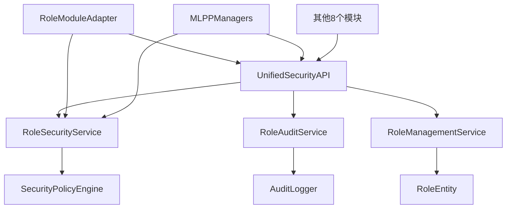
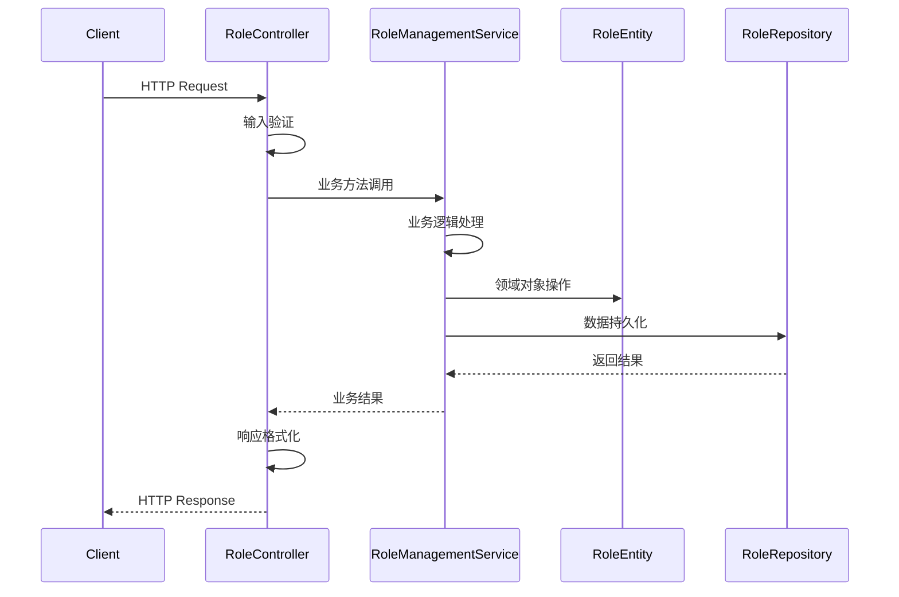
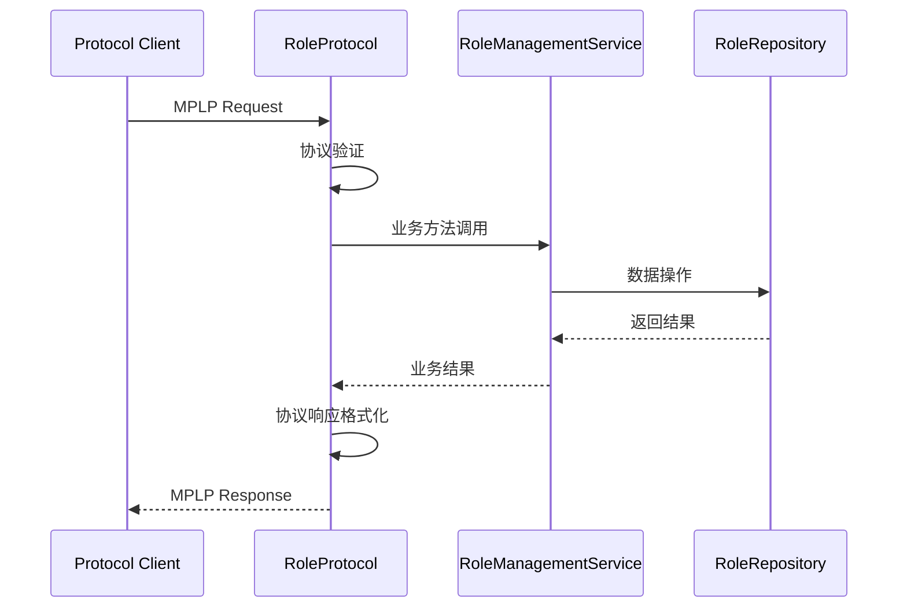

# Role模块架构指南

## 📋 概述

Role模块采用统一DDD架构，实现**统一安全框架**和**企业级RBAC安全中心**，作为MPLP生态系统的第9个企业级模块，为所有模块提供统一的安全验证服务。

**核心定位**: MPLP生态系统的统一安全中心，支持跨模块安全验证和企业级权限管理。

## 🏗️ 整体架构

### 分层架构设计
```
┌─────────────────────────────────────────────────────────────┐
│                        API层 (API Layer)                    │
├─────────────────────────────────────────────────────────────┤
│                      应用层 (Application Layer)              │
├─────────────────────────────────────────────────────────────┤
│                      领域层 (Domain Layer)                   │
├─────────────────────────────────────────────────────────────┤
│                    基础设施层 (Infrastructure Layer)          │
└─────────────────────────────────────────────────────────────┘
```

### 统一安全框架架构


## 🎯 API层 (API Layer)

### 职责
- HTTP请求处理和响应
- 输入验证和格式转换
- 错误处理和状态码管理
- API文档和接口定义

### 核心组件

#### RoleController
```typescript
export class RoleController {
  // REST API端点实现
  async createRole(req: Request, res: Response): Promise<void>
  async getRoleById(req: Request, res: Response): Promise<void>
  async updateRole(req: Request, res: Response): Promise<void>
  async deleteRole(req: Request, res: Response): Promise<void>
  async getAllRoles(req: Request, res: Response): Promise<void>
  async searchRoles(req: Request, res: Response): Promise<void>
  async checkPermission(req: Request, res: Response): Promise<void>
  async getStatistics(req: Request, res: Response): Promise<void>
  async bulkCreateRoles(req: Request, res: Response): Promise<void>
}
```

#### RoleDTO
```typescript
export interface CreateRoleRequest {
  name: string;
  roleType: RoleType;
  description?: string;
  contextId: UUID;
  permissions: Permission[];
  // ... 其他字段
}

export interface UpdateRoleRequest {
  name?: string;
  description?: string;
  permissions?: Permission[];
  // ... 其他字段
}
```

#### RoleMapper
```typescript
export class RoleMapper {
  // Schema ↔ TypeScript 双向映射
  static toSchema(entity: RoleEntity): RoleSchema
  static fromSchema(schema: RoleSchema): RoleEntityData
  static validateSchema(data: unknown): data is RoleSchema
  static toSchemaArray(entities: RoleEntity[]): RoleSchema[]
  static fromSchemaArray(schemas: RoleSchema[]): RoleEntityData[]
}
```

## 🔧 应用层 (Application Layer)

### 职责
- 业务流程编排
- 事务管理
- 应用服务协调
- 跨领域服务集成

### 核心组件

#### RoleManagementService
```typescript
export class RoleManagementService {
  // 核心业务逻辑
  async createRole(request: CreateRoleRequest): Promise<RoleEntity>
  async getRoleById(roleId: UUID): Promise<RoleEntity | null>
  async updateRole(roleId: UUID, request: UpdateRoleRequest): Promise<RoleEntity>
  async deleteRole(roleId: UUID): Promise<boolean>
  async getAllRoles(pagination?: PaginationParams): Promise<PaginatedResult<RoleEntity>>
  
  // 权限管理
  async checkPermission(roleId: UUID, resourceType: string, resourceId: string, action: string): Promise<boolean>
  async addPermission(roleId: UUID, permission: Permission): Promise<RoleEntity>
  async removePermission(roleId: UUID, permissionId: UUID): Promise<RoleEntity>
  
  // 高级功能
  async searchRoles(searchTerm: string, pagination?: PaginationParams): Promise<PaginatedResult<RoleEntity>>
  async getRoleStatistics(): Promise<RoleStatistics>
  async bulkCreateRoles(requests: CreateRoleRequest[]): Promise<BulkOperationResult>
}
```

### 横切关注点集成
```typescript
export class RoleManagementService {
  constructor(
    private repository: IRoleRepository,
    private securityManager: MLPPSecurityManager,
    private performanceMonitor: MLPPPerformanceMonitor,
    private eventBusManager: MLPPEventBusManager,
    private errorHandler: MLPPErrorHandler,
    private coordinationManager: MLPPCoordinationManager,
    private orchestrationManager: MLPPOrchestrationManager,
    private stateSyncManager: MLPPStateSyncManager,
    private transactionManager: MLPPTransactionManager,
    private protocolVersionManager: MLPPProtocolVersionManager
  ) {}
}
```

## 🏛️ 领域层 (Domain Layer)

### 职责
- 业务规则和逻辑
- 领域实体定义
- 仓库接口定义
- 领域服务

### 核心组件

#### RoleEntity
```typescript
export class RoleEntity {
  // 核心属性
  roleId: UUID;
  name: string;
  roleType: RoleType;
  description?: string;
  contextId: UUID;
  status: RoleStatus;
  
  // 权限和安全
  permissions: Permission[];
  inheritance?: RoleInheritance;
  delegation?: RoleDelegation;
  
  // 审计和监控
  auditTrail: AuditTrail;
  performanceMetrics: PerformanceMetrics;
  
  // 业务方法
  hasPermission(resourceType: string, resourceId: string, action: string): boolean
  addPermission(permission: Permission): void
  removePermission(permissionId: UUID): void
  activate(): void
  deactivate(): void
}
```

#### IRoleRepository
```typescript
export interface IRoleRepository {
  // 基础CRUD
  create(role: RoleEntity): Promise<RoleEntity>
  findById(roleId: UUID): Promise<RoleEntity | null>
  update(role: RoleEntity): Promise<RoleEntity>
  delete(roleId: UUID): Promise<boolean>
  
  // 查询方法
  findAll(pagination?: PaginationParams): Promise<PaginatedResult<RoleEntity>>
  findByContextId(contextId: UUID, pagination?: PaginationParams): Promise<PaginatedResult<RoleEntity>>
  findByType(roleType: RoleType, pagination?: PaginationParams): Promise<PaginatedResult<RoleEntity>>
  search(searchTerm: string, pagination?: PaginationParams): Promise<PaginatedResult<RoleEntity>>
  
  // 统计方法
  count(): Promise<number>
  countByStatus(status: RoleStatus): Promise<number>
  getStatistics(): Promise<RoleStatistics>
}
```

## 🔩 基础设施层 (Infrastructure Layer)

### 职责
- 数据持久化
- 外部服务集成
- 协议实现
- 模块适配

### 核心组件

#### RoleRepository
```typescript
export class RoleRepository implements IRoleRepository {
  private roles: Map<UUID, RoleEntity> = new Map();
  
  // 内存存储实现
  async create(role: RoleEntity): Promise<RoleEntity>
  async findById(roleId: UUID): Promise<RoleEntity | null>
  async update(role: RoleEntity): Promise<RoleEntity>
  async delete(roleId: UUID): Promise<boolean>
  
  // 高性能查询实现
  async search(searchTerm: string, pagination?: PaginationParams): Promise<PaginatedResult<RoleEntity>>
  async getStatistics(): Promise<RoleStatistics>
}
```

#### RoleProtocol
```typescript
export class RoleProtocol implements IMLPPProtocol {
  // MPLP协议实现
  async executeOperation(request: MLPPRequest): Promise<MLPPResponse>
  async healthCheck(): Promise<HealthStatus>
  getProtocolMetadata(): ProtocolMetadata
  
  // 支持的操作
  private async handleCreateRole(payload: unknown): Promise<RoleEntity>
  private async handleGetRole(payload: unknown): Promise<RoleEntity | null>
  private async handleUpdateRole(payload: unknown): Promise<RoleEntity>
  private async handleDeleteRole(payload: unknown): Promise<boolean>
  // ... 其他操作处理
}
```

#### RoleModuleAdapter
```typescript
export class RoleModuleAdapter {
  // 模块集成适配
  async initialize(options: RoleModuleOptions): Promise<RoleModuleResult>
  async shutdown(): Promise<void>
  getModuleInfo(): ModuleInfo
  
  // 健康检查
  async healthCheck(): Promise<HealthStatus>
  
  // 配置管理
  updateConfiguration(config: Partial<RoleModuleOptions>): Promise<void>
}
```

## 🔄 数据流架构

### 请求处理流程


### 协议处理流程


## 🎯 设计模式

### 使用的设计模式

#### 1. 仓库模式 (Repository Pattern)
- **目的**: 封装数据访问逻辑
- **实现**: IRoleRepository接口和RoleRepository实现
- **优势**: 数据访问抽象化，便于测试和替换

#### 2. 适配器模式 (Adapter Pattern)
- **目的**: 模块间接口适配
- **实现**: RoleModuleAdapter
- **优势**: 解耦模块依赖，提高可扩展性

#### 3. 策略模式 (Strategy Pattern)
- **目的**: 权限检查策略
- **实现**: 不同权限检查算法
- **优势**: 灵活的权限控制策略

#### 4. 观察者模式 (Observer Pattern)
- **目的**: 事件通知
- **实现**: 事件发布订阅机制
- **优势**: 松耦合的事件处理

#### 5. 工厂模式 (Factory Pattern)
- **目的**: 对象创建
- **实现**: 角色和权限对象创建
- **优势**: 统一的对象创建逻辑

## 🔒 安全架构

### 多层安全防护
```
┌─────────────────────────────────────────┐
│            网络安全层                    │
│  • TLS 1.3加密传输                      │
│  • API网关认证                          │
│  • 防火墙和入侵检测                      │
├─────────────────────────────────────────┤
│            应用安全层                    │
│  • JWT令牌验证                          │
│  • 角色权限检查                         │
│  • 输入验证和清理                       │
├─────────────────────────────────────────┤
│            数据安全层                    │
│  • 敏感数据加密                         │
│  • 审计日志记录                         │
│  • 数据访问控制                         │
└─────────────────────────────────────────┘
```

### 权限控制模型
```typescript
interface Permission {
  permissionId: UUID;
  resourceType: string;
  resourceId: string;
  actions: string[];
  grantType: 'direct' | 'inherited' | 'delegated';
  constraints?: PermissionConstraints;
}
```

## 📊 性能架构

### 缓存策略
```typescript
interface CacheStrategy {
  // 权限缓存
  permissionCache: {
    ttl: 300; // 5分钟
    maxSize: 10000;
    hitRate: 0.9; // 90%命中率
  };
  
  // 角色缓存
  roleCache: {
    ttl: 600; // 10分钟
    maxSize: 5000;
    hitRate: 0.85; // 85%命中率
  };
  
  // 统计缓存
  statisticsCache: {
    ttl: 3600; // 1小时
    maxSize: 100;
    hitRate: 0.95; // 95%命中率
  };
}
```

### 性能监控
```typescript
interface PerformanceMetrics {
  responseTime: {
    p50: number;
    p95: number;
    p99: number;
  };
  throughput: {
    requestsPerSecond: number;
    operationsPerSecond: number;
  };
  errorRate: {
    percentage: number;
    count: number;
  };
}
```

## 🔧 扩展性设计

### 插件架构
- **权限检查插件**: 自定义权限验证逻辑
- **审计插件**: 自定义审计日志格式
- **存储插件**: 支持多种数据存储后端
- **通知插件**: 自定义事件通知机制

### 配置管理
```typescript
interface RoleModuleOptions {
  enableLogging?: boolean;
  dataSource?: DataSourceConfig;
  cacheConfig?: CacheConfig;
  securityConfig?: SecurityConfig;
  performanceConfig?: PerformanceConfig;
}
```

---

**版本**: 1.0.0  
**最后更新**: 2025-08-26  
**维护者**: MPLP开发团队
