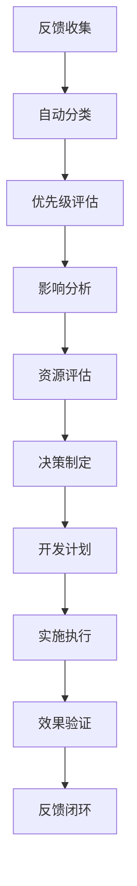

# MPLP V1.1.0-beta 持续改进机制建设计划

## 🎯 **持续改进目标**

建立系统性、数据驱动、用户导向的持续改进机制，确保MPLP生态系统的长期健康发展和持续创新。

### **核心价值**
- **用户导向**: 以用户需求和反馈为改进驱动力
- **数据驱动**: 基于客观数据和指标进行决策
- **快速迭代**: 建立快速响应和迭代的改进循环
- **质量保证**: 确保每次改进都提升整体质量

## 🔄 **改进机制架构**

### **1. 反馈收集系统**

#### **多渠道反馈收集**
```markdown
用户反馈渠道:
- GitHub Issues: 技术问题和功能请求
- Discord社区: 实时讨论和快速反馈
- 用户调研: 定期用户满意度调查
- 使用分析: SDK使用数据和性能指标
- 社交媒体: Twitter、LinkedIn等平台监控
- 邮件反馈: support@mplp.dev
- 在线表单: 结构化反馈收集
```

#### **反馈分类系统**
```typescript
interface FeedbackItem {
  id: string;
  type: 'bug' | 'feature' | 'improvement' | 'question' | 'complaint';
  priority: 'critical' | 'high' | 'medium' | 'low';
  category: 'sdk' | 'studio' | 'adapters' | 'docs' | 'community';
  source: 'github' | 'discord' | 'survey' | 'analytics' | 'social' | 'email';
  status: 'new' | 'triaged' | 'in-progress' | 'resolved' | 'closed';
  impact: 'high' | 'medium' | 'low';
  effort: 'small' | 'medium' | 'large';
  user_segment: 'beginner' | 'intermediate' | 'expert' | 'enterprise';
  created_at: Date;
  updated_at: Date;
}
```

### **2. 问题跟踪系统**

#### **GitHub Issues增强**
```markdown
Issue模板:
- 🐛 Bug报告模板
- ✨ 功能请求模板
- 📚 文档改进模板
- 🚀 性能问题模板
- 🔒 安全问题模板
- 💡 改进建议模板

标签系统:
类型: bug, enhancement, documentation, performance, security
优先级: P0-critical, P1-high, P2-medium, P3-low
模块: core, sdk, studio, adapters, docs
状态: needs-triage, in-progress, blocked, ready-for-review
影响: breaking-change, backward-compatible, internal
```

#### **内部问题跟踪**
```markdown
工具集成:
- Jira: 企业级项目管理
- Linear: 现代化问题跟踪
- Notion: 知识库和文档
- Slack: 团队协作和通知
- GitHub Projects: 开源项目管理
```

### **3. 数据分析系统**

#### **使用分析**
```typescript
interface UsageMetrics {
  // SDK使用指标
  sdk_downloads: number;
  active_projects: number;
  api_calls: number;
  error_rates: Record<string, number>;
  
  // 功能使用统计
  feature_adoption: Record<string, number>;
  platform_usage: Record<string, number>;
  
  // 性能指标
  response_times: Record<string, number>;
  success_rates: Record<string, number>;
  
  // 用户行为
  user_journeys: UserJourney[];
  retention_rates: Record<string, number>;
}
```

#### **质量指标监控**
```markdown
技术指标:
- 代码质量: 复杂度、重复率、技术债务
- 测试覆盖: 单元测试、集成测试、E2E测试
- 性能指标: 响应时间、吞吐量、资源使用
- 安全指标: 漏洞扫描、依赖安全、代码安全

用户体验指标:
- 用户满意度: NPS、CSAT、CES
- 使用便利性: 任务完成率、错误率、学习曲线
- 文档质量: 文档使用率、搜索成功率、反馈评分
- 社区活跃度: 贡献者数量、讨论参与度、问题解决率
```

## 📊 **改进决策流程**

### **1. 反馈处理流程**


### **2. 优先级评估矩阵**
```markdown
评估维度:
- 用户影响: 影响用户数量和程度
- 业务价值: 对产品目标的贡献
- 技术复杂度: 实现难度和风险
- 资源需求: 时间、人力、技术资源
- 战略重要性: 与长期战略的匹配度

评分标准:
- 高优先级: 高影响 + 低复杂度
- 中优先级: 中等影响 + 中等复杂度
- 低优先级: 低影响 + 高复杂度
- 暂缓: 低影响 + 高复杂度 + 低战略价值
```

### **3. 改进实施流程**
```markdown
实施阶段:
1. 需求分析: 详细分析改进需求和目标
2. 方案设计: 制定技术方案和实施计划
3. 原型验证: 快速原型和用户验证
4. 开发实施: 按计划实施改进
5. 测试验证: 全面测试和质量保证
6. 发布部署: 渐进式发布和监控
7. 效果评估: 数据分析和效果评估
8. 反馈收集: 收集用户反馈和使用数据
```

## 🛠️ **技术实现**

### **1. 反馈收集平台**
```typescript
// 统一反馈收集API
class FeedbackCollector {
  async collectFeedback(feedback: FeedbackItem): Promise<void> {
    // 数据验证和清洗
    const cleanedFeedback = this.validateAndClean(feedback);
    
    // 自动分类和标记
    const categorizedFeedback = await this.categorize(cleanedFeedback);
    
    // 存储到数据库
    await this.store(categorizedFeedback);
    
    // 触发通知和工作流
    await this.triggerWorkflow(categorizedFeedback);
  }
  
  async analyzeTrends(): Promise<TrendAnalysis> {
    // 分析反馈趋势和模式
    return this.performTrendAnalysis();
  }
}
```

### **2. 自动化工作流**
```yaml
GitHub Actions工作流:
  feedback-triage:
    - 自动标记和分类新Issues
    - 分配给相应团队成员
    - 发送通知到Slack频道
    
  quality-monitoring:
    - 定期运行质量检查
    - 生成质量报告
    - 监控关键指标变化
    
  user-analytics:
    - 收集和分析使用数据
    - 生成用户行为报告
    - 识别使用模式和问题
```

### **3. 数据分析平台**
```markdown
技术栈:
- 数据收集: Google Analytics, Mixpanel, 自定义埋点
- 数据存储: PostgreSQL, InfluxDB, Redis
- 数据处理: Apache Kafka, Apache Spark
- 数据分析: Python, R, Jupyter Notebooks
- 可视化: Grafana, Tableau, 自定义仪表板
```

## 📈 **改进效果评估**

### **1. 关键指标 (KPIs)**
```markdown
用户满意度指标:
- NPS (Net Promoter Score): >50
- CSAT (Customer Satisfaction): >4.0/5.0
- 用户留存率: >80% (月度)
- 功能采用率: >60% (新功能)

技术质量指标:
- Bug修复时间: <48小时 (P0), <1周 (P1)
- 功能交付周期: <2周 (小功能), <1月 (大功能)
- 代码质量评分: >8.0/10
- 测试覆盖率: >95%

社区健康指标:
- 活跃贡献者: >50人/月
- 问题响应时间: <24小时
- 文档更新频率: >2次/周
- 社区讨论参与度: >100条/周
```

### **2. 效果评估方法**
```markdown
定量评估:
- A/B测试: 对比改进前后的关键指标
- 趋势分析: 长期趋势和季节性变化
- 相关性分析: 改进措施与指标变化的关联
- 用户行为分析: 用户路径和行为模式变化

定性评估:
- 用户访谈: 深度了解用户体验变化
- 焦点小组: 收集特定用户群体反馈
- 专家评审: 技术专家和行业专家评估
- 社区反馈: 开源社区的反馈和建议
```

## 🔄 **持续改进循环**

### **改进周期**
```markdown
日常改进 (每日):
- 监控关键指标
- 处理紧急问题
- 收集用户反馈
- 更新问题状态

周度改进 (每周):
- 分析周度数据
- 评估改进效果
- 调整改进计划
- 团队回顾会议

月度改进 (每月):
- 月度数据分析
- 用户满意度调研
- 改进计划评估
- 战略调整会议

季度改进 (每季度):
- 季度业务回顾
- 长期趋势分析
- 战略规划调整
- 年度目标评估
```

### **改进文化建设**
```markdown
团队文化:
- 鼓励实验和创新
- 容忍失败，快速学习
- 数据驱动决策
- 用户至上原则

流程优化:
- 简化反馈流程
- 自动化重复工作
- 提高响应速度
- 增强透明度

知识管理:
- 建立改进知识库
- 分享最佳实践
- 记录经验教训
- 培训和能力建设
```

## 📋 **实施计划**

### **第1阶段: 基础建设 (1个月)**
- [ ] 建立反馈收集系统
- [ ] 配置问题跟踪工具
- [ ] 设置数据分析平台
- [ ] 制定改进流程规范

### **第2阶段: 系统完善 (2个月)**
- [ ] 完善自动化工作流
- [ ] 建立质量监控体系
- [ ] 实施用户分析系统
- [ ] 培训团队使用新流程

### **第3阶段: 优化提升 (3个月)**
- [ ] 优化改进决策流程
- [ ] 增强数据分析能力
- [ ] 建立改进效果评估
- [ ] 形成持续改进文化

---

**结论**: 通过建立系统性的持续改进机制，MPLP将能够快速响应用户需求，持续提升产品质量，保持技术领先地位，实现可持续发展。

**当前状态**: 📋 **计划完成，准备实施**  
**预期效果**: **显著提升用户满意度和产品质量**  
**实施周期**: **3个月建设，长期运营**
