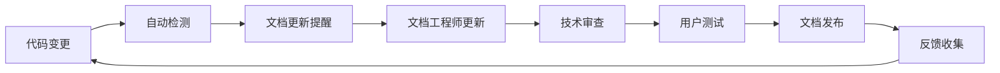

# MPLP v1.1.0-beta 文档同步规划

## 🎯 **文档同步战略**

### **GLFB文档管理应用**
- **全局文档架构**: 建立统一的文档体系和标准
- **局部文档执行**: 各模块文档的具体实现和维护
- **反馈循环机制**: 文档质量持续改进和用户反馈集成

### **文档同步原则**
- **代码文档一致性**: 代码变更必须同步更新文档
- **版本文档对应性**: 每个版本都有对应的完整文档
- **用户体验优先**: 文档以用户需求为导向
- **持续改进**: 基于用户反馈持续优化文档

## 📚 **文档架构设计**

### **文档分层结构**
```
MPLP文档生态系统
├── 协议文档 (v1.0) - 现有文档保持
│   ├── docs/en/                     # 英文协议文档
│   └── docs/zh-CN/                  # 中文协议文档
├── SDK文档 (v1.1) - 新增文档体系
│   ├── docs-sdk/getting-started/    # 快速开始
│   ├── docs-sdk/api-reference/      # API参考
│   ├── docs-sdk/tutorials/          # 教程指南
│   ├── docs-sdk/guides/             # 开发指南
│   ├── docs-sdk/adapters/           # 适配器文档
│   └── docs-sdk/examples/           # 示例文档
├── 版本文档 (追溯) - 版本管理文档
│   └── V1.1.0-beta/                 # 本版本文档
└── 社区文档 (生态) - 社区建设文档
    ├── CONTRIBUTING.md              # 贡献指南
    ├── CODE_OF_CONDUCT.md           # 行为准则
    └── GOVERNANCE.md                # 治理结构
```

### **文档类型定义**
```markdown
📖 用户文档 (User Documentation):
- 快速开始指南
- 教程和示例
- 最佳实践指南
- 故障排除指南

🔧 开发者文档 (Developer Documentation):
- API参考文档
- 架构设计文档
- 开发指南
- 贡献者指南

📋 项目文档 (Project Documentation):
- 版本规划文档
- 任务追踪文档
- 质量标准文档
- 发布说明文档
```

## 📝 **文档创建规划**

### **Phase 1: 核心SDK文档 (Week 1-4)**

#### **Week 1: 文档基础设施**
**负责人**: 文档工程师
**交付物**:
- [ ] 文档站点框架搭建 (Docusaurus)
- [ ] 文档模板和样式定义
- [ ] 自动化文档生成配置
- [ ] 文档版本管理机制
- [ ] 多语言支持框架

**文档结构创建**:
```bash
# 创建SDK文档目录结构
mkdir -p docs-sdk/{getting-started,api-reference,tutorials,guides,adapters,examples}

# 创建文档模板文件
touch docs-sdk/getting-started/installation.md
touch docs-sdk/getting-started/first-app.md
touch docs-sdk/getting-started/concepts.md
touch docs-sdk/api-reference/sdk-core.md
touch docs-sdk/api-reference/agent-builder.md
touch docs-sdk/api-reference/orchestrator.md
```

#### **Week 2: 核心SDK API文档**
**负责人**: 核心开发工程师 + 文档工程师
**交付物**:
- [ ] @mplp/sdk-core API文档
- [ ] MPLPApplication类文档
- [ ] 模块管理器API文档
- [ ] 配置系统文档
- [ ] 错误处理文档

**文档内容要求**:
```markdown
每个API文档必须包含:
- 功能概述和用途说明
- 完整的参数列表和类型
- 返回值说明和示例
- 使用示例和代码片段
- 错误处理和异常情况
- 相关API的交叉引用
```

#### **Week 3: Agent Builder文档**
**负责人**: Agent开发工程师 + 文档工程师
**交付物**:
- [ ] AgentBuilder API文档
- [ ] 链式配置API文档
- [ ] Agent生命周期文档
- [ ] 平台适配器接口文档
- [ ] Agent模板系统文档

#### **Week 4: Orchestrator文档**
**负责人**: 编排系统工程师 + 文档工程师
**交付物**:
- [ ] MultiAgentOrchestrator API文档
- [ ] 工作流构建器文档
- [ ] 并行执行引擎文档
- [ ] 结果聚合器文档
- [ ] 工作流模板文档

### **Phase 2: CLI工具文档 (Week 5-7)**

#### **CLI命令参考文档**
**负责人**: CLI工具工程师 + 文档工程师
**交付物**:
- [ ] CLI命令完整参考
- [ ] 项目创建指南
- [ ] 代码生成器使用说明
- [ ] 开发服务器配置
- [ ] 调试工具使用指南

**CLI文档格式标准**:
```markdown
每个CLI命令文档格式:
# 命令名称
## 功能描述
## 语法格式
## 参数说明
## 选项列表
## 使用示例
## 相关命令
## 故障排除
```

### **Phase 3: 平台适配器文档 (Week 8-10)**

#### **适配器开发文档**
**负责人**: 平台集成工程师 + 文档工程师
**交付物**:
- [ ] 适配器开发指南
- [ ] 统一接口规范文档
- [ ] 各平台适配器使用说明
- [ ] 第三方适配器开发教程
- [ ] 适配器最佳实践

**适配器文档结构**:
```markdown
每个适配器文档包含:
- 平台介绍和特性
- 安装和配置说明
- API使用示例
- 错误处理指南
- 限制和注意事项
- 故障排除指南
```

### **Phase 4: 示例应用文档 (Week 11-12)**

#### **示例和教程文档**
**负责人**: 应用开发工程师 + 文档工程师
**交付物**:
- [ ] CoregentisBot完整教程
- [ ] 工作流自动化示例
- [ ] AI协调系统示例
- [ ] 企业编排平台示例
- [ ] 最佳实践指南

**教程文档标准**:
```markdown
每个教程必须包含:
- 学习目标和前置条件
- 分步骤详细说明
- 完整的代码示例
- 运行结果展示
- 扩展和定制建议
- 相关资源链接
```

### **Phase 5: 高级工具文档 (Week 13-16)**

#### **可视化工具文档**
**负责人**: 前端开发工程师 + 文档工程师
**交付物**:
- [ ] MPLP Studio用户指南
- [ ] 可视化设计器教程
- [ ] DevTools扩展使用说明
- [ ] 调试和监控指南
- [ ] 高级功能说明

## 🔄 **文档同步机制**

### **代码-文档同步流程**


### **自动化同步工具**
```yaml
文档自动化工具链:
  代码注释提取:
    - TypeDoc: TypeScript API文档生成
    - JSDoc: JavaScript注释提取
    - 自定义脚本: 示例代码提取

  文档构建:
    - Docusaurus: 文档站点构建
    - MDX: 交互式文档支持
    - Mermaid: 图表和流程图

  质量检查:
    - 链接检查器: 确保所有链接有效
    - 拼写检查: 文档内容校对
    - 格式检查: Markdown格式规范
```

### **文档版本管理**
```markdown
版本管理策略:
- 每个SDK版本对应独立的文档版本
- 使用Git标签管理文档版本
- 维护多个版本的文档并行访问
- 提供版本间的迁移指南

版本标记规范:
- docs-v1.1.0-beta: SDK v1.1.0-beta文档
- docs-v1.0.0-alpha: 协议v1.0.0-alpha文档
- docs-latest: 最新版本文档
- docs-stable: 稳定版本文档
```

## 📊 **文档质量保证**

### **文档质量标准**
```markdown
内容质量:
- [ ] 信息准确性: 与代码实现100%一致
- [ ] 完整性: 覆盖所有公开API和功能
- [ ] 清晰性: 语言简洁明了，逻辑清晰
- [ ] 实用性: 提供实际可用的示例和指导

格式质量:
- [ ] 统一格式: 遵循文档模板和样式指南
- [ ] 链接有效: 所有内部外部链接可访问
- [ ] 图片清晰: 截图和图表清晰可读
- [ ] 代码正确: 所有代码示例可运行

用户体验:
- [ ] 导航清晰: 文档结构和导航直观
- [ ] 搜索友好: 支持全文搜索和关键词查找
- [ ] 响应式设计: 支持多设备访问
- [ ] 加载速度: 页面加载时间<3秒
```

### **文档审查流程**
```markdown
三级审查机制:
1. 技术审查 (开发工程师):
   - 技术准确性验证
   - 代码示例测试
   - API文档一致性检查

2. 编辑审查 (文档工程师):
   - 语言表达优化
   - 格式规范检查
   - 用户体验评估

3. 用户审查 (测试用户):
   - 可理解性测试
   - 可操作性验证
   - 反馈收集和改进
```

## 🎯 **文档成功指标**

### **量化指标**
```markdown
覆盖率指标:
- API文档覆盖率: 100%
- 功能文档覆盖率: 100%
- 示例代码覆盖率: ≥80%

质量指标:
- 文档准确率: ≥99%
- 链接有效率: 100%
- 用户满意度: ≥4.5/5.0

使用指标:
- 文档访问量: 月增长≥20%
- 搜索成功率: ≥90%
- 用户停留时间: ≥5分钟
```

### **用户反馈机制**
```markdown
反馈收集渠道:
- 文档页面反馈按钮
- GitHub Issues文档标签
- 社区论坛文档讨论
- 用户调研和访谈

反馈处理流程:
1. 反馈收集和分类
2. 优先级评估和排序
3. 改进方案制定
4. 实施和验证
5. 反馈闭环确认
```

## 📅 **文档维护计划**

### **日常维护**
```markdown
每日任务:
- 监控文档构建状态
- 处理用户反馈和问题
- 更新文档内容

每周任务:
- 文档质量检查
- 链接有效性验证
- 用户数据分析

每月任务:
- 文档使用情况报告
- 用户满意度调研
- 改进计划制定
```

### **版本维护**
```markdown
版本发布时:
- 更新版本相关文档
- 创建迁移指南
- 发布版本说明

版本维护期:
- 修复文档错误
- 补充缺失内容
- 优化用户体验

版本归档时:
- 标记版本状态
- 保留历史访问
- 引导用户升级
```

---

**文档版本**: v1.0  
**创建日期**: 2025-01-XX  
**最后更新**: 2025-01-XX  
**维护者**: 文档团队
