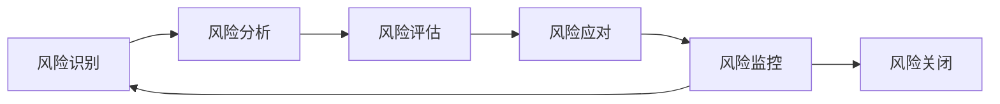

# MPLP v1.1.0-beta 风险管理计划

## 🎯 **风险管理框架**

### **SCTM风险分析应用**
- **系统性风险识别**: 从技术、市场、团队、时间等多维度识别风险
- **关联性风险分析**: 分析风险间的相互影响和连锁反应
- **时间维度风险**: 考虑风险在项目不同阶段的变化
- **批判性风险评估**: 质疑风险评估的准确性和应对措施的有效性

### **风险管理原则**
- **预防优于治疗**: 主动识别和预防风险
- **持续监控**: 定期评估风险状态和应对效果
- **快速响应**: 建立快速风险响应机制
- **学习改进**: 从风险事件中学习和改进

## 📊 **风险识别和分类**

### **技术风险 (Technical Risks)**

#### **高风险 (High Risk)**
| 风险ID | 风险描述 | 概率 | 影响 | 风险等级 | 负责人 |
|--------|----------|------|------|----------|--------|
| T-001 | 核心SDK架构设计缺陷 | 中等 | 极高 | 🔴 高风险 | 架构师 |
| T-002 | 平台API变更导致适配器失效 | 高 | 高 | 🔴 高风险 | 平台集成工程师 |
| T-003 | 并行执行引擎性能不达标 | 中等 | 高 | 🔴 高风险 | 编排系统工程师 |
| T-004 | TypeScript类型系统复杂度过高 | 中等 | 高 | 🔴 高风险 | 核心开发工程师 |

**T-001: 核心SDK架构设计缺陷**
```markdown
风险描述: SDK核心架构设计不合理，导致扩展性差、性能问题或维护困难
影响分析:
- 直接影响: 所有基于SDK的功能开发受阻
- 间接影响: 项目延期、重构成本高、用户体验差
- 连锁反应: 影响CLI工具、适配器、示例应用的开发

预防措施:
- [ ] 进行详细的架构设计评审
- [ ] 建立原型验证核心设计理念
- [ ] 邀请外部专家进行架构审查
- [ ] 制定架构变更的影响评估流程

应急预案:
- 如果发现架构问题，立即暂停相关开发
- 组织架构重新设计会议
- 评估重构成本和时间影响
- 制定分阶段重构计划
```

#### **中等风险 (Medium Risk)**
| 风险ID | 风险描述 | 概率 | 影响 | 风险等级 | 负责人 |
|--------|----------|------|------|----------|--------|
| T-005 | 第三方依赖库版本冲突 | 高 | 中等 | 🟡 中风险 | DevOps工程师 |
| T-006 | 浏览器兼容性问题 | 中等 | 中等 | 🟡 中风险 | 前端开发工程师 |
| T-007 | 测试环境不稳定 | 中等 | 中等 | 🟡 中风险 | 测试工程师 |
| T-008 | 文档生成工具限制 | 低 | 中等 | 🟡 中风险 | 文档工程师 |

#### **低风险 (Low Risk)**
| 风险ID | 风险描述 | 概率 | 影响 | 风险等级 | 负责人 |
|--------|----------|------|------|----------|--------|
| T-009 | 代码格式化工具配置问题 | 低 | 低 | 🟢 低风险 | DevOps工程师 |
| T-010 | 单元测试执行时间过长 | 中等 | 低 | 🟢 低风险 | 测试工程师 |

### **市场风险 (Market Risks)**

#### **高风险 (High Risk)**
| 风险ID | 风险描述 | 概率 | 影响 | 风险等级 | 负责人 |
|--------|----------|------|------|----------|--------|
| M-001 | 竞争对手推出类似产品 | 中等 | 高 | 🔴 高风险 | 产品经理 |
| M-002 | 开发者社区接受度低 | 中等 | 高 | 🔴 高风险 | 社区经理 |

**M-001: 竞争对手推出类似产品**
```markdown
风险描述: 在MPLP v1.1发布前，竞争对手推出功能类似的多智能体开发平台
影响分析:
- 市场先发优势丧失
- 用户获取成本增加
- 需要重新定位产品差异化

预防措施:
- [ ] 持续监控竞争对手动态
- [ ] 加快核心功能开发进度
- [ ] 强化产品独特价值主张
- [ ] 建立技术护城河

应急预案:
- 分析竞争产品的优劣势
- 调整产品定位和营销策略
- 加强技术创新和差异化
- 考虑合作或收购机会
```

### **团队风险 (Team Risks)**

#### **高风险 (High Risk)**
| 风险ID | 风险描述 | 概率 | 影响 | 风险等级 | 负责人 |
|--------|----------|------|------|----------|--------|
| P-001 | 关键开发人员离职 | 低 | 极高 | 🔴 高风险 | 项目经理 |
| P-002 | 团队技能不匹配项目需求 | 中等 | 高 | 🔴 高风险 | 技术经理 |

#### **中等风险 (Medium Risk)**
| 风险ID | 风险描述 | 概率 | 影响 | 风险等级 | 负责人 |
|--------|----------|------|------|----------|--------|
| P-003 | 团队沟通协调问题 | 中等 | 中等 | 🟡 中风险 | 项目经理 |
| P-004 | 工作量估算不准确 | 高 | 中等 | 🟡 中风险 | 技术经理 |

### **时间风险 (Schedule Risks)**

#### **高风险 (High Risk)**
| 风险ID | 风险描述 | 概率 | 影响 | 风险等级 | 负责人 |
|--------|----------|------|------|----------|--------|
| S-001 | 关键路径任务延期 | 中等 | 极高 | 🔴 高风险 | 项目经理 |
| S-002 | 依赖任务阻塞后续开发 | 高 | 高 | 🔴 高风险 | 项目经理 |

**S-001: 关键路径任务延期**
```markdown
风险描述: Phase 1核心SDK开发延期，影响所有后续阶段
影响分析:
- 整个项目时间线延后
- 发布日期推迟
- 市场机会窗口错失
- 团队士气受影响

预防措施:
- [ ] 详细的任务分解和时间估算
- [ ] 建立每日进度跟踪机制
- [ ] 识别关键路径和瓶颈任务
- [ ] 准备备用资源和应急计划

应急预案:
- 重新评估项目范围和优先级
- 调整资源分配，增加关键任务人力
- 考虑并行开发和风险承担
- 与利益相关者沟通调整期望
```

## 🛡️ **风险应对策略**

### **风险应对矩阵**
```markdown
风险应对策略分类:

🚫 规避 (Avoid): 改变项目计划以消除风险
- 适用于: 高概率、高影响的风险
- 示例: 避免使用不成熟的技术栈

🛡️ 缓解 (Mitigate): 降低风险发生概率或影响
- 适用于: 中高风险，可以通过措施降低
- 示例: 通过代码审查降低架构设计风险

📋 接受 (Accept): 接受风险并准备应对措施
- 适用于: 低风险或无法有效缓解的风险
- 示例: 接受第三方API可能的小幅变更

🔄 转移 (Transfer): 将风险转移给第三方
- 适用于: 可以通过保险或外包转移的风险
- 示例: 通过云服务转移基础设施风险
```

### **具体应对措施**

#### **技术风险应对**
```markdown
T-001 架构设计缺陷:
策略: 缓解 (Mitigate)
措施:
- [ ] 建立架构设计评审委员会
- [ ] 制定架构设计检查清单
- [ ] 实施原型驱动的设计验证
- [ ] 建立架构变更影响评估流程
- [ ] 定期进行架构健康度检查

T-002 平台API变更:
策略: 缓解 (Mitigate) + 接受 (Accept)
措施:
- [ ] 建立API变更监控机制
- [ ] 设计适配器抽象层
- [ ] 实施版本兼容性策略
- [ ] 建立快速适配器更新流程
- [ ] 与平台方建立沟通渠道
```

#### **市场风险应对**
```markdown
M-001 竞争对手威胁:
策略: 缓解 (Mitigate)
措施:
- [ ] 加快产品开发和发布节奏
- [ ] 强化产品差异化特性
- [ ] 建立技术专利保护
- [ ] 加强社区建设和用户粘性
- [ ] 建立合作伙伴生态系统

M-002 社区接受度低:
策略: 缓解 (Mitigate)
措施:
- [ ] 早期用户反馈收集和改进
- [ ] 建立开发者布道师计划
- [ ] 提供优质的文档和教程
- [ ] 举办技术分享和培训活动
- [ ] 建立用户成功案例展示
```

#### **团队风险应对**
```markdown
P-001 关键人员离职:
策略: 缓解 (Mitigate) + 转移 (Transfer)
措施:
- [ ] 建立知识文档和传承机制
- [ ] 实施结对编程和知识共享
- [ ] 建立人才储备和培养计划
- [ ] 提供有竞争力的薪酬和发展机会
- [ ] 建立外部技术顾问支持

P-002 技能不匹配:
策略: 缓解 (Mitigate)
措施:
- [ ] 进行技能差距分析
- [ ] 制定针对性培训计划
- [ ] 引入外部专家指导
- [ ] 调整任务分配和团队结构
- [ ] 建立技能认证和激励机制
```

## 📊 **风险监控和报告**

### **风险监控指标**
```markdown
📈 风险监控KPI:
- 高风险事件数量: 目标≤3个
- 风险应对措施完成率: 目标≥90%
- 风险事件平均解决时间: 目标≤48小时
- 风险预测准确率: 目标≥80%

📋 监控频率:
- 高风险: 每日监控
- 中风险: 每周监控
- 低风险: 每月监控
- 风险状态报告: 每周发布
```

### **风险报告模板**
```markdown
# 周度风险状态报告

## 风险概览
- 新增风险: X个
- 风险状态变化: X个
- 已关闭风险: X个
- 当前活跃风险: X个

## 高风险关注
| 风险ID | 风险描述 | 当前状态 | 应对进展 | 预计解决时间 |
|--------|----------|----------|----------|-------------|
| T-001 | 架构设计缺陷 | 监控中 | 评审进行中 | Week 2 |

## 风险趋势分析
- 风险数量趋势: [图表]
- 风险等级分布: [图表]
- 风险解决效率: [图表]

## 下周关注重点
- [ ] 重点监控项目1
- [ ] 重点监控项目2
- [ ] 重点监控项目3
```

### **风险升级机制**
```markdown
🚨 风险升级触发条件:
- 高风险事件发生
- 风险影响超出预期
- 应对措施无效
- 多个风险同时发生

📞 升级联系人:
- 技术风险: 技术总监
- 市场风险: 产品总监
- 团队风险: 人力资源总监
- 时间风险: 项目总监

⏰ 升级时间要求:
- 高风险: 2小时内升级
- 中风险: 24小时内升级
- 紧急情况: 立即升级
```

## 🔄 **风险管理流程**

### **风险管理生命周期**


### **风险管理活动**
```markdown
📅 定期风险管理活动:

每日 (Daily):
- 高风险状态检查
- 应对措施进展跟踪
- 新风险识别和记录

每周 (Weekly):
- 风险状态评审会议
- 风险报告发布
- 应对计划调整

每月 (Monthly):
- 风险管理效果评估
- 风险管理流程优化
- 风险管理培训

每季度 (Quarterly):
- 风险管理策略回顾
- 风险管理工具升级
- 风险管理最佳实践分享
```

## 📚 **风险管理工具和模板**

### **风险登记表模板**
```markdown
# 风险登记表

| 字段 | 说明 | 示例 |
|------|------|------|
| 风险ID | 唯一标识符 | T-001 |
| 风险描述 | 详细描述 | 核心SDK架构设计缺陷 |
| 风险类别 | 分类 | 技术风险 |
| 发生概率 | 高/中/低 | 中等 |
| 影响程度 | 极高/高/中/低 | 极高 |
| 风险等级 | 综合评估 | 高风险 |
| 负责人 | 责任人 | 架构师 |
| 识别日期 | 发现时间 | 2025-01-XX |
| 应对策略 | 策略类型 | 缓解 |
| 应对措施 | 具体措施 | 架构评审 |
| 状态 | 当前状态 | 监控中 |
| 关闭日期 | 解决时间 | - |
```

### **风险评估矩阵**
```markdown
# 风险评估矩阵

影响程度 \ 发生概率 | 低 | 中等 | 高
-------------------|----|----|----
极高                | 🟡 | 🔴 | 🔴
高                  | 🟢 | 🟡 | 🔴
中等                | 🟢 | 🟢 | 🟡
低                  | 🟢 | 🟢 | 🟢

🔴 高风险: 需要立即关注和应对
🟡 中风险: 需要定期监控和管理
🟢 低风险: 可以接受，定期检查
```

---

**文档版本**: v1.0  
**创建日期**: 2025-01-XX  
**最后更新**: 2025-01-XX  
**维护者**: 风险管理团队
