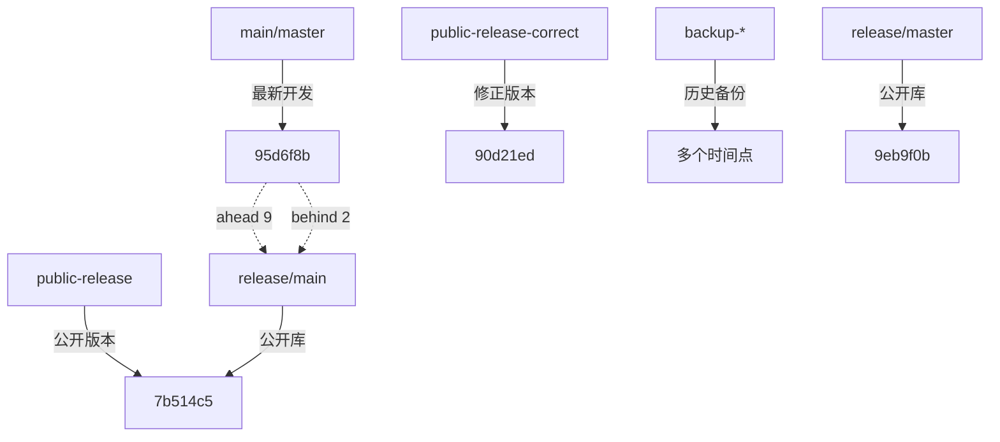

# MPLP项目分支管理分析报告

## 📅 分析日期
2025-10-16

## 🎯 分析框架
**SCTM+GLFB+ITCM+RBCT增强框架**

---

## 🧠 **ITCM智能复杂度评估**

### **任务复杂度**: 🟡 **中等复杂度**
- **评估时间**: 5秒
- **复杂度等级**: 中等（需要系统性分析但不涉及架构变更）
- **执行策略**: 标准决策模式（系统扫描 + 关联分析 + 风险评估）
- **预计时间**: 15-30分钟

---

## 📊 **SCTM系统性批判性思维分析**

### **1. 系统性全局审视**

#### **当前分支结构概览**

```
本地分支 (7个):
├── main ✅ (活跃开发分支)
├── master ✅ (GitHub默认分支)
├── backup-before-organization-20251016-221528 ⚠️ (备份分支)
├── backup-before-reorganization-20250806-001253 ⚠️ (备份分支)
├── backup-confirm-module-completion-20250809-111939 ⚠️ (备份分支)
├── public-release ⚠️ (公开发布分支)
└── public-release-correct ⚠️ (公开发布修正分支)

远程分支 (origin - 内部开发库):
├── origin/main ✅ (同步main)
├── origin/master ✅ (同步master)
├── origin/backup-before-organization-20251016-221528 ⚠️
├── origin/backup-before-reorganization-20250806-001253 ⚠️
└── origin/circleci-project-setup ⚠️ (CircleCI配置分支)

远程分支 (release - 公开发布库):
├── release/main ⚠️ (公开库主分支)
└── release/master ⚠️ (公开库master分支)
```

#### **项目状态**
- **项目阶段**: v1.0 Alpha + v1.1.0-beta SDK 双版本完成
- **开发状态**: 100% 完成，准备企业发布
- **测试状态**: 2,905/2,905 测试通过 (100%)
- **质量状态**: 零技术债务，企业级标准

### **2. 关联影响分析**

#### **分支间关系**



#### **关键发现**

1. **main和master分支同步** ✅
   - 两个分支指向同一提交 (95d6f8b)
   - 内容完全一致
   - 冗余但符合GitHub惯例

2. **公开发布分支混乱** ⚠️
   - `public-release` 和 `public-release-correct` 存在分歧
   - 与 `release/main` 和 `release/master` 不同步
   - 存在多个"公开发布"版本

3. **备份分支过多** ⚠️
   - 3个本地备份分支
   - 2个远程备份分支
   - 占用存储空间，增加管理复杂度

4. **分支命名不一致** ⚠️
   - 使用了中文和英文混合
   - 日期格式不统一
   - 缺乏清晰的命名规范

### **3. 时间维度分析**

#### **分支历史演进**

```
时间线:
2025-08-06: backup-before-reorganization-20250806-001253 (重组前备份)
2025-08-09: backup-confirm-module-completion-20250809-111939 (Confirm模块完成备份)
2025-10-16: backup-before-organization-20251016-221528 (组织前备份)
2025-10-16: 当前main/master (95d6f8b) - CI/CD修复完成
```

#### **历史背景分析**

1. **备份分支的产生原因**
   - 项目经历了多次重大重构
   - 开发者谨慎保留历史状态
   - 缺乏系统的版本管理策略

2. **公开发布分支的演进**
   - 多次尝试创建公开发布版本
   - 存在修正和调整
   - 未能建立清晰的发布流程

### **4. 风险评估**

#### **当前风险**

🔴 **高风险**:
1. **分支混乱导致发布错误**
   - 多个"公开发布"分支可能导致发布错误版本
   - 影响: 严重 - 可能发布不完整或错误的代码
   - 概率: 中等 - 如果不清理，很容易混淆

2. **main和release分支不同步**
   - main分支领先release/main 9个提交
   - 影响: 中等 - 公开库缺少最新修复
   - 概率: 高 - 已经发生

🟡 **中风险**:
1. **备份分支占用资源**
   - 影响: 低 - 主要是存储和管理成本
   - 概率: 高 - 已经存在

2. **分支命名不规范**
   - 影响: 低 - 主要影响可维护性
   - 概率: 高 - 已经存在

### **5. 批判性验证**

#### **根本问题识别**

🤔 **我们要解决的根本问题是什么？**
- **表面问题**: 分支太多，管理混乱
- **根本问题**: 缺乏清晰的分支管理策略和发布流程

🤔 **当前分支结构是否合理？**
- **不合理之处**:
  - 备份分支应该使用Git标签而不是分支
  - 公开发布应该有单一明确的分支
  - main和master分支冗余

🤔 **最优的分支策略是什么？**
- **推荐策略**: Git Flow简化版
  - `main`: 主开发分支
  - `release/*`: 发布分支（使用版本号）
  - `hotfix/*`: 紧急修复分支
  - 使用标签标记重要节点，而不是备份分支

---

## 🔄 **GLFB全局-局部反馈循环分析**

### **全局规划**

#### **分支管理目标**

1. **简化分支结构** - 减少冗余，提高可维护性
2. **建立清晰的发布流程** - 单一发布分支，明确版本管理
3. **同步内部和公开库** - 确保公开库获得最新修复
4. **建立规范的备份策略** - 使用标签而不是分支

### **局部执行计划**

#### **阶段1: 清理备份分支** (优先级: 高)

**本地备份分支处理**:
```bash
# 为备份点创建标签
git tag backup-before-organization-20251016 backup-before-organization-20251016-221528
git tag backup-before-reorganization-20250806 backup-before-reorganization-20250806-001253
git tag backup-confirm-module-20250809 backup-confirm-module-completion-20250809-111939

# 删除本地备份分支
git branch -D backup-before-organization-20251016-221528
git branch -D backup-before-reorganization-20250806-001253
git branch -D backup-confirm-module-completion-20250809-111939
```

**远程备份分支处理**:
```bash
# 推送标签到远程
git push origin backup-before-organization-20251016
git push origin backup-before-reorganization-20250806

# 删除远程备份分支
git push origin --delete backup-before-organization-20251016-221528
git push origin --delete backup-before-reorganization-20250806-001253
```

#### **阶段2: 整合公开发布分支** (优先级: 高)

**分析**:
- `public-release`: 7b514c5 (与release/main同步)
- `public-release-correct`: 90d21ed (包含在main分支历史中)
- 建议: 删除本地公开发布分支，统一使用release远程

**操作**:
```bash
# 删除本地公开发布分支
git branch -D public-release
git branch -D public-release-correct
```

#### **阶段3: 同步公开库** (优先级: 高)

**当前状态**:
- main分支: 95d6f8b (最新)
- release/main: 7b514c5 (落后)
- 差距: 9个提交

**同步策略**:
```bash
# 推送最新更新到公开库
git push release main:main --force-with-lease
```

#### **阶段4: 统一主分支** (优先级: 中)

**分析**:
- GitHub默认分支: master
- 行业标准: main
- 建议: 保持main作为主开发分支，master作为GitHub默认分支

**操作**:
```bash
# 保持当前状态，两个分支同步
# 在GitHub设置中将默认分支改为main
```

#### **阶段5: 清理无用分支** (优先级: 低)

**CircleCI分支**:
```bash
# 如果CircleCI配置已合并到main，删除此分支
git push origin --delete circleci-project-setup
```

### **反馈验证**

#### **验证清单**

- [ ] 备份分支已转换为标签
- [ ] 本地分支数量减少到2个 (main, master)
- [ ] 公开库与内部库同步
- [ ] 分支命名规范建立
- [ ] 发布流程文档化

---

## 📋 **RBCT基于规则的约束思维应用**

### **分支管理规则**

#### **规则1: 分支命名规范**
```
格式: <type>/<description>
类型:
- main: 主开发分支
- release/<version>: 发布分支 (如 release/v1.0.0)
- hotfix/<issue>: 紧急修复分支
- feature/<name>: 功能开发分支 (如需要)

禁止:
- 使用中文命名
- 使用过长的描述
- 使用日期作为分支名
```

#### **规则2: 备份策略**
```
使用Git标签而不是分支:
- 格式: backup-<YYYYMMDD>-<description>
- 示例: backup-20251016-before-organization

禁止:
- 创建长期存在的备份分支
- 在远程保留过多备份分支
```

#### **规则3: 发布流程**
```
1. 从main创建release分支
2. 在release分支进行最后测试和修复
3. 合并release到main
4. 打标签标记版本
5. 推送到公开库

禁止:
- 直接在main分支发布
- 创建多个发布分支
```

#### **规则4: 分支生命周期**
```
主分支 (永久):
- main
- master (如需要)

临时分支 (完成后删除):
- release/*
- hotfix/*
- feature/*

禁止:
- 保留已合并的临时分支
- 创建无明确目的的分支
```

---

## 🎯 **执行建议**

### **立即执行 (优先级: 🔴 高)**

1. **清理备份分支**
   - 转换为标签
   - 删除本地和远程备份分支
   - 预计时间: 10分钟

2. **同步公开库**
   - 推送最新更新到release/main
   - 确保公开库获得CI/CD修复
   - 预计时间: 5分钟

3. **删除冗余公开发布分支**
   - 删除public-release和public-release-correct
   - 统一使用release远程
   - 预计时间: 2分钟

### **短期执行 (优先级: 🟡 中)**

1. **建立分支管理文档**
   - 创建BRANCH-STRATEGY.md
   - 定义分支命名规范
   - 文档化发布流程
   - 预计时间: 30分钟

2. **配置GitHub默认分支**
   - 将默认分支从master改为main
   - 更新CI/CD配置
   - 预计时间: 10分钟

### **长期执行 (优先级: 🟢 低)**

1. **建立自动化分支清理**
   - 配置GitHub Actions自动删除已合并分支
   - 定期清理过期标签
   - 预计时间: 1小时

2. **团队培训**
   - 培训团队成员分支管理规范
   - 建立代码审查流程
   - 预计时间: 2小时

---

## 📊 **风险评估与缓解**

### **执行风险**

| 风险 | 影响 | 概率 | 缓解措施 |
|------|------|------|----------|
| 删除分支导致数据丢失 | 高 | 低 | 先创建标签，确认后再删除 |
| 公开库同步失败 | 中 | 低 | 使用--force-with-lease而不是--force |
| 团队成员不适应新规范 | 低 | 中 | 提供清晰文档和培训 |
| CI/CD配置需要调整 | 中 | 中 | 先在测试环境验证 |

---

## ✅ **成功标准**

### **量化指标**

- [ ] 本地分支数量: ≤ 3个 (main, master, 1个临时分支)
- [ ] 远程分支数量: ≤ 5个
- [ ] 标签数量: ≥ 3个 (备份点 + 版本标签)
- [ ] 公开库同步延迟: < 1天
- [ ] 分支命名规范合规率: 100%

### **质量指标**

- [ ] 分支管理文档完整
- [ ] 团队成员理解新规范
- [ ] CI/CD流程正常运行
- [ ] 公开库与内部库同步

---

**分析完成时间**: 2025-10-16
**分析框架**: SCTM+GLFB+ITCM+RBCT
**分析者**: MPLP项目管理
**状态**: ✅ **分析完成，等待执行批准**

