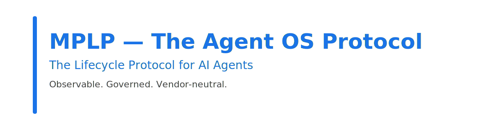
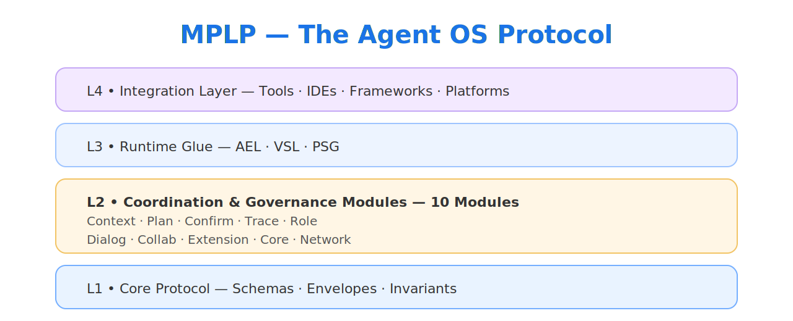
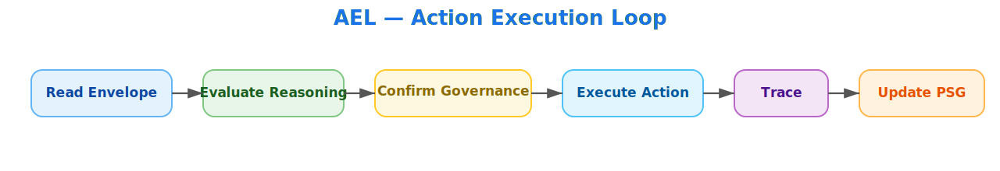
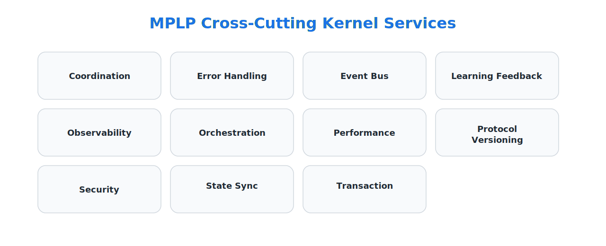
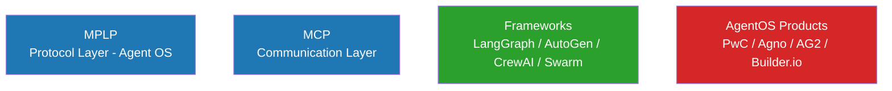

<div align="center">



</div>

<br>

<div align="center">

# <span style="color:#1A73E8">**Multi-Agent Lifecycle Protocol (MPLP)**</span>

## <span style="color:#1A73E8">**The Agent OS Protocol**</span>

### **The Lifecycle Protocol for AI Agents**

### **Observable. Governed. Vendor-neutral.**

</div>

<br>

<p align="center">
  
  
  
  
</p>

<br>

<div align="center">

Frameworks help you **build** agents.
Protocols ensure agents **work together safely and consistently**.

If HTTP is how **documents** travel across the internet,
**MPLP is how *work* travels between agents.**

[Documentation](https://coregentis.github.io/MPLP-Protocol/) •
[Specifications](https://coregentis.github.io/MPLP-Protocol/specs/) •
[Golden Flows](https://coregentis.github.io/MPLP-Protocol/golden-flows/) •
[Schemas](https://coregentis.github.io/MPLP-Protocol/schemas/) •
[SDKs](https://github.com/Coregentis/MPLP-Protocol/tree/main/sdk)

</div>

---

# **1. What Is an "Agent OS"?**

Modern LLM agents behave like operating system processes — they plan, act, update state, collaborate, and execute long-lived work.

A real Agent OS must define:

### **Lifecycle • Governance • State • Observability**

Frameworks ≠ OS.
Runtimes ≠ OS.
**Only a protocol can define the OS layer.**

MPLP *is* that protocol.

---

# **2. Why an Agent OS Must Be a Protocol**

Operating systems are **contracts**, not implementations:

* POSIX
* TCP/IP
* SQL
* Kubernetes API

Frameworks implement behavior.
Protocols define **invariants**.

Only a protocol can ensure:

* Vendor neutrality
* Semantic lifecycle guarantees
* Reproducible reasoning
* Cross-framework interoperability
* Stable execution semantics
* Portable agent state

This is why the Agent OS layer must be a **protocol**, not a tool.

---

# **3. Why MPLP Exists**

Today's agent ecosystem fails for structural reasons:

* No lifecycle semantics
* No governance
* No state model
* No observability
* No reproducibility
* No multi-agent correctness
* No cross-framework semantics

Frameworks give you execution convenience.
**MPLP provides lifecycle *correctness*.**

---

# **4. MPLP Architecture (L1 → L4)**

<div align="center">

</div>

---

# **5. L1 — Core Protocol**

Defines:

* lifecycle envelopes
* execution semantics
* reasoning stages
* governance hooks
* trace invariants
* semantic identity

This is the **OS contract** every runtime must follow.

---

# **6. L2 — Coordination & Governance Modules (10 Modules)**

| Module        | Description                                    |
| ------------- | ---------------------------------------------- |
| **Context**   | Initialize lifecycle constraints & objectives  |
| **Plan**      | Deterministic reasoning & orchestration intent |
| **Confirm**   | Governance, permissions, risk scoring          |
| **Trace**     | Replayable reasoning & action audit            |
| **Role**      | Persona & capability definitions               |
| **Dialog**    | Structured reasoning boundaries                |
| **Collab**    | Multi-agent workflow semantics                 |
| **Extension** | Safe extensibility model                       |
| **Core**      | Identity, invariants, protocol constants       |
| **Network**   | External IO under protocol semantics           |

---

# **7. L3 — Runtime Glue (AEL / VSL / PSG)**

## **AEL — Action Execution Layer**

<div align="center">

</div>

This is the **OS execution loop**.

---

## **VSL — Value State Layer**

The semantic state substrate for:

* scoring
* permissions
* governance
* lifecycle valuation
* capability models

---

## **PSG — Project Semantic Graph**

The OS-level semantic filesystem for:

* intents
* plans
* deltas
* documents
* code
* traces

Prevents drift. Ensures reproducibility.

---

# **8. Cross-Cutting Kernel Services (OS-Level Duties) **

These 11 kernel obligations apply across **every lifecycle stage, agent, and runtime**.  
They ensure multi-agent systems remain **coherent, auditable, recoverable, and deterministic** — the core requirements of an Agent OS.

---

<div align="center">
  
</div>

---

# **9. Execution Profiles**

| Profile | Purpose                            |
| ------- | ---------------------------------- |
| **SA**  | Deterministic single agent         |
| **MAP** | Governed multi-agent collaboration |

---

# **10. Positioning in the Ecosystem**

MPLP sits *below* frameworks and AgentOS products — it defines the lifecycle and governance layer they must all comply with.



Framework = App
Runtime = Engine
**MPLP = OS Protocol**

---

# **11. Schemas**

Located in `/schemas`:

```
mplp-context.schema.json
mplp-plan.schema.json
mplp-confirm.schema.json
mplp-trace.schema.json
mplp-role.schema.json
mplp-dialog.schema.json
mplp-collab.schema.json
mplp-extension.schema.json
mplp-core.schema.json
mplp-network.schema.json
```

---

# **12. Compliance**

A runtime is MPLP-compliant only if it implements:

* AEL / VSL / PSG
* All 10 modules
* All 11 cross-cutting concerns
* SA & MAP profiles
* Governance shells
* Drift detection
* Replayable trace

---

# **13. SDKs**

### TypeScript

```
@mplp/core
@mplp/schema
@mplp/modules
@mplp/coordination
@mplp/compliance
@mplp/devtools
@mplp/runtime-minimal
@mplp/sdk-ts
```

### Python

```
mplp-core
mplp-schema
mplp-modules
mplp-runtime
```

Examples include SA, MAP, drift detection, delta-intent, governance flows.

---

# **14. Documentation**

[https://coregentis.github.io/MPLP-Protocol/](https://coregentis.github.io/MPLP-Protocol/)

---

# **15. Status & Governance**

Version: **v1.0.0 (Frozen Spec)**  
Governance: **MPLP Protocol Governance Committee (MPGC)**  
License: **Apache-2.0**

Any normative breaking change requires a new protocol version.

---

# **16. Contributing**

Contributions are welcome.  
Please see `CONTRIBUTING.md` for submission process and coding standards.

---

# **17. License & Copyright**

This project is licensed under the **Apache License, Version 2.0**.  
You may not use this project except in compliance with the License.  
You may obtain a copy of the License at:

> http://www.apache.org/licenses/LICENSE-2.0

Unless required by applicable law or agreed to in writing, software  
distributed under the License is distributed on an "AS IS" BASIS,  
WITHOUT WARRANTIES OR CONDITIONS OF ANY KIND, either express or implied.  
See the License for the specific language governing permissions and  
limitations under the License.

**Copyright © 2025 Bangshi Beijing Network Technology Limited Company.**  
Licensed under the Apache License, Version 2.0.
