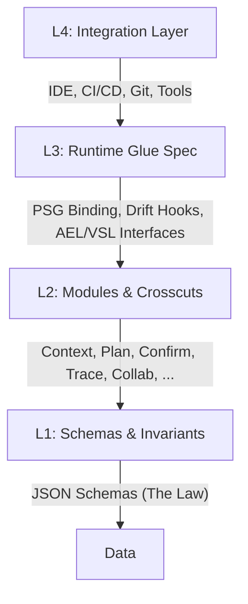

<div align="center">

# Multi-Agent Lifecycle Protocol (MPLP)
### The Open Standard for Governing Agentic AI Systems

[](docs/13-release/mplp-v1.0.0-release-notes.md)
[](LICENSE.txt)
[](docs/00-index/mplp-v1.0-protocol-overview.md)
[](docs/03-profiles/)
[](schemas/v2/)
[](docs/12-governance/mip-process.md)

[**Documentation**](docs/00-index/mplp-v1.0-docs-map.md) • [**Schemas**](schemas/v2/) • [**Examples**](examples/) • [**SDKs**](packages/) • [**Governance**](docs/12-governance/)

</div>

## 0. Why MPLP? The Case for a Lifecycle Protocol

We are witnessing a paradigm shift in AI development. The era of **Prompt Engineering**—fragile, unstructured conversations with LLMs—is ending.  
The era of **Protocol Engineering** has begun.

### The Crisis of Scale

As organizations move from simple chatbots to complex **Multi-Agent Systems (MAS)**, they face critical structural failures:

- **State Drift** – Agents lose context over long-running tasks.  
- **Hallucination Accumulation** – Errors compound across multi-step workflows.  
- **Ad-Hoc Orchestration** – Every team reinvents the wheel for agent coordination.  
- **Audit Black Holes** – No standard way to trace *who did what and why*.

### The Missing Layer: A Unified Protocol

Today’s ecosystem is full of **frameworks**, but lacks a **shared protocol**:

- Every tool defines its own Agents, Tools, Memory, Workflows.  
- There is no vendor-neutral way to describe **Context → Plan → Confirm → Trace → Collab**.  
- Migrating between runtimes often means **rewriting everything**.

**MPLP provides this missing layer.**  
It defines a vendor-neutral, schema-driven standard for how agents **Plan**, **Execute**, **Collaborate**, and **Learn**—with governance and observability built in.

---

## 1. What is MPLP? (Protocol, not Framework)

> **MPLP (Multi-Agent Lifecycle Protocol)** is a **schema-first**, **vendor-neutral** protocol that makes the full lifecycle of AI agents **explicit, governed, and interoperable**.

It is *not*:

- Not a specific vendor’s agent framework  
- Not an IDE / SaaS / Runtime product  
- Not bound to any single cloud or model provider

It *is*:
| **Observability**| Text Logs / Print Statements            | Structured **Event Streams** (Observability Spec)|
| **Learning**    | Manual Fine-Tuning                       | Systematic **Learning Samples**                  |

MPLP does not compete with frameworks like LangGraph / AutoGen—it **underlies** them.

---

## 3. Core Capabilities (What MPLP Adds to the Stack)

MPLP introduces five foundational capabilities to the agentic stack:

1. **Structured Lifecycle Management**  
   Agent execution is decomposed into explicit stages:  
   **Context → Plan → Confirm → Trace**, with schemas and invariants.

2. **Project Semantic Graph (PSG) Model**  
   Defines how Context/Plan/Trace/Events can be projected into a **single source of truth** for project state.  
   MPLP v1.0.0 specifies the minimal glue & events; concrete runtime implementations live outside this repo.

3. **Delta-Intent Governance (Spec Level)**  
   MPLP treats change of intent as first-class:  
   - Intent & Delta-Intent events  
   - Impact analysis & compensation planning can be modeled and traced

4. **Human-in-the-Loop Confirmation**  
   The **Confirm Module** provides a standardized structure for:  
   - Risk labeling  
   - Approval / rejection  
   - Checkpoints before destructive actions

5. **Drift Detection & Recovery (Protocol Hooks)**  
   MPLP defines events and invariants for:  
   - Semantic drift checks between Plan and Trace  
   - Graph drift checks between PSG and reality  
   - Rollback minimal specification  

> Implementation of Drift / PSG / AEL / VSL is **runtime-specific**.  
> MPLP defines *how* these concepts are expressed and observed—not how your runtime must implement them.

---

## 4. Industry Landscape

MPLP is not a framework; it is a **Lifecycle Protocol** that sits under frameworks and runtimes.

| Capability            | LangGraph | AutoGen | CrewAI | Semantic Kernel | A2A | AgentCore | MCP | **MPLP** |
| :-------------------- | :-------: | :-----: | :----: | :-------------: | :-: | :-------: | :-: | :------: |
| Lifecycle Standard    | ❌ | ❌ | ❌ | ❌ | ❌ | ❌ | ❌ | **✅ Yes** |
| Governance Layer      | ❌ | ⚠️ Partial | ⚠️ Partial | ⚠️ Filters | ❌ | ⚠️ Partial | ❌ | **✅ Native Spec** |
| Observability Spec    | ⚠️ (Proprietary) | ❌ | ⚠️ | ⚠️ Hooks | ❌ | ⚠️ | ⚠️ Partial | **✅ Event & Taxonomy** |
| Learning Loop Spec    | ❌ | ❌ | ❌ | ⚠️ Memory | ❌ | ❌ | ❌ | **✅ Learning Taxonomy** |
| Vendor-Neutral        | ❌ | ❌ | ❌ | ❌ | ❌ | ❌ | ❌ | **✅ Protocol-First** |
| Nature                | Framework | Framework | Framework | SDK | Pattern | Framework | Interface | **Lifecycle Protocol** |

### 🚀 The "Universal Bridge" Advantage: Cross-Framework Interoperability

Beyond feature comparison, MPLP's critical advantage is **breaking ecosystem silos**.

Frameworks often lock you in: an AutoGen agent cannot naturally "talk" to a LangGraph agent. MPLP provides a **standardized protocol layer** that sits *below* the frameworks, enabling true heterogeneity:

*   **Connect Any Ecosystem**: An AutoGen agent (Python) can initiate a Plan that is executed by a Semantic Kernel agent (C#) and audited by a custom enterprise system (Java).
*   **Unified Governance**: Regardless of the underlying engine, all agents adhere to the same `Context → Plan → Confirm → Trace` lifecycle, ensuring consistent compliance and observability across heterogeneous fleets.
*   **Future-Proof**: Switch frameworks or mix-and-match runtimes without rewriting your entire governance and observability stack.

```mermaid
graph TD
    subgraph Ecosystems ["Heterogeneous Agent Ecosystems"]
        style Ecosystems fill:#f9f9f9,stroke:#333,stroke-dasharray: 5 5
        A[AutoGen Agent<br/>(Python)]:::framework
        B[LangGraph Agent<br/>(JS/TS)]:::framework
        C[Semantic Kernel<br/>(C#)]:::framework
        D[Custom Enterprise<br/>(Java)]:::framework
    end

    subgraph Protocol ["MPLP: The Universal Bridge"]
        style Protocol fill:#e1f5fe,stroke:#01579b
        P[MPLP Protocol Layer<br/>(Context • Plan • Confirm • Trace)]:::protocol
    end

    subgraph Value ["Unified Operations"]
        style Value fill:#e8f5e9,stroke:#2e7d32
        G[Global Governance]:::ops
        O[Unified Observability]:::ops
        L[Shared Learning Loop]:::ops
    end

    A -->|"Speaks MPLP"| P
    B -->|"Speaks MPLP"| P
    C -->|"Speaks MPLP"| P
    D -->|"Speaks MPLP"| P

    P --> G
    P --> O
    P --> L

    classDef framework fill:#fff3e0,stroke:#ef6c00,color:#000
    classDef protocol fill:#0288d1,stroke:#01579b,color:#fff,stroke-width:2px
    classDef ops fill:#4caf50,stroke:#2e7d32,color:#fff
```

---

## 5. Four-Layer Architecture

MPLP organizes the agentic stack into four layers:



* **L1: Schemas & Invariants**

  * 10 normative JSON Schemas for core modules
  * Common types, events, integration, learning schemas
  * Invariants (YAML) for confirming behavior

* **L2: Modules & Crosscuts**

  * 10 functional modules
  * 9 cross-cutting concerns (Coordination, Observability, Security, State Sync, etc.)
  * Documented in `docs/01-architecture/` and `docs/02-modules/`

* **L3: Runtime Glue Spec**

  * PSG binding paths
  * Drift detection hooks
  * Rollback minimal spec
  * Design notes for AEL / VSL (conceptual reference, not implementation)

* **L4: Integration Layer**

  * Event schemas for CI, IDE, Git, File system, Tool execution
  * Minimal integration spec for bringing external tools into the MPLP lifecycle

---

## 6. Ten Modules: The Infrastructure of Agent Systems

MPLP standardizes the 10 essential components required for any robust agent system:

1. **Context** – Project scope, environment, constraints
2. **Plan** – Structured, auditable execution plan
3. **Confirm** – Governance gates for human approval / risk control
4. **Trace** – Immutable, replayable execution history
5. **Role** – Agent capabilities, permissions, responsibilities
6. **Collab** – Multi-agent coordination (turn-taking, broadcast, fan-out)
7. **Dialog** – Structured conversational exchanges for clarification & negotiation
8. **Extension** – Extension points / vendor-specific adapters
9. **Core** – Shared protocol primitives & meta-structures
10. **Network** – Distributed coordination & broadcast patterns

> Module docs: `docs/02-modules/*.md`
> Module schemas: `schemas/v2/mplp-*.schema.json`

---

## 7. Profiles: The Runtime Contract (SA & MAP)

MPLP defines **Execution Profiles** so runtimes can declare their capabilities.

* **SA Profile (Single-Agent)**

  * Baseline lifecycle: Context → Plan → Confirm → Trace
  * Intended for single-agent IDE integrations, assistants, and tools

* **MAP Profile (Multi-Agent)**

  * Multi-agent coordination patterns: turn-taking, broadcast, team roles
  * Ensures consistent handling of Collab, Dialog, Network, extended Trace

Profile docs & diagrams:

* `docs/03-profiles/mplp-sa-profile.md` + `.yaml` + `sa-lifecycle.mmd`
* `docs/03-profiles/mplp-map-profile.md` + `.yaml` + `map-*.mmd`

---

## 8. Repository Overview

This repository provides the **protocol assets**, not a runtime:

* **Docs & Specs**

  * `docs/00-index/` – Overview, docs map, glossary
  * `docs/01-architecture/` – L1–L4 architecture & cross-cutting concerns
  * `docs/02-modules/` – 10 module specs
  * `docs/03-profiles/` – SA & MAP Profiles
  * `docs/04-observability/` – Event taxonomy & observability duties
  * `docs/05-learning/` – Learning taxonomy & collection points
  * `docs/06-runtime/` – Runtime glue specs (PSG, drift, rollback)
  * `docs/07-integration/` – Integration event taxonomy & minimal spec
  * `docs/08-guides/` – Compliance guides & checklists
  * `docs/09-tests/` – Golden test suite overview
  * `docs/10-sdk/` – SDK mapping & language guides
  * `docs/11-examples/` – End-to-end flows
  * `docs/12-governance/` – Versioning, compatibility, MIP process
  * `docs/13-release/` – Release notes & migration guide (selected parts)

* **Schemas**

  * `schemas/v2/` – Core module schemas, events, integration, learning
  * `schemas/v2/invariants/` – Protocol invariants in YAML

* **Examples & SDKs**

  * `examples/` – TS/Go/Java/Python examples and flows
  * `packages/` – TypeScript & Python SDK packages (see below)

* **Tests**

  * `tests/golden/` – Golden flows & invariants
  * `tests/schema-alignment/` – Schema alignment tests
  * `tests/cross-language/` – Cross-language builders & validators

---

## 9. Golden Flows — How We Prove It Works

To avoid being a “paper protocol”, MPLP v1.0.0 ships with an executable **Golden Flow Test Suite**:

* Registry & docs:

  * `docs/09-tests/golden-test-suite-overview.md`
  * `docs/09-tests/golden-flow-registry.md`

* Test assets:

  * `tests/golden/flows/*`
  * `tests/golden/invariants/*.yaml`
  * `tests/golden/harness/ts/*.ts`

**Required flows for v1.0.0 compliance:**

1. Flow-01 — Single-Agent basic plan execution
2. Flow-02 — Single-Agent large plan handling
3. Flow-03 — Tool execution integration
4. Flow-04 — LLM-enriched plan flows
5. Flow-05 — Confirm-required, risk-aware execution

> Any runtime or SDK claiming MPLP compatibility can use these flows + invariants to validate behavior.

---

## 10. SDK Support Matrix

MPLP is runtime- and language-agnostic, but v1.0.0 includes SDK support:

### TypeScript SDK — **Stable (Reference Implementation)**

* Status: **Official / Stable**
* Features:

  * Full type mapping from schemas
  * Runtime validation (Ajv)
  * Builders & helpers for constructing MPLP objects
* Used as the canonical implementation for Golden Flows.

> Guide: `docs/10-sdk/ts-sdk-guide.md`
> Package: `packages/sdk-ts/`
> Install: `npm install @mplp/sdk-ts`

---

### Python SDK — **Stable**

* Status: **Stable / v1.0.0**
* Implemented via Pydantic v2 models generated from schemas
* Fully covers core protocol structures
* Used in cross-language Golden Flow validation
* Available on PyPI as `mplp`

> Guide: `docs/10-sdk/py-sdk-guide.md`
> Package: `packages/sdk-py/`
> Install: `pip install mplp`

---

### Go / Java — **Examples (Not Official SDKs)**

* Go example: `examples/go-basic-flow/`
* Java example: `examples/java-basic-flow/`

These are **illustrative only**, not part of the protocol’s compatibility contract.

---

## 11. Quick Start (5 Minutes)

> Get a feel for MPLP as a **protocol**, not just another library.

### 1. Clone & Install

```bash
git clone https://github.com/Coregentis/MPLP-Protocol.git
cd MPLP-Protocol
pnpm install
```

### 2. Validate All Schemas

```bash
pnpm ts-node scripts/validate-schemas.ts
```

### 3. Run Golden Flows

```bash
pnpm test:golden
```

You will see:

* Inputs & expected outputs for flows 01–05
* Invariants evaluated across Context/Plan/Confirm/Trace

### 4. Run a Single-Agent Example

```bash
cd examples/ts-single-agent-basic
pnpm install
pnpm start
```

This demonstrates:

* Constructing Context + Plan as MPLP objects
* Validating against the protocol schemas
* Sending them to your own runtime / orchestrator

More flows & patterns: `docs/11-examples/`

---

## 12. Roadmap

* **v1.0 (Current)**

  * Frozen core protocol (schemas + invariants)
  * SA & MAP Profiles
  * Golden Flow test suite (01–05)
  * TS SDK stable (v1.0.3), Python SDK stable (v1.0.0)

* **v1.1 (Planned)**

  * Expanded Golden Flows & invariants
  * More integration patterns for IDE / CI

* **v2.x (Future Direction)**

  * Advanced multi-agent orchestration patterns in MAP
  * Expanded governance & learning specs
  * Runtime Compliance Test Kit (RCTK)

> Concrete timelines are intentionally out-of-scope for the protocol; see `docs/99-meta/roadmap.md` for more.

---

## 13. Operations (MPLP-OPS)

MPLP is maintained via the **MPLP-OPS** framework, ensuring consistent governance, release quality, and schema evolution.

* **Overview**: `docs/14-ops/mplp-ops-overview.md`
* **Release Runbook**: `docs/14-ops/release-runbook.md`
* **Schema Change Process**: `docs/14-ops/schema-sdk-change-process.md`

---

## 14. Governance & License

MPLP is governed as an open protocol:

* **Versioning & Compatibility**

  * `docs/12-governance/versioning-policy.md`
  * `docs/12-governance/compatibility-matrix.md`

* **MIP Process (MPLP Improvement Proposals)**

  * `docs/12-governance/mip-process.md`
  * Any normative protocol change goes through a MIP.

License & Copyright:

* License: **Apache License 2.0** (see `LICENSE.txt`)
* Copyright:

  * `© 2025 邦士（北京）网络科技有限公司`

**Any normative change requires a new protocol version.**

---

## 15. Contributing

You can contribute by:

* Proposing new invariants or profiles
* Suggesting schema improvements
* Adding language SDKs or tools
* Expanding the Golden Flow suite

Please start with:

* `docs/12-governance/mip-process.md`
* Open an issue or PR referencing the relevant MIP.

---

## 16. Contact

For enterprise adoption, integration partnerships, or protocol collaborations:

* **MPLP / Coregentis Team**
* Email: `contact@mplp.io` 

---

<div align="center">
  <sub>Built for the future of Agentic AI. Vendor-neutral. Schema-driven. Lifecycle-governed.</sub>
</div>
---

© 2025 邦士（北京）网络科技有限公司
Licensed under the Apache License, Version 2.0.
