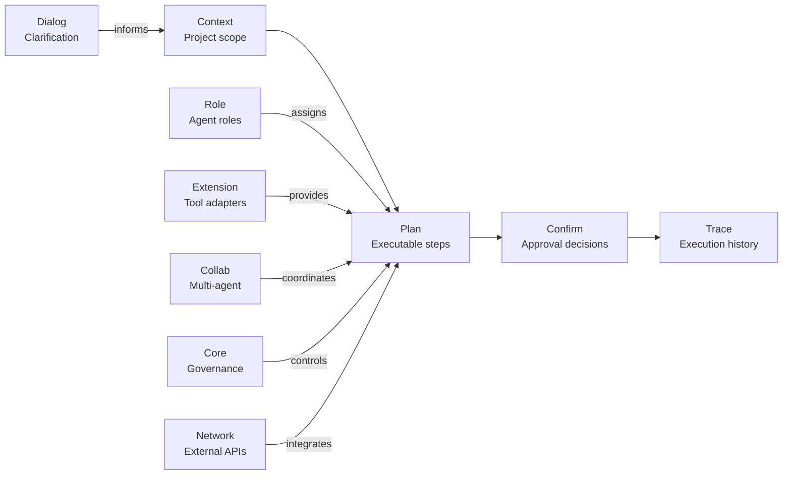

---
**MPLP Protocol 1.0.0 — Frozen Specification**
**Status**: Frozen as of 2025-11-30
**Copyright**: © 2025 邦士（北京）网络科技有限公司
**License**: Apache License 2.0 (see LICENSE at repository root)
**Any normative change requires a new protocol version.**
---

# MPLP v1.0 Protocol Overview

**Multi-Agent Lifecycle Protocol**
**Version**: 1.0.0
**Release Date**: 2025-11-30
**License**: Apache-2.0

## Official Protocol Name (v1.0)

For the avoidance of doubt, the protocol defined in this repository is officially named **“Multi-Agent Lifecycle Protocol” (MPLP)**.

Any earlier drafts or documents that referred to “Multi-Agent Lifecycle Protocol” or other variants MUST be considered deprecated and non-normative.

All normative references in this repository and in external integrations MUST use the name “Multi-Agent Lifecycle Protocol (MPLP)”.

---

## Table of Contents

1. [What is MPLP?](#what-is-mplp)
2. [Four-Layer Architecture](#four-layer-architecture)
3. [Ten Modules & Nine Crosscuts](#ten-modules--nine-crosscuts)
4. [Execution Profiles: SA & MAP](#execution-profiles-sa--map)
5. [Observability & Learning](#observability--learning)
6. [Runtime Glue & PSG](#runtime-glue--psg)
7. [Integration Layer](#integration-layer)
8. [Compliance & Validation](#compliance--validation)
9. [Use Cases & Applications](#use-cases--applications)
10. [Getting Started](#getting-started)

---

## What is MPLP?

### The Problem: Prompt Engineering vs Protocol Engineering

**Traditional AI Development** relies on **Prompt Engineering**:
- ❌ Unstructured conversations with LLMs
- ❌ No standardized project state representation
- ❌ Fragile, vendor-locked integrations
- ❌ Difficult to audit or replay
- ❌ No learning feedback loop

**MPLP offers Protocol Engineering**:
- ✅ Structured, schema-driven project lifecycle
- ✅ Vendor-neutral multi-agent collaboration
- ✅ Interoperable runtimes and tools
- ✅ Auditable event streams and traces
- ✅ Systematic learning sample collection

---

### Core Idea

**MPLP** defines a **protocol-first** approach to multi-agent AI development:

```
Instead of:  "Prompt → LLM → Unstructured Output"
MPLP says:   "Context → Plan → Confirm → Trace → Learning"
```

**Key Principles**:
1. **Schema-Driven**: All entities (Context, Plan, Trace, etc.) are JSON schema-validated
2. **Event-Observable**: All significant actions emit structured events
3. **State-Explicit**: Project Semantic Graph (PSG) is the single source of truth
4. **Learning-Enabled**: Systematic collection of training samples from execution history
5. **Vendor-Neutral**: Protocol, not product - any vendor can implement

---

### What MPLP Is NOT

**Out of Scope** (Intentionally):
- ❌ Not a specific LLM (works with any: GPT, Claude, Gemini, LLaMA, etc.)
- ❌ Not a UI framework (protocol-level only)
- ❌ Not a deployment platform (runtime-agnostic)
- ❌ Not a blockchain/settlement layer
- ❌ Not a training/tuning pipeline (defines data format, not training logic)

**MPLP is**:
- ✅ A **protocol specification** (like HTTP, not Apache/Nginx)
- ✅ A **interoperability layer** (like SQL, not MySQL/Postgres)
- ✅ A **compliance baseline** (like POSIX, not Linux/BSD)

---

## Four-Layer Architecture

MPLP organizes functionality into four layers (L1-L4):

```
┌─────────────────────────────────────────────────────────┐
│ L4: Integration Layer (IDE, CI, Git, Tools)             │
│ ─────────────────────────────────────────────────────── │
│ Phase 6: Minimal Integration Spec                       │
│ - file_update_event, git_event, ci_event, tool_event    │
└─────────────────────────────────────────────────────────┘
                          ↓
┌─────────────────────────────────────────────────────────┐
│ L3: Runtime Glue Layer (Behavioral Specifications)      │
│ ─────────────────────────────────────────────────────── │
│ Phase 5: Runtime Glue + PSG + Crosscuts                 │
│ - Module→PSG paths, Event emission rules                │
│ - 9 Crosscuts: coordination, orchestration, etc.        │
└─────────────────────────────────────────────────────────┘
                          ↓
┌─────────────────────────────────────────────────────────┐
│ L2: Modules & Crosscuts (Domain Logic)                  │
│ ─────────────────────────────────────────────────────── │
│ Phase 3-4: Observability + Learning                     │
│ - 12 Event Families (Observability)                     │
│ - 6 Sample Families (Learning)                          │
│                                                          │
│ Phase 1-2: Execution Profiles                           │
│ - SA Profile (single-agent)                             │
│ - MAP Profile (multi-agent)                             │
│                                                          │
│ Core: 10 Modules                                        │
│ - Context, Plan, Confirm, Trace, Role, Extension,       │
│   Dialog, Collab, Core, Network                         │
└─────────────────────────────────────────────────────────┘
                          ↓
┌─────────────────────────────────────────────────────────┐
│ L1: Schemas & Invariants (Data Structures)              │
│ ─────────────────────────────────────────────────────── │
│ JSON Schemas + Invariant Rules                          │
│ - L1 "shapes": Context, Plan, Confirm, Trace, etc.      │
│ - L2 "behaviors": SA/MAP flows, Event emissions         │
└─────────────────────────────────────────────────────────┘
```

**Layer Responsibilities**:

| Layer | Responsibility | Examples |
|-------|---------------|----------|
| **L1: Schemas** | Data structure definitions | `mplp-context.schema.json`, `mplp-plan.schema.json` |
| **L2: Modules** | Domain logic & crosscuts | Context, Plan, Trace, Observability, Learning |
| **L3: Runtime Glue** | Behavioral specifications | Module→PSG paths, Event emission rules, Drift/Rollback |
| **L4: Integration** | External tool interactions | IDE file changes, Git commits, CI pipeline status |

---

## Ten Modules & Nine Crosscuts

### Core Modules (10)

MPLP defines **10 L2 modules** for project lifecycle management:



**Module Descriptions**:

1. **Context** (`schemas/v2/mplp-context.schema.json`): Project root, environment, constraints
   - Purpose: Define "what problem are we solving?"
   - Example: Project title, timeline, budget, dependencies

2. **Plan** (`schemas/v2/mplp-plan.schema.json`): Executable plans with steps and dependencies
   - Purpose: Define "how will we solve it?"
   - Example: Step-by-step refactoring plan with agent role assignments

3. **Confirm** (`schemas/v2/mplp-confirm.schema.json`): Approval/rejection decisions for plans
   - Purpose: Human-in-loop governance
   - Example: User approves/rejects a plan before execution

4. **Trace** (`schemas/v2/mplp-trace.schema.json`): Execution history and spans
   - Purpose: Audit trail for "what actually happened?"
   - Example: Timestamped log of agent actions, tool calls, LLM invocations

5. **Role** (`schemas/v2/mplp-role.schema.json`): Agent role definitions and assignments
   - Purpose: Define "who does what?"
   - Example: Architect role, Developer role, QA role

6. **Extension** (`schemas/v2/mplp-extension.schema.json`): Tool adapters and plugins
   - Purpose: Integrate external tools (formatters, linters, APIs)
   - Example: ESLint adapter, Docker adapter, GitHub API adapter

7. **Dialog** (`schemas/v2/mplp-dialog.schema.json`): Conversation threads for intent clarification
   - Purpose: Iterative refinement of requirements
   - Example: Multi-turn dialog to clarify ambiguous user intent

8. **Collab** (`schemas/v2/mplp-collab.schema.json`): Multi-agent collaboration sessions
   - Purpose: Coordinate multiple agents working together
   - Example: Turn-taking session with planner and executor agents

9. **Core** (`schemas/v2/mplp-core.schema.json`): Orchestration, governance, conflict resolution
   - Purpose: Central control and policy enforcement
   - Example: Detect conflicting plans, apply resolution policies

10. **Network** (`schemas/v2/mplp-network.schema.json`): External system integration metadata
    - Purpose: Manage connections to external services
    - Example: API endpoints, authentication, rate limits

**Note**: All module schemas follow the `mplp-<module>.schema.json` naming convention at `schemas/v2/` root level. This is a v1.0 protocol guarantee.

---

### Nine Crosscutting Concerns

MPLP defines **9 crosscuts** that span multiple modules:

1. **coordination**: Multi-agent collaboration and handoffs
   - Implementation: Via Collab module + MAP events
   - Example: Agent A hands off to Agent B after completing a subtask

2. **error-handling**: Failure detection, recovery, retry logic
   - Implementation: Via Trace module + PipelineStageEvent (failed status)
   - Example: Retry failed step 3 times before escalating

3. **event-bus**: Structured event routing and consumption
   - Implementation: Via Observability layer (12 event families)
   - Example: PipelineStageEvent emitted on every stage transition

4. **orchestration**: Pipeline and plan execution control
   - Implementation: Via Core module + PipelineStageEvent
   - Example: Execute steps in dependency order, skip on failure

5. **performance**: Timing metrics, resource usage, cost tracking
   - Implementation: Via Trace spans + CostAndBudgetEvent
   - Example: Track LLM token costs, execution time per step

6. **protocol-version**: Version compatibility and migration
   - Implementation: Via PSG version annotations
   - Example: Protocol v1.0 → v1.1 migration path

7. **security**: Authentication, authorization, access control
   - Implementation: Via PSG access control lists (ACLs)
   - Example: User permissions for plan approval

8. **state-sync**: PSG consistency and synchronization
   - Implementation: Via GraphUpdateEvent (REQUIRED)
   - Example: Every PSG structural change emits GraphUpdateEvent

9. **transaction**: Atomicity and rollback for grouped operations
   - Implementation: Via PSG snapshots + bulk GraphUpdateEvent
   - Example: Rollback PSG to pre-refactor state on failure

**Reference**: [Crosscut→PSG Binding](../06-runtime/crosscut-psg-event-binding.md)

---

## Execution Profiles: SA & MAP

MPLP defines **two execution profiles** for agent behavior:

### SA Profile (Single-Agent)

**Purpose**: Minimum viable execution unit for one agent

**Characteristics**:
- ✅ REQUIRED for v1.0 compliance
- ✅ Context → Plan → (optional Confirm) → Trace flow
- ✅ Agent executes steps sequentially or in parallel
- ✅ No inter-agent coordination

**Use Cases**:
- Simple refactoring tasks
- Code generation
- Documentation updates
- Single-agent workflows

**Reference**: [SA Profile](../03-profiles/mplp-sa-profile.md)

---

### MAP Profile (Multi-Agent Protocol)

**Purpose**: Multi-agent collaboration patterns

**Characteristics**:
- ⚠️ RECOMMENDED (not REQUIRED) for v1.0
- ✅ Multiple agents collaborate on shared project
- ✅ Three coordination modes:
  1. **Turn-Taking**: Sequential handoffs (Agent A → Agent B → Agent C)
  2. **Broadcast**: One-to-many fan-out (Orchestrator → Worker₁,₂,₃...)
  3. **Orchestrated**: Central orchestrator + worker agents
- ✅ MAP-specific events: MAPSessionStarted, MAPTurnDispatched, etc.

**Use Cases**:
- Complex refactoring with architect + developer agents
- Multi-stage pipelines (planner + coder + reviewer)
- Parallel task execution with result aggregation

**Reference**: [MAP Profile](../03-profiles/mplp-map-profile.md)

---

## Observability & Learning

### Observability Layer (Phase 3)

**Purpose**: Structured event emission for monitoring and audit

**12 Event Families**:
1. **ImportProcessEvent**: Project initialization
2. **IntentEvent**: User intent capture
3. **DeltaIntentEvent**: Change requests
4. **ImpactAnalysisEvent**: Change impact assessment
5. **CompensationPlanEvent**: Rollback/compensation plans
6. **MethodologyEvent**: Reasoning and decision-making
7. **ReasoningGraphEvent**: Thought graphs from agents
8. **PipelineStageEvent**: ✅ **REQUIRED** - Pipeline stage transitions
9. **GraphUpdateEvent**: ✅ **REQUIRED** - PSG structural changes
10. **RuntimeExecutionEvent**: RECOMMENDED - Agent/tool/LLM invocations
11. **CostAndBudgetEvent**: RECOMMENDED - Cost tracking
12. **ExternalIntegrationEvent**: RECOMMENDED - External tool calls

**v1.0 Requirements**:
- ✅ MUST emit: `PipelineStageEvent`, `GraphUpdateEvent`
- ⚠️ SHOULD emit: `RuntimeExecutionEvent`
- ⚠️ RECOMMENDED: Others

**Benefits**:
- Uniform event structure across vendors
- Auditable trail for compliance and debugging
- Foundation for monitoring dashboards

**Reference**: [Observability Overview](../04-observability/mplp-observability-overview.md)

---

### Learning Layer (Phase 4)

**Purpose**: Systematic collection of training samples from execution history

**6 LearningSample Families**:
1. **intent_resolution**: User intent → Plan mapping
2. **delta_impact**: Change request → Impact prediction
3. **pipeline_outcome**: Plan execution → Success/failure patterns
4. **confirm_decision**: Plan → Approval/rejection decision
5. **graph_evolution**: PSG topology changes
6. **multi_agent_coordination**: MAP session patterns

**v1.0 Requirements**:
- ❌ NOT REQUIRED: Sample collection is optional
- ✅ REQUIRED (if collected): Samples MUST conform to schemas
- ⚠️ RECOMMENDED: Collect at suggested triggers

**Data Format Only**:
- MPLP defines **sample structure** (schemas, invariants)
- MPLP does NOT define **training/tuning** logic (product-specific)

**Benefits**:
- Consistent sample format across vendors
- Enables fine-tuning of project-specific models
- Foundation for agent improvement over time

**Reference**: [Learning Overview](../05-learning/mplp-learning-overview.md)

---

## Runtime Glue & PSG

### Project Semantic Graph (PSG)

**Core Principle**: PSG is the **single source of truth** for all project state.

**What is PSG?**
- Graph structure (nodes + edges) representing project semantics
- Nodes: Context, Plans, Steps, Traces, Commits, Files, etc.
- Edges: Dependencies, handoffs, approvals, etc.
- Attributes: Metadata, status, timestamps, etc.

**Why PSG?**
- ✅ Unified state model (no scattered caches)
- ✅ Enables drift detection (compare snapshots)
- ✅ Simplifies rollback (restore snapshot)
- ✅ Natural audit trail (all changes tracked)

**Example PSG Structure**:
```
psg.project_root[context_id] = {title, timeline, budget}
psg.plans[plan_id] = {context_id, status, created_at}
psg.plan_steps[step_id] = {plan_id, description, agent_role, status}
psg.edges[context_id → plan_id] = {type: "context_to_plan"}
psg.edges[step_1 → step_2] = {type: "depends_on"}
```

---

### Runtime Glue Specifications

**Module→PSG Paths**: How each of 10 modules reads/writes PSG
- Context: project_root, environment, constraints
- Plan: plans, plan_steps, dependencies
- Trace: execution_traces, spans
- Etc.

**Crosscut Bindings**: How 9 crosscuts are realized through PSG + Events
- coordination → Collab sessions in PSG + MAP events
- error-handling → Failure nodes in PSG + PipelineStageEvent (failed)
- state-sync → GraphUpdateEvent for all PSG changes
- Etc.

**Drift Detection**: Compare PSG snapshots to detect divergence
- Minimal spec: Take snapshots at milestones, flag discrepancies

**Rollback**: Restore PSG from snapshot on failure
- Minimal spec: PSG restoration, trace recording, event emission

**Reference**: [Runtime Glue Overview](../06-runtime/mplp-runtime-glue-overview.md)

---

## Integration Layer

**Purpose**: External tool integration (IDE, CI, Git, Tools) as L4 Boundary Layer

**4 Integration Event Families**:
1. **tool_event**: Formatters, linters, test runners, code generators
2. **file_update_event**: IDE file changes (save, create, delete, rename)
3. **git_event**: Commit, push, merge, tag, branch operations
4. **ci_event**: CI pipeline execution status

**v1.0 Compliance**:
- ❌ NOT REQUIRED: Integration is entirely optional
- ✅ RECOMMENDED: If integrating, use these specs
- ✅ REQUIRED (if used): Events MUST conform to schemas

**Pattern**: Integration events as `ExternalIntegrationEvent.payload`
```json
{
  "event_family": "ExternalIntegrationEvent",
  "event_type": "file_update",
  "payload": {
    "file_path": "src/App.tsx",
    "change_type": "modified",
    "timestamp": "2025-11-30T10:15:30Z"
  }
}
```

**Reference**: [Integration Spec](../07-integration/mplp-minimal-integration-spec.md)

---

## Compliance & Validation

### v1.0 Compliance Levels

**REQUIRED** (for "MPLP v1.0 compliant"):
- ✅ L1/L2 schemas for Context, Plan, Confirm, Trace
- ✅ SA Profile support
- ✅ PipelineStageEvent + GraphUpdateEvent emission
- ✅ PSG as single source of truth
- ✅ Module→PSG mapping documented

**RECOMMENDED** (strongly suggested):
- ⚠️ MAP Profile support
- ⚠️ RuntimeExecutionEvent emission
- ⚠️ LearningSample collection
- ⚠️ Drift detection + Rollback

**OPTIONAL** (nice-to-have):
- ⭕ Integration Layer (IDE/CI/Git)
- ⭕ Other Observability events
- ⭕ Advanced features (ML-based drift, saga transactions, etc.)

**Reference**: [Compliance Guide](../08-guides/mplp-v1.0-compliance-guide.md)

---

### Golden Test Suite

**Purpose**: Protocol-invariant validation through 9 test flows

**9 Golden Flows**:
- **FLOW-01~05**: Core protocol (Context → Plan → Confirm → Trace)
  - FLOW-01: Single Agent Plan (basic)
  - FLOW-02: Single Agent Large Plan (scale test)
  - FLOW-03: Single Agent With Tools (Extension module)
  - FLOW-04: Single Agent LLM Enrichment (Intent → Plan)
  - FLOW-05: Single Agent Confirm Required (approval flow)
- **SA-01/02**: SA Profile-specific flows
- **MAP-01/02**: MAP Profile-specific flows
  - MAP-01: Turn-Taking (sequential handoffs)
  - MAP-02: Broadcast Fanout (one-to-many)

**Cross-Language Harnesses**:
- TypeScript: `tests/golden/harness/ts/`
- Python: `tests/golden/harness/py/`

**CI Integration**: GitHub Actions runs Golden Harness on every commit

**Reference**: [Golden Test Suite](../09-tests/golden-test-suite-overview.md)

---

## Use Cases & Applications

### Enterprise AI Development Teams
- **Problem**: Coordinating multiple AI agents, tracking decisions, ensuring auditability
- **MPLP Solution**: Structured plans, approval workflows, comprehensive trace logs
- **Products**: Coregentis, TracePilot

---

### AI-Assisted Coding Platforms
- **Problem**: Managing multi-step refactoring, correlating changes with user intent
- **MPLP Solution**: Context → Plan → Trace flow, learning from successful refactors
- **Products**: PublishPilot, MRX Multi-Agent

---

### Compliance-Heavy Industries
- **Problem**: Auditable AI development, regulatory compliance for LLM usage
- **MPLP Solution**: Complete observability, structured event streams, approval gates
- **Products**: Finance, Healthcare, Government systems

---

### Research & Academia
- **Problem**: Reproducible multi-agent experiments, standardized benchmarks
- **MPLP Solution**: Protocol-level specification, cross-language Golden Tests
- **Products**: Academic research tools

---

## Getting Started

### For Implementers

1. **Read**: [Compliance Guide](../08-guides/mplp-v1.0-compliance-guide.md)
2. **Review**: [SA Profile](../03-profiles/mplp-sa-profile.md)
3. **Test**: Run [Golden Harness](../09-tests/golden-test-suite-overview.md)
4. **Implement**: Build runtime conforming to specs
5. **Validate**: Pass all 9 Golden Flows

---

### For Integrators (IDE/Tools)

1. **Read**: [Integration Spec](../07-integration/mplp-minimal-integration-spec.md)
2. **Choose**: Which events to emit (file_update, git, ci, tool)
3. **Conform**: Match schemas in `schemas/v2/integration/`
4. **Test**: Validate against invariants
5. **Deploy**: Integrate with MPLP runtime

---

### For Researchers

1. **Explore**: [Protocol Overview](mplp-v1.0-protocol-overview.md) (this doc)
2. **Study**: [MAP Profile](../03-profiles/mplp-map-profile.md) - Multi-agent patterns
3. **Experiment**: Use Golden Flows as baselines
4. **Extend**: Propose new flows for v1.1+

---

### For Decision Makers

1. **Assess**: [Release Notes](../13-release/mplp-v1.0.0-release-notes.md) - Scope and limitations
2. **Evaluate**: Business value vs implementation cost
3. **Plan**: Vendor selection (TracePilot, Coregentis, build in-house)
4. **Adopt**: Gradual rollout (start with SA Profile, add MAP later)

---

## Next Steps

**Explore Documentation**:
- 📖 [Documentation Map](mplp-v1.0-docs-map.md) - Complete navigation guide
- ✅ [Compliance Checklist](../08-guides/mplp-v1.0-compliance-checklist.md) - Self-assessment
- 🧪 [Golden Test Suite](../09-tests/golden-test-suite-overview.md) - Validation mechanism

**Join Community**:
- GitHub: [mplp-protocol](https://github.com/org/mplp-protocol)
- Discussions: [Forum](https://github.com/org/mplp-protocol/discussions)
- Issues: [Bug Reports](https://github.com/org/mplp-protocol/issues)

**Reference Implementations**:
- TracePilot: Full-featured MPLP runtime
- Coregentis: Enterprise MPLP platform
- PublishPilot: Content generation with MPLP
- MRX Multi-Agent: Research-oriented MPLP

---

## Version History

| Version | Date | Milestone |
|---------|------|-----------|
| 1.0.0 | 2025-11-30 | First stable public release |
| 1.0.0-rc.1 | 2025-11-29 | Internal baseline (Phases 1-6) |

**Future Roadmap**: See [Release Notes](../13-release/mplp-v1.0.0-release-notes.md)

---

**End of MPLP v1.0 Protocol Overview**

*MPLP is a vendor-neutral, protocol-first specification for multi-agent AI development, enabling interoperability, auditability, and systematic learning across diverse implementations.*
