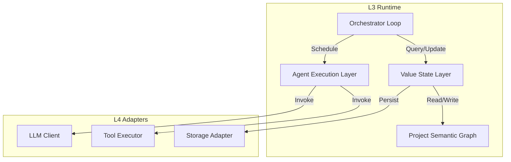

> [!FROZEN]
> **MPLP Protocol v1.0.0 — Frozen Specification**
> **Freeze Date**: 2025-12-03
> **Status**: FROZEN (no breaking changes permitted)
> **Governance**: MPLP Protocol Governance Committee (MPGC)
> **License**: Apache-2.0
> **Note**: Any normative change requires a new protocol version.

---
**MPLP Protocol 1.0.0 — Frozen Specification**
**Status**: Frozen as of 2025-11-30
**Copyright**: © 2025 邦士（北京）网络科技有限公司
**License**: Apache License 2.0 (see LICENSE at repository root)
**Any normative change requires a new protocol version.**
---

# L1–L4 Architecture Deep Dive

## 1. Scope

This document provides a **comprehensive technical deep dive** into the MPLP v1.0 architecture. It is intended for runtime architects and advanced implementers who need to understand the complex interactions between the four layers.

**Boundaries**:
- **In Scope**: AEL/VSL internal mechanics, PSG state transitions, MAP coordination protocols, Drift Detection algorithms.
- **Out of Scope**: Basic API usage (covered in L1-L4 specs).

## 2. Normative Definitions

- **AEL (Agent Execution Layer)**: The runtime component that abstracts agent and tool invocation. It acts as the "CPU" of the MPLP runtime.
- **VSL (Value State Layer)**: The runtime component that abstracts state persistence. It acts as the "Memory" of the MPLP runtime.
- **PSG (Project Semantic Graph)**: The hypergraph data structure representing the project state.
- **Orchestrator**: The control loop that schedules AEL operations based on PSG state and L2 Profiles.

## 3. Responsibilities (MUST/SHALL)

1.  **Atomic State Transitions**: The VSL **MUST** ensure that PSG updates are atomic to prevent inconsistent states.
2.  **Deterministic Execution**: Given the same PSG state and inputs, the Orchestrator **SHOULD** make deterministic scheduling decisions.
3.  **Event Causality**: The runtime **MUST** preserve the causal ordering of events (e.g., a Plan cannot be executed before it is created).

## 4. Architecture Structure

### The Runtime Core (L3)



## 5. Binding Points

### 5.1 The AEL Interface
The AEL exposes a unified interface for all "actions":
```typescript
interface AEL {
  executeAction(action: Action): Promise<ActionResult>;
}
```
Actions include: `llm_call`, `tool_call`, `agent_handoff`.

### 5.2 The VSL Interface
The VSL exposes a unified interface for state:
```typescript
interface VSL {
  readNode(type: string, id: string): Promise<Node>;
  writeNode(type: string, id: string, data: Node): Promise<void>;
  createSnapshot(): Promise<string>;
  restoreSnapshot(id: string): Promise<void>;
}
```

## 6. Interaction Model

### 6.1 Drift Detection Flow
1.  **Snapshot**: VSL creates a snapshot of the PSG.
2.  **Scan**: Tool Executor runs a "scan" tool (e.g., file system walker).
3.  **Compare**: Orchestrator compares Scan result vs PSG state.
4.  **Detect**: If mismatch found, emit `DriftEvent`.
5.  **Reconcile**: Orchestrator triggers "Reconciliation Plan" (L2 flow).

### 6.2 MAP Coordination Flow (Broadcast)
1.  **Intent**: User requests "Refactor Auth Module".
2.  **Plan**: Architect Agent creates a Plan with 3 parallel steps.
3.  **Broadcast**: Orchestrator sees parallel steps, broadcasts `MAPTurnDispatched` to 3 Worker Agents.
4.  **Parallel Exec**: AEL executes 3 agents in parallel (via async promises or separate threads).
5.  **Aggregation**: Orchestrator waits for all 3 to complete (`Promise.all`).
6.  **Merge**: Orchestrator merges results into PSG.

## 7. Versioning & Invariants

- **State Migration**: When upgrading Runtime versions, the VSL **MUST** provide migration logic for the PSG schema.
- **Protocol Compatibility**: Runtimes **SHOULD** declare which Protocol Version they support in the `ImportProcessEvent`.

## 8. Security / Safety Considerations

- **AEL Sandboxing**: In multi-tenant environments, the AEL **MUST** enforce strict resource limits (CPU, RAM) on agent execution.
- **VSL Encryption**: In sensitive environments, the VSL **SHOULD** encrypt PSG data at rest.

## 9. References

- [L3: Execution & Orchestration](l3-execution-orchestration.md)
- [Runtime Glue Overview](../06-runtime/mplp-runtime-glue-overview.md)
- [Drift Detection Spec](../06-runtime/drift-detection-spec.md)
---

© 2025 邦士（北京）网络科技有限公司
Licensed under the Apache License, Version 2.0.
