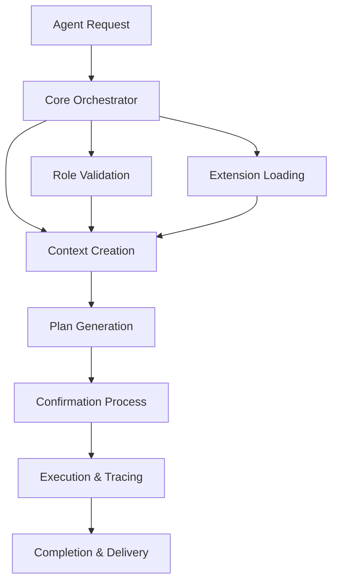

# MPLP v1.0 System Architecture

<!--
文档元数据
版本: v1.0.0
创建时间: 2025-08-06T00:35:06Z
最后更新: 2025-08-06T00:35:06Z
文档状态: 已完成
-->

## 🏛️ High-Level System Overview

MPLP v1.0 is designed as a comprehensive multi-agent project lifecycle protocol with a modular, event-driven architecture that supports complex workflow orchestration and real-time collaboration.

## 🎯 System Goals

### Primary Objectives
- **Multi-Agent Coordination**: Seamless collaboration between AI agents
- **Lifecycle Management**: Complete project lifecycle from inception to delivery
- **Scalability**: Handle multiple concurrent projects and agents
- **Extensibility**: Plugin architecture for custom functionality
- **Reliability**: Fault-tolerant with automatic recovery mechanisms

### Quality Attributes
- **Performance**: Sub-second response times for most operations
- **Availability**: 99.9% uptime with graceful degradation
- **Security**: Role-based access control with audit trails
- **Maintainability**: Clean architecture with clear module boundaries
- **Testability**: Comprehensive testing at all levels

## 🏗️ System Components

### Core Runtime (Orchestrator)
```
┌─────────────────────────────────────────┐
│              Core Module                │
├─────────────────────────────────────────┤
│  • Workflow Orchestration              │
│  • Module Coordination                 │
│  • Event Bus Management                │
│  • Performance Monitoring              │
│  • Error Handling & Recovery           │
└─────────────────────────────────────────┘
```

### Protocol Modules
```
┌─────────────┬─────────────┬─────────────┐
│   Context   │    Plan     │   Confirm   │
│   Module    │   Module    │   Module    │
├─────────────┼─────────────┼─────────────┤
│ • Lifecycle │ • Tasks     │ • Approvals │
│ • Metadata  │ • Workflow  │ • Reviews   │
│ • State     │ • Resources │ • Decisions │
└─────────────┴─────────────┴─────────────┘

┌─────────────┬─────────────┬─────────────┐
│    Trace    │    Role     │ Extension   │
│   Module    │   Module    │   Module    │
├─────────────┼─────────────┼─────────────┤
│ • Events    │ • RBAC      │ • Plugins   │
│ • Metrics   │ • Perms     │ • Hooks     │
│ • Logs      │ • Audit     │ • APIs      │
└─────────────┴─────────────┴─────────────┘
```

## 🔄 System Flow

### 1. Standard Workflow Execution


### 2. Event-Driven Communication
```
Agent A ──┐
          ├─→ Event Bus ──┐
Agent B ──┘              ├─→ Module Processing
                         │
Extension ───────────────┘
```

### 3. Data Flow Architecture
```
┌─────────────┐    ┌─────────────┐    ┌─────────────┐
│   Client    │───▶│     API     │───▶│ Application │
│  (Agents)   │    │   Gateway   │    │   Services  │
└─────────────┘    └─────────────┘    └─────────────┘
                                              │
┌─────────────┐    ┌─────────────┐    ┌─────────────┐
│  Database   │◀───│ Repository  │◀───│   Domain    │
│   Layer     │    │    Layer    │    │   Entities  │
└─────────────┘    └─────────────┘    └─────────────┘
```

## 🌐 Deployment Architecture

### Development Environment
```
┌─────────────────────────────────────────┐
│           Development Setup             │
├─────────────────────────────────────────┤
│  • Local Node.js Runtime               │
│  • In-Memory Data Storage              │
│  • File-based Configuration            │
│  • Console Logging                     │
└─────────────────────────────────────────┘
```

### Production Environment
```
┌─────────────────────────────────────────┐
│            Load Balancer                │
└─────────────┬───────────────────────────┘
              │
    ┌─────────┴─────────┐
    │                   │
┌───▼────┐         ┌───▼────┐
│ MPLP   │         │ MPLP   │
│ Node 1 │         │ Node 2 │
└───┬────┘         └───┬────┘
    │                  │
    └─────────┬────────┘
              │
    ┌─────────▼─────────┐
    │    Database       │
    │    Cluster        │
    └───────────────────┘
```

## 🔧 Technical Stack

### Core Technologies
- **Runtime**: Node.js 18+
- **Language**: TypeScript 5.0+
- **Architecture**: Domain-Driven Design (DDD)
- **Patterns**: CQRS, Event Sourcing, Repository

### Infrastructure
- **Database**: PostgreSQL (primary), Redis (cache)
- **Message Queue**: Redis Pub/Sub or RabbitMQ
- **Monitoring**: Prometheus + Grafana
- **Logging**: Winston + ELK Stack

### Development Tools
- **Testing**: Jest + Supertest
- **Linting**: ESLint + Prettier
- **Documentation**: TypeDoc + Markdown
- **CI/CD**: GitHub Actions

## 📊 Performance Characteristics

### Throughput Targets
- **Workflow Creation**: 1000+ per second
- **Event Processing**: 10,000+ per second
- **API Requests**: 5000+ per second
- **Concurrent Users**: 10,000+

### Latency Targets
- **API Response**: < 100ms (95th percentile)
- **Workflow Execution**: < 5 seconds (simple)
- **Event Propagation**: < 50ms
- **Database Queries**: < 10ms

### Scalability Patterns
- **Horizontal Scaling**: Stateless application nodes
- **Database Sharding**: By context or tenant
- **Caching Strategy**: Multi-level caching
- **Load Balancing**: Round-robin with health checks

## 🛡️ Security Architecture

### Authentication & Authorization
```
┌─────────────┐    ┌─────────────┐    ┌─────────────┐
│   Client    │───▶│    Auth     │───▶│    Role     │
│ Credentials │    │  Service    │    │  Validation │
└─────────────┘    └─────────────┘    └─────────────┘
                           │
                   ┌───────▼───────┐
                   │  JWT Tokens   │
                   │  + Refresh    │
                   └───────────────┘
```

### Security Layers
1. **Transport Security**: TLS 1.3 encryption
2. **API Security**: JWT-based authentication
3. **Authorization**: Role-based access control (RBAC)
4. **Data Security**: Encryption at rest and in transit
5. **Audit Trail**: Comprehensive logging and monitoring

## 🔍 Monitoring & Observability

### Metrics Collection
- **Application Metrics**: Response times, error rates, throughput
- **Business Metrics**: Workflow completion rates, user activity
- **Infrastructure Metrics**: CPU, memory, disk, network
- **Custom Metrics**: Module-specific performance indicators

### Logging Strategy
- **Structured Logging**: JSON format with correlation IDs
- **Log Levels**: ERROR, WARN, INFO, DEBUG, TRACE
- **Log Aggregation**: Centralized logging with ELK stack
- **Log Retention**: 30 days for INFO+, 7 days for DEBUG

### Health Checks
- **Liveness Probe**: Basic application health
- **Readiness Probe**: Service dependency health
- **Deep Health Check**: End-to-end workflow validation
- **Circuit Breakers**: Automatic failure isolation

## 🚀 Scalability Considerations

### Horizontal Scaling
- **Stateless Design**: No server-side session state
- **Database Scaling**: Read replicas and sharding
- **Cache Distribution**: Redis cluster for shared cache
- **Load Distribution**: Intelligent routing based on load

### Vertical Scaling
- **Resource Optimization**: Efficient memory and CPU usage
- **Connection Pooling**: Database connection management
- **Async Processing**: Non-blocking I/O operations
- **Garbage Collection**: Optimized GC settings

### Future Scaling
- **Microservices**: Potential module separation
- **Event Streaming**: Kafka for high-volume events
- **Container Orchestration**: Kubernetes deployment
- **Edge Computing**: CDN for static assets

## 🔄 Integration Patterns

### Internal Integration
- **Event Bus**: Asynchronous module communication
- **Shared Database**: Consistent data access
- **API Gateway**: Unified external interface
- **Service Mesh**: Advanced traffic management

### External Integration
- **REST APIs**: Standard HTTP-based integration
- **WebHooks**: Event-driven external notifications
- **Message Queues**: Reliable async communication
- **File Exchange**: Batch data processing

---

This system architecture provides a robust foundation for multi-agent collaboration while maintaining flexibility for future enhancements and scaling requirements.
