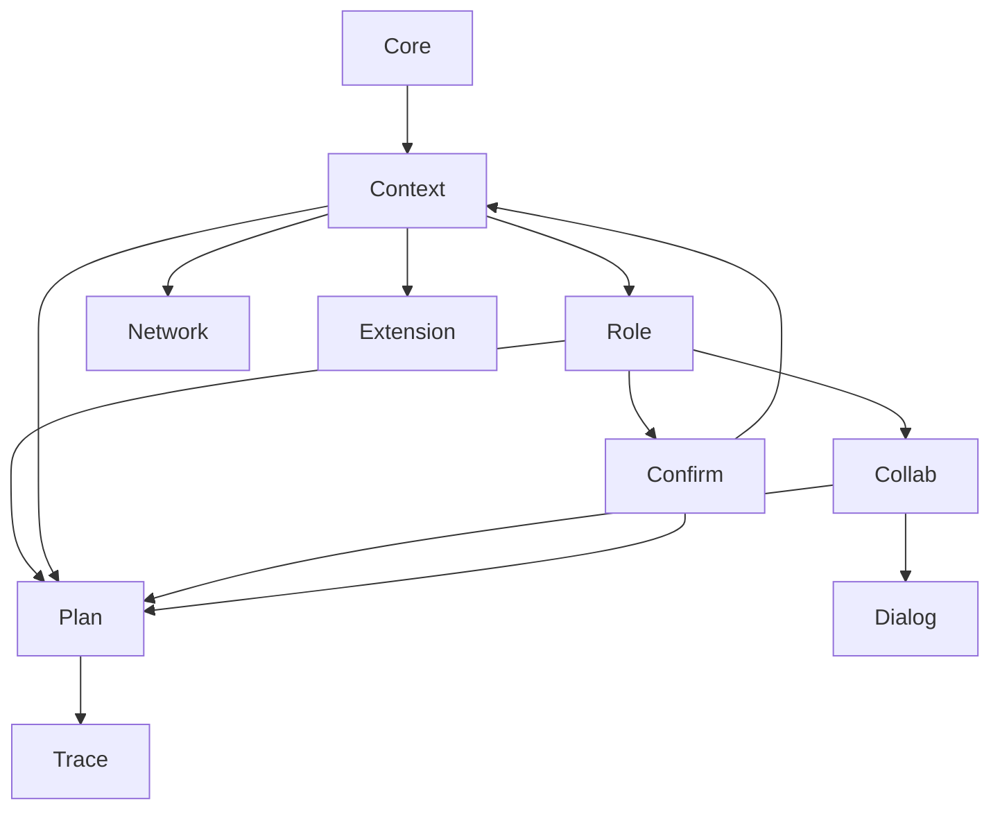

> [!FROZEN]
> **MPLP Protocol v1.0.0 — Frozen Specification**
> **Freeze Date**: 2025-12-03
> **Status**: FROZEN (no breaking changes permitted)
> **Governance**: MPLP Protocol Governance Committee (MPGC)
> **License**: Apache-2.0
> **Note**: Any normative change requires a new protocol version.

> [!FROZEN]
> **MPLP Protocol v1.0.0 — Frozen Specification**
> **Freeze Date**: 2025-12-03
> **Status**: FROZEN (no breaking changes permitted)
> **Governance**: MPLP Protocol Governance Committee (MPGC)
> **License**: Apache-2.0
> **Note**: Any normative change requires a new protocol version.

---
**MPLP Protocol 1.0.0 — Frozen Specification**
**Status**: Frozen as of 2025-11-30
**Copyright**: © 2025 邦士（北京）网络科技有限公司
**License**: Apache License 2.0 (see LICENSE at repository root)
**Any normative change requires a new protocol version.**
---

# Module Interactions

## 1. Scope

This document defines the **normative interaction patterns** and **dependency graph** between the 10 Core MPLP Modules. It serves as the "wiring diagram" for the protocol.

## 2. Dependency Graph

The following directed graph defines the initialization and reference dependencies. A module **MUST** have its dependencies satisfied before it can be fully functional.

### 2.1 Layered Dependencies
1.  **Bootstrap Layer**: `Core` (Version, Config)
2.  **Foundation Layer**: `Context`, `Role`, `Network`, `Extension` (Static State)
3.  **Execution Layer**: `Plan`, `Collab`, `Dialog`, `Confirm` (Dynamic State)
4.  **Observability Layer**: `Trace` (Cross-cutting)

## 3. Normative Interaction Patterns

### 3.1 The "Plan-Execute-Trace" Loop
1.  **Plan**: Agent creates a `Plan` linked to `Context`.
2.  **Execute**: Runtime executes steps, generating `Trace` spans.
3.  **Trace**: `Trace` records the execution history, linking back to `Plan` and `Context`.

### 3.2 The "Confirm-Gate" Pattern
1.  **Request**: Agent requests action (e.g., "Delete Database").
2.  **Gate**: `Confirm` module intercepts request (Status: `pending`).
3.  **Decision**: `Role` (Human/Admin) approves request.
4.  **Proceed**: Action executes only after `Confirm` status is `approved`.

### 3.3 The "Collab-Dialog" Pattern
1.  **Session**: `Collab` session starts (e.g., "Pair Programming").
2.  **Exchange**: Agents exchange messages via `Dialog` module.
3.  **Context**: All messages share the same `thread_id` and `context_id`.

## 4. Data Flow & Consistency

- **Reference Integrity**: All `*_id` references (e.g., `context_id`, `role_id`) **MUST** resolve to valid entities in the PSG.
- **Event Propagation**: State changes in any module **MUST** emit a `GraphUpdateEvent` to notify subscribers (e.g., Trace, UI).

## 5. Anti-Patterns (What NOT to do)

- **Circular Dependency**: `Context` should never depend on `Plan`.
- **Orphaned Execution**: `Trace` without a `context_id` is invalid.
- **Implicit Roles**: Actions without a defined `role_id` violate the audit trail.
---

© 2025 邦士（北京）网络科技有限公司
Licensed under the Apache License, Version 2.0.
