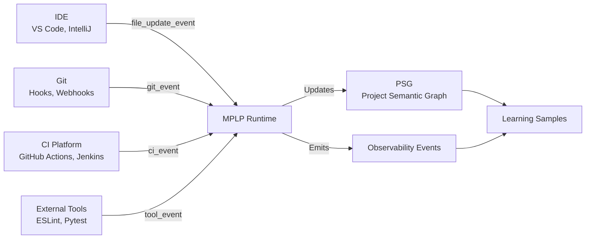

---
**MPLP Protocol 1.0.0 — Frozen Specification**
**Status**: Frozen as of 2025-11-30
**Copyright**: © 2025 邦士（北京）网络科技有限公司
**License**: Apache License 2.0 (see LICENSE at repository root)
**Any normative change requires a new protocol version.**
## 1. Introduction

### 1.1 What is the Integration Layer?

**Integration Layer** is MPLP's L4 Boundary Layer that defines how external development tools interact with MPLP-compliant runtimes through structured events.

**Layer Hierarchy**:
```
L1/L2: Schemas & Modules (Context, Plan, Trace, etc.)
  ↓
Profiles: SA / MAP execution semantics
  ↓
L3 Runtime Glue: Module→PSG paths, Crosscuts
  ↓
Observability: Event streams (Phase 3)
  ↓
L4 Integration Layer: IDE / CI / Git / Tools ← This Layer
```

### 1.2 Why Integration Layer Matters

**Without Integration Spec**:
- ❌ Each tool integrates differently (incompatible formats)
- ❌ No standard way to correlate IDE changes with PSG updates
- ❌ CI/Git events disconnected from MPLP runtime state

**With Integration Spec**:
- ✅ Uniform event structures across tools
- ✅ Seamless IDE ↔ Runtime ↔ PSG flows
- ✅ Traceable CI/Git operations in MPLP context

---

## 2. Integration Model

### 2.1 High-Level Topology



### 2.2 Integration Flow

**Typical Flow**:
1. **External Tool Action** (e.g., user saves file in IDE)
2. **Integration Event Emission** (file_update_event created)
3. **Wrapped in Observability Event** (as ExternalIntegrationEvent.payload)
4. **Runtime Processing**:
   - Updates PSG nodes/edges
   - May trigger pipeline stages
   - May collect learning samples
5. **Optional Feedback** (e.g., IDE shows PSG validation errors)

---

## 3. Integration Entities (4 Event Families)

### 3.1 TOOL_EVENT

**Purpose**: External tool invocation and results (formatters, linters, test runners, generators).

**Minimal Schema**:
```json
{
  "tool_id": "eslint-v8.54.0",
  "tool_kind": "formatter" | "linter" | "test_runner" | "generator" | "other",
  "invocation_id": "550e8400-...",  // UUID v4
  "status": "pending" | "running" | "succeeded" | "failed" | "cancelled"
}
```

**Use Cases**:
- Track linting violations over time
- Correlate test failures with code changes
- Monitor formatter application patterns

**Reference**: [`mplp-tool-event.schema.json`](../../schemas/v2/integration/mplp-tool-event.schema.json)

---

### 3.2 FILE_UPDATE_EVENT

**Purpose**: IDE file changes (save, refactor, batch modify).

**Minimal Schema**:
```json
{
  "file_path": "src/components/App.tsx",
  "change_type": "created" | "modified" | "deleted" | "renamed",
  "timestamp": "2025-11-30T10:15:30.000Z"
}
```

**Use Cases**:
- Trigger PSG node updates on file changes
- Track edit patterns for learning samples
- Correlate file changes with plan execution

**Reference**: [`mplp-file-update-event.schema.json`](../../schemas/v2/integration/mplp-file-update-event.schema.json)

---

### 3.3 GIT_EVENT

**Purpose**: Git operations (commit, push, branch/merge/tag).

**Minimal Schema**:
```json
{
  "repo_url": "https://github.com/org/repo.git",
  "commit_id": "abc123def456...",
  "ref_name": "refs/heads/main",
  "event_kind": "commit" | "push" | "merge" | "tag" | "branch_create" | "branch_delete",
  "timestamp": "2025-11-30T11:30:00.000Z"
}
```

**Use Cases**:
- Record commits in PSG for audit trail
- Trigger CI pipelines on push
- Track collaboration patterns via commit history

**Reference**: [`mplp-git-event.schema.json`](../../schemas/v2/integration/mplp-git-event.schema.json)

---

### 3.4 CI_EVENT

**Purpose**: CI pipeline execution status.

**Minimal Schema**:
```json
{
  "ci_provider": "github-actions",
  "pipeline_id": "build-and-test",
  "run_id": "2025113001",
  "status": "pending" | "running" | "succeeded" | "failed" | "cancelled"
}
```

**Use Cases**:
- Correlate CI results with plan execution
- Trigger rollback on CI failure
- Track build times and success rates

**Reference**: [`mplp-ci-event.schema.json`](../../schemas/v2/integration/mplp-ci-event.schema.json)

---

## 4. Minimal Requirements (Compliance Boundary)

### 4.1 MPLP v1.0 Compliance

**Integration Layer**:
- ❌ **NOT REQUIRED**: Integration is entirely optional for v1.0
- ✅ **RECOMMENDED**: If integrating external tools, use these specs
- ✅ **REQUIRED (if used)**: Must conform to Integration schemas & invariants

**Rationale**:
- MPLP v1.0 focuses on core protocol (L1/L2), not external tool integration
- Integration adds value but increases implementation complexity
- Vendors can choose which tools to integrate based on user needs

---

### 4.2 Recommended Integration Points

**If Runtime Integrates**:
1. **IDE Integration** → RECOMMENDED:
   - Emit `file_update_event` on file save/create/delete
   - Use events to trigger PSG updates

2. **CI Integration** → RECOMMENDED:
   - Emit `ci_event` on pipeline start/complete/fail
   - Correlate with PipelineStageEvent (from Phase 3)

3. **Git Integration** → RECOMMENDED:
   - Emit `git_event` on commit/push/merge
   - Store commit metadata in PSG

4. **Tool Integration** → OPTIONAL:
   - Emit `tool_event` for linters, formatters, test runners
   - Track tool invocations for learning samples

---

### 4.3 Conformance Requirements (When Implemented)

**If Runtime Implements Integration**:
1. ✅ Integration events MUST conform to [`schemas/v2/integration/`](../../schemas/v2/integration/)
2. ✅ Events MUST pass [`integration-invariants.yaml`](../../schemas/v2/invariants/integration-invariants.yaml)
3. ✅ Events SHOULD be wrapped as `ExternalIntegrationEvent.payload` (from Phase 3)
4. ⚠️ Transport mechanism (Webhook, MQ, file) is implementation-specific

---

## 5. Relationship to Observability (Phase 3)

### 5.1 Integration Events as ExternalIntegrationEvent Payload

**Pattern**: Integration events typically appear as `ExternalIntegrationEvent.payload`.

**Example**:
```json
{
  "event_id": "evt-001",
  "event_family": "ExternalIntegrationEvent",
  "event_type": "file_update",
  "timestamp": "2025-11-30T10:15:30.000Z",
  "source_module": "IDE",
  "payload": {
    // file_update_event schema
    "file_path": "src/App.tsx",
    "change_type": "modified",
    "timestamp": "2025-11-30T10:15:30.000Z"
  }
}
```

**Benefits**:
- Unified event envelope (event_id, timestamp, event_family)
- Integration events inherit Observability infrastructure
- Consistent with Phase 3 event taxonomy

---

### 5.2 Event Family Mapping

| Integration Event | Observability Wrapper | Phase 3 Family |
|-------------------|----------------------|----------------|
| `tool_event` | ExternalIntegrationEvent | ExternalIntegrationEvent |
| `file_update_event` | ExternalIntegrationEvent | ExternalIntegrationEvent |
| `git_event` | ExternalIntegrationEvent | ExternalIntegrationEvent |
| `ci_event` | ExternalIntegrationEvent | ExternalIntegrationEvent |

**Note**: All Integration events use `ExternalIntegrationEvent` as envelope.

---

## 6. Relationship to Runtime Glue / PSG (Phase 5)

### 6.1 Integration Events Trigger PSG Updates

**Flow**: Integration Event → Runtime Processing → PSG Update

**Examples**:

1. **file_update_event → PSG Node Update**:
   ```
   file_update_event {file_path: "src/App.tsx", change_type: "modified"}
     → Runtime updates psg.file_nodes["src/App.tsx"].last_modified
     → Emits GraphUpdateEvent (from Phase 5)
   ```

2. **git_event → PSG Commit Record**:
   ```
   git_event {commit_id: "abc123", event_kind: "push"}
     → Runtime creates psg.commits["abc123"]
     → Links to branch nodes, author nodes
   ```

3. **ci_event → Pipeline Stage Update**:
   ```
   ci_event {status: "succeeded"}
     → Runtime updates psg.pipeline_state
     → Emits PipelineStageEvent (from Phase 3)
   ```

---

### 6.2 PSG as Integration Context

**PSG provides context for integration events**:
- **File updates** query PSG for current project structure
- **Git commits** reference PSG plan nodes, context nodes
- **CI results** correlate with PSG pipeline state

---

## 7. Security & Privacy Notes

### 7.1 PII in Integration Events

**Caution**: Integration events may contain:
- File paths (may reveal project structure)
- Commit messages (may contain sensitive info)
- Author names/emails
- CI logs (may contain secrets)

**Recommendations**:
- ⚠️ Sanitize sensitive data before emitting events
- ⚠️ Use workspace-relative paths (not absolute)
- ⚠️ Avoid storing secrets in event payloads

---

### 7.2 Access Control

**Not in MPLP Scope**:
- Authentication mechanisms
- Authorization policies
- Event encryption in transit

**Implementation Responsibility**:
- Vendors SHOULD implement access control for integration endpoints
- Vendors SHOULD use secure transport (TLS) for event emission

---

## 8. Implementation Patterns

### 8.1 IDE Integration Example (VS Code)

**Pseudo-code**:
```typescript
// VS Code extension listens for file saves
workspace.onDidSaveTextDocument((document) => {
  const event: FileUpdateEvent = {
    file_path: workspace.asRelativePath(document.uri),
    change_type: "modified",
    workspace_root: workspace.rootPath,
    timestamp: new Date().toISOString()
  };

  // Emit to MPLP runtime
  mplpRuntime.emitIntegrationEvent({
    event_family: "ExternalIntegrationEvent",
    event_type: "file_update",
    payload: event
  });
});
```

---

### 8.2 Git Hook Integration Example

**Pseudo-code** (post-commit hook):
```bash
#!/bin/bash
# .git/hooks/post-commit

COMMIT_ID=$(git rev-parse HEAD)
REF_NAME=$(git symbolic-ref HEAD)
AUTHOR_NAME=$(git log -1 --format='%an')

# Create git_event JSON
EVENT=$(cat <<EOF
{
  "repo_url": "$(git config --get remote.origin.url)",
  "commit_id": "$COMMIT_ID",
  "ref_name": "$REF_NAME",
  "event_kind": "commit",
  "author_name": "$AUTHOR_NAME",
  "timestamp": "$(date -u +%Y-%m-%dT%H:%M:%S.000Z)"
}
EOF
)

# Send to MPLP runtime
curl -X POST http://localhost:8080/integration/git \
  -H "Content-Type: application/json" \
  -d "$EVENT"
```

---

### 8.3 CI Integration Example (GitHub Actions)

**Pseudo-code** (GitHub Actions workflow):
```yaml
on: [push, pull_request]
jobs:
  build:
    runs-on: ubuntu-latest
    steps:
      - uses: actions/checkout@v3
      - name: Run tests
        run: npm test

      - name: Emit CI event to MPLP
        if: always()
        run: |
          curl -X POST $MPLP_RUNTIME_URL/integration/ci \
            -H "Content-Type: application/json" \
            -d '{
              "ci_provider": "github-actions",
              "pipeline_id": "${{ github.workflow }}",
              "run_id": "${{ github.run_id }}",
              "status": "${{ job.status }}",
              "branch_name": "${{ github.ref_name }}",
              "commit_id": "${{ github.sha }}"
            }'
```

---

## 9. Compliance Summary

### 9.1 v1.0 Requirements

**REQUIRED**: None (Integration is optional)

**RECOMMENDED** (if integrating external tools):
- Emit `file_update_event` for IDE file changes
- Emit `git_event` for Git operations
- Emit `ci_event` for CI pipeline status
- Emit `tool_event` for external tool invocations

**REQUIRED (if Integration events are emitted)**:
- Events MUST conform to Integration schemas
- Events MUST pass Integration invariants
- Events SHOULD be wrapped as ExternalIntegrationEvent.payload

---

### 9.2 What is Out-of-Scope

**NOT in Integration Spec**:
- ❌ Specific IDE implementations (VS Code plugins, IntelliJ extensions)
- ❌ Specific CI platforms (how GitHub Actions emits events)
- ❌ Specific Git providers (GitHub vs GitLab webhooks)
- ❌ Transport mechanisms (Webhook vs MQ vs gRPC vs files)
- ❌ Bidirectional integration (Runtime→IDE feedback)
- ❌ Real-time event streaming protocols

**Reason**: Integration Spec defines **data structures**, not **implementation details**.

---

## 10. References

**Integration Layer**:
- [Integration Event Taxonomy](integration-event-taxonomy.yaml)
- [Tool Event Schema](../../schemas/v2/integration/mplp-tool-event.schema.json)
- [File Update Event Schema](../../schemas/v2/integration/mplp-file-update-event.schema.json)
- [Git Event Schema](../../schemas/v2/integration/mplp-git-event.schema.json)
- [CI Event Schema](../../schemas/v2/integration/mplp-ci-event.schema.json)
- [Integration Invariants](../../schemas/v2/invariants/integration-invariants.yaml)

**Related Phases**:
- [Phase 3: Observability Duties](../04-observability/mplp-observability-overview.md)
- [Phase 5: Runtime Glue](../06-runtime/mplp-runtime-glue-overview.md)

**Compliance**:
- [MPLP v1.0 Compliance Guide](../08-guides/mplp-v1.0-compliance-guide.md)

---

**End of MPLP Minimal Integration Spec**

*This specification defines the protocol-level data structures for external tool integration (IDE, CI, Git, Tools), enabling uniform integration patterns across MPLP-compliant runtimes while maintaining implementation flexibility.*
