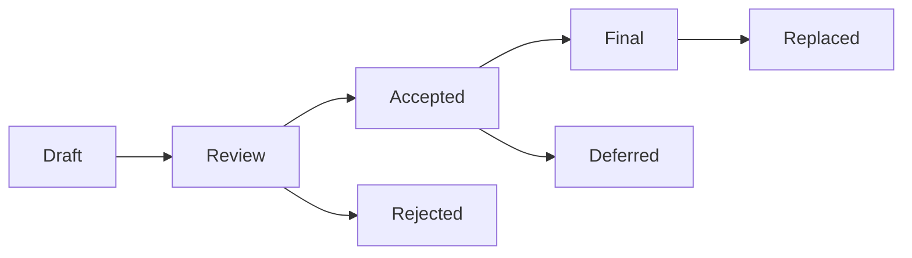

---
**MPLP Protocol 1.0.0 — Frozen Specification**
**Status**: Frozen as of 2025-11-30
**Copyright**: © 2025 邦士（北京）网络科技有限公司
**License**: Apache License 2.0 (see LICENSE at repository root)
**Any normative change requires a new protocol version.**
---

# MIP Process (MPLP Improvement Proposals)

**Status**: Active
**Version**: 1.0.0

## 1. Purpose

The MIP process is the primary mechanism for proposing new features, collecting community input, and documenting design decisions for the MPLP protocol.

## 2. MIP Types

1.  **Standards Track**: Describes a new feature or implementation for MPLP.
2.  **Informational**: Describes a MPLP design issue, or provides general guidelines or information to the community, but does not propose a new feature.
3.  **Process**: Describes a process surrounding MPLP, or proposes a change to (or an event in) a process.

## 3. MIP Lifecycle

- **Draft**: The author is writing the proposal.
- **Review**: The proposal is ready for community review.
- **Accepted**: The proposal has been accepted for implementation.
- **Rejected**: The proposal has been rejected.
- **Final**: The proposal has been implemented and is now part of the standard.
- **Deferred**: The proposal is accepted but implementation is postponed.
- **Replaced**: The proposal has been replaced by a newer MIP.

## 4. Contributing a MIP

1.  Fork the repository.
2.  Copy `mips/mip-template.md`.
3.  Fill in the details.
4.  Submit a Pull Request to the `mips/` directory.
