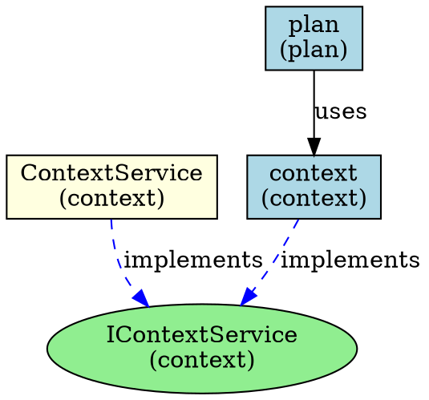

# MPLP 模块依赖关系图实现文档

> **项目**: Multi-Agent Project Lifecycle Protocol (MPLP)  
> **版本**: v1.0.0  
> **创建时间**: 2025-07-15  
> **更新时间**: 2025-07-15T15:00:00+08:00  
> **作者**: MPLP架构团队

## 📖 概述

本文档详细描述MPLP项目中模块依赖关系图的设计与实现。依赖关系图用于可视化和管理项目各模块之间的依赖关系，支持依赖验证、循环依赖检测和架构分析。

## 🏗️ 架构设计

### 核心组件

依赖图实现包含以下核心组件：

1. **DependencyGraph**: 依赖关系图的核心数据结构，管理节点和关系
2. **DependencyAnalyzer**: 静态分析工具，负责提取代码中的依赖关系
3. **EventBus**: 事件总线，用于组件间的通信
4. **EventTypes**: 定义系统中所有事件类型
5. **依赖图生成工具**: 命令行工具，用于执行依赖分析和生成可视化结果

### 组件关系图

```
┌────────────────────┐      ┌────────────────────┐
│                    │      │                    │
│   DependencyGraph  │◄─────┤  DependencyAnalyzer│
│                    │      │                    │
└─────────┬──────────┘      └─────────┬──────────┘
          │                           │
          │         ┌─────────────────┘
          │         │
          ▼         ▼
┌────────────────────┐      ┌────────────────────┐
│                    │      │                    │
│     EventBus       │◄─────┤  EventTypes        │
│                    │      │                    │
└────────────────────┘      └────────────────────┘
```

## 🔍 依赖图数据模型

### 节点类型

- **模块 (MODULE)**: 表示核心功能模块，如Context、Plan等
- **接口 (INTERFACE)**: 表示抽象接口定义
- **服务 (SERVICE)**: 表示具体的服务实现
- **适配器 (ADAPTER)**: 表示与外部系统的适配器

### 关系类型

- **使用 (USES)**: 模块A使用模块B
- **实现 (IMPLEMENTS)**: 类实现接口或模块实现接口
- **依赖 (DEPENDS_ON)**: 直接的依赖关系
- **继承 (EXTENDS)**: 类继承或接口继承关系

## 🔧 依赖分析功能

依赖分析器具有以下主要功能：

1. **代码静态分析**:
   - 分析TypeScript源文件
   - 提取导入语句、类定义和接口定义
   - 识别模块间的依赖关系

2. **依赖关系验证**:
   - 检测循环依赖
   - 验证依赖关系的有效性

3. **依赖图生成**:
   - 构建完整的依赖关系图
   - 导出为DOT格式的可视化文件
   - 生成Markdown格式的依赖报告

## 📊 使用方式

### 命令行使用

```bash
# 生成依赖关系图
npm run analyze:deps

# 生成详细依赖关系图（包含更多日志信息）
npm run analyze:deps:verbose
```

### 编程方式使用

```typescript
import { EventBus } from './core/event-bus';
import { DependencyAnalyzer } from './core/dependency-analyzer';
import { EventType } from './core/event-types';

// 创建事件总线
const eventBus = new EventBus();

// 创建依赖分析器
const analyzer = new DependencyAnalyzer(eventBus, {
  rootDir: process.cwd(),
  outputDir: './docs/architecture'
});

// 监听依赖图生成事件
eventBus.subscribe(EventType.DEPENDENCY_GRAPH_GENERATED, (data) => {
  console.log(`依赖图生成完成: ${data.nodeCount}个节点`);
});

// 生成依赖图
await analyzer.generateGraph();

// 导出可视化文件
await analyzer.exportGraphVisualization();
```

## 📋 输出示例

### 依赖图(DOT格式)



### 依赖报告(Markdown格式)

依赖报告包含以下主要内容：

1. 模块统计
   - 各类型节点数量
   - 总节点数和关系数

2. 模块依赖表
   - 源模块
   - 依赖模块
   - 依赖类型

3. 接口实现表
   - 模块
   - 服务
   - 实现的接口

4. 循环依赖检查
   - 是否存在循环依赖
   - 循环依赖路径

## ✅ 厂商中立实现

依赖图的实现严格遵循厂商中立原则：

1. 所有接口和类型定义均采用通用命名，不包含厂商特定名称
2. 核心模块依赖通用接口而非具体实现
3. 所有第三方适配器实现都通过标准接口进行
4. 事件总线使用标准化的事件类型
5. 依赖分析完全基于代码静态分析，不依赖特定厂商工具

## 🚀 未来扩展

1. **增强可视化功能**:
   - 支持更多图形格式(SVG, PNG, PDF)
   - 交互式Web可视化界面

2. **增强分析功能**:
   - 深度依赖路径分析
   - 模块依赖指标计算
   - 架构演进建议

3. **集成持续集成**:
   - 自动依赖分析
   - 架构规则检查
   - 依赖变更报警 