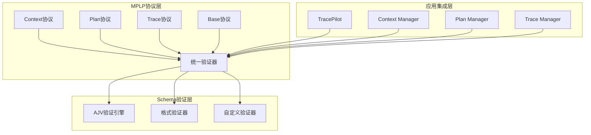

# MPLP Schema集成架构

> **项目**: Multi-Agent Project Lifecycle Protocol (MPLP)  
> **文档类型**: 架构设计文档  
> **版本**: v2.0.0  
> **创建时间**: 2025-01-09  
> **更新时间**: 2025-01-09T25:10:00+08:00  
> **作者**: MPLP团队

## 📖 概述

本文档详细说明MPLP协议中完整的Schema验证体系架构，包括各协议模块的Schema定义、验证机制和集成策略。

## 📋 目录

- [概述](#概述)
- [Schema架构设计](#schema架构设计)
- [协议Schema定义](#协议schema定义)
- [验证器实现](#验证器实现)
- [集成模式](#集成模式)
- [性能优化](#性能优化)
- [扩展性设计](#扩展性设计)

## 🏗️ Schema架构设计

### 整体架构图



### 核心设计原则

#### 1. **分层验证策略**

```typescript
/**
 * 分层验证架构
 */
interface ValidationLayer {
  // 基础语法验证
  syntax: {
    description: 'JSON Schema语法验证';
    engine: 'AJV';
    performance: '<10ms';
  };
  
  // 格式验证
  format: {
    description: 'UUID、时间戳、邮箱等格式验证';
    engine: 'ajv-formats';
    performance: '<5ms';
  };
  
  // 业务逻辑验证
  business: {
    description: '自定义业务规则验证';
    engine: 'custom validators';
    performance: '<20ms';
  };
  
  // 关联验证
  relationship: {
    description: '跨协议数据一致性验证';
    engine: 'MPLP validator';
    performance: '<50ms';
  };
}
```

#### 2. **模块化Schema设计**

```json
{
  "设计理念": {
    "继承性": "所有协议继承base-protocol",
    "扩展性": "支持动态字段扩展",
    "版本兼容": "向后兼容的版本管理",
    "性能优化": "预编译Schema减少运行时开销"
  }
}
```

## 📄 协议Schema定义

### 1. Base Protocol Schema

```json
{
  "$schema": "http://json-schema.org/draft-07/schema#",
  "$id": "base-protocol.json",
  "title": "MPLP Base Protocol",
  "description": "所有MPLP协议的基础Schema定义",
  "type": "object",
  "required": ["version", "timestamp"],
  "properties": {
    "version": {
      "type": "string",
      "pattern": "^\\d+\\.\\d+\\.\\d+$",
      "description": "协议版本号，遵循语义化版本规范",
      "examples": ["1.0.0", "1.2.3"]
    },
    "timestamp": {
      "type": "string",
      "format": "date-time",
      "description": "ISO 8601格式的时间戳",
      "examples": ["2025-01-09T16:10:00Z"]
    },
    "metadata": {
      "type": "object",
      "description": "可选的元数据字段",
      "additionalProperties": true
    }
  },
  "additionalProperties": false
}
```

### 2. Context Protocol Schema

```json
{
  "$schema": "http://json-schema.org/draft-07/schema#",
  "$id": "context-protocol.json",
  "title": "MPLP Context Protocol",
  "description": "Context模块数据Schema定义",
  "allOf": [
    { "$ref": "base-protocol.json" }
  ],
  "type": "object",
  "required": ["context_id", "user_id", "shared_state"],
  "properties": {
    "context_id": {
      "type": "string",
      "format": "uuid",
      "description": "上下文唯一标识符"
    },
    "user_id": {
      "type": "string",
      "minLength": 1,
      "maxLength": 255,
      "description": "用户标识符"
    },
    "shared_state": {
      "type": "object",
      "description": "共享状态数据",
      "additionalProperties": true
    },
    "permissions": {
      "type": "object",
      "properties": {
        "read": {
          "type": "array",
          "items": { "type": "string" }
        },
        "write": {
          "type": "array", 
          "items": { "type": "string" }
        }
      }
    }
  }
}
```

### 3. Plan Protocol Schema

```json
{
  "$schema": "http://json-schema.org/draft-07/schema#",
  "$id": "plan-protocol.json", 
  "title": "MPLP Plan Protocol",
  "description": "Plan模块数据Schema定义",
  "allOf": [
    { "$ref": "base-protocol.json" }
  ],
  "type": "object",
  "required": ["plan_id", "context_id", "tasks"],
  "properties": {
    "plan_id": {
      "type": "string",
      "format": "uuid",
      "description": "计划唯一标识符"
    },
    "context_id": {
      "type": "string", 
      "format": "uuid",
      "description": "关联的上下文ID"
    },
    "tasks": {
      "type": "array",
      "items": {
        "type": "object",
        "required": ["task_id", "title", "status"],
        "properties": {
          "task_id": {
            "type": "string",
            "format": "uuid"
          },
          "title": {
            "type": "string",
            "minLength": 1,
            "maxLength": 500
          },
          "status": {
            "type": "string",
            "enum": ["pending", "in_progress", "completed", "failed"]
          },
          "dependencies": {
            "type": "array",
            "items": {
              "type": "string",
              "format": "uuid"
            }
          }
        }
      }
    }
  }
}
```

### 4. Trace Protocol Schema

```json
{
  "$schema": "http://json-schema.org/draft-07/schema#",
  "$id": "trace-protocol.json",
  "title": "MPLP Trace Protocol", 
  "description": "Trace模块数据Schema定义",
  "allOf": [
    { "$ref": "base-protocol.json" }
  ],
  "type": "object",
  "required": ["trace_id", "operation_name", "status"],
  "properties": {
    "trace_id": {
      "type": "string",
      "format": "uuid",
      "description": "追踪唯一标识符"
    },
    "operation_name": {
      "type": "string",
      "minLength": 1,
      "maxLength": 255,
      "description": "操作名称"
    },
    "status": {
      "type": "string",
      "enum": ["started", "completed", "failed", "timeout"],
      "description": "追踪状态"
    },
    "performance_metrics": {
      "type": "object",
      "properties": {
        "duration_ms": {
          "type": "number",
          "minimum": 0,
          "description": "执行时长(毫秒)"
        },
        "memory_usage_mb": {
          "type": "number", 
          "minimum": 0,
          "description": "内存使用(MB)"
        }
      }
    },
    "tags": {
      "type": "object",
      "description": "自定义标签",
      "additionalProperties": true
    }
  }
}
```

## 🔍 验证器实现

### 统一验证器架构

```typescript
/**
 * MPLP Schema验证器
 */
import Ajv from 'ajv';
import addFormats from 'ajv-formats';

export class MPLPSchemaValidator {
  private ajv: Ajv;
  private compiledSchemas: Map<string, ValidateFunction> = new Map();
  
  constructor() {
    this.ajv = new Ajv({
      allErrors: true,
      strict: true,
      loadSchema: this.loadSchemaHandler.bind(this)
    });
    
    // 添加格式验证
    addFormats(this.ajv);
    
    // 预编译Schema
    this.precompileSchemas();
  }
  
  /**
   * 预编译Schema提升性能
   */
  private async precompileSchemas(): Promise<void> {
    const schemas = [
      'base-protocol.json',
      'context-protocol.json', 
      'plan-protocol.json',
      'trace-protocol.json'
    ];
    
    for (const schemaFile of schemas) {
      try {
        const schema = await this.loadSchema(schemaFile);
        const validate = this.ajv.compile(schema);
        this.compiledSchemas.set(schemaFile, validate);
      } catch (error) {
        throw new Error(`预编译Schema失败: ${schemaFile} - ${error}`);
      }
    }
  }
  
  /**
   * Context协议验证
   */
  validateContextProtocol(data: any): ValidationResult {
    return this.validateWithSchema('context-protocol.json', data);
  }
  
  /**
   * Plan协议验证
   */
  validatePlanProtocol(data: any): ValidationResult {
    return this.validateWithSchema('plan-protocol.json', data);
  }
  
  /**
   * Trace协议验证
   */
  validateTraceProtocol(data: any): ValidationResult {
    return this.validateWithSchema('trace-protocol.json', data);
  }
  
  /**
   * 使用指定Schema验证数据
   */
  private validateWithSchema(schemaName: string, data: any): ValidationResult {
    const validate = this.compiledSchemas.get(schemaName);
    if (!validate) {
      throw new Error(`Schema未找到: ${schemaName}`);
    }
    
    const valid = validate(data);
    
    return {
      valid,
      errors: valid ? [] : this.formatValidationErrors(validate.errors || []),
      schema: schemaName,
      data: data
    };
  }
  
  /**
   * 格式化验证错误
   */
  private formatValidationErrors(errors: ErrorObject[]): ValidationError[] {
    return errors.map(error => ({
      path: error.instancePath,
      message: error.message || 'Unknown error',
      value: error.data,
      schema_path: error.schemaPath,
      keyword: error.keyword
    }));
  }
  
  /**
   * 批量验证
   */
  validateBatch(validations: Array<{schema: string; data: any}>): ValidationResult[] {
    return validations.map(({ schema, data }) => {
      try {
        return this.validateWithSchema(schema, data);
      } catch (error) {
        return {
          valid: false,
          errors: [{
            path: '',
            message: error instanceof Error ? error.message : 'Unknown error',
            value: data,
            schema_path: '',
            keyword: 'batch_validation'
          }],
          schema,
          data
        };
      }
    });
  }
}
```

### 自定义验证器扩展

```typescript
/**
 * 自定义验证器
 */
export class CustomValidators {
  /**
   * 注册自定义验证器
   */
  static register(ajv: Ajv): void {
    // UUID验证增强
    ajv.addKeyword({
      keyword: 'uuid',
      type: 'string',
      compile: () => (data: string) => {
        const uuidRegex = /^[0-9a-f]{8}-[0-9a-f]{4}-[1-5][0-9a-f]{3}-[89ab][0-9a-f]{3}-[0-9a-f]{12}$/i;
        return uuidRegex.test(data);
      }
    });
    
    // 时间戳验证增强
    ajv.addKeyword({
      keyword: 'futureTimestamp',
      type: 'string',
      compile: () => (data: string) => {
        const timestamp = new Date(data);
        return timestamp > new Date();
      }
    });
    
    // 依赖关系验证
    ajv.addKeyword({
      keyword: 'noCyclicDependencies',
      type: 'array',
      compile: () => (dependencies: string[]) => {
        // 检查循环依赖逻辑
        return !this.hasCyclicDependencies(dependencies);
      }
    });
  }
  
  /**
   * 检查循环依赖
   */
  private static hasCyclicDependencies(dependencies: string[]): boolean {
    // 实现循环依赖检测算法
    const visited = new Set<string>();
    const inStack = new Set<string>();
    
    for (const dep of dependencies) {
      if (this.dfsHasCycle(dep, visited, inStack, dependencies)) {
        return true;
      }
    }
    
    return false;
  }
}
```

## 🔗 集成模式

### 1. TracePilot集成

```typescript
/**
 * TracePilot中的Schema集成
 */
export class TracePilotSchemaIntegration {
  private validator: MPLPSchemaValidator;
  
  constructor() {
    this.validator = new MPLPSchemaValidator();
  }
  
  /**
   * 验证追踪数据
   */
  async validateTraceData(traceData: any): Promise<boolean> {
    const result = this.validator.validateTraceProtocol(traceData);
    
    if (!result.valid) {
      logger.error('追踪数据验证失败', {
        errors: result.errors,
        data: traceData
      });
      
      // 发送验证失败事件
      this.emit('validation_failed', {
        type: 'trace',
        errors: result.errors,
        data: traceData
      });
      
      return false;
    }
    
    return true;
  }
  
  /**
   * 自动修复Schema错误
   */
  async autoFixSchemaErrors(data: any, errors: ValidationError[]): Promise<any> {
    let fixedData = { ...data };
    
    for (const error of errors) {
      switch (error.keyword) {
        case 'required':
          fixedData = this.addMissingRequiredFields(fixedData, error);
          break;
          
        case 'format':
          fixedData = this.fixFormatErrors(fixedData, error);
          break;
          
        case 'type':
          fixedData = this.fixTypeErrors(fixedData, error);
          break;
      }
    }
    
    return fixedData;
  }
}
```

### 2. 模块管理器集成

```typescript
/**
 * 模块管理器Schema集成基类
 */
export abstract class SchemaIntegratedManager {
  protected validator: MPLPSchemaValidator;
  
  constructor() {
    this.validator = new MPLPSchemaValidator();
  }
  
  /**
   * 创建前验证
   */
  protected async validateBeforeCreate(data: any): Promise<void> {
    const result = await this.validate(data);
    if (!result.valid) {
      throw new ValidationError(`数据验证失败: ${JSON.stringify(result.errors)}`);
    }
  }
  
  /**
   * 更新前验证
   */
  protected async validateBeforeUpdate(data: any): Promise<void> {
    await this.validateBeforeCreate(data);
  }
  
  /**
   * 抽象验证方法
   */
  protected abstract validate(data: any): Promise<ValidationResult>;
}

/**
 * Context管理器Schema集成
 */
export class ContextManagerWithSchema extends SchemaIntegratedManager {
  protected async validate(data: any): Promise<ValidationResult> {
    return this.validator.validateContextProtocol(data);
  }
  
  async createContext(data: ContextCreationData): Promise<ContextProtocol> {
    await this.validateBeforeCreate(data);
    
    // 创建逻辑...
    const context = await this.doCreateContext(data);
    
    // 创建后再次验证
    await this.validateBeforeCreate(context);
    
    return context;
  }
}
```

## ⚡ 性能优化

### 1. Schema预编译

```typescript
/**
 * Schema预编译优化
 */
export class SchemaPrecompiler {
  private static compiledSchemas = new Map<string, ValidateFunction>();
  
  /**
   * 预编译所有Schema
   */
  static async precompileAll(): Promise<void> {
    const startTime = Date.now();
    
    const schemas = await this.loadAllSchemas();
    
    for (const [name, schema] of schemas) {
      const ajv = new Ajv({ allErrors: true });
      addFormats(ajv);
      
      const validate = ajv.compile(schema);
      this.compiledSchemas.set(name, validate);
    }
    
    const endTime = Date.now();
    logger.info(`Schema预编译完成`, {
      count: schemas.size,
      duration_ms: endTime - startTime
    });
  }
  
  /**
   * 获取编译后的验证器
   */
  static getValidator(schemaName: string): ValidateFunction {
    const validator = this.compiledSchemas.get(schemaName);
    if (!validator) {
      throw new Error(`Schema验证器未找到: ${schemaName}`);
    }
    return validator;
  }
}
```

### 2. 缓存策略

```typescript
/**
 * 验证结果缓存
 */
export class ValidationCache {
  private cache = new Map<string, CacheEntry>();
  private maxSize = 1000;
  private ttl = 300000; // 5分钟
  
  /**
   * 获取缓存的验证结果
   */
  get(key: string): ValidationResult | null {
    const entry = this.cache.get(key);
    if (!entry || Date.now() - entry.timestamp > this.ttl) {
      this.cache.delete(key);
      return null;
    }
    
    return entry.result;
  }
  
  /**
   * 缓存验证结果
   */
  set(key: string, result: ValidationResult): void {
    if (this.cache.size >= this.maxSize) {
      const oldestKey = this.cache.keys().next().value;
      this.cache.delete(oldestKey);
    }
    
    this.cache.set(key, {
      result,
      timestamp: Date.now()
    });
  }
  
  /**
   * 生成缓存键
   */
  generateKey(schema: string, data: any): string {
    const dataHash = crypto
      .createHash('md5')
      .update(JSON.stringify(data))
      .digest('hex');
    
    return `${schema}:${dataHash}`;
  }
}
```

## 🔄 扩展性设计

### 1. 动态Schema加载

```typescript
/**
 * 动态Schema加载器
 */
export class DynamicSchemaLoader {
  private schemaCache = new Map<string, any>();
  
  /**
   * 动态加载Schema
   */
  async loadSchema(schemaId: string): Promise<any> {
    if (this.schemaCache.has(schemaId)) {
      return this.schemaCache.get(schemaId);
    }
    
    const schema = await this.fetchSchema(schemaId);
    this.schemaCache.set(schemaId, schema);
    
    return schema;
  }
  
  /**
   * 从多个来源获取Schema
   */
  private async fetchSchema(schemaId: string): Promise<any> {
    // 尝试本地文件
    try {
      return await this.loadFromFile(schemaId);
    } catch (error) {
      logger.warn(`本地Schema文件未找到: ${schemaId}`);
    }
    
    // 尝试远程URL
    try {
      return await this.loadFromUrl(schemaId);
    } catch (error) {
      logger.warn(`远程Schema加载失败: ${schemaId}`);
    }
    
    throw new Error(`Schema未找到: ${schemaId}`);
  }
}
```

### 2. 版本兼容性

```typescript
/**
 * Schema版本管理器
 */
export class SchemaVersionManager {
  private versions = new Map<string, Map<string, any>>();
  
  /**
   * 注册Schema版本
   */
  registerVersion(schemaName: string, version: string, schema: any): void {
    if (!this.versions.has(schemaName)) {
      this.versions.set(schemaName, new Map());
    }
    
    this.versions.get(schemaName)!.set(version, schema);
  }
  
  /**
   * 获取兼容的Schema版本
   */
  getCompatibleSchema(schemaName: string, requestedVersion: string): any {
    const schemaVersions = this.versions.get(schemaName);
    if (!schemaVersions) {
      throw new Error(`Schema不存在: ${schemaName}`);
    }
    
    // 尝试精确匹配
    if (schemaVersions.has(requestedVersion)) {
      return schemaVersions.get(requestedVersion);
    }
    
    // 尝试向后兼容
    const compatibleVersion = this.findBackwardCompatibleVersion(
      schemaVersions,
      requestedVersion
    );
    
    if (compatibleVersion) {
      return schemaVersions.get(compatibleVersion);
    }
    
    throw new Error(`兼容的Schema版本未找到: ${schemaName}@${requestedVersion}`);
  }
}
```

## 📊 监控和指标

### 验证性能监控

```typescript
/**
 * Schema验证性能监控
 */
export class ValidationMetrics {
  private metrics = {
    validation_count: 0,
    validation_time_total: 0,
    validation_errors: 0,
    cache_hits: 0,
    cache_misses: 0
  };
  
  /**
   * 记录验证指标
   */
  recordValidation(duration: number, success: boolean): void {
    this.metrics.validation_count++;
    this.metrics.validation_time_total += duration;
    
    if (!success) {
      this.metrics.validation_errors++;
    }
  }
  
  /**
   * 获取性能报告
   */
  getPerformanceReport(): PerformanceReport {
    const avgTime = this.metrics.validation_time_total / this.metrics.validation_count;
    const errorRate = this.metrics.validation_errors / this.metrics.validation_count;
    const cacheHitRate = this.metrics.cache_hits / (this.metrics.cache_hits + this.metrics.cache_misses);
    
    return {
      total_validations: this.metrics.validation_count,
      average_time_ms: avgTime,
      error_rate: errorRate,
      cache_hit_rate: cacheHitRate,
      timestamp: new Date().toISOString()
    };
  }
}
```

---

> **版权声明**: 本文档属于MPLP项目，遵循项目开源协议。  
> **架构状态**: ✅ Schema集成架构已完全实现 