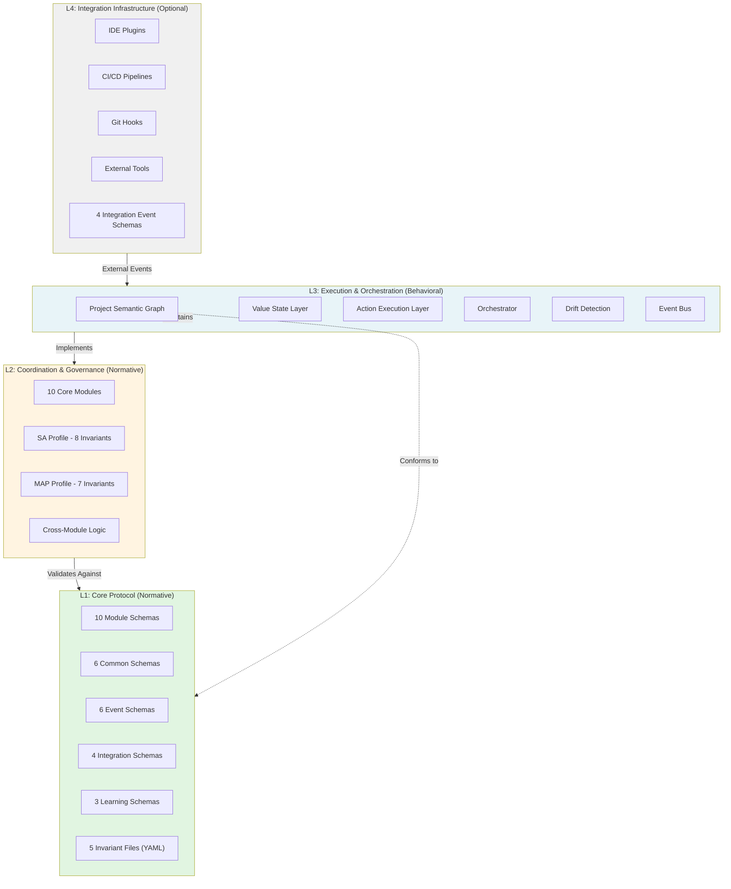

---
title: Architecture Overview
description: Comprehensive architectural view of MPLP v1.0 four-layer architecture (L1-L4), design principles, normative boundaries, and implementation guidance for multi-agent AI systems.
keywords: [MPLP, Multi-Agent Lifecycle Protocol, Agent OS Protocol, AI Agent, Observable, Governed, Vendor-neutral, MPLP architecture, L1 L2 L3 L4, protocol layers, schema-first design, PSG, Project Semantic Graph, agent architecture]
sidebar_label: Architecture Overview
sidebar_position: 1
---
> [!FROZEN]
> **MPLP Protocol v1.0.0  Frozen Specification**
> **Freeze Date**: 2025-12-03
> **Status**: FROZEN (no breaking changes permitted)
> **Governance**: MPLP Protocol Governance Committee (MPGC)
> **License**: Apache-2.0
> **Note**: Any normative change requires a new protocol version.

# MPLP Architecture Overview

## 1. Purpose

This document provides a comprehensive architectural view of the **Multi-Agent Lifecycle Protocol (MPLP) v1.0**, defining the structural organization into four distinct layers (L1-L4), design principles, normative boundaries, and implementation guidance. As a world-class open protocol specification, MPLP is designed to enable vendor-neutral, interoperable, and auditable multi-agent AI systems.

The architecture rigorously decouples **data definition** (L1) from **domain logic** (L2), **execution behavior** (L3), and **external integration** (L4), creating a modular foundation that supports diverse implementations while maintaining strict compliance boundaries.

## 2. Design Principles

MPLP's architecture is founded on these immutable principles:

1.  **Schema-First Design**: All protocol entities are rigorously defined using JSON Schema Draft-07 specifications located in `schemas/v2/` (29 schemas total). Schemas serve as the normative contract. Implementations MUST validate all data against these schemas using compliant validators.

2.  **Vendor and Platform Neutrality**: The protocol maintains strict independence from:
    - Specific LLM providers (OpenAI, Anthropic, Google, etc.)
    - Programming languages (though TypeScript and Python reference SDKs exist)
    - Cloud platforms (AWS, Azure, GCP, etc.)
    - Agent frameworks (LangChain, AutoGen, CrewAI, etc.)

3.  **Explicit State Management**: The **Project Semantic Graph (PSG)** serves as the authoritative single source of truth. All runtimes MUST:
    - Maintain PSG integrity across distributed components
    - Emit `graph_update` events (from `mplp-graph-update-event.schema.json`) on structural changes
    - Prevent state drift through strict synchronization protocols

4.  **Structured Observability**: System behavior is made transparent through:
    - **12 Event Families** (defined in `schemas/v2/events/mplp-event-core.schema.json`)
    - **2 Required Events**: `pipeline_stage` and `graph_update`
    - W3C Trace Context compatibility (via `schemas/v2/common/trace-base.schema.json`)

5.  **Layered Abstraction with Strict Dependencies**:
    - Higher layers MAY depend on lower layers
    - Lower layers MUST NOT depend on higher layers
    - Example: L1 schemas are decoupled from L3 runtime implementations

6.  **Normative vs. Behavioral Separation**:
    - **Normative** (L1, L2): MUST be implemented exactly as specified for compliance
    - **Behavioral** (L3): Specifies outcomes, allows implementation flexibility
    - **Optional** (L4): Strictly optional, schemas provided for interoperability

## 3. Four-Layer Architecture

MPLP is structured as a layered architecture where each layer has distinct responsibilities, normative status, and codebase mappings.



## 4. Layer 1: Core Protocol (Normative)

**Status**: NORMATIVE - Required for all compliant implementations  
**Location**: `schemas/v2/`  
**SDK Implementation**: `packages/sdk-ts/src/core/`, validation via AJV v8.12.0

### 4.1 Responsibility

L1 defines the "physics" of the protocol – the invariant data structures and validation rules that all higher layers must obey. It is purely **declarative** and **immutable** once frozen.

### 4.2 Component Catalog (29 JSON Schemas)

#### 4.2.1 Module Schemas (10)
Primary data structures for the 10 core modules:

| Schema File | Key Required Fields | Purpose |
|:---|:---|:---|
| `mplp-context.schema.json` | `context_id`, `root`, `meta` | Project scope and environment definition |
| `mplp-plan.schema.json` | `plan_id`, `context_id`, `steps[]`, `meta` | Executable step DAG with dependencies |
| `mplp-confirm.schema.json` | `confirm_id`, `target_id`, `target_type`, `decisions[]` | Human-in-the-loop approval records |
| `mplp-trace.schema.json` | `trace_id`, `context_id`, `plan_id`, `segments[]` | Execution audit log with causal spans |
| `mplp-role.schema.json` | `role_id`, `name`, `capabilities[]` | Agent capability and permission definitions |
| `mplp-dialog.schema.json` | `dialog_id`, `context_id`, `messages[]` | Multi-turn conversation threads |
| `mplp-collab.schema.json` | `collab_id`, `mode`, `participants[]` | Multi-agent session coordination |
| `mplp-extension.schema.json` | `extension_id`, `extension_type`, `version` | Tool/capability plugin registry |
| `mplp-core.schema.json` | `core_id`, `protocol_version`, `modules[]` | Central governance and module registry |
| `mplp-network.schema.json` | `network_id`, `topology_type`, `nodes[]` | Distributed agent topology |

#### 4.2.2 Common Schemas (6)
Reusable foundational types in `schemas/v2/common/`:

| Schema File | Purpose | Key Specification |
|:---|:---|:---|
| `identifiers.schema.json` | Universal ID format | **UUID v4** (RFC 4122), regex pattern enforced |
| `metadata.schema.json` | Protocol metadata | **Required**: `protocol_version` (SemVer), `schema_version` (SemVer)<br/>**Optional**: timestamps (ISO 8601), tags, `cross_cutting[]` (9 concerns enum) |
| `trace-base.schema.json` | Distributed tracing | **W3C Trace Context** compatible: `trace_id`, `span_id`, `parent_span_id` |
| `common-types.schema.json` | Cross-module types | `Ref`, annotations, shared enums |
| `events.schema.json` | Event array definitions | Typing for observability event collections |
| `learning-sample.schema.json` | Learning data structure | Base structure for RLHF/SFT samples |

#### 4.2.3 Event Schemas (6)
Observability infrastructure in `schemas/v2/events/`:

| Schema File | Status | Purpose |
|:---|:---|:---|
| `mplp-event-core.schema.json` | **REQUIRED** | Defines **12 Event Families**: `import_process`, `intent`, `delta_intent`, `impact_analysis`, `compensation_plan`, `methodology`, `reasoning_graph`, `pipeline_stage`, `graph_update`, `runtime_execution`, `cost_budget`, `external_integration` |
| `mplp-pipeline-stage-event.schema.json` | **REQUIRED** | Plan/Step lifecycle transitions (draftpprovedn_progressompleted) |
| `mplp-graph-update-event.schema.json` | **REQUIRED** | PSG structural changes (node/edge add/remove/update) |
| `mplp-runtime-execution-event.schema.json` | Optional | Low-level execution details (LLM calls, tool invocations) |
| `mplp-sa-event.schema.json` | Optional | Single-Agent profile-specific events |
| `mplp-map-event.schema.json` | Optional | Multi-Agent profile-specific events |

#### 4.2.4 Integration Schemas (4)
L4 external system integration in `schemas/v2/integration/`:

- `mplp-file-update-event.schema.json` - IDE file changes
- `mplp-git-event.schema.json` - Git operations (commit, push, merge, tag)
- `mplp-ci-event.schema.json` - CI/CD pipeline status
- `mplp-tool-event.schema.json` - External tool execution (linters, formatters, test runners)

#### 4.2.5 Learning Schemas (3)
Learning loop infrastructure in `schemas/v2/learning/`:

- `mplp-learning-sample-core.schema.json` - Base learning sample structure
- `mplp-learning-sample-intent.schema.json` - Intent Plan mappings
- `mplp-learning-sample-delta.schema.json` - Delta Impact predictions

### 4.3 Invariants (5 YAML Files)

L1 invariants provide formal verification rules in `schemas/v2/invariants/`:

| File | Scope | Rules Count | Example Rule |
|:---|:---|:---:|:---|
| `sa-invariants.yaml` | SA Profile | **8** | `sa_context_must_be_active`: Context status = `active` |
| `map-invariants.yaml` | MAP Profile | **7** | `map_session_requires_multiple_participants`:  participants |
| `observability-invariants.yaml` | Events | - | Event structure, emission timing |
| `integration-invariants.yaml` | L4 Events | - | External event validation |
| `learning-invariants.yaml` | Learning | - | Sample structure requirements |

### 4.4 L1 Compliance Requirements

Implementations MUST:
1. Embed all 29 JSON Schemas
2. Validate ALL input/output against schemas using JSON Schema Draft-07 compliant validator
3. Reject invalid data with descriptive errors
4. Support standard JSON serialization

**Reference Validator**: AJV v8.12.0 (TypeScript SDK dependency)

## 5. Layer 2: Coordination & Governance (Normative)

**Status**: NORMATIVE - Required for all compliant implementations  
**Location**: Defined by schemas (L1), implemented in `packages/sdk-ts/src/coordination/`

### 5.1 Responsibility

L2 defines **what should happen** - the domain logic, state transitions, lifecycle rules, and coordination patterns. While L1 defines data shapes, L2 defines how that data behaves.

### 5.2 Ten Core Modules

Each module governs a specific domain with defined lifecycles:

| Module | State Machine | Terminal States | Normative Doc |
|:---|:---|:---|:---|
| **Context** | null active suspended closed | closed | [context-module.md](../02-modules/context-module.md) |
| **Plan** | draft proposed approved in_progress completed/cancelled | completed, cancelled | [plan-module.md](../02-modules/plan-module.md) |
| **Confirm** | pending approved/rejected/override | approved, rejected, override | [confirm-module.md](../02-modules/confirm-module.md) |
| **Trace** | active completed/failed/cancelled | completed, failed, cancelled | [trace-module.md](../02-modules/trace-module.md) |
| **Dialog** | active paused completed/cancelled | completed, cancelled | [dialog-module.md](../02-modules/dialog-module.md) |
| **Collab** | draft active suspended completed/cancelled | completed, cancelled | [collab-module.md](../02-modules/collab-module.md) |
| **Extension** | registered active inactive/deprecated | inactive, deprecated | [extension-module.md](../02-modules/extension-module.md) |
| **Core** | draft active deprecated archived | archived | [core-module.md](../02-modules/core-module.md) |
| **Network** | draft provisioning active degraded maintenance retired | retired | [network-module.md](../02-modules/network-module.md) |
| **Role** | N/A (declarative, no lifecycle) | N/A | [role-module.md](../02-modules/role-module.md) |

### 5.3 Execution Profiles

#### 5.3.1 SA Profile (Single-Agent) **REQUIRED**

**Normative Invariants** (`sa-invariants.yaml`, 8 rules):
- Context must exist with UUID v4, status = `active`
- Plan must have  step, all with UUID v4 IDs and `agent_role`
- Plan's `context_id` MUST match Context
- Trace must emit  event, `context_id` and `plan_id` MUST match

**Reference Implementation**: `packages/sdk-ts/src/runtime-minimal/index.ts`
- `runSingleAgentFlow(options: RunSingleAgentFlowOptions): Promise<RuntimeResult>`

#### 5.3.2 MAP Profile (Multi-Agent) **RECOMMENDED**

**Normative Invariants** (`map-invariants.yaml`, 7 rules):
- Collab session MUST have  participants
- All participants MUST have valid `role_id` bindings
- Collab `mode` MUST be: `broadcast`, `round_robin`, `orchestrated`, `swarm`, or `pair`

**5 Coordination Modes** (from `mplp-collab.schema.json`):
| Mode | Description |
|:---|:---|
| `broadcast` | One-to-many parallel task distribution |
| `round_robin` | Sequential ordered turn-taking |
| `orchestrated` | Centralized coordinator with conditional branching |
| `swarm` | Self-organizing emergent collaboration |
| `pair` | 1:1 focused collaboration |

### 5.4 L2 Compliance Requirements

Implementations MUST:
1. Implement all 10 module lifecycles
2. Enforce state transition rules (reject invalid transitions)
3. Support SA Profile (8 invariants)
4. Validate cross-module references (e.g., `context_id`, `plan_id`)
5. Emit lifecycle events on state changes

## 6. Layer 3: Execution & Orchestration (Behavioral)

**Status**: BEHAVIORAL (Non-Normative) - Outcomes specified, implementation flexible  
**Location**: `packages/sdk-ts/src/runtime/`, `runtime-minimal/`

### 6.1 Responsibility

L3 defines **how things happen** - the actual execution engine that runs plans, manages PSG state, routes events, and handles resources. Implementations have flexibility in **how** they achieve normative outcomes.

### 6.2 Core Components (Reference Implementation)

Based on `packages/sdk-ts/src/runtime-minimal/index.ts`:

#### 6.2.1 RuntimeContext
```typescript
interface RuntimeContext {
  ids: { runId: string };
  coordination: {
    ids: { runId: string };
    metadata: Record<string, any>;
  };
  events: any[];
}
```

#### 6.2.2 Value State Layer (VSL)
```typescript
interface ValueStateLayer {
  get(key: string): Promise<any>;
  set(key: string, value: any): Promise<void>;
}
```
**Purpose**: Abstract state persistence (Redis, Postgres, in-memory, etc.)  
**Reference**: InMemoryVSL (Map-based implementation)

#### 6.2.3 Action Execution Layer (AEL)
```typescript
interface ActionExecutionLayer {
  execute(action: any): Promise<any>;
}
```
**Purpose**: Abstract tool/LLM invocation  
**Reference**: InMemoryAEL (mock implementation)

#### 6.2.4 runSingleAgentFlow
```typescript
async function runSingleAgentFlow(
  options: RunSingleAgentFlowOptions
): Promise<RuntimeResult>
```
**Purpose**: SA Profile execution loop reference

### 6.3 Required Behaviors (Normative Outcomes)

Runtimes MUST produce these observable outcomes:

1. **PSG Maintenance**:
   - Treat PSG as single source of truth
   - Emit `graph_update` events on changes

2. **Event Emission**:
   - Emit `pipeline_stage` events on Plan/Step transitions
   - Emit `graph_update` events on PSG structural changes

3. **Drift Detection**:
   - Detect discrepancies between PSG and file system/repository
   - Support passive (event-driven) or active (polling) strategies

4. **Rollback/Compensation**:
   - Support snapshot/restore OR compensation logic
   - Handle failures gracefully

### 6.4 L3 Compliance Requirements

Implementations MUST:
1. Emit `pipeline_stage` and `graph_update` events (REQUIRED)
2. Maintain PSG integrity across components
3. Provide VSL and AEL abstractions (or equivalent patterns)
4. Support SA Profile execution flow

Implementations MAY:
- Choose any storage backend for PSG
- Implement custom orchestration logic
- Add proprietary optimizations (as long as normative outcomes are preserved)

## 7. Layer 4: Integration Infrastructure (Optional)

**Status**: OPTIONAL but encouraged for ecosystem interoperability  
**Location**: `schemas/v2/integration/` (schemas only, no normative runtime)

### 7.1 Responsibility

L4 connects external systems (IDE, Git, CI/CD, tools) to the MPLP runtime. Adapters translate external events into L1-conform

ant integration events.

### 7.2 Integration Event Types

All events conform to schemas in `schemas/v2/integration/`:

| Event Type | Schema | Trigger | Key Fields |
|:---|:---|:---|:---|
| File Update | `mplp-file-update-event.schema.json` | IDE file save/edit | `file_path`, `change_type` (created/modified/deleted/renamed), `timestamp` |
| Git | `mplp-git-event.schema.json` | Git operations | `repo_url`, `commit_id`, `ref_name`, `event_kind` (commit/push/merge/tag) |
| CI | `mplp-ci-event.schema.json` | Pipeline status | `ci_provider`, `pipeline_id`, `run_id`, `status` (pending/running/succeeded/failed/cancelled) |
| Tool | `mplp-tool-event.schema.json` | External tool execution | `tool_id`, `tool_kind` (formatter/linter/test_runner/generator), `invocation_id`, `status` |

### 7.3 L4 Compliance (If Implemented)

IF L4 integration is provided, implementations MUST:
1. Validate all integration events against L4 schemas
2. Include `source` identifier (e.g., `vscode-plugin-v1.2`)
3. Use ISO 8601 timestamps
4. Handle backpressure gracefully

## 8. Cross-Cutting Kernel Duties (11 Duties)

MPLP defines 11 "Kernel Duties" that span all layers. These are documented in `docs/01-architecture/cross-cutting-kernel-duties/`:

1.  **Coordination** (`coordination.md`) - Multi-agent handoffs and turn-taking
2.  **Error Handling** (`error-handling.md`) - Failure detection, recovery, retry
3.  **Event Bus** (`event-bus.md`) - Event routing and dispatch
4.  **Learning Feedback** (`learning-feedback.md`) - Learning loop integration
5.  **Observability** (`observability.md`) - 12 event families, structured logging
6.  **Orchestration** (`orchestration.md`) - Plan step sequencing, dependency resolution
7.  **Performance** (`performance.md`) - Latency, throughput, token cost tracking
8.  **Protocol Versioning** (`protocol-versioning.md`) - Compatibility checks, migration paths
9.  **Security** (`security.md`) - Access control, data safety, role-based permissions
10. **State Sync** (`state-sync.md`) - PSG consistency across distributed components
11. **Transaction** (`transaction.md`) - Atomicity, rollback, compensation

**Normative Rule**: Modules MAY opt-in to duties via `meta.cross_cutting[]` array.

## 9. Normative Compliance Summary

To claim **MPLP v1.0 Compliance**, implementations MUST satisfy:

| Requirement | Layer | Verification Method |
|:---|:---:|:---|
| **Validate Against All L1 Schemas** | L1 | JSON Schema Draft-07 validation (AJV or equivalent) |
| **Implement All 10 Module Lifecycles** | L2 | State transition tests |
| **Support SA Profile (8 Invariants)** | L2 | SA invariant validation suite |
| **Maintain PSG Integrity** | L3 | PSG consistency checks |
| **Emit pipeline_stage Events** | L3 | Event stream verification |
| **Emit graph_update Events** | L3 | PSG change tracking |

**Optional but Recommended**:
- MAP Profile (7 invariants)
- L4 Integration (if connecting external systems)
- Learning sample collection

## 10. Layering Independence & Dependencies

The architecture enforces strict dependency rules:

| Layer | Imports From | MUST NOT Import From | Rationale |
|:---|:---|:---|:---|
| **L1** | - (Self-contained) | L2, L3, L4 | Ensures schemas are universally usable |
| **L2** | L1 | L3, L4 | Modules independent of runtime choices |
| **L3** | L1, L2 | L4 | Runtime doesn't depend on integration adapters |
| **L4** | L1, L2, L3 | - | Integration can use all layers |

This dependency structure enables:
- **Schema Portability**: L1 schemas usable by any runtime
- **Module Reusability**: L2 logic portable across runtimes
- **Runtime Flexibility**: L3 implementations can vary widely
- **Integration Decoupling**: L4 adapters don't affect core protocol

## 11. Implementation Paths

### 11.1 Minimal Compliance (SA Profile Only)

**Required Components**:
- L1: 10 module schemas + 6 common schemas + 2 required event schemas
- L2: SA Profile (Context, Plan, Trace modules minimum), 8 SA invariants
- L3: Basic runtime with PSG + event emission

**Estimated Effort**: 4-6 weeks for a small team

### 11.2 Production-Ready (SA + MAP)

**Additional Components**:
- L2: MAP Profile (Collab, Dialog, Network modules), 7 MAP invariants, 5 coordination modes
- L3: Drift detection, rollback mechanisms, distributed PSG
- L4: At least 2 integration adapters (e.g., Git + CI)

**Estimated Effort**: 3-4 months for a small team

### 11.3 World-Class (Full Spec)

**All Components**:
- All 29 schemas validated
- All 10 modules fully implemented
- Both SA and MAP profiles
- All 12 event families captured
- Learning sample collection
- Full observability stack

**Estimated Effort**: 6-12 months for a dedicated team

## 12. SDK Quick Reference

### 12.1 TypeScript SDK (`@mplp/sdk-ts` v1.0.3)

**Installation**:
```bash
npm install @mplp/sdk-ts
```

**Key Exports** (from `packages/sdk-ts/src/index.ts`):
- `builders/*` - Context, Plan, Confirm, Trace builders
- `core/validators` - AJV-based schema validation
- `coordination` - SA Profile contracts
- `runtime-minimal` - VSL, AEL, runSingleAgentFlow
- `client/runtime-client` - HTTP client for remote runtimes

**Dependencies**: AJV v8.12.0, uuid v9.0.1

### 12.2 Python SDK (`mplp` v1.0.0)

**Installation**:
```bash
pip install mplp
```

**Key Components**:
- `mplp.core` - Pydantic v2.0+ models
- `mplp.validators` - Schema validation

**Python Requirement**: 3.10+

---

**Document Status**: Normative  
**Last Updated**: 2025-12-03 (Protocol Freeze Date)  
**Governance**: MPLP Protocol Governance Committee (MPGC)
---

 2025 Bangshi Beijing Network Technology Limited Company
Licensed under the Apache License, Version 2.0.
