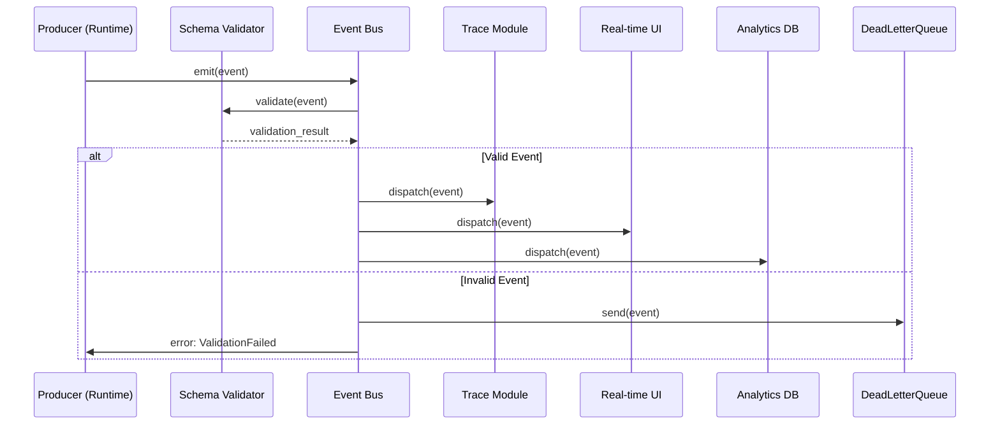

> [!FROZEN]
> **MPLP Protocol v1.0.0  Frozen Specification**
> **Freeze Date**: 2025-12-03
> **Status**: FROZEN (no breaking changes permitted)
> **Governance**: MPLP Protocol Governance Committee (MPGC)
> **License**: Apache-2.0
> **Note**: Any normative change requires a new protocol version.

# Event Bus

## 1. Purpose

The **Event Bus** is the central nervous system of MPLP - the publish-subscribe infrastructure that routes observability events from producers (runtime, agents, tools) to consumers (trace storage, UI, analytics, monitoring). The Event Bus enables complete observability, real-time monitoring, audit compliance, and learning feedback collection.

**Key Responsibilities**:
- Route 12 event families to appropriate consumers
- Validate all events against schemas before dispatch
- Guarantee ordering within trace spans
- Provide reliability guarantees (at-least-once delivery)
- Support multiple backend implementations (in-memory, Redis Pub/Sub, Kafka)
- Enable fan-out to multiple consumers simultaneously

**Design Principle**: "All significant operations emit events; Event Bus ensures they reach all interested parties"

## 2. Architecture

### 2.1 Producer-Channel-Consumer Model

```
Producers                Event Bus               Consumers
---------               -----------             ----------
L3 Runtime    >   Channel:      >    Trace Module
                       pipeline_stage
L4 Adapters   >   Channel:      >    Drift Detector
                       graph_update
AEL           >   Channel:      >    UI (WebSocket)
                       runtime_execution
                                      >    Analytics DB
                                      >    Monitoring (Datadog)
```

### 2.2 Event Flow



## 3. Event Bus Interface

### 3.1 Core Interface

```typescript
export interface EventBus {
  // Emit event (producer API)
  emit(event: MplpEvent): Promise<void>;
  
  // Subscribe to events (consumer API)
  subscribe(
    eventFamily: string,
    handler: (event: MplpEvent) => Promise<void>
  ): Subscription;
  
  // Unsubscribe
  unsubscribe(subscription: Subscription): void;
  
  // Get events by trace ID
  getEventsByTraceId(trace_id: string): Promise<MplpEvent[]>;
  
  // Get events by context ID
  getEventsByContextId(context_id: string): Promise<MplpEvent[]>;
}

interface Subscription {
  subscription_id: string;
  event_family: string;
  handler: (event: MplpEvent) => Promise<void>;
}

interface MplpEvent {
  event_id: string;              // UUID v4
  event_type: string;            // Specific event subtype
  event_family: string;          // 1 of 12 families
  timestamp: string;             // ISO 8601
  payload: Record<string, any>;  // Event-specific data
}
```

### 3.2 Reference Implementation (In-Memory)

```typescript
class InMemoryEventBus implements EventBus {
  private subscriptions = new Map<string, Subscription[]>();
  private eventLog: MplpEvent[] = [];
  
  async emit(event: MplpEvent): Promise<void> {
    // Validate event schema
    const valid = await this.validateEvent(event);
    if (!valid) {
      throw new Error(`Invalid event: ${event.event_id}`);
    }
    
    // Store event
    this.eventLog.push(event);
    
    // Dispatch to subscribers
    const subscribers = this.subscriptions.get(event.event_family) || [];
    await Promise.all(
      subscribers.map(sub => sub.handler(event))
    );
  }
  
  subscribe(
    eventFamily: string,
    handler: (event: MplpEvent) => Promise<void>
  ): Subscription {
    const subscription: Subscription = {
      subscription_id: generateUUID(),
      event_family: eventFamily,
      handler: handler
    };
    
    if (!this.subscriptions.has(eventFamily)) {
      this.subscriptions.set(eventFamily, []);
    }
    this.subscriptions.get(eventFamily)!.push(subscription);
    
    return subscription;
  }
  
  unsubscribe(subscription: Subscription): void {
    const subs = this.subscriptions.get(subscription.event_family) || [];
    const index = subs.findIndex(s => s.subscription_id === subscription.subscription_id);
    if (index >= 0) {
      subs.splice(index, 1);
    }
  }
  
  async getEventsByTraceId(trace_id: string): Promise<MplpEvent[]> {
    return this.eventLog.filter(e => e.payload?.trace_id === trace_id);
  }
  
  async getEventsByContextId(context_id: string): Promise<MplpEvent[]> {
    return this.eventLog.filter(e => e.payload?.context_id === context_id);
  }
  
  private async validateEvent(event: MplpEvent): Promise<boolean> {
    // Validate against base event schema
    const baseSchema = require('./schemas/v2/events/mplp-event-core.schema.json');
    const ajv = new Ajv();
    const valid = ajv.validate(baseSchema, event);
    
    if (!valid) {
      console.error('Event validation failed:', ajv.errors);
      return false;
    }
    
    return true;
  }
}
```

## 4. Producers

### 4.1 L3 Runtime (Primary Producer)

**Emits**:
- `pipeline_stage` - Plan/Step status transitions (REQUIRED)
- `graph_update` - PSG structural changes (REQUIRED)
- `runtime_execution` - LLM/tool invocations (RECOMMENDED)

**Example**:
```typescript
class MPLPRuntime {
  constructor(private eventBus: EventBus) {}
  
  async executeStep(step: Step): Promise<void> {
    // Emit step_started
    await this.eventBus.emit({
      event_id: generateUUID(),
      event_family: 'pipeline_stage',
      event_type: 'step_started',
      timestamp: new Date().toISOString(),
      payload: {
        plan_id: step.plan_id,
        step_id: step.step_id,
        step_description: step.description
      }
    });
    
    // Execute step
    const result = await this.ael.execute({ step_id: step.step_id });
    
    // Emit step_completed
    await this.eventBus.emit({
      event_id: generateUUID(),
      event_family: 'pipeline_stage',
      event_type: 'step_completed',
      timestamp: new Date().toISOString(),
      payload: {
        plan_id: step.plan_id,
        step_id: step.step_id,
        status: result.status,
        duration_ms: result.duration_ms
      }
    });
  }
}
```

### 4.2 L4 Integration Adapters

**Emits**:
- `external_integration` - File changes, Git commits, CI status

**Example** (File watcher):
```typescript
class FileSystemAdapter {
  constructor(private eventBus: EventBus) {
    this.watchForChanges();
  }
  
  private watchForChanges(): void {
    fs.watch('./src', async (eventType, filename) => {
      await this.eventBus.emit({
        event_id: generateUUID(),
        event_family: 'external_integration',
        event_type: 'file_changed',
        timestamp: new Date().toISOString(),
        payload: {
          file_path: filename,
          change_type: eventType // 'rename' | 'change'
        }
      });
    });
  }
}
```

### 4.3 AEL (Action Execution Layer)

**Emits**:
- `runtime_execution` - Execution start/completion

**Example**:
```typescript
class ObservableAEL implements ActionExecutionLayer {
  constructor(
    private baseAEL: ActionExecutionLayer,
    private eventBus: EventBus
  ) {}
  
  async execute(action: Action): Promise<ActionResult> {
    // Emit execution_started
    await this.eventBus.emit({
      event_id: generateUUID(),
      event_family: 'runtime_execution',
      event_type: 'execution_started',
      timestamp: new Date().toISOString(),
      payload: {
        execution_id: action.action_id,
        executor_kind: action.executor_kind,
        action_type: action.action_type
      }
    });
    
    const startTime = Date.now();
    
    try {
      const result = await this.baseAEL.execute(action);
      
      // Emit execution_completed
      await this.eventBus.emit({
        event_id: generateUUID(),
        event_family: 'runtime_execution',
        event_type: 'execution_completed',
        timestamp: new Date().toISOString(),
        payload: {
          execution_id: action.action_id,
          status: 'completed',
          duration_ms: Date.now() - startTime,
          token_usage: result.token_usage
        }
      });
      
      return result;
    } catch (error) {
      // Emit execution_failed
      await this.eventBus.emit({
        event_id: generateUUID(),
        event_family: 'runtime_execution',
        event_type: 'execution_failed',
        timestamp: new Date().toISOString(),
        payload: {
          execution_id: action.action_id,
          status: 'failed',
          duration_ms: Date.now() - startTime,
          error: error.message
        }
      });
      
      throw error;
    }
  }
}
```

## 5. Event Channels (12 Families)

**From**: `schemas/v2/events/mplp-event-core.schema.json`

Each event family is effectively a separate "channel":

```typescript
const EVENT_CHANNELS = [
  'import_process',      // Project initialization
  'intent',              // User goals
  'delta_intent',        // Goal modifications
  'impact_analysis',     // Change predictions
  'compensation_plan',   // Rollback actions
  'methodology',         // Agent approaches
  'reasoning_graph',     // Chain-of-thought
  'pipeline_stage',      // Plan/Step lifecycle (REQUIRED)
  'graph_update',        // PSG changes (REQUIRED)
  'runtime_execution',   // LLM/tool invocations
  'cost_budget',         // Token usage/costs
  'external_integration' // L4 system events
];

// Subscribe to specific channel
eventBus.subscribe('pipeline_stage', async (event) => {
  console.log(`Pipeline event: ${event.event_type}`);
});

// Subscribe to all channels (wildcard)
for (const channel of EVENT_CHANNELS) {
  eventBus.subscribe(channel, async (event) => {
    await logEvent(event);
  });
}
```

## 6. Consumers

### 6.1 Trace Module (Persistent Storage)

```typescript
class TraceConsumer {
  constructor(
    private eventBus: EventBus,
    private vsl: VSL
  ) {
    this.subscribeToAll();
  }
  
  private subscribeToAll(): void {
    const eventFamilies = [
      'pipeline_stage',
      'graph_update',
      'runtime_execution',
      'cost_budget'
    ];
    
    for (const family of eventFamilies) {
      this.eventBus.subscribe(family, async (event) => {
        await this.persistEvent(event);
      });
    }
  }
  
  private async persistEvent(event: MplpEvent): Promise<void> {
    // Store in VSL event log
    await this.vsl.appendEvent(event);
    
    // Index by trace_id for fast retrieval
    if (event.payload?.trace_id) {
      await this.vsl.set(
        `traces/${event.payload.trace_id}/events/${event.event_id}`,
        event
      );
    }
  }
}
```

### 6.2 Real-Time UI Consumer

```typescript
class UIConsumer {
  constructor(
    private eventBus: EventBus,
    private webSocketServer: WebSocket.Server
  ) {
    this.subscribeToUIEvents();
  }
  
  private subscribeToUIEvents(): void {
    // Subscribe to events relevant for UI
    this.eventBus.subscribe('pipeline_stage', async (event) => {
      // Broadcast to all connected clients
      this.webSocketServer.clients.forEach(client => {
        if (client.readyState === WebSocket.OPEN) {
          client.send(JSON.stringify({
            type: 'pipeline_update',
            event: event
          }));
        }
      });
    });
    
    this.eventBus.subscribe('graph_update', async (event) => {
      // Update UI PSG visualization
      this.webSocketServer.clients.forEach(client => {
        if (client.readyState === WebSocket.OPEN) {
          client.send(JSON.stringify({
            type: 'graph_update',
            event: event
          }));
        }
      });
    });
  }
}
```

### 6.3 Analytics Consumer

```typescript
class AnalyticsConsumer {
  constructor(
    private eventBus: EventBus,
    private analyticsDB: Database
  ) {
    this.subscribeForAnalytics();
  }
  
  private subscribeForAnalytics(): void {
    this.eventBus.subscribe('runtime_execution', async (event) => {
      // Extract metrics
      if (event.event_type === 'execution_completed') {
        await this.analyticsDB.insert('metrics', {
          timestamp: event.timestamp,
          executor_kind: event.payload.executor_kind,
          duration_ms: event.payload.duration_ms,
          token_usage: event.payload.token_usage,
          cost_usd: event.payload.cost_usd
        });
      }
    });
    
    this.eventBus.subscribe('cost_budget', async (event) => {
      // Track budget consumption
      await this.analyticsDB.insert('cost_tracking', {
        timestamp: event.timestamp,
        plan_id: event.payload.plan_id,
        tokens_used: event.payload.tokens_used,
        cost_usd: event.payload.cost_usd
      });
    });
  }
}
```

### 6.4 Drift Detector Consumer

```typescript
class DriftDetectorConsumer {
  constructor(
    private eventBus: EventBus,
    private driftDetector: DriftDetector
  ) {
    this.subscribeForDriftDetection();
  }
  
  private subscribeForDriftDetection(): void {
    this.eventBus.subscribe('external_integration', async (event) => {
      if (event.event_type === 'file_changed') {
        // Check for drift between PSG and file system
        await this.driftDetector.checkFileDrift(event.payload.file_path);
      }
    });
  }
}
```

## 7. Reliability Guarantees

### 7.1 Ordering Guarantee

**Requirement**: Events within a single Trace Span **MUST** be ordered by timestamp

**Enforcement**:
```typescript
class OrderedEventBus extends InMemoryEventBus {
  private sequenceNumbers = new Map<string, number>();
  
  async emit(event: MplpEvent): Promise<void> {
    const trace_id = event.payload?.trace_id;
    
    if (trace_id) {
      // Assign sequence number
      const seqNum = (this.sequenceNumbers.get(trace_id) || 0) + 1;
      this.sequenceNumbers.set(trace_id, seqNum);
      event.payload.sequence_number = seqNum;
    }
    
    await super.emit(event);
  }
  
  async getEventsByTraceId(trace_id: string): Promise<MplpEvent[]> {
    const events = await super.getEventsByTraceId(trace_id);
    
    // Sort by sequence number
    return events.sort((a, b) =>
      (a.payload.sequence_number || 0) - (b.payload.sequence_number || 0)
    );
  }
}
```

### 7.2 Delivery Guarantee

**At-Least-Once Delivery** (recommended for audit logs):

```typescript
class ReliableEventBus implements EventBus {
  private pendingEvents = new Map<string, MplpEvent>();
  private acknowledgements = new Set<string>();
  
  async emit(event: MplpEvent): Promise<void> {
    // Store event before dispatch
    this.pendingEvents.set(event.event_id, event);
    
    // Dispatch to subscribers
    const subscribers = this.getSubscribers(event.event_family);
    await Promise.all(
      subscribers.map(async sub => {
        try {
          await sub.handler(event);
          // Acknowledge successful delivery
          this.acknowledge(event.event_id, sub.subscription_id);
        } catch (error) {
          console.error(`Delivery failed for ${event.event_id}:`, error);
          // Retry later
          this.scheduleRetry(event, sub);
        }
      })
    );
  }
  
  private acknowledge(event_id: string, subscription_id: string): void {
    this.acknowledgements.add(`${event_id}:${subscription_id}`);
  }
  
  private scheduleRetry(event: MplpEvent, subscription: Subscription): void {
    setTimeout(async () => {
      try {
        await subscription.handler(event);
        this.acknowledge(event.event_id, subscription.subscription_id);
      } catch (error) {
        console.error(`Retry failed for ${event.event_id}:`, error);
      }
    }, 5000);  // Retry after 5 seconds
  }
}
```

## 8. Schema Validation

**Requirement**: Event Bus **MUST** validate all events against schemas before routing

### 8.1 Validation Pipeline

```typescript
class ValidatingEventBus extends InMemoryEventBus {
  private ajv = new Ajv({ allErrors: true, strict: true });
  private schemas = new Map<string, any>();
  
  constructor() {
    super();
    this.loadSchemas();
  }
  
  private loadSchemas(): void {
    // Load base event schema
    this.schemas.set('event-core', require('./schemas/v2/events/mplp-event-core.schema.json'));
    
    // Load family-specific schemas
    this.schemas.set('pipeline_stage', require('./schemas/v2/events/mplp-pipeline-stage-event.schema.json'));
    this.schemas.set('graph_update', require('./schemas/v2/events/mplp-graph-update-event.schema.json'));
    this.schemas.set('runtime_execution', require('./schemas/v2/events/mplp-runtime-execution-event.schema.json'));
  }
  
  async emit(event: MplpEvent): Promise<void> {
    // Step 1: Validate against base schema
    const baseSchema = this.schemas.get('event-core');
    const baseValid = this.ajv.validate(baseSchema, event);
    
    if (!baseValid) {
      throw new ValidationError(
        `Event failed base validation: ${this.ajv.errorsText()}`,
        event.event_id
      );
    }
    
    // Step 2: Validate against family-specific schema
    const familySchema = this.schemas.get(event.event_family);
    if (familySchema) {
      const familyValid = this.ajv.validate(familySchema, event);
      
      if (!familyValid) {
        throw new ValidationError(
          `Event failed ${event.event_family} validation: ${this.ajv.errorsText()}`,
          event.event_id
        );
      }
    }
    
    // Validation passed - proceed with emission
    await super.emit(event);
  }
}

class ValidationError extends Error {
  constructor(message: string, public event_id: string) {
    super(message);
    this.name = 'ValidationError';
  }
}
```

### 8.2 Dead Letter Queue

**For invalid events**:

```typescript
class EventBusWithDLQ extends ValidatingEventBus {
  private deadLetterQueue: MplpEvent[] = [];
  
  async emit(event: MplpEvent): Promise<void> {
    try {
      await super.emit(event);
    } catch (error) {
      if (error instanceof ValidationError) {
        // Send to dead letter queue
        this.deadLetterQueue.push(event);
        
        console.error(`Event ${event.event_id} sent to DLQ:`, error.message);
        
        // Emit DLQ event
        await this.emitDLQEvent(event, error.message);
      } else {
        throw error;
      }
    }
  }
  
  private async emitDLQEvent(invalidEvent: MplpEvent, reason: string): Promise<void> {
    // Don't validate DLQ events (would cause infinite loop)
    await super.emit({
      event_id: generateUUID(),
      event_family: 'compensation_plan',
      event_type: 'event_validation_failed',
      timestamp: new Date().toISOString(),
      payload: {
        invalid_event_id: invalidEvent.event_id,
        invalid_event_family: invalidEvent.event_family,
        validation_error: reason
      }
    });
  }
  
  getDeadLetterQueue(): MplpEvent[] {
    return this.deadLetterQueue;
  }
}
```

## 9. Backend Implementations

### 9.1 In-Memory (Development/Testing)

**Pros**: Simple, fast, no dependencies  
**Cons**: Not persistent, single-node only

Already shown in reference implementation above.

### 9.2 Redis Pub/Sub (Production, Distributed)

```typescript
import Redis from 'ioredis';

class RedisEventBus implements EventBus {
  private publisher: Redis;
  private subscriber: Redis;
  private subscriptions = new Map<string, Subscription[]>();
  
  constructor(redisUrl: string) {
    this.publisher = new Redis(redisUrl);
    this.subscriber = new Redis(redisUrl);
    
    // Listen for published events
    this.subscriber.on('message', (channel, message) => {
      const event = JSON.parse(message);
      this.dispatchToSubscribers(event);
    });
  }
  
  async emit(event: MplpEvent): Promise<void> {
    // Validate event
    const valid = await this.validateEvent(event);
    if (!valid) {
      throw new Error(`Invalid event: ${event.event_id}`);
    }
    
    // Publish to Redis channel (event family)
    await this.publisher.publish(
      event.event_family,
      JSON.stringify(event)
    );
  }
  
  subscribe(
    eventFamily: string,
    handler: (event: MplpEvent) => Promise<void>
  ): Subscription {
    const subscription: Subscription = {
      subscription_id: generateUUID(),
      event_family: eventFamily,
      handler: handler
    };
    
    if (!this.subscriptions.has(eventFamily)) {
      this.subscriptions.set(eventFamily, []);
      // Subscribe to Redis channel
      this.subscriber.subscribe(eventFamily);
    }
    
    this.subscriptions.get(eventFamily)!.push(subscription);
    
    return subscription;
  }
  
  private async dispatchToSubscribers(event: MplpEvent): Promise<void> {
    const subscribers = this.subscriptions.get(event.event_family) || [];
    await Promise.all(
      subscribers.map(sub => sub.handler(event))
    );
  }
}
```

### 9.3 Kafka (High-Throughput, Event Sourcing)

```typescript
import { Kafka, Producer, Consumer } from 'kafkajs';

class KafkaEventBus implements EventBus {
  private kafka: Kafka;
  private producer: Producer;
  private consumers = new Map<string, Consumer>();
  
  constructor(brokers: string[]) {
    this.kafka = new Kafka({ brokers });
    this.producer = this.kafka.producer();
  }
  
  async init(): Promise<void> {
    await this.producer.connect();
  }
  
  async emit(event: MplpEvent): Promise<void> {
    // Send event to Kafka topic (event family)
    await this.producer.send({
      topic: event.event_family,
      messages: [{
        key: event.event_id,
        value: JSON.stringify(event),
        headers: {
          'event_type': event.event_type,
          'timestamp': event.timestamp
        }
      }]
    });
  }
  
  subscribe(
    eventFamily: string,
    handler: (event: MplpEvent) => Promise<void>
  ): Subscription {
    const subscription_id = generateUUID();
    
    // Create consumer group
    const consumer = this.kafka.consumer({
      groupId: `mplp-consumer-${subscription_id}`
    });
    
    this.consumers.set(subscription_id, consumer);
    
    // Start consuming
    (async () => {
      await consumer.connect();
      await consumer.subscribe({ topic: eventFamily });
      
      await consumer.run({
        eachMessage: async ({ message }) => {
          const event = JSON.parse(message.value.toString());
          await handler(event);
        }
      });
    })();
    
    return { subscription_id, event_family: eventFamily, handler };
  }
}
```

## 10. Performance Optimizations

### 10.1 Batching

```typescript
class BatchingEventBus extends InMemoryEventBus {
  private batch: MplpEvent[] = [];
  private batchSize = 100;
  private flushInterval = 1000;  // 1 second
  
  constructor() {
    super();
    this.startBatchFlusher();
  }
  
  async emit(event: MplpEvent): Promise<void> {
    this.batch.push(event);
    
    if (this.batch.length >= this.batchSize) {
      await this.flushBatch();
    }
  }
  
  private startBatchFlusher(): void {
    setInterval(async () => {
      if (this.batch.length > 0) {
        await this.flushBatch();
      }
    }, this.flushInterval);
  }
  
  private async flushBatch(): Promise<void> {
    const events = this.batch.splice(0);
    
    // Emit all events concurrently
    await Promise.all(
      events.map(event => super.emit(event))
    );
  }
}
```

### 10.2 Throttling

```typescript
class ThrottledEventBus extends InMemoryEventBus {
  private lastEmit = new Map<string, number>();
  private minIntervalMs = 100;  // Max 10 events/sec per type
  
  async emit(event: MplpEvent): Promise<void> {
    const key = `${event.event_family}:${event.event_type}`;
    const now = Date.now();
    const last = this.lastEmit.get(key) || 0;
    
    if (now - last < this.minIntervalMs) {
      // Skip event (throttle)
      console.warn(`Event ${key} throttled`);
      return;
    }
    
    this.lastEmit.set(key, now);
    await super.emit(event);
  }
}
```

## 11. Related Documents

**Architecture**:
- [L3 Execution & Orchestration](../l3-execution-orchestration.md)
- [Observability](observability.md)

**Cross-Cutting Concerns**:
- [Performance](performance.md)
- [State Sync](state-sync.md)

**Schemas**:
- `schemas/v2/events/mplp-event-core.schema.json` (12 families)

---

**Document Status**: Infrastructure Specification  
**Event Families**: 12 channels  
**Reliability**: Ordering guarantee (within span), At-least-once delivery  
**Validation**: MUST validate against schemas, Dead Letter Queue for invalid events  
**Backends**: In-Memory, Redis Pub/Sub, Kafka
---

 2025 Bangshi Beijing Network Technology Limited Company
Licensed under the Apache License, Version 2.0.
