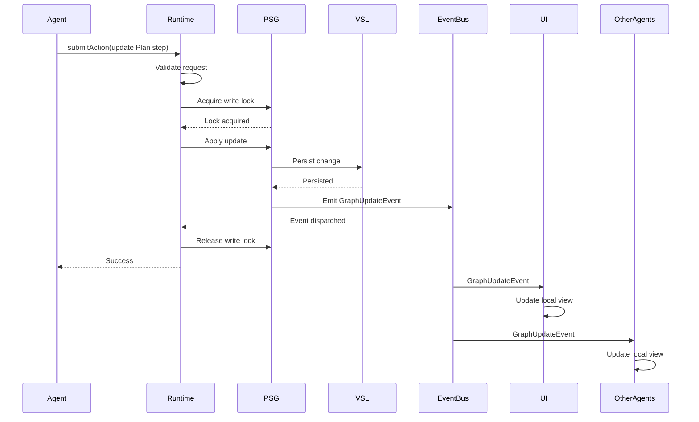

> [!FROZEN]
> **MPLP Protocol v1.0.0  Frozen Specification**
> **Freeze Date**: 2025-12-03
> **Status**: FROZEN (no breaking changes permitted)
> **Governance**: MPLP Protocol Governance Committee (MPGC)
> **License**: Apache-2.0
> **Note**: Any normative change requires a new protocol version.

# State Sync

## 1. Purpose

**State Synchronization** ensures the Project Semantic Graph (PSG) remains consistent across all distributed components (agents, runtime, UI, tools). Since these components may operate asynchronously, robust sync mechanisms prevent "split-brain" scenarios where different parts of the system have conflicting views of project state.

**Design Principle**: "One source of truth (PSG), many synchronized views"

## 2. The GraphUpdateEvent

**From**: `schemas/v2/events/mplp-graph-update-event.schema.json`

The `GraphUpdateEvent` is the primary vehicle for state synchronization.

### 2.1 Event Schema

```json
{
  "event_id": "uuid-v4",
  "event_family": "graph_update",
  "event_type": "node_updated",
  "timestamp": "2025-12-07T00:00:00.000Z",
  "graph_id": "psg-789",
  "update_kind": "node_update",
  "payload": {
    "node_id": "step-456",
    "node_type": "Step",
    "changed_fields": ["status"],
    "previous_values": { "status": "in_progress" },
    "new_values": { "status": "completed" }
  }
}
```

### 2.2 Update Kinds

**From**: Schema enum

```typescript
type UpdateKind =
  | 'node_add'      // New node added to PSG
  | 'node_update'   // Existing node modified
  | 'node_delete'   // Node removed from PSG
  | 'edge_add'      // New relationship created
  | 'edge_update'   // Relationship modified
  | 'edge_delete'   // Relationship removed
  | 'bulk';         // Batch update
```

## 3. Consistency Model

### 3.1 Strong Consistency (Central PSG)

**The runtime's in-memory PSG is the authoritative source**:
- All writes go through runtime
- Runtime validates before applying
- Runtime emits `GraphUpdateEvent` after successful write

```typescript
class AuthoritativePSG {
  async updateNode(node_id: string, updates: any): Promise<void> {
    // 1. Acquire lock
    await this.acquireWriteLock(node_id);
    
    try {
      // 2. Validate update
      const valid = await this.validateUpdate(node_id, updates);
      if (!valid) {
        throw new Error('Invalid update');
      }
      
      // 3. Apply update
      const node = this.nodes.get(node_id);
      const previous = { ...node };
      Object.assign(node, updates);
      
      // 4. Persist to VSL
      await this.vsl.writeNode(node.type, node_id, node);
      
      // 5. Emit GraphUpdateEvent
      await this.eventBus.emit({
        event_family: 'graph_update',
        event_type: 'node_updated',
        graph_id: this.psg_id,
        update_kind: 'node_update',
        payload: {
          node_id,
          node_type: node.type,
          changed_fields: Object.keys(updates),
          previous_values: previous,
          new_values: node
        }
      });
    } finally {
      // 6. Release lock
      this.releaseWriteLock(node_id);
    }
  }
}
```

### 3.2 Eventual Consistency (Distributed Components)

**Distributed components** (UI, other agents) are **eventually consistent**:
- Subscribe to `GraphUpdateEvent`
- Apply updates to local replica
- Accept that local view may lag slightly

```typescript
class EventuallyConsistentReplica {
  private localPSG = new Map<string, Node>();
  
  constructor(private eventBus: EventBus) {
    this.subscribeToUpdates();
  }
  
  private subscribeToUpdates(): void {
    this.eventBus.subscribe('graph_update', async (event) => {
      await this.applyUpdate(event);
    });
  }
  
  private async applyUpdate(event: GraphUpdateEvent): Promise<void> {
    switch (event.update_kind) {
      case 'node_add':
        this.localPSG.set(event.payload.node_id, event.payload.node_data);
        break;
      
      case 'node_update':
        const node = this.localPSG.get(event.payload.node_id);
        if (node) {
          Object.assign(node, event.payload.new_values);
        }
        break;
      
      case 'node_delete':
        this.localPSG.delete(event.payload.node_id);
        break;
    }
  }
  
  // Read from local replica (may be slightly stale)
  getNode(node_id: string): Node | undefined {
    return this.localPSG.get(node_id);
  }
}
```

## 4. Write Flow (Submit Validate Apply Emit)



## 5. Conflict Resolution

### 5.1 Sequential Processing

**Problem**: Two agents attempt to modify same node simultaneously

**Solution**: Runtime processes requests sequentially

```typescript
class ConflictResolver {
  private requestQueue: Array<UpdateRequest> = [];
  private processing = false;
  
  async submitUpdate(request: UpdateRequest): Promise<void> {
    // Add to queue
    this.requestQueue.push(request);
    
    // Process queue
    if (!this.processing) {
      await this.processQueue();
    }
  }
  
  private async processQueue(): Promise<void> {
    this.processing = true;
    
    while (this.requestQueue.length > 0) {
      const request = this.requestQueue.shift()!;
      
      try {
        await this.psg.updateNode(request.node_id, request.updates);
        request.resolve();
      } catch (error) {
        request.reject(error);
      }
    }
    
    this.processing = false;
  }
}
``

`

### 5.2 Optimistic Locking (Version Numbers)

**Alternative**: Use version numbers to detect conflicts

```typescript
interface VersionedNode {
  node_id: string;
  version: number;
  data: any;
}

async function updateWithOptimisticLock(
  node_id: string,
  expectedVersion: number,
  updates: any
): Promise<void> {
  const node = await psg.getNode(node_id);
  
  // Check version
  if (node.version !== expectedVersion) {
    throw new Error(`Version mismatch: expected ${expectedVersion}, got ${node.version}`);
  }
  
  // Apply update and increment version
  node.version++;
  Object.assign(node.data, updates);
  
  await psg.writeNode(node_id, node);
}
```

**Agent retry on conflict**:
```typescript
async function updateWithRetry(
  node_id: string,
  updateFn: (node: Node) => any,
  maxRetries = 3
): Promise<void> {
  for (let attempt = 0; attempt < maxRetries; attempt++) {
    try {
      const node = await psg.getNode(node_id);
      const updates = updateFn(node);
      
      await updateWithOptimisticLock(node_id, node.version, updates);
      return;  // Success
    } catch (error) {
      if (error.message.includes('Version mismatch')) {
        // Retry with fresh data
        continue;
      }
      throw error;
    }
  }
  
  throw new Error('Max retries exceeded');
}
```

## 6. Synchronization Strategies

### 6.1 Push-Based (Event-Driven)

**Runtime pushes updates** to subscribers via EventBus

**Pros**: Real-time, low latency  
**Cons**: Requires persistent connection

### 6.2 Pull-Based (Polling)

**Clients poll** for updates periodically

```typescript
class PollingSync {
  private lastSyncTime = new Date(0);
  
  async sync(): Promise<void> {
    // Get events since last sync
    const events = await eventBus.getEventsSince(this.lastSyncTime, 'graph_update');
    
    // Apply all events
    for (const event of events) {
      await this.applyUpdate(event);
    }
    
    // Update sync timestamp
    this.lastSyncTime = new Date();
  }
  
  startPolling(intervalMs: number = 5000): void {
    setInterval(() => this.sync(), intervalMs);
  }
}
```

**Pros**: Simpler, no persistent connection  
**Cons**: Higher latency, more network traffic

### 6.3 Hybrid (Push + Periodic Reconciliation)

**Combine both approaches**:
- Push events for real-time updates
- Periodic full reconciliation to catch any missed events

```typescript
class HybridSync extends EventuallyConsistentReplica {
  constructor(eventBus: EventBus) {
    super(eventBus);
    this.startReconciliation();
  }
  
  private startReconciliation(): void {
    setInterval(async () => {
      await this.fullReconciliation();
    }, 60000);  // Every 60 seconds
  }
  
  private async fullReconciliation(): Promise<void> {
    // Fetch full PSG state from authoritative source
    const authoritativePSG = await this.fetchAuthoritativePSG();
    
    // Compare with local replica
    for (const [node_id, node] of authoritativePSG.entries()) {
      const local = this.localPSG.get(node_id);
      
      if (!local || !this.isEqual(local, node)) {
        // Local is stale - update
        this.localPSG.set(node_id, node);
      }
    }
    
    // Remove deleted nodes
    for (const node_id of this.localPSG.keys()) {
      if (!authoritativePSG.has(node_id)) {
        this.localPSG.delete(node_id);
      }
    }
  }
}
```

## 7. Drift Detection

**From**: `docs/06-runtime/drift-and-rollback.md`

**Detect discrepancies** between PSG and actual file system:

```typescript
async function detectDrift(psg: PSG, fs: FileSystem): Promise<Drift[]> {
  const drifts: Drift[] = [];
  
  // Get all files tracked in PSG
  const trackedFiles = psg.queryByType('File');
  
  for (const fileNode of trackedFiles) {
    const psgContent = fileNode.content_hash;
    const actualContent = await fs.readFile(fileNode.path);
    const actualHash = sha256(actualContent);
    
    if (psgContent !== actualHash) {
      drifts.push({
        file_path: fileNode.path,
        psg_hash: psgContent,
        actual_hash: actualHash,
        detected_at: new Date().toISOString()
      });
    }
  }
  
  return drifts;
}
```

**Emit drift detected event**:
```typescript
if (drifts.length > 0) {
  await eventBus.emit({
    event_family: 'graph_update',
    event_type: 'drift_detected',
    payload: {
      drift_count: drifts.length,
      drifts: drifts
    }
  });
}
```

## 8. Best Practices

### 8.1 Minimize Write Latency

**Batch updates** when possible:

```typescript
async function batchUpdate(updates: Array<{ node_id: string; data: any }>): Promise<void> {
  await psg.beginTransaction();
  
  for (const update of updates) {
    await psg.updateNode(update.node_id, update.data);
  }
  
  await psg.commitTransaction();
  
  // Emit single bulk update event
  await eventBus.emit({
    event_family: 'graph_update',
    event_type: 'bulk_update',
    update_kind: 'bulk',
    payload: {
      update_count: updates.length,
      node_ids: updates.map(u => u.node_id)
    }
  });
}
```

### 8.2 Subscription Filtering

**Filter events** to reduce unnecessary processing:

```typescript
eventBus.subscribe('graph_update', async (event) => {
  // Only process updates to Plan nodes
  if (event.payload.node_type === 'Plan') {
    await this.handlePlanUpdate(event);
  }
});
```

### 8.3 Idempotent Updates

**Make update handlers idempotent**:

```typescript
async function applyUpdate(event: GraphUpdateEvent): Promise<void> {
  const node = this.localPSG.get(event.payload.node_id);
  
  // Check if already applied (idempotency)
  if (node && node.version >= event.payload.version) {
    return;  // Already up-to-date
  }
  
  // Apply update
  this.localPSG.set(event.payload.node_id, event.payload.new_values);
}
```

## 9. Related Documents

**Architecture**:
- [L2 Coordination & Governance](../l2-coordination-governance.md)
- [Observability](observability.md) - GraphUpdateEvent

**Cross-Cutting Concerns**:
- [Event Bus](event-bus.md) - Distribution mechanism
- [Transaction](transaction.md) - ACID guarantees

**Runtime**:
- [Drift Detection](../../06-runtime/drift-and-rollback.md)

---

**Document Status**: Specification (Normative sync semantics)  
**Primary Mechanism**: GraphUpdateEvent via Event Bus  
**Consistency**: Strong (central PSG), Eventual (distributed components)  
**Conflict Resolution**: Sequential processing or optimistic locking  
**Strategies**: Push (event-driven), Pull (polling), Hybrid (both)
---

 2025 Bangshi Beijing Network Technology Limited Company
Licensed under the Apache License, Version 2.0.
