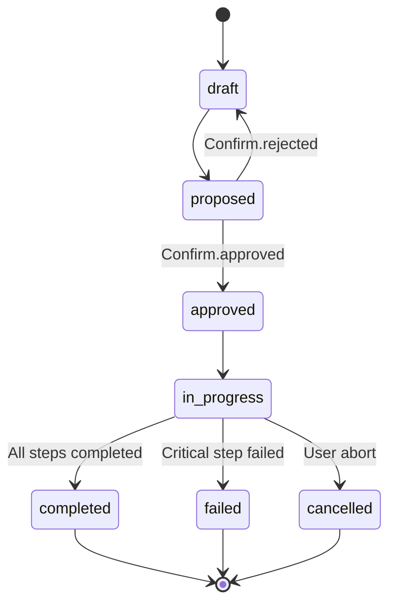
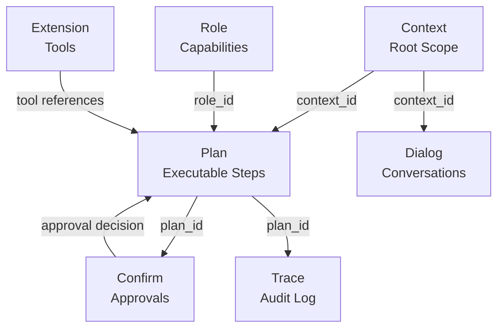

> **Scope**: Inherited (from /docs/01-architecture/)
> **Non-Goals**: Inherited (from /docs/01-architecture/)

# L2 Coordination & Governance

> **Status**: Normative
> **Version**: 1.0.0
> **Authority**: MPGC
> **Protocol**: MPLP v1.0.0 (Frozen)

## 1. Scope

This specification defines the normative requirements for **L2 Coordination & Governance**.

## 2. Non-Goals

This specification does not mandate specific implementation details beyond the defined interfaces and invariants.

## 1. Purpose

The **L2 Coordination & Governance** layer defines the domain logic, behavioral semantics, and coordination patterns that bring MPLP's declarative L1 schemas to life. While L1 prescribes *WHAT* data structures look like, L2 prescribes *HOW* those structures should behave, transition through states, and interact.

L2 is **normative** for compliancemplementations MUST adhere to the lifecycle rules, state transitions, and coordination patterns defined here. However, L2 is **implementation-agnostic**: it specifies observable outcomes without dictating internal algorithms or storage mechanisms (those belong to L3 Runtime).

L2 encompasses:
- **10 Core Modules**: State machines with defined lifecycle transitions
- **2 Execution Profiles**: SA (REQUIRED) and MAP (RECOMMENDED)
- **Module Interactions**: Cross-module dependencies and event flows
- **Governance Mechanisms**: Version control, locking, approval workflows

## 2. Scope & Boundaries

### 2.1 L2 Encompasses

Based on actual schemas ( `schemas/v2/mplp-*.schema.json`) and module documents (`docs/02-modules/*.md`):

1.  **Module Lifecycles**: State machines for all 10 modules with normative transitions
2.  **Execution Profiles**: SA (8 invariants) and MAP (9 invariants) from `schemas/v2/invariants/`
3.  **Coordination Patterns**: 5 multi-agent modes from `mplp-collab.schema.json`
4.  **Cross-Module Logic**: Dependencies, bindings, ref integrity
5.  **Governance Metadata**: From `metadata.schema.json` and `governance` blocks in schemas

### 2.2 L2 Explicitly Excludes

- **Physical Storage** (L3): PSG backends, databases, state persistence
- **Execution Engines** (L3): How to run steps, invoke LLMs, call tools
- **External Integration** (L4): File system access, Git operations, CI hooks
- **Low-Level Orchestration** (L3): Scheduling algorithms, resource allocation

## 3. Ten Core Modules

Each module governs a specific domain with defined state machines. Status enums are extracted from actual `schemas/v2/mplp-*.schema.json` files.

### 3.1 Module Catalog & Lifecycles

| Module | Schema | Primary Responsibility | Status Enum | Terminal States | Module Doc |
|:---|:---|:---|:---|:---|:---|
| **Context** | `mplp-context.schema.json` | Project scope & environment | N/A (inferred: active, suspended, closed) | `closed` | [context-module.md](../02-modules/context-module.md) |
| **Plan** | `mplp-plan.schema.json` | Executable step DAG | `draft`, `proposed`, `approved`, `in_progress`, `completed`, `cancelled`, `failed` | `completed`, `cancelled`, `failed` | [plan-module.md](../02-modules/plan-module.md) |
| **Confirm** | `mplp-confirm.schema.json` | Human-in-the-loop approvals | `pending`, `approved`, `rejected`, `override` | `approved`, `rejected`, `override` | [confirm-module.md](../02-modules/confirm-module.md) |
| **Trace** | `mplp-trace.schema.json` | Execution audit log | `active`, `completed`, `failed`, `cancelled` | `completed`, `failed`, `cancelled` | [trace-module.md](../02-modules/trace-module.md) |
| **Role** | `mplp-role.schema.json` | Capability definitions | N/A (declarative, no lifecycle) | N/A | [role-module.md](../02-modules/role-module.md) |
| **Dialog** | `mplp-dialog.schema.json` | Multi-turn conversations | `active`, `paused`, `completed`, `cancelled` | `completed`, `cancelled` | [dialog-module.md](../02-modules/dialog-module.md) |
| **Collab** | `mplp-collab.schema.json` | Multi-agent sessions | `draft`, `active`, `suspended`, `completed`, `cancelled` | `completed`, `cancelled` | [collab-module.md](../02-modules/collab-module.md) |
| **Extension** | `mplp-extension.schema.json` | Tool/capability registry | `registered`, `active`, `inactive`, `deprecated` | `inactive`, `deprecated` | [extension-module.md](../02-modules/extension-module.md) |
| **Core** | `mplp

-core.schema.json` | Central governance | `draft`, `active`, `deprecated`, `archived` | `archived` | [core-module.md](../02-modules/core-module.md) |
| **Network** | `mplp-network.schema.json` | Distributed topology | `draft`, `provisioning`, `active`, `degraded`, `maintenance`, `retired` | `retired` | [network-module.md](../02-modules/network-module.md) |

### 3.2 Plan Module Lifecycle (Detailed Example)

**From**: `schemas/v2/mplp-plan.schema.json` (lines 35-43) + `docs/02-modules/plan-module.md`

**7 Status States**:



**Normative Transitions**:

| From | To | Trigger | Requirements |
|:---|:---|:---|:---|
| `draft` | `proposed` | Agent completes planning | Plan has  step (SA invariant `sa_plan_has_steps`) |
| `proposed` | `approved` | Confirm Module | `Confirm.status = approved` |
| `proposed` | `draft` | Confirm Module | `Confirm.status = rejected` |
| `approved` | `in_progress` | Runtime starts execution | `context_id` binding valid |
| `in_progress` | `completed` | All steps done | All steps `status = completed` |
| `in_progress` | `failed` | Critical error | At least one step `status = failed` |
| `in_progress` | `cancelled` | User cancellation | External cancellation signal |

**Forbidden Transitions** (MUST be rejected):
- `draft` `in_progress` (missing approval)
- `completed` `in_progress` (terminal state)
- `approved` `draft` (cannot revert after approval)

**Step Status** (from schema lines 160-167):
- `pending`: Awaiting dependencies
- `in_progress`: Agent working
- `completed`: Finished successfully
- `blocked`: Dependency failed
- `skipped`: Conditional skip
- `failed`: Execution error

### 3.3 Other Module Lifecycles

#### Context Module
**Inferred States** (not explicitly in schema but documented):
- Created (implicit initial state)
- `active`: Ready for agent execution (SA invariant `sa_context_must_be_active`)
- `suspended`: Temporarily paused
- `closed`: Project completed/archived

**Key Behavior**: SA Profile REQUIRES Context status = `active`

#### Confirm Module
**4 Status States** (from `mplp-confirm.schema.json`):
- `pending`: Awaiting decision
- `approved`: Decision maker approved
- `rejected`: Decision maker rejected
- `override`: Governance override (bypass normal approval)

**Key Behavior**: Blocks Plan transitions from `proposed` `approved`

#### Trace Module
**4 Status States**:
- `active`: Currently recording events
- `completed`: Execution finished normally
- `failed`: Execution encountered error
- `cancelled`: Execution aborted

**Key Behavior**: MUST emit  event (SA invariant `sa_trace_not_empty`)

#### Collab Module (MAP-Specific)
**5 Status States** (from `mplp-collab.schema.json` lines 69-75):
- `draft`: Session being configured
- `active`: Agents collaborating
- `suspended`: Temporarily paused
- `completed`: Session finished
- `cancelled`: Session aborted

**Key Behavior**: MAP Profile REQUIRES  participants (invariant `map_session_requires_multiple_participants`)

#### Extension Module
**4 Status States**:
- `registered`: Tool registered, not yet activated
- `active`: Available for use
- `inactive`: Temporarily disabled
- `deprecated`: Marked for removal

**Key Behavior**: Provides plugin mechanism for tools/capabilities

#### Dialog Module
**4 Status States**:
- `active`: Conversation ongoing
- `paused`: Temporarily suspended
- `completed`: Conversation finished
- `cancelled`: Conversation terminated

**Key Behavior**: Stores multi-turn conversation threads

#### Core Module
**4 Status States**:
- `draft`: System being configured
- `active`: Operational
- `deprecated`: Being phased out
- `archived`: Historical record only

**Key Behavior**: Central registry tracking enabled modules

#### Network Module
**6 Status States** (most complex):
- `draft`: Topology being defined
- `provisioning`: Resources being allocated
- `active`: Fully operational
- `degraded`: Partial functionality
- `maintenance`: Under repair/upgrade
- `retired`: Decommissioned

**Key Behavior**: Maps roles to physical/virtual execution nodes

#### Role Module
**No Lifecycle**: Role is purely declarative (no status field)

**Key Behavior**: Defines `capabilities[]` array with permission strings (e.g., `plan.create`, `confirm.approve`)

## 4. Execution Profiles

Profiles define higher-level execution patterns that span multiple modules.

### 4.1 SA Profile (Single-Agent) **REQUIRED**

**Status**: **REQUIRED** for MPLP v1.0 compliance  
**Normative Specification**: `schemas/v2/invariants/sa-invariants.yaml` (8 rules)  
**Reference Implementation**: `packages/sdk-ts/src/runtime-minimal/index.ts`

#### 4.1.1 SA Invariants (8 Rules)

From `schemas/v2/invariants/sa-invariants.yaml`:

| ID | Scope | Path | Rule | Description |
|:---|:---|:---|:---|:---|
| `sa_requires_context` | Context | `context_id` | uuid-v4 | SA execution requires valid Context with UUID v4 |
| `sa_context_must_be_active` | Context | `status` | enum(active) | Context status must be `active` |
| `sa_plan_context_binding` | Plan | `context_id` | eq(context.context_id) | Plan's context_id must match SA's Context |
| `sa_plan_has_steps` | Plan | `steps` | min-length(1) | Plan must contain  executable step |
| `sa_steps_have_valid_ids` | Plan | `steps[*].step_id` | uuid-v4 | All step IDs must be UUID v4 |
| `sa_steps_have_agent_role` | Plan | `steps[*].agent_role` | non-empty-string | All steps must specify `agent_role` |
| `sa_trace_not_empty` | Trace | `events` | min-length(1) | SA must emit  trace event before completion |
| `sa_trace_context_binding` | Trace | `context_id` | eq(context.context_id) | Trace context_id must match |
| `sa_trace_plan_binding` | Trace | `plan_id` | eq(plan.plan_id) | Trace plan_id must match |

**Note**: Last two listed as separate rules in YAML, total = 8

#### 4.1.2 SA Minimal Flow

**Required Modules**: Context, Plan, Trace  
**Optional Modules**: Confirm (for approval workflows), Role (for capability checks)

**Normative Execution Sequence**:

```
1. Load/Create Context Validate: context_id is UUID v4, status = "active"
   
2. Generate Plan Validate: plan.context_id matches, steps.length 1, all step_id are UUID v4
   
3. [Optional] Request Confirmation If required, wait for Confirm.status = "approved"
   
4. Execute Steps Sequentially Transition Plan.status: approved in_progress For each step: emit Trace events with valid trace_id, span_id
   
5. Complete Execution Transition Plan.status: in_progress completed/failed/cancelled Transition Trace.status: active completed/failed/cancelled Validate: Trace has  event
```

**Reference Implementation**: `packages/sdk-ts/src/runtime-minimal/index.ts`
```typescript
export async function runSingleAgentFlow(
  options: RunSingleAgentFlowOptions
): Promise<RuntimeResult> {
  // 1. Execute context module
  if (options.modules.context) {
    await options.modules.context({ ctx: {} });
  }
  // 2. Execute plan module
  if (options.modules.plan) {
    await options.modules.plan({ 
      ctx: { context: { title: "..." } } 
    });
  }
  // 3. Return result
  return { success: true, output: {...} };
}
```

### 4.2 MAP Profile (Multi-Agent) **RECOMMENDED**

**Status**: **RECOMMENDED** for MPLP v1.0 (REQUIRED for multi-agent systems)  
**Normative Specification**: `schemas/v2/invariants/map-invariants.yaml` (9 rules)

#### 4.2.1 MAP Invariants (9 Rules)

From `schemas/v2/invariants/map-invariants.yaml` (64 lines):

**Structural Rules** (7 enforceable):

| ID | Path | Rule | Description |
|:---|:---|:---|:---|
| `map_session_requires_multiple_participants` | `collab.participants` | min-length(2) | MAP sessions require  participants |
| `map_collab_mode_valid` | `collab.mode` | enum(broadcast, round_robin, orchestrated, swarm, pair) | Valid collaboration pattern |
| `map_session_id_is_uuid` | `collab.collab_id` | uuid-v4 | Session ID must be UUID v4 |
| `map_participants_have_role_ids` | `collab.participants[*].role_id` | non-empty-string | All participants need role bindings |
| `map_role_ids_are_uuids` | `collab.participants[*].role_id` | uuid-v4 | All role_ids must be UUID v4 |
| `map_participant_ids_are_non_empty` | `collab.participants[*].participant_id` | non-empty-string | Participant IDs must be non-empty |
| `map_participant_kind_valid` | `collab.participants[*].kind` | enum(agent, human, system, external) | Valid participant kind |

**Event Consistency Rules** (2 descriptive, require trace analysis):
- `map_turn_completion_matches_dispatch`: Every MAPTurnDispatched must have corresponding MAPTurnCompleted
- `map_broadcast_has_receivers`: MAPBroadcastSent must have  MAPBroadcastReceived

**Total**: 9 rules (7 structural + 2 event-based)

#### 4.2.2 MAP Coordination Modes (5 Patterns)

From `schemas/v2/mplp-collab.schema.json` (lines 58-64):

| Mode | Description | Use Case | Turn-Taking | Determinism |
|:---|:---|:---|:---|:---|
| **`broadcast`** | One-to-many task distribution | Parallel execution of independent tasks | No turns, all work simultaneously | Non-deterministic (race conditions possible) |
| **`round_robin`** | Sequential ordered turn-taking | Ordered pipeline (Planner Coder Reviewer) | Strict sequential turns | Deterministic |
| **`orchestrated`** | Centralized coordinator | Complex workflows with conditional branching | Coordinator dispatches turns | Deterministic (coordinator decides) |
| **`swarm`** | Self-organizing emergent collaboration | Decentralized problem-solving | Emergent, no fixed order | Non-deterministic |
| **`pair`** | 1:1 focused collaboration | Paired programming, focused review | Alternating turns between 2 agents | Deterministic |

#### 4.2.3 MAP Extended Modules

Beyond SA's {Context, Plan, Trace}, MAP adds:

- **Collab**: Session management, participant roster, turn dispatch
- **Dialog**: Inter-agent communication threads
- **Network**: Role-to-node topology mapping (which agent runs where)
- **Role**: Capability-based access control for multi-user scenarios

## 5. Module Interactions

### 5.1 Core Dependencies (All Profiles)



**Binding Rules** (normative):
1. Plan MUST reference valid `context_id` (SA invariant `sa_plan_context_binding`)
2. Trace MUST reference valid `context_id` and `plan_id` (SA invariants)
3. Confirm MUST reference valid `target_id` (typically `plan_id`)
4. Dialog SHOULD reference `context_id` for conversation scoping

### 5.2 MAP Extensions

```mermaid
graph TD
    Collab[Collab<br/>Session] -->|participants[]| Role[Role<br/>Capabilities]
    Collab -->|collab_id| Dialog[Dialog<br/>Coordination Messages]
    Collab -->|session context| Plan[Plan<br/>Collaborative Work]
    Network[Network<br/>Topology] -->|node assignments| Role
```

**Additional Binding Rules** (MAP-specific):
1. Collab MUST have  participants (invariant `map_session_requires_multiple_participants`)
2. All `participants[*].role_id` MUST be valid UUIDs (invariant `map_role_ids_are_uuids`)
3. Collab `mode` MUST be valid enum (invariant `map_collab_mode_valid`)

### 5.3 Tool Integration (Extension Module)

```mermaid
graph LR
    Plan[Plan] -->|steps[].tool_id| Extension[Extension Registry]
    Extension -->|capability injection| Runtime[L3 Runtime]
    Runtime -->|invocation logs| Trace[Trace]
```

**Integration Pattern**:
1. Extensions register in Extension module with `extension_type` {capability, policy, integration, transformation, validation}
2. Plan steps reference `tool_id` matching `extension_id`
3. Runtime resolves tool references and invokes
4. Trace captures tool invocation results

## 6. State Transition Enforcement

### 6.1 Normative Rules

**All Implementations MUST**:

1. **Validate State Transitions**: Reject invalid transitions (e.g., `draft` `in_progress` without approval for Plan)
2. **Emit Lifecycle Events**: Publish `pipeline_stage` events on status changes
3. **Enforce Cross-Module Refs**: Ensure `context_id`, `plan_id`, `role_id` reference valid objects
4. **Respect Terminal States**: Prevent transitions out of terminal states (`completed`, `failed`, `cancelled`, `archived`, `retired`)

**Example Enforcement Code** (pseudocode):
```typescript
function transitionPlanStatus(
  plan: Plan,
  newStatus: PlanStatus
): Result<Plan, Error> {
  const validTransitions = {
    draft: ["proposed"],
    proposed: ["approved", "draft"],
    approved: ["in_progress"],
    in_progress: ["completed", "failed", "cancelled"],
    // Terminal states: no outgoing transitions
    completed: [],
    failed: [],
    cancelled: []
  };
  
  if (!validTransitions[plan.status].includes(newStatus)) {
    return Error(`Invalid transition: ${plan.status} ${newStatus}`);
  }
  
  // Additional checks
  if (newStatus === "in_progress") {
    if (plan.status !== "approved") {
      return Error("Plan must be approved before execution");
    }
    if (plan.steps.length === 0) {
      return Error("Plan must have  step (SA invariant)");
    }
  }
  
  plan.status = newStatus;
  emit_pipeline_stage_event(plan, newStatus);
  return Ok(plan);
}
```

### 6.2 Compliance Testing

**Validation Method**: Golden Flow tests

Example test structure:
```
tests/golden/flows/sa-flow-01-basic/
   input.json          # Initial Context
   expected/    plan.json       # Plan with valid transitions    trace.json      # Trace with  event    final_state.json
   invalid/
       plan_skip_approval.json  # MUST be rejected
```

## 7. Governance Mechanisms