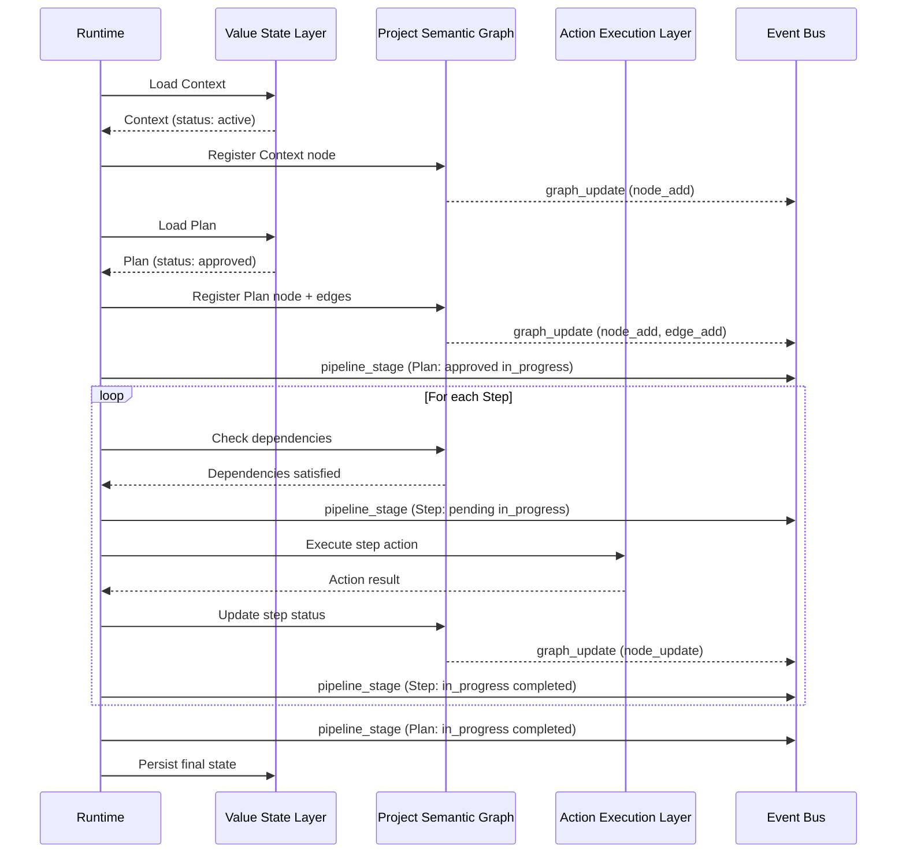

---
title: L3 Execution & Orchestration
description: L3 runtime layer specification covering PSG (Project Semantic Graph), VSL, AEL, event bus, orchestration, drift detection, and rollback mechanisms.
keywords: [MPLP, Multi-Agent Lifecycle Protocol, Agent OS Protocol, AI Agent, Observable, Governed, Vendor-neutral, L3 Runtime, PSG, Project Semantic Graph, VSL, AEL, event bus, orchestration, drift detection, rollback, runtime execution]
sidebar_label: L3 Execution & Orchestration
---
> [!FROZEN]
> **MPLP Protocol v1.0.0  Frozen Specification**
> **Freeze Date**: 2025-12-03
> **Status**: FROZEN (no breaking changes permitted)
> **Governance**: MPLP Protocol Governance Committee (MPGC)
> **License**: Apache-2.0
> **Note**: Any normative change requires a new protocol version.

# L3 Execution & Orchestration

## 1. Purpose

The **L3 Execution & Orchestration** layer is the concrete runtime that brings MPLP to life. While L1 defines data shapes and L2 defines behavioral rules, L3 is responsible for **actual execution**: running plans, managing state, routing events, and orchestrating resources.

L3 is **behavioral** (non-normative in structure) but **normative in outcomes**mplementations have full freedom in *HOW* they execute, as long as they produce the observable outcomes required by L2 (state transitions, event emissions, PSG integrity).

L3 encompasses:
- **Project Semantic Graph (PSG)**: The authoritative state model
- **Value State Layer (VSL)**: Abstract state persistence
- **Action Execution Layer (AEL)**: Abstract action invocation  
- **Event Bus**: Observability event routing
- **Orchestrator**: Module coordination and execution loop
- **Drift Detection**: State validation mechanisms
- **Rollback/Compensation**: Error recovery

## 2. Scope & Boundaries

### 2.1 L3 Encompasses

Based on reference implementation (`packages/sdk-ts/src/runtime-minimal/`) and runtime documentation (`docs/06-runtime/`):

1.  **Runtime Execution Loop**: The "tick" cycle that drives agent actions
2.  **PSG Management**: Storing and querying the project semantic graph
3.  **State Persistence**: VSL backends (Redis, Postgres, in-memory)
4.  **Action Invocation**: AEL adapters for LLMs, tools, external APIs
5.  **Event Emission**: Publishing `pipeline_stage` and `graph_update` events (**REQUIRED**)
6.  **Module Registry**: Dynamic loading/unloading of MPLP modules
7.  **Drift Detection**: Reconciling PSG vs. file system state
8.  **Rollback Mechanisms**: PSG snapshots + compensation logic

### 2.2 L3 Explicitly Excludes

- **Data Schemas** (L1): Schema definitions are frozen, L3 cannot modify
- **Module Lifecycles** (L2): State transition rules are normative, L3 fulfills them
- **External System APIs** (L4): File I/O, Git, CI integration (L4 provides events, L3 consumes)

## 3. Core Components

### 3.1 Project Semantic Graph (PSG)

**Definition** (from `docs/06-runtime/crosscut-psg-event-binding.md`):  
The PSG is a unified graph representation where:
- **Nodes**: Protocol objects (Context, Plan, Step, Trace segments, etc.)
- **Edges**: Relationships (dependencies, ownership, causality)

**PSG Structure**:
```
Context (root)
   context_id = "ctx-123"
   Plan (child)    plan_id = "plan-456"    context_id = "ctx-123" (binding)    steps[] (children)        Step 1 (child)     dependencies: [] (edge)        Step 2 (child)            dependencies: [step-1] (edge)
   Trace (child)
       trace_id = "trace-789"
       context_id = "ctx-123" (binding)
       plan_id = "plan-456" (binding)
```

**PSG Requirements** (normative):
1. **Single Source of Truth**: PSG is authoritative, file system is secondary
2. **DAG Property**: Plan steps form directed acyclic graph (no cycles)
3. **Referential Integrity**: All `*_id` references must resolve to valid PSG nodes
4. **Append-only History**: Trace segments cannot be modified after creation

**PSG Operations** (from `docs/06-runtime/module-psg-paths.md`):
- **Read Paths**: How modules query PSG (e.g., `GET /psg/contexts/:context_id`)
- **Write Paths**: How modules update PSG (e.g., `POST /psg/plans`, `PATCH /psg/plans/:plan_id/status`)
- **Graph Updates**: Structural changes trigger `graph_update` events

### 3.2 Value State Layer (VSL)

**Interface** (from `packages/sdk-ts/src/runtime-minimal/index.ts` lines 24-27):

```typescript
export interface ValueStateLayer {
  get(key: string): Promise<any>;
  set(key: string, value: any): Promise<void>;
}
```

**Purpose**: Abstract state persistence to allow pluggable backends

**Reference Implementation** (InMemoryVSL, lines 33-37):
```typescript
export class InMemoryVSL implements ValueStateLayer {
  private store = new Map<string, any>();
  async get(key: string) { return this.store.get(key); }
  async set(key: string, value: any) { this.store.set(key, value); }
}
```

** Supported Backends** (implementation-specific):
- **In-Memory**: `Map<string, any>` (development, testing)
- **Redis**: `redis.get(key)`, `redis.set(key, val)` (production, distributed)
- **PostgreSQL**: `SELECT state FROM psg WHERE key=$1` (production, ACID)
- **File System**: `fs.readFileSync(key)`, `fs.writeFileSync(key, val)` (simple deployments)

**VSL Compliance**:
- MUST support async `get(key)` and `set(key, value)`
- MUST ensure eventual consistency (for distributed VSL)
- SHOULD support transactions (for ACID VSL like Postgres)

### 3.3 Action Execution Layer (AEL)

**Interface** (from `packages/sdk-ts/src/runtime-minimal/index.ts` lines 29-31):

```typescript
export interface ActionExecutionLayer {
  execute(action: any): Promise<any>;
}
```

**Purpose**: Abstract action invocation (LLM calls, tool execution, etc.)

**Reference Implementation** (InMemoryAEL, lines 39-41):
```typescript
export class InMemoryAEL implements ActionExecutionLayer {
  async execute(action: any) { 
    return { status: 'executed', action }; 
  }
}
```

**Supported Action Types** (implementation-specific):
- **LLM API Calls**: OpenAI, Anthropic, Google, local models
- **Tool Invocations**: Code formatters, linters, test runners
- **External APIs**: HTTP requests, database queries
- **File Operations**: Read/write (via L4 integration events)

**AEL Compliance**:
- MUST return Promise<any> with execution result
- MUST throw errors on failures (runtime catches and logs)
- SHOULD emit `runtime_execution` events for observability

### 3.4 Runtime Context

**Interface** (from `packages/sdk-ts/src/runtime-minimal/index.ts` lines 8-15):

```typescript
export interface RuntimeContext {
  ids: { runId: string };
  coordination: {
    ids: { runId: string };
    metadata: Record<string, any>;
  };
  events: any[];
}
```

**Purpose**: Holds global state for current execution "tick"

**Fields**:
- `ids.runId`: Unique identifier for this execution run
- `coordination.metadata`: Cross-agent synchronization data (MAP Profile)
- ` events[]`: Event queue for current tick (flushed to event bus)

### 3.5 Module Registry

**Type** (from `runtime-minimal/index.ts` line 43):

```typescript
export type RuntimeModuleRegistry = Record<
  string, 
  (args: { ctx: any }) => Promise<{ output: any; events: any[] }>
>;
```

**Purpose**: Dynamic module loading for extensibility

**Example**:
```typescript
const modules: RuntimeModuleRegistry = {
  context: async ({ ctx }) => {
    // Context module logic
    return { output: contextObj, events: [] };
  },
  plan: async ({ ctx }) => {
    // Plan module logic
    return { output: planObj, events: [pipelineStageEvent] };
  },
};
```

### 3.6 Event Bus

**Purpose**: Route observability events to consumers (logging, monitoring, L4 integrations)

**Required Events** (L2 normative outcomes):
1. **`pipeline_stage`**: Plan/Step status transitions
   - Example: Plan draft proposed, Step pending in_progress
2. **`graph_update`**: PSG structural changes
   - Example: Node added (new Step), Edge added (dependency)

**Optional Events**:
- `runtime_execution`: LLM/tool invocation details
- `cost_budget`: Token usage tracking
- `intent`, `delta_intent`, etc. (other 10 event families)

**Event Bus Backends** (implementation-specific):
- In-Memory: Simple array/queue
- Redis Pub/Sub: Distributed event streaming
- Kafka: High-throughput event log
- WebSockets: Real-time UI updates

## 4. Execution Loop (SA Profile)

**Reference** (`packages/sdk-ts/src/runtime-minimal/index.ts` lines 52-74):

```typescript
export async function runSingleAgentFlow(
  options: RunSingleAgentFlowOptions
): Promise<RuntimeResult> {
  // 1. Execute context module
  if (options.modules.context) {
    await options.modules.context({ ctx: {} });
  }

  // 2. Execute plan module
  if (options.modules.plan) {
    await options.modules.plan({ 
      ctx: { context: { title: "..." } } 
    });
  }

  // 3. Return result
  return {
    success: true,
    output: { context: {...}, plan: {...} }
  };
}
```

**Detailed SA Execution Flow**:



## 5. Behavioral Requirements (Normative Outcomes)

While L3 structure is flexible, these **observable outcomes** are REQUIRED:

### 5.1 PSG Integrity
- **Referential Integrity**: All `*_id` bindings valid (e.g., `plan.context_id` resolves to existing Context)
- **DAG Property**: Plan steps form acyclic graph
- **Immutability**: Trace segments never modified after creation

**Verification**: Graph traversal tests, cycle detection

### 5.2 Event Emission
- **`pipeline_stage` Events**: Emitted on EVERY Plan/Step status change
- **`graph_update` Events**: Emitted on PSG structural changes

**Verification**: Event stream capture, count assertions

### 5.3 State Transitions
- **Enforce L2 Rules**: No forbidden transitions (e.g., Plan draft in_progress without approval)
- **Atomic Updates**: State changes either fully succeed or fully fail

**Verification**: Golden flow tests with invalid transitions (MUST be rejected)

### 5.4 Drift Detection
- **Reconciliation**: Detect PSG vs. file system mismatches
- **Passive or Active**: Support event-driven OR polling strategies

**Verification**: Drift simulation tests

## 6. Drift Detection (from `docs/06-runtime/drift-and-rollback.md`)

**Problem**: PSG state may diverge from file system/repository state

**Detection Strategies**:

### 6.1 Passive (Event-Driven)
- L4 emits `file_update_event` on IDE file save
- Runtime compares event timestamp vs. PSG timestamp
- If mismatch:  reconcile or flag drift

### 6.2 Active (Polling)
- Runtime periodically scans file system
- Computes checksums/hashes
- Compares vs. PSG metadata
- If mismatch: reconcile or flag drift

**Reconciliation Options**:
1. **PSG Wins**: Overwrite file system from PSG (restore authoritative state)
2. **File System Wins**: Update PSG from file system (accept external changes)
3. **Manual Decision**: Prompt user to resolve conflict
4. **3-Way Merge**: Attempt automatic merge using common ancestor

## 7. Rollback & Compensation (from `docs/06-runtime/drift-and-rollback.md`)

**Strategies**:

### 7.1 PSG Snapshots
- Before executing Plan, save PSG snapshot
- On failure, restore from snapshot
- **Trade-off**: Memory/storage overhead

### 7.2 Compensation Logic
- Each action has inverse operation
- On failure, execute compensations in reverse order
- **Trade-off**: Requires defining compensations for all actions

**Example Compensation**:
```typescript
const actions = [
  { forward: createFile("foo.txt"), backward: deleteFile("foo.txt") },
  { forward: writeData("foo", data), backward: clearData("foo") },
];

// On failure:
for (const action of actions.reverse()) {
  await action.backward();
}
```

## 8. L3 Compliance Checklist

To claim **L3 Compliance**, implementations MUST:

| Requirement | Verification Method |
|:---|:---|
| **Implement VSL Interface** | Provide `get(key)`, `set(key, value)` | 
| **Implement AEL Interface** | Provide `execute(action)` |
| **Maintain PSG** | Graph integrity tests (referential, DAG, immutability) |
| **Emit `pipeline_stage` Events** | Event stream capture on every status change |
| **Emit `graph_update` Events** | Event stream capture on PSG changes |
| **Enforce L2 State Transitions** | Golden flow tests (reject invalid transitions) |
| **Support SA Profile** | SA golden flow execution |

**Optional but Recommended**:
- Drift detection (passive OR active)
- Rollback mechanism (snapshots OR compensation)
- MAP Profile support (for multi-agent systems)

## 9. Implementation Freedom

L3 allows full flexibility in:

- **VSL Backend**: Redis, Postgres, MongoDB, in-memory, custom
- **AEL Adapters**: OpenAI, Anthropic, local LLMs, custom tools
- **Event Bus**: Kafka, Redis Pub/Sub, in-memory, WebSockets
- **Orchestration Algorithm**: Sequential, parallel, actor-based, work-stealing
- **PSG Storage Format**: Graph database (Neo4j), relational (Postgres), document (MongoDB), in-memory

**Constraint**: All choices must still satisfy normative outcomes (PSG integrity, event emission, state transitions)

## 10. Relationship to L1 and L2

| Layer | Responsibility | L3 Role | Example |
|:---|:---|:---|:---|
| **L1** | Define `Plan` schema | Validate data against schema | Runtime rejects Plan with invalid UUID |
| **L2** | Define Plan lifecycle | Enforce state transitions | Runtime blocks draft in_progress without approval |
| **L3** | Execute Plan | Invoke AEL for steps, emit events | Runtime calls LLM API, emits `pipeline_stage` |

**Layering Rule**: L3 **fulfills** L2 semantics using L1 schemas, but cannot modify either

## 11. Reference Implementation

**Location**: `packages/sdk-ts/src/runtime-minimal/`

**Files**:
- `index.ts`: RuntimeContext, VSL, AEL, runSingleAgentFlow

**Key Interfaces**:
```typescript
// Entry point
export async function runSingleAgentFlow(
  options: RunSingleAgentFlowOptions
): Promise<RuntimeResult>

// Options
export interface RunSingleAgentFlowOptions {
  flow: any;
  runtimeContext: RuntimeContext;
  modules: RuntimeModuleRegistry;
  vsl: ValueStateLayer;
}

// Result
export interface RuntimeResult {
  success?: boolean;
  output?: any;
  error?: any;
  events?: any[];
}
```

**Usage**:
```typescript
import { runSingleAgentFlow, InMemoryVSL, InMemoryAEL } from '@mplp/sdk-ts';

const result = await runSingleAgentFlow({
  flow: {...},
  runtimeContext: { ids: { runId: "run-123" }, ... },
  modules: { context: ..., plan: ... },
  vsl: new InMemoryVSL()
});
```

## 12. Related Documents

**Architecture**:
- [Architecture Overview](architecture-overview.md)
- [L1 Core Protocol](l1-core-protocol.md)
- [L2 Coordination & Governance](l2-coordination-governance.md)
- [L4 Integration Infrastructure](l4-integration-infra.md)

**Runtime Details** (complete specs):
- [06-runtime/runtime-glue-overview.md](../06-runtime/runtime-glue-overview.md)
- [06-runtime/crosscut-psg-event-binding.md](../06-runtime/crosscut-psg-event-binding.md)
- [06-runtime/module-psg-paths.md](../06-runtime/module-psg-paths.md)
- [06-runtime/drift-and-rollback.md](../06-runtime/drift-and-rollback.md)

**Cross-Cutting**:
- [../06-runtime/ael.md](../06-runtime/ael.md)
- [../06-runtime/vsl.md](../06-runtime/vsl.md)
- [cross-cutting-kernel-duties/orchestration.md](cross-cutting-kernel-duties/orchestration.md)

**Compliance**:
- [08-guides/conformance-guide.md](../08-guides/conformance-guide.md)

---

**Document Status**: Behavioral (Non-Normative structure, Normative outcomes)  
**Core Abstractions**: PSG, VSL (get/set), AEL (execute), Event Bus  
**Required Events**: `pipeline_stage`, `graph_update`  
**Reference Implementation**: `packages/sdk-ts/src/runtime-minimal/index.ts` (75 lines, 5 interfaces, 2 classes, 1 function)
---

 2025 Bangshi Beijing Network Technology Limited Company
Licensed under the Apache License, Version 2.0.
