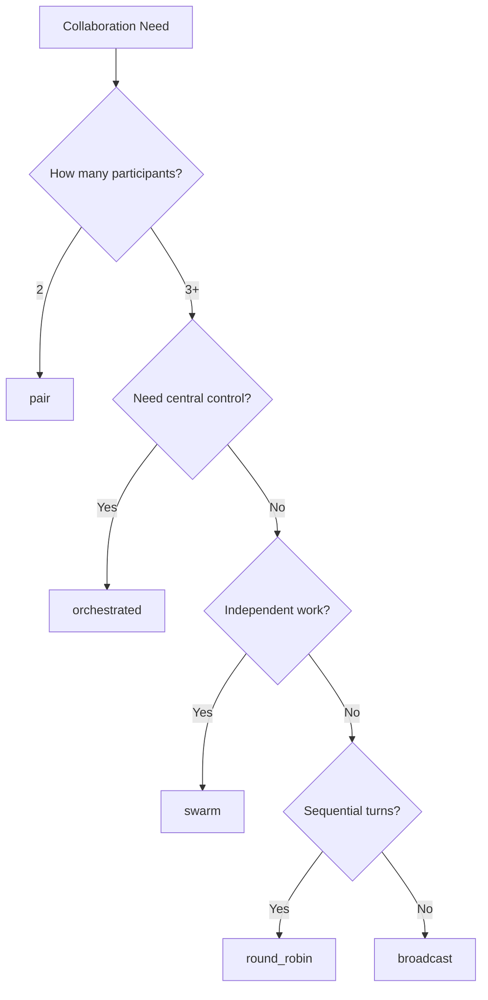
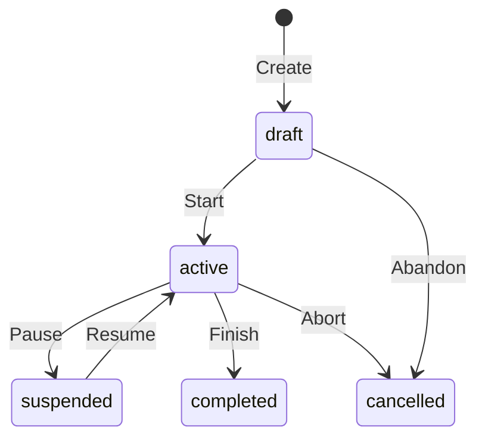

> [!FROZEN]
> **MPLP Protocol v1.0.0 — Frozen Specification**
> **Freeze Date**: 2025-12-03
> **Status**: FROZEN (no breaking changes permitted)
> **Governance**: MPLP Protocol Governance Committee (MPGC)
> **License**: Apache-2.0
> **Note**: Any normative change requires a new protocol version.

# Collab Module

## 1. Purpose

The **Collab Module** provides the structure for multi-agent collaboration sessions. It defines how multiple agents/roles coordinate their work through different collaboration modes, enabling the MAP (Multi-Agent Plan) profile.

**Design Principle**: "Structured coordination, explicit participation"

## 2. Canonical Schema

**From**: `schemas/v2/mplp-collab.schema.json`

### 2.1 Required Fields

| Field | Type | Description |
|:---|:---|:---|
| **`meta`** | Object | Protocol metadata |
| **`collab_id`** | UUID v4 | Global unique identifier |
| **`context_id`** | UUID v4 | Link to parent Context |
| **`title`** | String (min 1 char) | Session title |
| **`purpose`** | String (min 1 char) | Session goal description |
| **`mode`** | Enum | Collaboration mode |
| **`status`** | Enum | Session lifecycle status |
| **`participants`** | Array (min 1) | Participant list |
| **`created_at`** | ISO 8601 | Creation timestamp |

### 2.2 Optional Fields

| Field | Type | Description |
|:---|:---|:---|
| `updated_at` | ISO 8601 | Last modification timestamp |
| `trace` | Object | Session trace reference |
| `events` | Array | Session lifecycle events |
| `governance` | Object | Lifecycle phase and locking |

### 2.3 The `Participant` Object

**Required**: `participant_id`, `kind`

| Field | Type | Description |
|:---|:---|:---|
| **`participant_id`** | String | Participant identifier |
| **`kind`** | Enum | Participant type |
| `role_id` | String | Bound Role (from Role module) |
| `display_name` | String | Human-readable name |

**Kind Enum**: `["agent", "human", "system", "external"]`

## 3. Collaboration Modes

**From schema**: `["broadcast", "round_robin", "orchestrated", "swarm", "pair"]`

### 3.1 Mode Descriptions

| Mode | Description | Use Case |
|:---|:---|:---|
| **broadcast** | All participants receive same message simultaneously | Announcements, status updates |
| **round_robin** | Turn-based sequential participation | Structured reviews, voting |
| **orchestrated** | Central orchestrator controls flow | Complex multi-step tasks |
| **swarm** | Self-organizing parallel work | Independent subtasks |
| **pair** | Two-participant direct collaboration | Code review, debugging |

### 3.2 Mode Selection Guide



## 4. Lifecycle State Machine

### 4.1 Session Status

**From schema**: `["draft", "active", "suspended", "completed", "cancelled"]`



### 4.2 Status Semantics

| Status | Participants Can Act | Description |
|:---|:---:|:---|
| **draft** | No | Setting up session |
| **active** | Yes | Collaboration in progress |
| **suspended** | No | Temporarily paused |
| **completed** | No | Successfully finished |
| **cancelled** | No | Aborted |

## 5. MAP Invariants

**From**: `schemas/v2/invariants/map-invariants.yaml`

### 5.1 Core Invariants

| ID | Rule | Description |
|:---|:---|:---|
| `map_min_participants` | `participants.length >= 1` | At least one participant required |
| `map_unique_participant_ids` | All participant_id unique | No duplicate participants |
| `map_orchestrator_required` | If mode=orchestrated, one participant must be orchestrator | Orchestrated mode needs controller |
| `map_exclusive_write` | Only active speaker can modify | Prevents write conflicts |

### 5.2 Turn Management

**For round_robin and orchestrated modes**:

```typescript
interface TurnState {
  current_turn_holder: string;  // participant_id
  turn_order: string[];         // participant_ids in order
  turn_index: number;
  turn_started_at: string;      // ISO 8601
}

function advanceTurn(session: Collab, state: TurnState): string {
  state.turn_index = (state.turn_index + 1) % state.turn_order.length;
  state.current_turn_holder = state.turn_order[state.turn_index];
  state.turn_started_at = new Date().toISOString();
  
  return state.current_turn_holder;
}
```

## 6. Module Interactions

### 6.1 Dependency Map

```
Collab Module  Context Module        collab.context_id MUST reference valid Context  Role Module        participant.role_id references Role  Plan Module        Collaboration produces coordinated Plans  Trace Module
             Session execution captured in Trace
```

## 7. SDK Examples

### 7.1 TypeScript

```typescript
import { v4 as uuidv4 } from 'uuid';

type CollabMode = 'broadcast' | 'round_robin' | 'orchestrated' | 'swarm' | 'pair';
type CollabStatus = 'draft' | 'active' | 'suspended' | 'completed' | 'cancelled';
type ParticipantKind = 'agent' | 'human' | 'system' | 'external';

interface Participant {
  participant_id: string;
  kind: ParticipantKind;
  role_id?: string;
  display_name?: string;
}

interface Collab {
  meta: { protocolVersion: string };
  collab_id: string;
  context_id: string;
  title: string;
  purpose: string;
  mode: CollabMode;
  status: CollabStatus;
  participants: Participant[];
  created_at: string;
}

function createCollab(
  context_id: string,
  title: string,
  purpose: string,
  mode: CollabMode,
  participants: Participant[]
): Collab {
  return {
    meta: { protocolVersion: '1.0.0' },
    collab_id: uuidv4(),
    context_id,
    title,
    purpose,
    mode,
    status: 'draft',
    participants,
    created_at: new Date().toISOString()
  };
}

// Usage
const session = createCollab(
  'ctx-123',
  'Code Review Session',
  'Review authentication module changes',
  'pair',
  [
    { participant_id: 'coder-1', kind: 'agent', role_id: 'role-coder' },
    { participant_id: 'reviewer-1', kind: 'agent', role_id: 'role-reviewer' }
  ]
);
```

### 7.2 Python

```python
from pydantic import BaseModel, Field
from uuid import uuid4
from datetime import datetime
from typing import List, Optional
from enum import Enum

class CollabMode(str, Enum):
    BROADCAST = 'broadcast'
    ROUND_ROBIN = 'round_robin'
    ORCHESTRATED = 'orchestrated'
    SWARM = 'swarm'
    PAIR = 'pair'

class CollabStatus(str, Enum):
    DRAFT = 'draft'
    ACTIVE = 'active'
    SUSPENDED = 'suspended'
    COMPLETED = 'completed'
    CANCELLED = 'cancelled'

class ParticipantKind(str, Enum):
    AGENT = 'agent'
    HUMAN = 'human'
    SYSTEM = 'system'
    EXTERNAL = 'external'

class Participant(BaseModel):
    participant_id: str
    kind: ParticipantKind
    role_id: Optional[str] = None
    display_name: Optional[str] = None

class Collab(BaseModel):
    collab_id: str = Field(default_factory=lambda: str(uuid4()))
    context_id: str
    title: str = Field(..., min_length=1)
    purpose: str = Field(..., min_length=1)
    mode: CollabMode
    status: CollabStatus = CollabStatus.DRAFT
    participants: List[Participant] = Field(..., min_items=1)
    created_at: datetime = Field(default_factory=datetime.now)

# Usage
session = Collab(
    context_id='ctx-123',
    title='Code Review Session',
    purpose='Review authentication module',
    mode=CollabMode.PAIR,
    participants=[
        Participant(participant_id='coder-1', kind=ParticipantKind.AGENT),
        Participant(participant_id='reviewer-1', kind=ParticipantKind.AGENT)
    ]
)
```

## 8. Complete JSON Example

```json
{
  "meta": {
    "protocolVersion": "1.0.0",
    "source": "mplp-runtime"
  },
  "collab_id": "collab-550e8400-e29b-41d4-a716-446655440003",
  "context_id": "ctx-550e8400-e29b-41d4-a716-446655440000",
  "title": "Authentication Refactor Planning",
  "purpose": "Coordinate multi-agent planning for JWT migration",
  "mode": "orchestrated",
  "status": "active",
  "participants": [
    {
      "participant_id": "orchestrator-1",
      "kind": "agent",
      "role_id": "role-architect-001",
      "display_name": "Lead Architect"
    },
    {
      "participant_id": "coder-1",
      "kind": "agent",
      "role_id": "role-coder-001",
      "display_name": "Backend Developer"
    },
    {
      "participant_id": "tester-1",
      "kind": "agent",
      "role_id": "role-tester-001",
      "display_name": "QA Engineer"
    },
    {
      "participant_id": "human-1",
      "kind": "human",
      "role_id": "role-reviewer-001",
      "display_name": "Human Reviewer"
    }
  ],
  "created_at": "2025-12-07T00:00:00.000Z",
  "updated_at": "2025-12-07T00:15:00.000Z"
}
```

## 9. Related Documents

**Architecture**:
- [L2 Coordination & Governance](../01-architecture/l2-coordination-governance.md)
- [Coordination](../01-architecture/cross-cutting-kernel-duties/coordination.md) - MAP modes detail

**Modules**:
- [Context Module](context-module.md) - Parent Context binding
- [Role Module](role-module.md) - Participant roles
- [Plan Module](plan-module.md) - Collaborative plan creation

**Schemas**:
- `schemas/v2/mplp-collab.schema.json`
- `schemas/v2/invariants/map-invariants.yaml`

---

**Document Status**: Normative (Core Module)  
**Required Fields**: meta, collab_id, context_id, title, purpose, mode, status, participants, created_at  
**Modes**: broadcast, round_robin, orchestrated, swarm, pair  
**Status Enum**: draft active suspended/completed/cancelled  
**Key Invariant**: participants.length 1