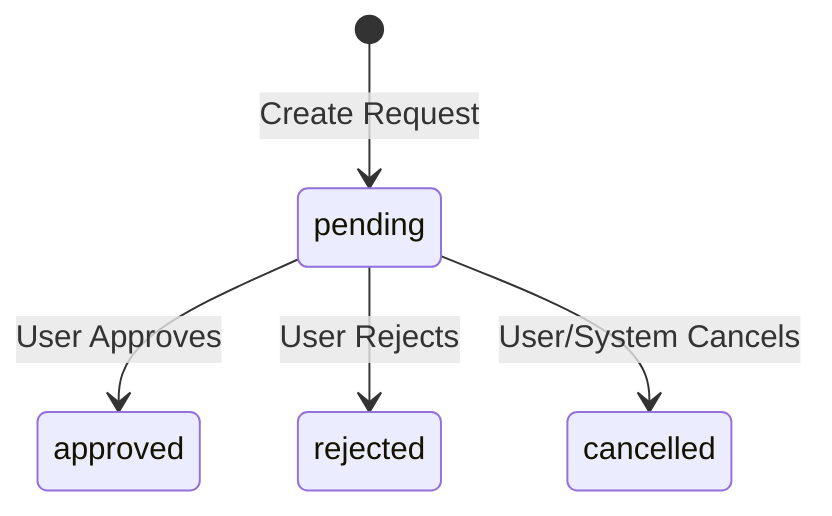
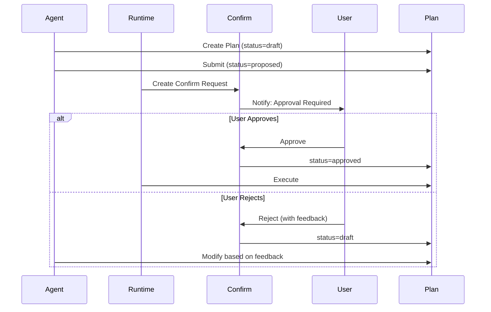

> [!FROZEN]
> **MPLP Protocol v1.0.0  Frozen Specification**
> **Freeze Date**: 2025-12-03
> **Status**: FROZEN (no breaking changes permitted)
> **Governance**: MPLP Protocol Governance Committee (MPGC)
> **License**: Apache-2.0
> **Note**: Any normative change requires a new protocol version.

# Confirm Module

## 1. Purpose

The **Confirm Module** provides the Human-in-the-Loop (HITL) approval workflow for MPLP. It enables users to approve, reject, or request changes to agent-generated Plans and other resources before execution.

**Design Principle**: "No irreversible action without explicit human consent"

## 2. Canonical Schema

**From**: `schemas/v2/mplp-confirm.schema.json`

### 2.1 Required Fields

| Field | Type | Description |
|:---|:---|:---|
| **`meta`** | Object | Protocol metadata |
| **`confirm_id`** | UUID v4 | Global unique identifier |
| **`target_type`** | Enum | Type of resource being approved |
| **`target_id`** | UUID v4 | ID of resource being approved |
| **`status`** | Enum | Approval request status |
| **`requested_by_role`** | String | Role that initiated request |
| **`requested_at`** | ISO 8601 | Request timestamp |

### 2.2 Optional Fields

| Field | Type | Description |
|:---|:---|:---|
| `reason` | String | Request justification |
| `decisions` | Array | Decision records |
| `trace` | Object | Trace reference |
| `events` | Array | Lifecycle events |
| `governance` | Object | Lifecycle phase and locking |

### 2.3 Target Types

**From schema**: `["context", "plan", "trace", "extension", "other"]`

| Target Type | Description |
|:---|:---|
| **context** | Approve Context creation/modification |
| **plan** | Approve Plan for execution |
| **trace** | Approve Trace record (rare) |
| **extension** | Approve extension installation |
| **other** | Custom approval target |

### 2.4 The `Decision` Object

**Required**: `decision_id`, `status`, `decided_by_role`, `decided_at`

| Field | Type | Description |
|:---|:---|:---|
| **`decision_id`** | UUID v4 | Decision record identifier |
| **`status`** | Enum | Decision result |
| **`decided_by_role`** | String | Role making decision |
| **`decided_at`** | ISO 8601 | Decision timestamp |
| `reason` | String | Decision justification |

**Decision Status Enum**: `["approved", "rejected", "cancelled"]`

## 3. Lifecycle State Machine

### 3.1 Confirm Status

**From schema**: `["pending", "approved", "rejected", "cancelled"]`



### 3.2 Status Semantics

| Status | Final | Description |
|:---|:---:|:---|
| **pending** | No | Awaiting decision |
| **approved** | Yes | Approved for execution |
| **rejected** | Yes | Rejected, needs changes |
| **cancelled** | Yes | Cancelled, no action needed |

## 4. Approval Workflow

### 4.1 Plan Approval Flow



### 4.2 Approval Trigger

**When Plan transitions**: `draft` `proposed`

```typescript
async function submitPlanForApproval(
  plan: Plan,
  requestedBy: string
): Promise<Confirm> {
  // Update plan status
  plan.status = 'proposed';
  
  // Create confirm request
  const confirm: Confirm = {
    meta: { protocolVersion: '1.0.0' },
    confirm_id: uuidv4(),
    target_type: 'plan',
    target_id: plan.plan_id,
    status: 'pending',
    requested_by_role: requestedBy,
    requested_at: new Date().toISOString(),
    reason: `Requesting approval for plan: ${plan.title}`
  };
  
  // Notify user (via UI or other channel)
  await notifyUser('approval_required', confirm);
  
  return confirm;
}
```

### 4.3 Decision Processing

```typescript
async function processDecision(
  confirm: Confirm,
  decision: Decision
): Promise<void> {
  // Add decision record
  confirm.decisions = confirm.decisions || [];
  confirm.decisions.push(decision);
  
  // Update confirm status
  confirm.status = decision.status;
  
  // Update target resource
  const target = await getResource(confirm.target_type, confirm.target_id);
  
  if (confirm.target_type === 'plan') {
    if (decision.status === 'approved') {
      target.status = 'approved';
    } else if (decision.status === 'rejected') {
      target.status = 'draft';  // Back to editable state
    }
  }
  
  // Emit event
  await eventBus.emit({
    event_family: 'pipeline_stage',
    event_type: decision.status === 'approved'  'plan_approved' : 'plan_rejected',
    payload: {
      confirm_id: confirm.confirm_id,
      plan_id: target.plan_id,
      decided_by: decision.decided_by_role
    }
  });
}
```

## 5. Learning Signal Capture

**Confirm decisions are high-value learning signals**:

```typescript
async function captureLearningSample(
  confirm: Confirm,
  target: Plan
): Promise<LearningSample> {
  return {
    sample_id: uuidv4(),
    sample_family: 'intent_resolution',
    created_at: new Date().toISOString(),
    input: {
      intent_text: target.objective,
      context: await getContext(target.context_id)
    },
    output: {
      plan_structure: target.steps
    },
    feedback: {
      source: 'user',
      type: confirm.status === 'approved'  'approval' : 'rejection',
      quality_label: confirm.status === 'approved'  'good' : 'poor',
      details: confirm.decisions?.[0]?.reason
    }
  };
}
```

## 6. SDK Examples

### 6.1 TypeScript

```typescript
import { v4 as uuidv4 } from 'uuid';

type TargetType = 'context' | 'plan' | 'trace' | 'extension' | 'other';
type ConfirmStatus = 'pending' | 'approved' | 'rejected' | 'cancelled';
type DecisionStatus = 'approved' | 'rejected' | 'cancelled';

interface Decision {
  decision_id: string;
  status: DecisionStatus;
  decided_by_role: string;
  decided_at: string;
  reason?: string;
}

interface Confirm {
  meta: { protocolVersion: string };
  confirm_id: string;
  target_type: TargetType;
  target_id: string;
  status: ConfirmStatus;
  requested_by_role: string;
  requested_at: string;
  reason?: string;
  decisions?: Decision[];
}

function createConfirm(
  targetType: TargetType,
  targetId: string,
  requestedByRole: string,
  reason?: string
): Confirm {
  return {
    meta: { protocolVersion: '1.0.0' },
    confirm_id: uuidv4(),
    target_type: targetType,
    target_id: targetId,
    status: 'pending',
    requested_by_role: requestedByRole,
    requested_at: new Date().toISOString(),
    reason
  };
}

function addDecision(
  confirm: Confirm,
  status: DecisionStatus,
  decidedByRole: string,
  reason?: string
): void {
  const decision: Decision = {
    decision_id: uuidv4(),
    status,
    decided_by_role: decidedByRole,
    decided_at: new Date().toISOString(),
    reason
  };
  
  confirm.decisions = confirm.decisions || [];
  confirm.decisions.push(decision);
  confirm.status = status;
}
```

### 6.2 Python

```python
from pydantic import BaseModel, Field
from uuid import uuid4
from datetime import datetime
from typing import List, Optional
from enum import Enum

class TargetType(str, Enum):
    CONTEXT = 'context'
    PLAN = 'plan'
    TRACE = 'trace'
    EXTENSION = 'extension'
    OTHER = 'other'

class ConfirmStatus(str, Enum):
    PENDING = 'pending'
    APPROVED = 'approved'
    REJECTED = 'rejected'
    CANCELLED = 'cancelled'

class DecisionStatus(str, Enum):
    APPROVED = 'approved'
    REJECTED = 'rejected'
    CANCELLED = 'cancelled'

class Decision(BaseModel):
    decision_id: str = Field(default_factory=lambda: str(uuid4()))
    status: DecisionStatus
    decided_by_role: str
    decided_at: datetime = Field(default_factory=datetime.now)
    reason: Optional[str] = None

class Confirm(BaseModel):
    confirm_id: str = Field(default_factory=lambda: str(uuid4()))
    target_type: TargetType
    target_id: str
    status: ConfirmStatus = ConfirmStatus.PENDING
    requested_by_role: str
    requested_at: datetime = Field(default_factory=datetime.now)
    reason: Optional[str] = None
    decisions: List[Decision] = []

# Usage
confirm = Confirm(
    target_type=TargetType.PLAN,
    target_id='plan-123',
    requested_by_role='role-planner-001',
    reason='Requesting approval for login fix plan'
)
```

## 7. Complete JSON Example

```json
{
  "meta": {
    "protocolVersion": "1.0.0",
    "source": "mplp-runtime"
  },
  "confirm_id": "confirm-550e8400-e29b-41d4-a716-446655440004",
  "target_type": "plan",
  "target_id": "plan-550e8400-e29b-41d4-a716-446655440001",
  "status": "approved",
  "requested_by_role": "role-planner-001",
  "requested_at": "2025-12-07T00:00:00.000Z",
  "reason": "Requesting approval to fix login 500 error",
  "decisions": [
    {
      "decision_id": "decision-001",
      "status": "approved",
      "decided_by_role": "role-reviewer-001",
      "decided_at": "2025-12-07T00:05:00.000Z",
      "reason": "Plan looks good, approved for execution"
    }
  ]
}
```

## 8. Related Documents

**Architecture**:
- [L2 Coordination & Governance](../01-architecture/l2-coordination-governance.md)

**Modules**:
- [Plan Module](plan-module.md) - Plan approval workflow
- [Role Module](role-module.md) - requested_by_role, decided_by_role
- [Learning Overview](../05-learning/learning-overview.md) - Learning signal capture

**Cross-Cutting**:
- [Observability](../01-architecture/cross-cutting/observability.md) - Approval events

**Schemas**:
- `schemas/v2/mplp-confirm.schema.json`

---

**Document Status**: Normative (Core Module)  
**Required Fields**: meta, confirm_id, target_type, target_id, status, requested_by_role, requested_at  
**Target Types**: context, plan, trace, extension, other  
**Status Enum**: pending approved/rejected/cancelled  
**Key Use**: Plan proposed approved transition
---

 2025 Bangshi Beijing Network Technology Limited Company
Licensed under the Apache License, Version 2.0.
