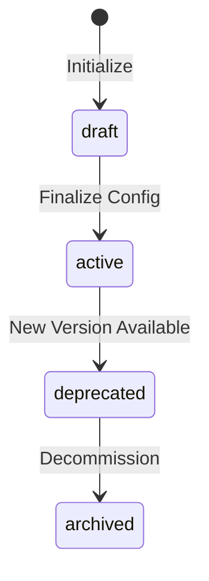

> [!FROZEN]
> **MPLP Protocol v1.0.0  Frozen Specification**
> **Freeze Date**: 2025-12-03
> **Status**: FROZEN (no breaking changes permitted)
> **Governance**: MPLP Protocol Governance Committee (MPGC)
> **License**: Apache-2.0
> **Note**: Any normative change requires a new protocol version.

# Core Module

## 1. Purpose

The **Core Module** serves as the protocol manifest for an MPLP instance. It declares the protocol version, enabled modules, and overall runtime state. Every MPLP runtime MUST have exactly one Core object.

**Design Principle**: "Single source of truth for protocol configuration"

## 2. Canonical Schema

**From**: `schemas/v2/mplp-core.schema.json`

### 2.1 Required Fields

| Field | Type | Description |
|:---|:---|:---|
| **`meta`** | Object | Protocol metadata |
| **`core_id`** | UUID v4 | Global unique identifier |
| **`protocol_version`** | String | MPLP version (e.g., "1.0.0") |
| **`status`** | Enum | Instance lifecycle status |
| **`modules`** | Array (min 1) | Enabled L2 modules |

### 2.2 Optional Fields

| Field | Type | Description |
|:---|:---|:---|
| `trace` | Object | Configuration audit trace |
| `events` | Array | Core lifecycle events |
| `governance` | Object | Lifecycle phase and locking |

### 2.3 The `ModuleDescriptor` Object

**Required**: `module_id`, `version`, `status`

| Field | Type | Description |
|:---|:---|:---|
| **`module_id`** | Enum | Module identifier |
| **`version`** | String | Module version (SemVer recommended) |
| **`status`** | Enum | Module status in this instance |
| `required` | Boolean | Whether this module is mandatory |
| `description` | String | Brief module description |

**Module ID Enum**: `["context", "plan", "confirm", "trace", "role", "extension", "dialog", "collab", "core", "network"]`

**Status Enum**: `["enabled", "disabled", "experimental", "deprecated"]`

## 3. Lifecycle State Machine

### 3.1 Core Status

**From schema**: `["draft", "active", "deprecated", "archived"]`



### 3.2 Status Semantics

| Status | Operational | Description |
|:---|:---:|:---|
| **draft** | No | Configuration in progress |
| **active** | Yes | Runtime operational |
| **deprecated** |  Limited | Marked for migration |
| **archived** | No | Historical record |

## 4. Module Registration

### 4.1 L2 Module List

**Standard MPLP v1.0 modules**:

| Module ID | Required | Description |
|:---|:---:|:---|
| `context` | Yes | World state management |
| `plan` | Yes | Plan decomposition |
| `trace` | Yes | Execution tracing |
| `role` | Yes | Capability/permission |
| `collab` | Optional | Multi-agent coordination |
| `confirm` | Optional | Approval workflow |
| `dialog` | Optional | Conversational interaction |
| `extension` | Optional | Plugin system |
| `network` | Optional | Agent network topology |

### 4.2 Module Enable/Disable

```typescript
function enableModule(core: Core, module_id: string, version: string): void {
  const existing = core.modules.find(m => m.module_id === module_id);
  
  if (existing) {
    existing.status = 'enabled';
    existing.version = version;
  } else {
    core.modules.push({
      module_id,
      version,
      status: 'enabled'
    });
  }
  
  // Emit event
  core.events?.push({
    event_type: 'module_enabled',
    payload: { module_id, version },
    timestamp: new Date().toISOString()
  });
}
```

## 5. SDK Examples

> [!NOTE]
> The Core Module is not yet included in the official SDK packages (`sdk-ts`, `sdk-py`). The following examples demonstrate schema-compliant usage patterns for reference implementations.

### 5.1 TypeScript (Reference)

```typescript
import { v4 as uuidv4 } from 'uuid';

type CoreStatus = 'draft' | 'active' | 'deprecated' | 'archived';
type ModuleStatus = 'enabled' | 'disabled' | 'experimental' | 'deprecated';
type ModuleId = 'context' | 'plan' | 'confirm' | 'trace' | 'role' | 'extension' | 'dialog' | 'collab' | 'core' | 'network';

interface ModuleDescriptor {
  module_id: ModuleId;
  version: string;
  status: ModuleStatus;
  required?: boolean;
  description?: string;
}

interface Core {
  meta: { protocolVersion: string };
  core_id: string;
  protocol_version: string;
  status: CoreStatus;
  modules: ModuleDescriptor[];
}

function createCore(version: string = '1.0.0'): Core {
  return {
    meta: { protocolVersion: version },
    core_id: uuidv4(),
    protocol_version: version,
    status: 'draft',
    modules: [
      // Required modules
      { module_id: 'context', version: '1.0.0', status: 'enabled', required: true },
      { module_id: 'plan', version: '1.0.0', status: 'enabled', required: true },
      { module_id: 'trace', version: '1.0.0', status: 'enabled', required: true },
      { module_id: 'role', version: '1.0.0', status: 'enabled', required: true }
    ]
  };
}
```

### 5.2 Python (Reference)

```python
from pydantic import BaseModel, Field
from uuid import uuid4
from typing import List, Optional
from enum import Enum

class CoreStatus(str, Enum):
    DRAFT = 'draft'
    ACTIVE = 'active'
    DEPRECATED = 'deprecated'
    ARCHIVED = 'archived'

class ModuleStatus(str, Enum):
    ENABLED = 'enabled'
    DISABLED = 'disabled'
    EXPERIMENTAL = 'experimental'
    DEPRECATED = 'deprecated'

class ModuleId(str, Enum):
    CONTEXT = 'context'
    PLAN = 'plan'
    CONFIRM = 'confirm'
    TRACE = 'trace'
    ROLE = 'role'
    EXTENSION = 'extension'
    DIALOG = 'dialog'
    COLLAB = 'collab'
    CORE = 'core'
    NETWORK = 'network'

class ModuleDescriptor(BaseModel):
    module_id: ModuleId
    version: str
    status: ModuleStatus = ModuleStatus.ENABLED
    required: Optional[bool] = None
    description: Optional[str] = None

class Core(BaseModel):
    core_id: str = Field(default_factory=lambda: str(uuid4()))
    protocol_version: str = '1.0.0'
    status: CoreStatus = CoreStatus.DRAFT
    modules: List[ModuleDescriptor] = Field(..., min_length=1)

# Usage with required modules
core = Core(modules=[
    ModuleDescriptor(module_id=ModuleId.CONTEXT, version='1.0.0', required=True),
    ModuleDescriptor(module_id=ModuleId.PLAN, version='1.0.0', required=True),
    ModuleDescriptor(module_id=ModuleId.TRACE, version='1.0.0', required=True),
    ModuleDescriptor(module_id=ModuleId.ROLE, version='1.0.0', required=True)
])
```

## 6. Complete JSON Example

```json
{
  "meta": {
    "protocolVersion": "1.0.0",
    "source": "mplp-runtime"
  },
  "core_id": "core-550e8400-e29b-41d4-a716-446655440006",
  "protocol_version": "1.0.0",
  "status": "active",
  "modules": [
    { "module_id": "context", "version": "1.0.0", "status": "enabled", "required": true },
    { "module_id": "plan", "version": "1.0.0", "status": "enabled", "required": true },
    { "module_id": "trace", "version": "1.0.0", "status": "enabled", "required": true },
    { "module_id": "role", "version": "1.0.0", "status": "enabled", "required": true },
    { "module_id": "collab", "version": "1.0.0", "status": "enabled" },
    { "module_id": "confirm", "version": "1.0.0", "status": "enabled" },
    { "module_id": "dialog", "version": "1.0.0", "status": "enabled" }
  ]
}
```

## 7. Related Documents

**Architecture**:
- [L1 Core Protocol](../01-architecture/l1-core-protocol.md)
- [Protocol Versioning](../01-architecture/cross-cutting/protocol-versioning.md)

**Modules**:
- [Module Interactions](module-interactions.md) - Module dependency map

**Schemas**:
- `schemas/v2/mplp-core.schema.json`

---

**Document Status**: Normative (Core Module)  
**Required Fields**: meta, core_id, protocol_version, status, modules  
**Required Modules**: context, plan, trace, role  
**Status Enum**: draft active deprecated archived
---

 2025 Bangshi Beijing Network Technology Limited Company
Licensed under the Apache License, Version 2.0.
