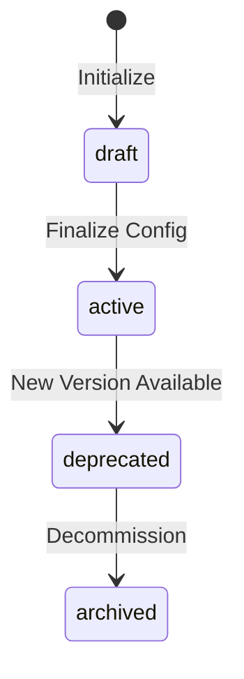

---
title: Core Module
description: Core Module specification serving as the MPLP protocol manifest. Declares protocol version, enabled modules, and runtime state configuration.
keywords: [MPLP, Multi-Agent Lifecycle Protocol, Agent OS Protocol, AI Agent, Observable, Governed, Vendor-neutral, Core Module, protocol manifest, MPLP configuration, module registration, runtime state, protocol version, system core]
sidebar_label: Core Module
---
> [!FROZEN]
> **MPLP Protocol v1.0.0  Frozen Specification**
> **Freeze Date**: 2025-12-03
> **Status**: FROZEN (no breaking changes permitted)
> **Governance**: MPLP Protocol Governance Committee (MPGC)
> **License**: Apache-2.0
> **Note**: Any normative change requires a new protocol version.

# Core Module

## 1. Scope

This specification defines:
- The **protocol manifest** for an MPLP instance
- **Protocol version** declaration
- **Module registration** (which L2 modules are enabled)
- **Instance lifecycle** (draft → active → deprecated → archived)

This module is normative at the protocol level.

## 🧭 How to Use This Section

| Your Goal | Start Here |
|:----------|:-----------|
| **View data contract** | [Data Contract (Schema)](#4-data-contract-schema) |
| **Check lifecycle** | [Lifecycle Semantics](#5-lifecycle-semantics) |
| **See example JSON** | [JSON Example](#9-json-example) |
| **Explore other modules** | [Module Interactions](./module-interactions.md) |

## 2. Non-Goals

This specification does NOT:
- Define individual module semantics (see respective module specs)
- Specify runtime execution logic
- Mandate specific module implementations
- Define inter-module communication protocols

## 3. Normative Requirements

Implementations MUST:
- Create exactly **one Core object** per MPLP runtime instance
- Include all **required fields**: `meta`, `core_id`, `protocol_version`, `status`, `modules`
- Register at least **one module** in the `modules` array
- Use valid **module_id** values from the defined enum

Implementations SHOULD:
- Include the four required modules: `context`, `plan`, `trace`, `role`
- Follow SemVer for `protocol_version`

Implementations MAY:
- Include `governance`, `trace`, `events` optional fields
- Enable optional modules: `collab`, `confirm`, `dialog`, `extension`, `network`

## 4. Data Contract (Schema)

### 4.1 Schema Reference

| Item | Reference |
|:-----|:----------|
| Schema | `schemas/v2/mplp-core.schema.json` |
| Status | ✅ FROZEN |
| Versioning | MPLP v1.0.0 |

### 4.2 Required Fields

| Field | Type | Description |
|:------|:-----|:------------|
| **`meta`** | Object | Protocol metadata ($ref: common/metadata.schema.json) |
| **`core_id`** | UUID v4 | Global unique identifier |
| **`protocol_version`** | String (min 1) | MPLP version (e.g., "1.0.0") |
| **`status`** | Enum | Instance lifecycle status |
| **`modules`** | Array (min 1) | Enabled L2 modules |

### 4.3 Optional Fields

| Field | Type | Description |
|:------|:-----|:------------|
| `governance` | Object | Lifecycle phase, truth domain, locking |
| `trace` | Object | Configuration audit trace reference |
| `events` | Array | Core lifecycle events |

### 4.4 Status Enum

**From schema**: `["draft", "active", "deprecated", "archived"]`

| Status | Operational | Description |
|:-------|:-----------:|:------------|
| **draft** | No | Configuration in progress |
| **active** | Yes | Runtime operational |
| **deprecated** | Limited | Marked for migration |
| **archived** | No | Historical record |

### 4.5 Module Descriptor

**Required fields**: `module_id`, `version`, `status`

| Field | Type | Description |
|:------|:-----|:------------|
| **`module_id`** | Enum | Module identifier |
| **`version`** | String (min 1) | Module version (SemVer) |
| **`status`** | Enum | Module status in this instance |
| `required` | Boolean | Whether mandatory |
| `description` | String | Brief description |

**Module ID Enum**: `["context", "plan", "confirm", "trace", "role", "extension", "dialog", "collab", "core", "network"]`

**Module Status Enum**: `["enabled", "disabled", "experimental", "deprecated"]`

## 5. Lifecycle Semantics

### 5.1 State Machine



### 5.2 Module Registration

| Module ID | Required | Description |
|:----------|:--------:|:------------|
| `context` | Yes | World state management |
| `plan` | Yes | Plan decomposition |
| `trace` | Yes | Execution tracing |
| `role` | Yes | Capability/permission |
| `collab` | Optional | Multi-agent coordination |
| `confirm` | Optional | Approval workflow |
| `dialog` | Optional | Conversational interaction |
| `extension` | Optional | Plugin system |
| `network` | Optional | Agent network topology |

## 6. Evidence

| Type | Location | Status |
|:-----|:---------|:-------|
| **Schema** | `schemas/v2/mplp-core.schema.json` | ✅ Exists |
| **Builder** | — | ⚠️ Not implemented |
| **Tests** | `tests/schema-alignment/ts-schema-alignment.test.ts` | ⚠️ Indirect (via schema validation) |

> [!IMPORTANT]
> **Schema-Level Definition Only**
>
> This module is fully defined at the protocol and schema level.
> Reference builders and automated tests are intentionally partial or absent.
>
> This does NOT indicate experimental status.
> It reflects the separation between:
>
> - **Protocol obligations** (normative, frozen)
> - **Reference implementations** (non-normative, incremental)

## 7. Golden Flow Participation

The Core module provides the protocol manifest for all Golden Flows but is not directly exercised as a standalone validation target.

| Golden Flow | Role |
|:------------|:-----|
| All Flows | Protocol version anchor |

> This does not imply standalone module completeness.

## 8. Change Sensitivity

| Change Type | Authority |
|:------------|:----------|
| Schema change | MPGC |
| Status enum change | MPGC |
| Module ID enum change | MPGC |
| Documentation clarification | Documentation Governance |

---

## 9. JSON Example

```json
{
  "meta": {
    "protocolVersion": "1.0.0",
    "source": "mplp-runtime"
  },
  "core_id": "core-550e8400-e29b-41d4-a716-446655440006",
  "protocol_version": "1.0.0",
  "status": "active",
  "modules": [
    { "module_id": "context", "version": "1.0.0", "status": "enabled", "required": true },
    { "module_id": "plan", "version": "1.0.0", "status": "enabled", "required": true },
    { "module_id": "trace", "version": "1.0.0", "status": "enabled", "required": true },
    { "module_id": "role", "version": "1.0.0", "status": "enabled", "required": true },
    { "module_id": "confirm", "version": "1.0.0", "status": "enabled" }
  ]
}
```

---

## 10. Related Documents

**Architecture**:
- [Architecture Overview](../01-architecture/architecture-overview.md)
- [L1 Core Protocol](../01-architecture/l1-core-protocol.md)

**Schemas**:
- `schemas/v2/mplp-core.schema.json`

---

**Document Status**: Normative (Core Module)
**Required Fields**: meta, core_id, protocol_version, status, modules
**Required Modules**: context, plan, trace, role
**Status Enum**: draft → active → deprecated → archived

---

© 2025 Bangshi Beijing Network Technology Limited Company
Licensed under the Apache License, Version 2.0.
