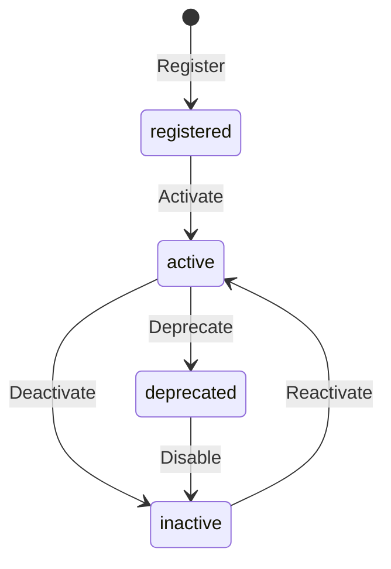

> [!FROZEN]
> **MPLP Protocol v1.0.0  Frozen Specification**
> **Freeze Date**: 2025-12-03
> **Status**: FROZEN (no breaking changes permitted)
> **Governance**: MPLP Protocol Governance Committee (MPGC)
> **License**: Apache-2.0
> **Note**: Any normative change requires a new protocol version.

# Extension Module

## 1. Purpose

The **Extension Module** provides the plugin system for MPLP. It enables capability injection, policy enforcement, and protocol enhancement through a standardized extension mechanism.

**Design Principle**: "Extensibility without breaking core semantics"

## 2. Canonical Schema

**From**: `schemas/v2/mplp-extension.schema.json`

### 2.1 Required Fields

| Field | Type | Description |
|:---|:---|:---|
| **`meta`** | Object | Protocol metadata |
| **`extension_id`** | UUID v4 | Global unique identifier |
| **`context_id`** | UUID v4 | Link to parent Context |
| **`name`** | String (min 1 char) | Extension name |
| **`extension_type`** | Enum | Extension classification |
| **`version`** | String (SemVer) | Extension version |
| **`status`** | Enum | Extension status |

### 2.2 Optional Fields

| Field | Type | Description |
|:---|:---|:---|
| `config` | Object | Extension configuration |
| `trace` | Object | Audit trace reference |
| `events` | Array | Extension lifecycle events |
| `governance` | Object | Lifecycle phase and locking |

### 2.3 Extension Types

**From schema**: `["capability", "policy", "integration", "transformation", "validation", "other"]`

| Type | Description | Examples |
|:---|:---|:---|
| **capability** | Adds new functionality | Custom tools, LLM adapters |
| **policy** | Enforces rules/constraints | Budget limits, rate limiting |
| **integration** | External system integration | Jira, GitHub, Slack |
| **transformation** | Data transformation | Format converters, encoders |
| **validation** | Custom validation rules | Schema validators |
| **other** | Other extensions | Misc enhancements |

## 3. Lifecycle State Machine

### 3.1 Extension Status

**From schema**: `["registered", "active", "inactive", "deprecated"]`



### 3.2 Status Semantics

| Status | Executes | Description |
|:---|:---:|:---|
| **registered** | No | Registered but not activated |
| **active** | Yes | Running and available |
| **inactive** | No | Temporarily disabled |
| **deprecated** |  Limited | Marked for removal |

## 4. Extension Patterns

### 4.1 Capability Extension

**Adding custom tool support**:

```json
{
  "extension_id": "ext-custom-tool-001",
  "name": "GitHub Integration Tool",
  "extension_type": "capability",
  "version": "1.0.0",
  "status": "active",
  "config": {
    "tool_name": "github_pr",
    "api_base": "https://api.github.com",
    "capabilities": ["pr.create", "pr.review", "issues.create"]
  }
}
```

### 4.2 Policy Extension

**Budget enforcement policy**:

```json
{
  "extension_id": "ext-budget-policy-001",
  "name": "Token Budget Enforcer",
  "extension_type": "policy",
  "version": "1.0.0",
  "status": "active",
  "config": {
    "max_tokens_per_plan": 100000,
    "max_cost_usd_per_day": 50.00,
    "on_exceed": "suspend"
  }
}
```

### 4.3 Integration Extension

**Slack notification integration**:

```json
{
  "extension_id": "ext-slack-001",
  "name": "Slack Notifier",
  "extension_type": "integration",
  "version": "1.0.0",
  "status": "active",
  "config": {
    "webhook_url": "https://hooks.slack.com/...",
    "events": ["plan.approved", "plan.completed", "plan.failed"]
  }
}
```

## 5. Extension Lifecycle

### 5.1 Registration Flow

```typescript
async function registerExtension(
  context_id: string,
  name: string,
  type: ExtensionType,
  version: string,
  config?: Record<string, any>
): Promise<Extension> {
  const extension: Extension = {
    meta: { protocolVersion: '1.0.0' },
    extension_id: uuidv4(),
    context_id,
    name,
    extension_type: type,
    version,
    status: 'registered',
    config
  };
  
  // Validate config against type-specific schema
  await validateExtensionConfig(type, config);
  
  // Store extension
  await db.insert('extensions', extension);
  
  // Emit event
  await eventBus.emit({
    event_type: 'extension_registered',
    payload: { extension_id: extension.extension_id, name }
  });
  
  return extension;
}
```

### 5.2 Activation with Approval

**Extensions may require approval**:

```typescript
async function activateExtension(extension_id: string): Promise<void> {
  const extension = await db.get('extensions', extension_id);
  
  // For security-sensitive types, require approval
  if (['capability', 'integration'].includes(extension.extension_type)) {
    const confirm = await createConfirm(
      'extension',
      extension_id,
      'system',
      `Activating extension: ${extension.name}`
    );
    
    // Wait for approval
    const decision = await waitForDecision(confirm.confirm_id);
    if (decision.status !== 'approved') {
      throw new Error('Extension activation not approved');
    }
  }
  
  extension.status = 'active';
  await db.update('extensions', extension);
}
```

## 6. SDK Examples

### 6.1 TypeScript

```typescript
import { v4 as uuidv4 } from 'uuid';

type ExtensionType = 'capability' | 'policy' | 'integration' | 'transformation' | 'validation' | 'other';
type ExtensionStatus = 'registered' | 'active' | 'inactive' | 'deprecated';

interface Extension {
  meta: { protocolVersion: string };
  extension_id: string;
  context_id: string;
  name: string;
  extension_type: ExtensionType;
  version: string;
  status: ExtensionStatus;
  config?: Record<string, any>;
}

function createExtension(
  context_id: string,
  name: string,
  type: ExtensionType,
  version: string,
  config?: Record<string, any>
): Extension {
  return {
    meta: { protocolVersion: '1.0.0' },
    extension_id: uuidv4(),
    context_id,
    name,
    extension_type: type,
    version,
    status: 'registered',
    config
  };
}
```

### 6.2 Python

```python
from pydantic import BaseModel, Field
from uuid import uuid4
from typing import Optional, Dict, Any
from enum import Enum

class ExtensionType(str, Enum):
    CAPABILITY = 'capability'
    POLICY = 'policy'
    INTEGRATION = 'integration'
    TRANSFORMATION = 'transformation'
    VALIDATION = 'validation'
    OTHER = 'other'

class ExtensionStatus(str, Enum):
    REGISTERED = 'registered'
    ACTIVE = 'active'
    INACTIVE = 'inactive'
    DEPRECATED = 'deprecated'

class Extension(BaseModel):
    extension_id: str = Field(default_factory=lambda: str(uuid4()))
    context_id: str
    name: str = Field(..., min_length=1)
    extension_type: ExtensionType
    version: str  # SemVer pattern
    status: ExtensionStatus = ExtensionStatus.REGISTERED
    config: Optional[Dict[str, Any]] = None

# Usage
ext = Extension(
    context_id='ctx-123',
    name='GitHub Integration',
    extension_type=ExtensionType.INTEGRATION,
    version='1.0.0',
    config={'api_base': 'https://api.github.com'}
)
```

## 7. Complete JSON Example

```json
{
  "meta": {
    "protocolVersion": "1.0.0",
    "source": "mplp-runtime"
  },
  "extension_id": "ext-550e8400-e29b-41d4-a716-446655440007",
  "context_id": "ctx-550e8400-e29b-41d4-a716-446655440000",
  "name": "GitHub Integration Suite",
  "extension_type": "integration",
  "version": "1.2.0",
  "status": "active",
  "config": {
    "api_base": "https://api.github.com",
    "owner": "your-org",
    "token_env_var": "GITHUB_TOKEN",
    "enabled_features": ["pull_requests", "issues", "actions"],
    "webhook_secret_env_var": "GITHUB_WEBHOOK_SECRET"
  }
}
```

## 8. Related Documents

**Architecture**:
- [L3 Extension Layer](../01-architecture/l3-execution-orchestration.md)

**Modules**:
- [Context Module](context-module.md) - Parent Context binding
- [Confirm Module](confirm-module.md) - Extension approval

**Schemas**:
- `schemas/v2/mplp-extension.schema.json`

---

**Document Status**: Normative (L2 Optional Module)  
**Required Fields**: meta, extension_id, context_id, name, extension_type, version, status  
**Types**: capability, policy, integration, transformation, validation, other  
**Status Enum**: registered active inactive deprecated
---

 2025 Bangshi Beijing Network Technology Limited Company
Licensed under the Apache License, Version 2.0.
