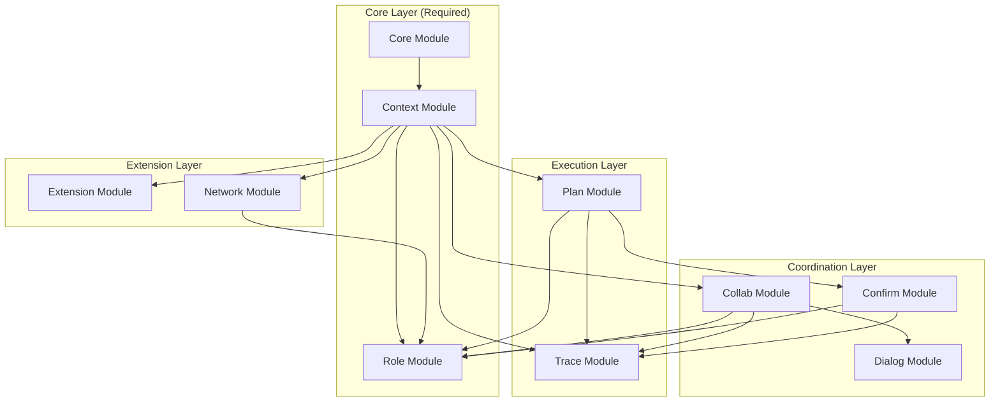
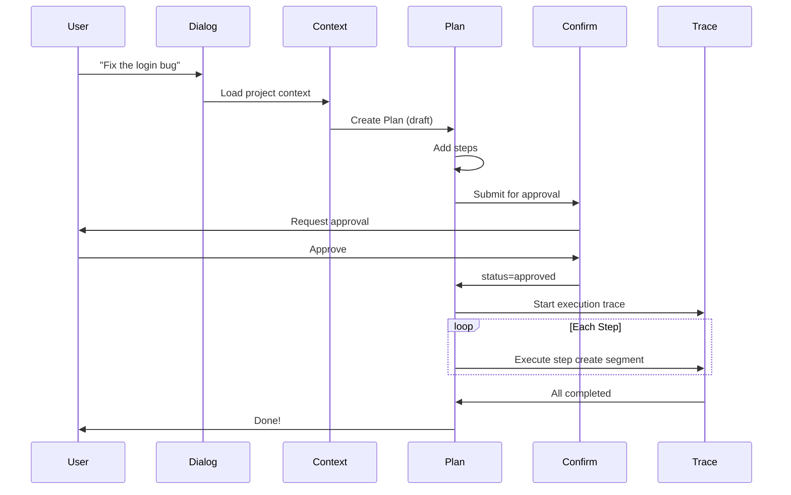
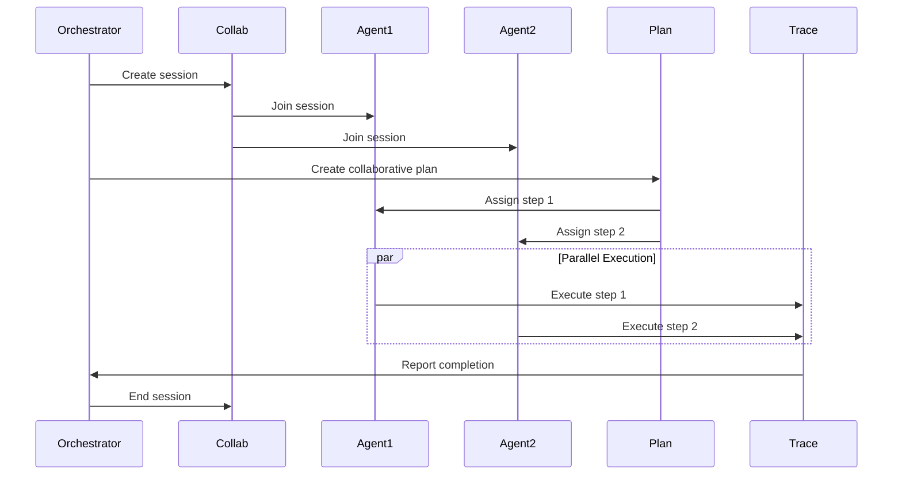
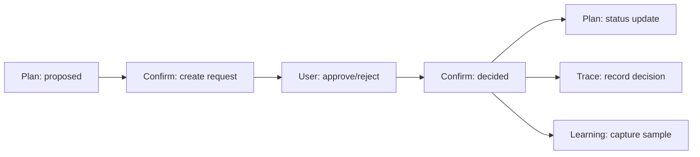

---
title: Module Interactions
description: Comprehensive overview of relationships and dependencies between MPLP L2 modules, including dependency graphs and data flow patterns.
keywords: [MPLP, Multi-Agent Lifecycle Protocol, Agent OS Protocol, AI Agent, Observable, Governed, Vendor-neutral, Module Interactions, dependency graph, data flow, module coupling]
sidebar_label: Module Interactions
---
> [!FROZEN]
> **MPLP Protocol v1.0.0  Frozen Specification**
> **Freeze Date**: 2025-12-03
> **Status**: FROZEN (no breaking changes permitted)
> **Governance**: MPLP Protocol Governance Committee (MPGC)
> **License**: Apache-2.0
> **Note**: Any normative change requires a new protocol version.

# Module Interactions

## 1. Purpose

This document describes the relationships and dependencies between MPLP L2 modules, providing a comprehensive view of how modules interact within the protocol.

## 2. Module Classification

### 2.1 Core Modules (Required)

| Module | Purpose | Always Required |
|:---|:---|:---:|
| [Core](core-module.md) | Protocol manifest | Yes |
| [Context](context-module.md) | World state | Yes |
| [Plan](plan-module.md) | Task decomposition | Yes |
| [Trace](trace-module.md) | Execution audit | Yes |
| [Role](role-module.md) | Permissions | Yes |

### 2.2 Coordination Modules (Optional)

| Module | Purpose | Profile |
|:---|:---|:---|
| [Collab](collab-module.md) | Multi-agent sessions | MAP |
| [Confirm](confirm-module.md) | Approval workflow | SA/MAP |
| [Dialog](dialog-module.md) | Conversations | SA/MAP |

### 2.3 Extension Modules (Optional)

| Module | Purpose | Profile |
|:---|:---|:---|
| [Extension](extension-module.md) | Plugin system | SA/MAP |
| [Network](network-module.md) | Agent topology | MAP |

## 3. Dependency Graph

### 3.1 Complete Dependency Map



### 3.2 Reference Bindings

| From | Field | To | Description |
|:---|:---|:---|:---|
| Plan | `context_id` | Context | Plan belongs to Context |
| Trace | `context_id` | Context | Trace belongs to Context |
| Trace | `plan_id` | Plan | Trace for Plan execution |
| Confirm | `target_id` | Plan/Context | What to approve |
| Confirm | `requested_by_role` | Role | Who requested |
| Confirm | `decided_by_role` | Role | Who decided |
| Collab | `context_id` | Context | Session belongs to Context |
| Collab | `participant.role_id` | Role | Participant role |
| Dialog | `context_id` | Context | Dialog belongs to Context |
| Extension | `context_id` | Context | Extension belongs to Context |
| Network | `context_id` | Context | Network belongs to Context |
| Plan.Step | `agent_role` | Role | Step executor |
| Context | `owner_role` | Role | Context owner |

## 4. Data Flow Patterns

### 4.1 SA Profile (Single-Agent)



### 4.2 MAP Profile (Multi-Agent)



## 5. Module Coupling

### 5.1 Loose Coupling (Recommended)

**Good**: Reference by ID only
```json
{
  "plan_id": "plan-123",
  "context_id": "ctx-456"  // Only stores ID, not entire Context
}
```

### 5.2 Invariant Enforcement

Modules enforce cross-references through invariants:

```typescript
// SA invariant: Plan context_id must match loaded Context
function validatePlanContextBinding(plan: Plan, context: Context): boolean {
  return plan.context_id === context.context_id;
}

// SA invariant: Trace context_id must match loaded Context
function validateTraceContextBinding(trace: Trace, context: Context): boolean {
  return trace.context_id === context.context_id;
}
```

## 6. Profile Configurations

### 6.1 Minimal SA Profile

**Required modules only**:

```json
{
  "modules": [
    { "module_id": "context", "status": "enabled" },
    { "module_id": "plan", "status": "enabled" },
    { "module_id": "trace", "status": "enabled" },
    { "module_id": "role", "status": "enabled" }
  ]
}
```

### 6.2 Full SA Profile

**With approval and dialog**:

```json
{
  "modules": [
    { "module_id": "context", "status": "enabled" },
    { "module_id": "plan", "status": "enabled" },
    { "module_id": "trace", "status": "enabled" },
    { "module_id": "role", "status": "enabled" },
    { "module_id": "confirm", "status": "enabled" },
    { "module_id": "dialog", "status": "enabled" }
  ]
}
```

### 6.3 Full MAP Profile

**Multi-agent with all modules**:

```json
{
  "modules": [
    { "module_id": "context", "status": "enabled" },
    { "module_id": "plan", "status": "enabled" },
    { "module_id": "trace", "status": "enabled" },
    { "module_id": "role", "status": "enabled" },
    { "module_id": "collab", "status": "enabled" },
    { "module_id": "confirm", "status": "enabled" },
    { "module_id": "dialog", "status": "enabled" },
    { "module_id": "extension", "status": "enabled" },
    { "module_id": "network", "status": "enabled" }
  ]
}
```

## 7. Event Flow

### 7.1 Cross-Module Events

| Event | Source | Consumers |
|:---|:---|:---|
| `context.activated` | Context | Plan, Collab |
| `plan.proposed` | Plan | Confirm |
| `plan.approved` | Confirm | Plan, Trace |
| `step.completed` | Plan | Trace, Learning |
| `collab.started` | Collab | Dialog, Trace |
| `confirm.decided` | Confirm | Plan, Learning |

### 7.2 Event Propagation



## 8. Related Documents

- [Core Module](core-module.md)
- [Context Module](context-module.md)
- [Plan Module](plan-module.md)
- [Trace Module](trace-module.md)
- [Role Module](role-module.md)
- [Collab Module](collab-module.md)
- [Confirm Module](confirm-module.md)
- [Dialog Module](dialog-module.md)
- [Extension Module](extension-module.md)
- [Network Module](network-module.md)

---

**Document Status**: Informative (Overview)  
**Core Modules**: Core, Context, Plan, Trace, Role (5)  
**Optional Modules**: Collab, Confirm, Dialog, Extension, Network (5)  
**Total Modules**: 10
---

 2025 Bangshi Beijing Network Technology Limited Company
Licensed under the Apache License, Version 2.0.
