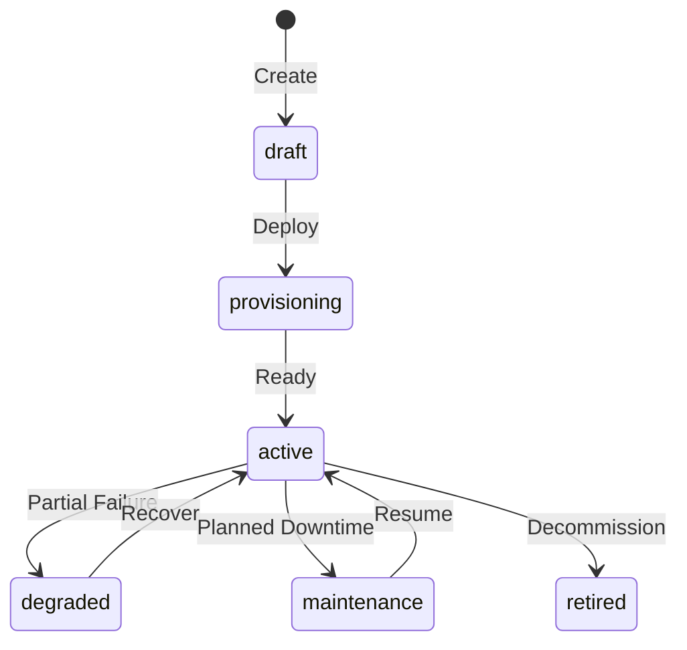

> [!FROZEN]
> **MPLP Protocol v1.0.0 — Frozen Specification**
> **Freeze Date**: 2025-12-03
> **Status**: FROZEN (no breaking changes permitted)
> **Governance**: MPLP Protocol Governance Committee (MPGC)
> **License**: Apache-2.0
> **Note**: Any normative change requires a new protocol version.

# Network Module

## 1. Purpose

The **Network Module** defines the topology and node collection for multi-agent collaboration networks. It describes how agents are organized, connected, and communicate in distributed MPLP deployments.

**Design Principle**: "Explicit topology for predictable communication patterns"

## 2. Canonical Schema

**From**: `schemas/v2/mplp-network.schema.json`

### 2.1 Required Fields

| Field | Type | Description |
|:---|:---|:---|
| **`meta`** | Object | Protocol metadata |
| **`network_id`** | UUID v4 | Global unique identifier |
| **`context_id`** | UUID v4 | Link to parent Context |
| **`name`** | String (min 1 char) | Network name |
| **`topology_type`** | Enum | Network topology |
| **`status`** | Enum | Network lifecycle status |

### 2.2 Optional Fields

| Field | Type | Description |
|:---|:---|:---|
| `description` | String | Network description |
| `nodes` | Array | Collection of network nodes |
| `trace` | Object | Audit trace reference |
| `events` | Array | Network lifecycle events |
| `governance` | Object | Lifecycle phase and locking |

### 2.3 The `Node` Object

**Required**: `node_id`, `kind`, `status`

| Field | Type | Description |
|:---|:---|:---|
| **`node_id`** | UUID v4 | Node identifier |
| **`kind`** | Enum | Node type classification |
| **`status`** | Enum | Node status |
| `name` | String | Node name |
| `role_id` | String | Bound Role (from Role module) |

**Kind Enum**: `["agent", "service", "database", "queue", "external", "other"]`

**Status Enum**: `["active", "inactive", "degraded", "unreachable", "retired"]`

## 3. Topology Types

**From schema**: `["single_node", "hub_spoke", "mesh", "hierarchical", "hybrid", "other"]`

### 3.1 Topology Descriptions

| Topology | Description | Use Case |
|:---|:---|:---|
| **single_node** | Single agent instance | Simple SA profile |
| **hub_spoke** | Central hub with satellite nodes | Orchestrated collaboration |
| **mesh** | Fully connected peer-to-peer | Swarm collaboration |
| **hierarchical** | Tree structure with levels | Enterprise deployment |
| **hybrid** | Mixed topology | Complex scenarios |
| **other** | Custom topology | Special requirements |

### 3.2 Topology Diagrams

**Hub-Spoke** (orchestrated mode):
```  Hub          
   ode? ode? ode? A  B  C    
```

**Mesh** (swarm mode):
```  A  B                 C D   
```

## 4. Lifecycle State Machine

### 4.1 Network Status

**From schema**: `["draft", "provisioning", "active", "degraded", "maintenance", "retired"]`



### 4.2 Status Semantics

| Status | Operational | Description |
|:---|:---:|:---|
| **draft** | No | Configuration in progress |
| **provisioning** | No | Nodes being deployed |
| **active** | Yes | All nodes operational |
| **degraded** |  Partial | Some nodes offline |
| **maintenance** | No | Planned downtime |
| **retired** | No | Decommissioned |

### 4.3 Node Status

**From schema**: `["active", "inactive", "degraded", "unreachable", "retired"]`

| Status | Description |
|:---|:---|
| **active** | Node is operational |
| **inactive** | Node is offline |
| **degraded** | Node has reduced capacity |
| **unreachable** | Cannot connect to node |
| **retired** | Node decommissioned |

## 5. Node Kind Types

**From schema**: `["agent", "service", "database", "queue", "external", "other"]`

### 5.1 Kind Descriptions

| Kind | Description | Examples |
|:---|:---|:---|
| **agent** | MPLP Agent node | Coder, Reviewer, Orchestrator |
| **service** | Backend service | API service, Gateway |
| **database** | Data storage | PostgreSQL, Redis |
| **queue** | Message queue | Kafka, RabbitMQ |
| **external** | External system | Third-party API |
| **other** | Other node types | Custom infrastructure |

### 5.2 Node Configuration

```json
{
  "node_id": "node-550e8400-e29b-41d4-a716-446655440001",
  "kind": "agent",
  "name": "Coder Agent A",
  "status": "active",
  "role_id": "role-coder-001"
}
```

## 6. SDK Examples

> [!NOTE]
> The Network module is not yet included in the official SDK packages (`sdk-ts`, `sdk-py`). The following examples demonstrate schema-compliant usage patterns for reference implementations.

### 6.1 TypeScript (Reference)

```typescript
import { v4 as uuidv4 } from 'uuid';

type TopologyType = 'single_node' | 'hub_spoke' | 'mesh' | 'hierarchical' | 'hybrid' | 'other';
type NetworkStatus = 'draft' | 'provisioning' | 'active' | 'degraded' | 'maintenance' | 'retired';
type NodeKind = 'agent' | 'service' | 'database' | 'queue' | 'external' | 'other';
type NodeStatus = 'active' | 'inactive' | 'degraded' | 'unreachable' | 'retired';

interface NetworkNode {
  node_id: string;
  kind: NodeKind;
  status: NodeStatus;
  name?: string;
  role_id?: string;
}

interface Network {
  meta: { protocolVersion: string };
  network_id: string;
  context_id: string;
  name: string;
  description?: string;
  topology_type: TopologyType;
  status: NetworkStatus;
  nodes?: NetworkNode[];
}

function createNetwork(
  context_id: string,
  name: string,
  topology: TopologyType
): Network {
  return {
    meta: { protocolVersion: '1.0.0' },
    network_id: uuidv4(),
    context_id,
    name,
    topology_type: topology,
    status: 'draft',
    nodes: []
  };
}

function addNode(network: Network, kind: NodeKind, name?: string, role_id?: string): void {
  network.nodes = network.nodes || [];
  network.nodes.push({
    node_id: uuidv4(),
    kind,
    status: 'active',
    name,
    role_id
  });
}
```

### 6.2 Python (Reference)

```python
from pydantic import BaseModel, Field
from uuid import uuid4
from typing import List, Optional
from enum import Enum

class TopologyType(str, Enum):
    SINGLE_NODE = 'single_node'
    HUB_SPOKE = 'hub_spoke'
    MESH = 'mesh'
    HIERARCHICAL = 'hierarchical'
    HYBRID = 'hybrid'
    OTHER = 'other'

class NetworkStatus(str, Enum):
    DRAFT = 'draft'
    PROVISIONING = 'provisioning'
    ACTIVE = 'active'
    DEGRADED = 'degraded'
    MAINTENANCE = 'maintenance'
    RETIRED = 'retired'

class NodeKind(str, Enum):
    AGENT = 'agent'
    SERVICE = 'service'
    DATABASE = 'database'
    QUEUE = 'queue'
    EXTERNAL = 'external'
    OTHER = 'other'

class NodeStatus(str, Enum):
    ACTIVE = 'active'
    INACTIVE = 'inactive'
    DEGRADED = 'degraded'
    UNREACHABLE = 'unreachable'
    RETIRED = 'retired'

class NetworkNode(BaseModel):
    node_id: str = Field(default_factory=lambda: str(uuid4()))
    kind: NodeKind
    status: NodeStatus = NodeStatus.ACTIVE
    name: Optional[str] = None
    role_id: Optional[str] = None

class Network(BaseModel):
    network_id: str = Field(default_factory=lambda: str(uuid4()))
    context_id: str
    name: str = Field(..., min_length=1)
    description: Optional[str] = None
    topology_type: TopologyType
    status: NetworkStatus = NetworkStatus.DRAFT
    nodes: List[NetworkNode] = []

# Usage
network = Network(
    context_id='ctx-123',
    name='Production Agent Network',
    topology_type=TopologyType.HUB_SPOKE
)
network.nodes.append(NetworkNode(kind=NodeKind.AGENT, name='Coder'))
```

## 7. Complete JSON Example

```json
{
  "meta": {
    "protocolVersion": "1.0.0",
    "source": "mplp-runtime"
  },
  "network_id": "network-550e8400-e29b-41d4-a716-446655440008",
  "context_id": "ctx-550e8400-e29b-41d4-a716-446655440000",
  "name": "Production Multi-Agent Network",
  "description": "Hub-spoke network for orchestrated code review workflow",
  "topology_type": "hub_spoke",
  "status": "active",
  "nodes": [
    {
      "node_id": "node-hub-001",
      "kind": "agent",
      "name": "Orchestrator Hub",
      "status": "active",
      "role_id": "role-orchestrator-001"
    },
    {
      "node_id": "node-coder-001",
      "kind": "agent",
      "name": "Coder Agent",
      "status": "active",
      "role_id": "role-coder-001"
    },
    {
      "node_id": "node-db-001",
      "kind": "database",
      "name": "PSG Store",
      "status": "active"
    }
  ]
}
```

**Schemas**:
- `schemas/v2/mplp-network.schema.json`

## 8. Related Documents

**Architecture**:
- [L4 Integration Infrastructure](../01-architecture/l4-integration-infra.md)

**Modules**:
- [Context Module](context-module.md)
- [Role Module](role-module.md)
- [Collab Module](collab-module.md)

---

**Document Status**: Normative (L2 Optional Module)  
**Required Fields**: meta, network_id, context_id, name, topology_type, status  
**Topologies**: single_node, hub_spoke, mesh, hierarchical, hybrid, other  
**Status Enum**: draft provisioning active degraded/maintenance retired