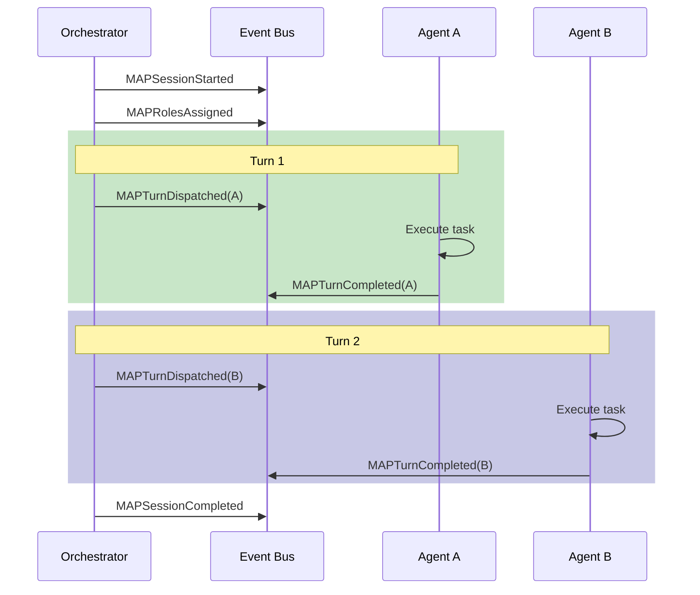
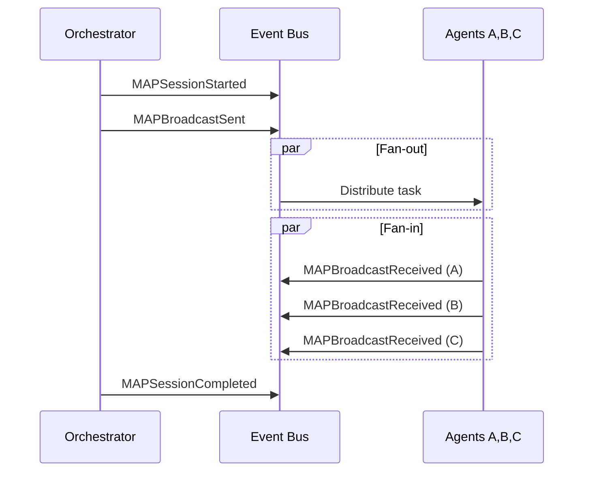

---
title: Map Events
description: MAP Events specification for Multi-Agent Profile. Defines mandatory and recommended events for observability, turn tracking, and conflict resolution in multi-agent collaboration.
keywords: [MAP Events, multi-agent events, MAPSessionStarted, MAPTurnDispatched, MAPConflictDetected, event schema, collaboration tracking]
sidebar_label: Map Events
---
> [!FROZEN]
> **MPLP Protocol v1.0.0  Frozen Specification**
> **Freeze Date**: 2025-12-03
> **Status**: FROZEN (no breaking changes permitted)
> **Governance**: MPLP Protocol Governance Committee (MPGC)
> **License**: Apache-2.0
> **Note**: Any normative change requires a new protocol version.

# MAP Events Specification

## 1. Purpose

This document specifies the **mandatory and recommended events** for the Multi-Agent (MAP) Profile. These events enable observability, turn tracking, and conflict resolution in multi-agent collaboration.

## 2. Event Families in Scope

The MAP Profile utilizes the following Event Families:

| Family | Usage | Primary Events |
|:---|:---|:---|
| `GraphUpdateEvent` | Session state | `MAPSessionStarted`, `MAPSessionCompleted` |
| `RuntimeExecutionEvent` | Turn flow | `MAPTurnDispatched`, `MAPTurnCompleted` |
| `CommunicationEvent` | Broadcasting | `MAPBroadcastSent`, `MAPBroadcastReceived` |
| `ConflictEvent` | State reconciliation | `MAPConflictDetected`, `MAPConflictResolved` |

## 3. Mandatory Events (Normative)

**Requirement Level**: MUST emit

### 3.1 Event Matrix

| Phase | Trigger | Event Type | Required Fields |
|:---|:---|:---|:---|
| Initialize | Session created | `MAPSessionStarted` | `session_id`, `mode`, `participant_count` |
| Assign | Roles assigned | `MAPRolesAssigned` | `session_id`, `assignments[]` |
| Dispatch | Turn issued | `MAPTurnDispatched` | `session_id`, `role_id`, `turn_number` |
| Execute | Turn done | `MAPTurnCompleted` | `session_id`, `role_id`, `status` |
| Complete | Session ends | `MAPSessionCompleted` | `session_id`, `status`, `turns_total` |

### 3.2 Event Flow by Mode

#### Orchestrated Mode



#### Broadcast Mode



## 4. Recommended Events (Normative - SHOULD)

**Requirement Level**: SHOULD emit

| Scenario | Event Type | Rationale |
|:---|:---|:---|
| Fan-out | `MAPBroadcastSent` | Track distribution |
| Fan-in | `MAPBroadcastReceived` | Track responses |
| Concurrent write | `MAPConflictDetected` | State integrity |
| Resolution | `MAPConflictResolved` | Audit trail |
| Handoff | `MAPHandoffInitiated` | Agent transitions |

## 5. Event Schemas

### 5.1 MAPSessionStarted

```json
{
  "event_type": "MAPSessionStarted",
  "event_family": "GraphUpdateEvent",
  "session_id": "collab-550e8400-e29b-41d4-a716-446655440003",
  "timestamp": "2025-12-07T00:00:00.000Z",
  "payload": {
    "mode": "orchestrated",
    "participant_count": 4,
    "context_id": "ctx-550e8400",
    "purpose": "Code review pipeline"
  }
}
```

### 5.2 MAPRolesAssigned

```json
{
  "event_type": "MAPRolesAssigned",
  "event_family": "GraphUpdateEvent",
  "session_id": "collab-550e8400",
  "timestamp": "2025-12-07T00:00:01.000Z",
  "payload": {
    "assignments": [
      { "participant_id": "p1", "role_id": "role-orchestrator", "kind": "agent" },
      { "participant_id": "p2", "role_id": "role-coder", "kind": "agent" },
      { "participant_id": "p3", "role_id": "role-reviewer", "kind": "agent" },
      { "participant_id": "p4", "role_id": "role-human", "kind": "human" }
    ]
  }
}
```

### 5.3 MAPTurnDispatched

```json
{
  "event_type": "MAPTurnDispatched",
  "event_family": "RuntimeExecutionEvent",
  "session_id": "collab-550e8400",
  "timestamp": "2025-12-07T00:00:02.000Z",
  "initiator_role": "role-orchestrator",
  "target_roles": ["role-coder"],
  "payload": {
    "role_id": "role-coder",
    "turn_number": 1,
    "token_id": "token-uuid-001",
    "task": "Implement authentication module"
  }
}
```

### 5.4 MAPTurnCompleted

```json
{
  "event_type": "MAPTurnCompleted",
  "event_family": "RuntimeExecutionEvent",
  "session_id": "collab-550e8400",
  "timestamp": "2025-12-07T00:05:00.000Z",
  "payload": {
    "role_id": "role-coder",
    "turn_number": 1,
    "status": "completed",
    "duration_ms": 298000,
    "output_summary": "Implemented JWT authentication in auth/token.ts"
  }
}
```

### 5.5 MAPBroadcastSent

```json
{
  "event_type": "MAPBroadcastSent",
  "event_family": "CommunicationEvent",
  "session_id": "collab-550e8400",
  "timestamp": "2025-12-07T00:00:03.000Z",
  "initiator_role": "role-orchestrator",
  "target_roles": ["role-agent-a", "role-agent-b", "role-agent-c"],
  "payload": {
    "message_type": "task_assignment",
    "message": {
      "task": "Generate solution approaches",
      "deadline_ms": 60000
    }
  }
}
```

### 5.6 MAPBroadcastReceived

```json
{
  "event_type": "MAPBroadcastReceived",
  "event_family": "CommunicationEvent",
  "session_id": "collab-550e8400",
  "timestamp": "2025-12-07T00:00:45.000Z",
  "payload": {
    "receiver_role": "role-agent-a",
    "broadcast_ref": "broadcast-001",
    "response": {
      "approach": "Use JWT with refresh tokens",
      "confidence": 0.85
    }
  }
}
```

### 5.7 MAPConflictDetected

```json
{
  "event_type": "MAPConflictDetected",
  "event_family": "ConflictEvent",
  "session_id": "collab-550e8400",
  "timestamp": "2025-12-07T00:10:00.000Z",
  "payload": {
    "conflict_id": "conflict-001",
    "resource_type": "plan_step",
    "resource_id": "step-123",
    "conflicting_roles": ["role-coder", "role-reviewer"],
    "conflict_type": "concurrent_modification",
    "details": "Both attempted to update step status simultaneously"
  }
}
```

### 5.8 MAPConflictResolved

```json
{
  "event_type": "MAPConflictResolved",
  "event_family": "ConflictEvent",
  "session_id": "collab-550e8400",
  "timestamp": "2025-12-07T00:10:01.000Z",
  "payload": {
    "conflict_id": "conflict-001",
    "resolution_strategy": "hierarchy",
    "winning_role": "role-reviewer",
    "reason": "Reviewer has higher rank"
  }
}
```

### 5.9 MAPSessionCompleted

```json
{
  "event_type": "MAPSessionCompleted",
  "event_family": "GraphUpdateEvent",
  "session_id": "collab-550e8400",
  "timestamp": "2025-12-07T00:30:00.000Z",
  "payload": {
    "status": "completed",
    "participants_count": 4,
    "turns_total": 12,
    "broadcasts_count": 2,
    "conflicts_count": 1,
    "duration_ms": 1800000
  }
}
```

## 6. Module Mapping

| Module | Profile Action | Event Type |
|:---|:---|:---|
| Collab | Session Init | `MAPSessionStarted` |
| Collab | Role Binding | `MAPRolesAssigned` |
| Collab | Turn Handoff | `MAPTurnDispatched`, `MAPTurnCompleted` |
| Network | Broadcast | `MAPBroadcastSent`, `MAPBroadcastReceived` |
| Trace | Conflict | `MAPConflictDetected`, `MAPConflictResolved` |

## 7. Invariant Validation

### 7.1 Turn Completion Matching

**Invariant**: `map_turn_completion_matches_dispatch`

```typescript
function validateTurnCompletion(events: MAPEvent[]): ValidationResult {
  const dispatched = events.filter(e => e.event_type === 'MAPTurnDispatched');
  const completed = events.filter(e => e.event_type === 'MAPTurnCompleted');
  
  const errors: string[] = [];
  
  for (const dispatch of dispatched) {
    const match = completed.find(c => 
      c.session_id === dispatch.session_id &&
      c.payload.role_id === dispatch.payload.role_id &&
      c.payload.turn_number === dispatch.payload.turn_number
    );
    
    if (!match) {
      errors.push(`Turn ${dispatch.payload.turn_number} for ${dispatch.payload.role_id} has no completion`);
    }
  }
  
  return { valid: errors.length === 0, errors };
}
```

### 7.2 Broadcast Receiver Matching

**Invariant**: `map_broadcast_has_receivers`

```typescript
function validateBroadcastReceivers(events: MAPEvent[]): ValidationResult {
  const sent = events.filter(e => e.event_type === 'MAPBroadcastSent');
  const received = events.filter(e => e.event_type === 'MAPBroadcastReceived');
  
  const errors: string[] = [];
  
  for (const broadcast of sent) {
    const receivers = received.filter(r => 
      r.session_id === broadcast.session_id &&
      r.payload.broadcast_ref === broadcast.payload.broadcast_id
    );
    
    if (receivers.length === 0) {
      errors.push(`Broadcast ${broadcast.payload.broadcast_id} has no receivers`);
    }
  }
  
  return { valid: errors.length === 0, errors };
}
```

## 8. Related Documents

**Profiles**:
- [MAP Profile](map-profile.md) - Full profile specification
- [SA Events](sa-events.md) - Single-agent events

**Schemas**:
- `schemas/v2/events/mplp-map-event.schema.json`
- `schemas/v2/events/mplp-event-core.schema.json`

---

**Document Status**: Normative (Event Specification)  
**Profile**: MAP Profile  
**Mandatory Events**: 5  
**Recommended Events**: 5
---

 2025 Bangshi Beijing Network Technology Limited Company
Licensed under the Apache License, Version 2.0.
