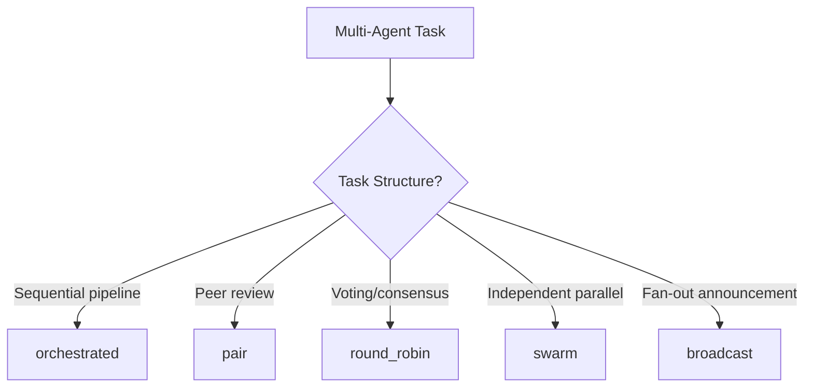
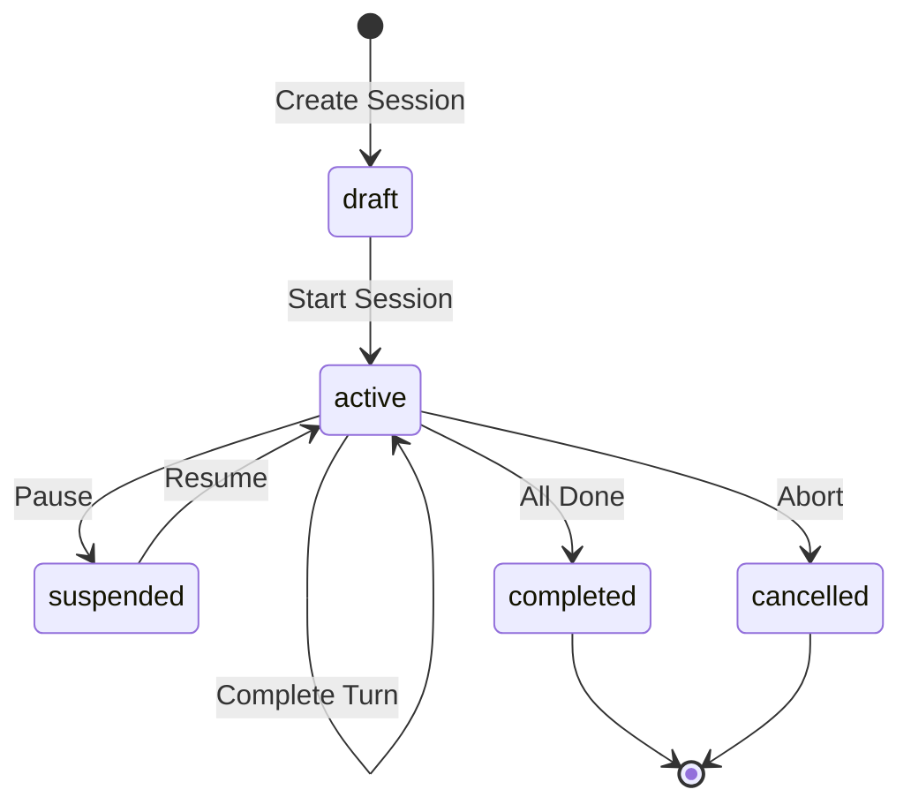
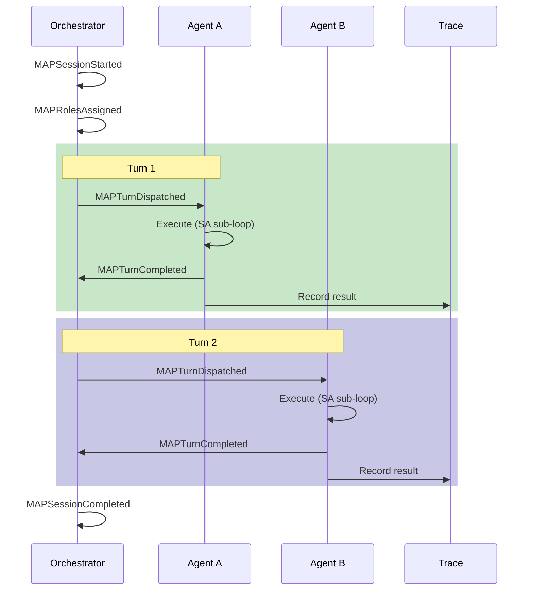
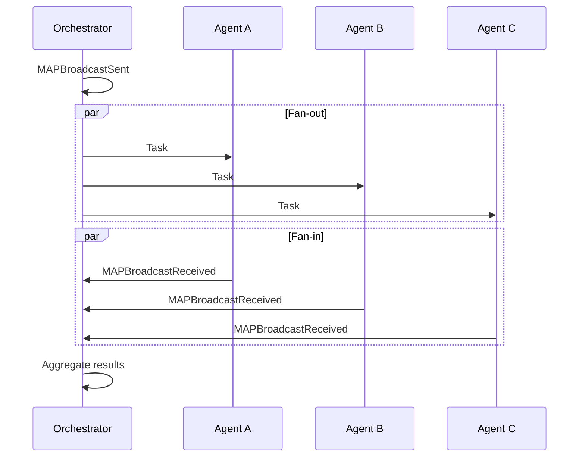

---
title: Map Profile
description: Multi-Agent (MAP) Profile specification extending SA Profile. Introduces coordination mechanisms, turn-taking, and shared state management for complex multi-agent workflows.
keywords: [MPLP, Multi-Agent Lifecycle Protocol, Agent OS Protocol, AI Agent, Observable, Governed, Vendor-neutral, MAP Profile, multi-agent collaboration, coordination modes, orchestrated execution, swarm intelligence, agent profile, MPLP MAP]
sidebar_label: Map Profile
---
> [!FROZEN]
> **MPLP Protocol v1.0.0  Frozen Specification**
> **Freeze Date**: 2025-12-03
> **Status**: FROZEN (no breaking changes permitted)
> **Governance**: MPLP Protocol Governance Committee (MPGC)
> **License**: Apache-2.0
> **Note**: Any normative change requires a new protocol version.

# Multi-Agent (MAP) Profile

## 1. Purpose

The **Multi-Agent (MAP) Profile** extends the SA Profile to support collaboration between multiple agents. It introduces coordination mechanisms, turn-taking, and shared state management for complex workflows.

**Design Principle**: "Explicit coordination, traceable handoffs, conflict-free collaboration"

## 2. Profile Classification

| Attribute | Value |
|:---|:---|
| **Profile ID** | `mplp:profile:map:1.0.0` |
| **Requirement Level** | RECOMMENDED (optional) |
| **Extends** | SA Profile |
| **Extended By** | |

## 3. Required Modules

**All MAP-conformant runtimes MUST implement**:

| Module | Requirement | Usage |
|:---|:---:|:---|
| All SA Modules | REQUIRED | Context, Plan, Trace, Role, Core |
| [Collab](../02-modules/collab-module.md) | REQUIRED | Session and turn management |
| [Dialog](../02-modules/dialog-module.md) | REQUIRED | Inter-agent communication |
| [Network](../02-modules/network-module.md) | REQUIRED | Agent topology |

## 4. Coordination Modes

**From**: `schemas/v2/mplp-collab.schema.json`

### 4.1 Mode Descriptions

| Mode | Pattern | Use Case |
|:---|:---|:---|
| **broadcast** | One-to-many fan-out | Announcements, swarm tasks |
| **round_robin** | Sequential turns | Structured reviews |
| **orchestrated** | Central controller | Complex pipelines |
| **swarm** | Self-organizing parallel | Independent subtasks |
| **pair** | Two-agent direct | Code review, debugging |

### 4.2 Mode Selection



### 4.3 Mode Examples

**Orchestrated (Software Development)**:
```
Orchestrator
    > Architect (design)
    > Coder (implement)
    > Tester (test)
    > Reviewer (review)
```

**Pair (Code Review)**:
```
Coder <> Reviewer
```

**Swarm (Research)**:
```
Task: "Find solutions"
    > Agent A (approach 1)
    > Agent B (approach 2)
    > Agent C (approach 3)
```

## 5. Invariants

**From**: `schemas/v2/invariants/map-invariants.yaml`

### 5.1 Session Structure

| ID | Rule | Description |
|:---|:---|:---|
| `map_session_requires_multiple_participants` | `participants.length >= 2` | At least 2 participants |
| `map_collab_mode_valid` | mode enum | Valid mode required |
| `map_session_id_is_uuid` | `collab_id` is UUID v4 | Valid session ID |
| `map_participants_have_role_ids` | `participants[*].role_id` non-empty | All have roles |

### 5.2 Participant Validation

| ID | Rule | Description |
|:---|:---|:---|
| `map_role_ids_are_uuids` | `role_id` is UUID v4 | Valid role references |
| `map_participant_ids_are_non_empty` | `participant_id` non-empty | Valid IDs |
| `map_participant_kind_valid` | kind enum | Valid participant type |

### 5.3 Event Consistency

| ID | Rule | Description |
|:---|:---|:---|
| `map_turn_completion_matches_dispatch` | Dispatch Complete pair | Turn tracking |
| `map_broadcast_has_receivers` | Sent Received pair | Broadcast tracking |

### 5.4 Validation Code

```typescript
function validateMAPProfile(session: Collab): ValidationResult {
  const errors: string[] = [];
  
  // Session structure
  if (!session.participants || session.participants.length < 2) {
    errors.push('map_session_requires_multiple_participants: Need  participants');
  }
  
  // Mode validation
  const validModes = ['broadcast', 'round_robin', 'orchestrated', 'swarm', 'pair'];
  if (!validModes.includes(session.mode)) {
    errors.push(`map_collab_mode_valid: Invalid mode ${session.mode}`);
  }
  
  // Participant validation
  for (const p of session.participants || []) {
    if (!p.role_id) {
      errors.push(`map_participants_have_role_ids: ${p.participant_id} missing role`);
    }
    const validKinds = ['agent', 'human', 'system', 'external'];
    if (!validKinds.includes(p.kind)) {
      errors.push(`map_participant_kind_valid: ${p.participant_id} invalid kind`);
    }
  }
  
  return { valid: errors.length === 0, errors };
}
```

## 6. Execution Lifecycle

### 6.1 Session State Machine



### 6.2 Turn-Taking Flow (Orchestrated)



### 6.3 Broadcast Flow



## 7. Mandatory Events

**From**: `schemas/v2/events/mplp-map-event.schema.json`

### 7.1 Event Table

| Phase | Event Type | Required Fields |
|:---|:---|:---|
| Initialize | `MAPSessionStarted` | `session_id`, `mode`, `participant_count` |
| Assign | `MAPRolesAssigned` | `session_id`, `assignments[]` |
| Dispatch | `MAPTurnDispatched` | `session_id`, `role_id`, `turn_number` |
| Complete | `MAPTurnCompleted` | `session_id`, `role_id`, `status` |
| End | `MAPSessionCompleted` | `session_id`, `status`, `turns_total` |

### 7.2 Recommended Events

| Scenario | Event Type | Rationale |
|:---|:---|:---|
| Broadcast | `MAPBroadcastSent` | Fan-out tracking |
| Broadcast | `MAPBroadcastReceived` | Fan-in tracking |
| Conflict | `MAPConflictDetected` | State integrity |
| Conflict | `MAPConflictResolved` | Audit trail |

### 7.3 Event Examples

**MAPTurnDispatched**:
```json
{
  "event_type": "MAPTurnDispatched",
  "event_family": "RuntimeExecutionEvent",
  "session_id": "collab-550e8400",
  "timestamp": "2025-12-07T00:00:02.000Z",
  "initiator_role": "orchestrator-001",
  "target_roles": ["coder-001"],
  "payload": {
    "role_id": "coder-001",
    "turn_number": 2,
    "task": "Implement authentication module"
  }
}
```

**MAPSessionCompleted**:
```json
{
  "event_type": "MAPSessionCompleted",
  "event_family": "GraphUpdateEvent",
  "session_id": "collab-550e8400",
  "timestamp": "2025-12-07T00:30:00.000Z",
  "payload": {
    "status": "completed",
    "participants_count": 4,
    "turns_total": 12,
    "duration_ms": 1800000
  }
}
```

## 8. Governance Rules

### 8.1 Turn Token Management

**Only the agent holding the turn token can modify shared state**:

```typescript
interface TurnToken {
  token_id: string;
  session_id: string;
  holder_role: string;
  acquired_at: string;
  expires_at?: string;
}

function canModifyState(session: Collab, role_id: string, token: TurnToken): boolean {
  // In orchestrated/round_robin, only token holder can modify
  if (['orchestrated', 'round_robin'].includes(session.mode)) {
    return token.holder_role === role_id;
  }
  // In swarm/pair, concurrent modification allowed
  return true;
}
```

### 8.2 Conflict Resolution

When concurrent modifications occur:

1. **Last-Write-Wins (LWW)**: Latest timestamp wins
2. **Hierarchy**: Higher-rank role wins
3. **Voting**: Majority vote
4. **Escalation**: Human decision

## 9. Usage Scenarios

### 9.1 Software Development Pipeline

```
Orchestrator 
     Phase 1: Design    Architect (design system) 
     Phase 2: Implementation    Coder A (frontend)    Coder B (backend) 
     Phase 3: Testing    Tester (run tests) 
     Phase 4: Review
         Reviewer (code review)
```

### 9.2 Debate Pattern

```
Proposer     Moderator?   
Opponent 
```

### 9.3 Research Swarm

```
Task: "Explore solution space"       
   A1  A2  A3  A4  A5  (parallel exploration)        
       Aggregator
```

## 10. SDK Examples

### 10.1 TypeScript

```typescript
async function runMAPSession(
  context_id: string,
  mode: CollabMode,
  participants: Participant[]
): Promise<void> {
  // Create session
  const session: Collab = {
    meta: { protocolVersion: '1.0.0' },
    collab_id: uuidv4(),
    context_id,
    title: 'Code Review Session',
    purpose: 'Review authentication changes',
    mode,
    status: 'draft',
    participants,
    created_at: new Date().toISOString()
  };
  
  // Validate MAP invariants
  const validation = validateMAPProfile(session);
  if (!validation.valid) {
    throw new Error(`MAP validation failed: ${validation.errors.join(', ')}`);
  }
  
  // Start session
  session.status = 'active';
  await emit({ event_type: 'MAPSessionStarted', session_id: session.collab_id, mode });
  await emit({ event_type: 'MAPRolesAssigned', session_id: session.collab_id, assignments: participants });
  
  // Execute based on mode
  if (mode === 'orchestrated') {
    await runOrchestratedSession(session);
  } else if (mode === 'round_robin') {
    await runRoundRobinSession(session);
  } else if (mode === 'broadcast') {
    await runBroadcastSession(session);
  }
  
  // Complete
  session.status = 'completed';
  await emit({ event_type: 'MAPSessionCompleted', session_id: session.collab_id });
}
```

## 11. Related Documents

**Architecture**:
- [L2 Coordination & Governance](../01-architecture/l2-coordination-governance.md)
- [Coordination](../01-architecture/cross-cutting-kernel-duties/coordination.md)

**Profiles**:
- [SA Profile](sa-profile.md) - Base profile
- [MAP Events](map-events.md) - Event details
- [MAP Governance](multi-agent-governance-profile.md) - Governance rules

**Invariants**:
- `schemas/v2/invariants/map-invariants.yaml`

---

**Document Status**: Normative (Optional Profile)  
**Profile ID**: `mplp:profile:map:1.0.0`  
**Required Modules**: SA modules + Collab, Dialog, Network  
**Invariant Count**: 9 normative rules  
**Coordination Modes**: broadcast, round_robin, orchestrated, swarm, pair
---

 2025 Bangshi Beijing Network Technology Limited Company
Licensed under the Apache License, Version 2.0.
