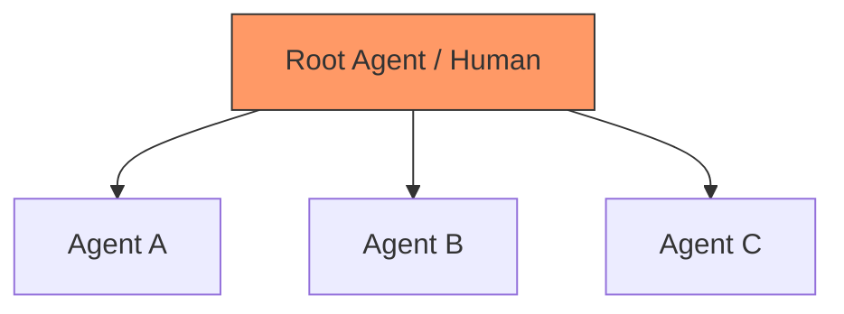
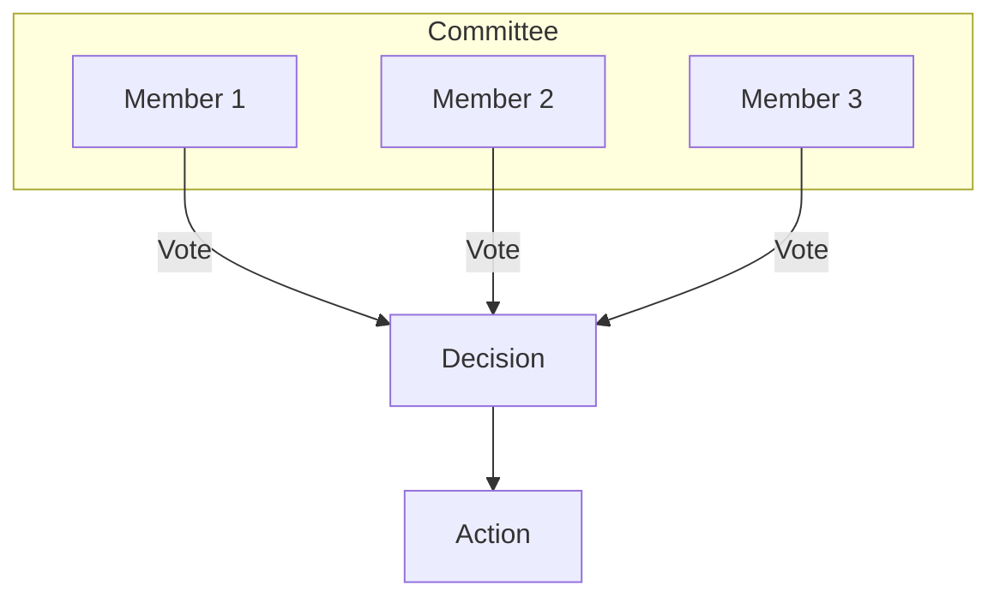
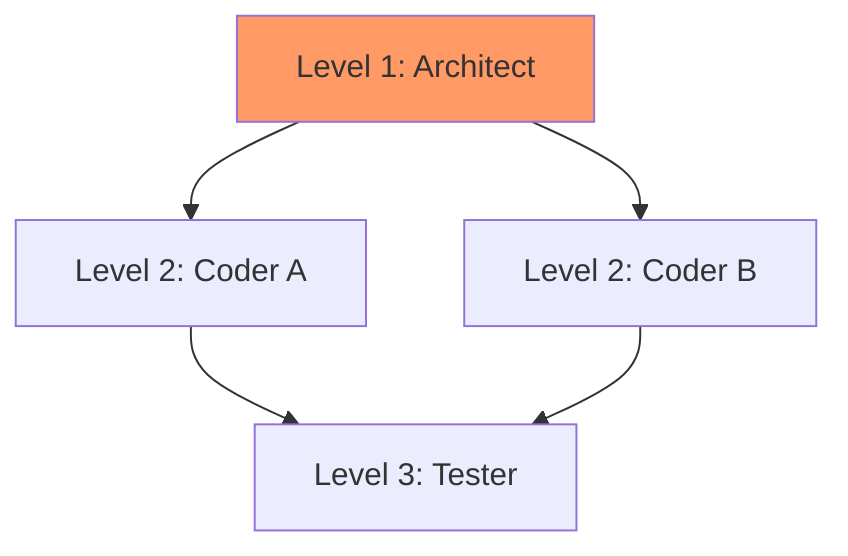
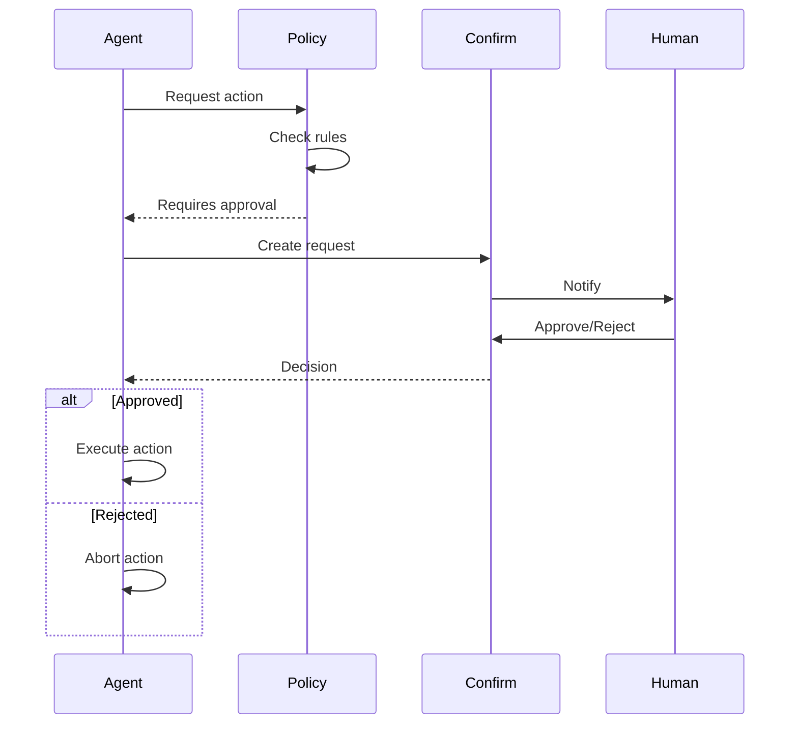

> [!FROZEN]
> **MPLP Protocol v1.0.0 — Frozen Specification**
> **Freeze Date**: 2025-12-03
> **Status**: FROZEN (no breaking changes permitted)
> **Governance**: MPLP Protocol Governance Committee (MPGC)
> **License**: Apache-2.0
> **Note**: Any normative change requires a new protocol version.

# Multi-Agent Governance Profile

## 1. Purpose

The **Multi-Agent Governance Profile** defines rules and mechanisms for maintaining order, safety, and alignment in multi-agent systems. It addresses the risks of "agent swarms" by imposing structural constraints on their interactions.

**Design Principle**: "Explicit authority, enforced boundaries, human oversight"

## 2. Governance Models

MPLP supports multiple governance models:

### 2.1 Model Comparison

| Model | Authority | Decision Process | Use Case |
|:---|:---|:---|:---|
| **Centralized** | Single root agent/human | Absolute authority | High-security tasks |
| **Federated** | Committee of agents | Consensus voting | Complex decisions |
| **Hierarchical** | Role-based ranks | Escalation chain | Enterprise workflows |
| **Autonomous** | Self-governing swarm | Emergent consensus | Research exploration |

### 2.2 Centralized (Dictator)



**Rules**:
- Single "Root Agent" or Human has absolute authority
- All plans MUST be approved by root
- No lateral communication without root permission

### 2.3 Federated (Committee)



**Rules**:
- Decisions require consensus (e.g., 2/3 majority)
- All committee members have equal vote weight
- Deadlock escalates to human

### 2.4 Hierarchical



**Rules**:
- Higher rank overrides lower rank
- Escalation follows hierarchy
- Scope limited by level

## 3. Conflict Resolution

### 3.1 Resolution Strategies

When agents disagree (e.g., Agent A wants to delete a file, Agent B wants to keep it):

| Strategy | Mechanism | Priority |
|:---|:---|:---|
| **Hierarchy** | Higher-rank role wins | 1 (default) |
| **Voting** | Majority vote wins | 2 |
| **Timestamp** | Last-write-wins (LWW) | 3 |
| **Escalation** | Human decides | 4 (fallback) |

### 3.2 Conflict Resolution Flow

```mermaid
flowchart TD
    A[Conflict Detected] --> B{Same Rank?}
    B -->|No| C[Higher Rank Wins]
    B -->|Yes| D{Policy Allows Voting?}
    D -->|Yes| E[Voting]
    D -->|No| F{LWW Enabled?}
    F -->|Yes| G[Latest Timestamp Wins]
    F -->|No| H[Escalate to Human]
    E --> I{Majority?}
    I -->|Yes| J[Apply Winner]
    I -->|No (Tie)| H
```

### 3.3 Implementation

```typescript
type ResolutionStrategy = 'hierarchy' | 'voting' | 'lww' | 'escalation';

interface Conflict {
  conflict_id: string;
  resource_type: string;
  resource_id: string;
  conflicting_roles: string[];
  proposed_values: Record<string, any>;
}

async function resolveConflict(
  conflict: Conflict,
  session: Collab,
  strategy: ResolutionStrategy
): Promise<string> {
  switch (strategy) {
    case 'hierarchy':
      return resolveByHierarchy(conflict, session);
    case 'voting':
      return resolveByVoting(conflict, session);
    case 'lww':
      return resolveByTimestamp(conflict);
    case 'escalation':
      return await escalateToHuman(conflict);
  }
}

function resolveByHierarchy(conflict: Conflict, session: Collab): string {
  // Get role ranks from Role module
  let highestRank = -1;
  let winner = '';
  
  for (const role_id of conflict.conflicting_roles) {
    const role = getRoleById(role_id);
    const rank = getRoleRank(role);
    if (rank > highestRank) {
      highestRank = rank;
      winner = role_id;
    }
  }
  
  return winner;
}
```

## 4. Policy Enforcement

### 4.1 Policy Types

| Policy Type | Description | Enforcement |
|:---|:---|:---|
| **Resource Limits** | Max tokens, steps, cost | Runtime check |
| **Tool Whitelists** | Allowed tools | Pre-execution |
| **Human Gates** | Required approvals | Confirm module |
| **Scope Limits** | File/directory access | Pre-execution |

### 4.2 Policy Schema

```json
{
  "policy_id": "policy-safety-001",
  "name": "Production Safety Policy",
  "rules": [
    {
      "rule_id": "max_tokens",
      "type": "resource_limit",
      "resource": "tokens",
      "max_value": 100000,
      "scope": "session"
    },
    {
      "rule_id": "no_delete",
      "type": "tool_whitelist",
      "action": "block",
      "tools": ["rm", "del", "rmdir"],
      "exception": "requires_confirm"
    },
    {
      "rule_id": "human_gate_deploy",
      "type": "human_gate",
      "trigger": "action.type == 'deploy'",
      "action": "require_confirm"
    }
  ]
}
```

### 4.3 Policy Enforcement Code

```typescript
interface PolicyRule {
  rule_id: string;
  type: 'resource_limit' | 'tool_whitelist' | 'human_gate' | 'scope_limit';
  action: 'allow' | 'block' | 'require_confirm';
}

async function enforcePolicy(
  action: AgentAction,
  policies: Policy[]
): Promise<PolicyResult> {
  for (const policy of policies) {
    for (const rule of policy.rules) {
      const result = await checkRule(action, rule);
      
      if (result.blocked) {
        return {
          allowed: false,
          rule_id: rule.rule_id,
          reason: result.reason
        };
      }
      
      if (result.requires_confirm) {
        const confirm = await createConfirm({
          target_type: 'extension',
          target_id: action.action_id,
          reason: `Policy ${rule.rule_id} requires approval`
        });
        
        const decision = await waitForDecision(confirm.confirm_id);
        if (decision.status !== 'approved') {
          return { allowed: false, rule_id: rule.rule_id, reason: 'User rejected' };
        }
      }
    }
  }
  
  return { allowed: true };
}
```

## 5. Human-in-the-Loop (HITL)

### 5.1 HITL Triggers

| Trigger | Condition | Action |
|:---|:---|:---|
| **High-Risk Action** | Destructive operations | Block + Confirm |
| **Budget Exceeded** | Cost > threshold | Pause + Notify |
| **Conflict Deadlock** | No resolution | Escalate |
| **Policy Violation** | Rule triggered | Block + Confirm |

### 5.2 HITL Flow



## 6. Safety Examples

### 6.1 Destructive Operation Blocking

**Policy**: "No file deletion without Human Approval"

```yaml
- rule_id: no_delete_without_approval
  type: tool_whitelist
  tools: ["rm", "del", "rmdir", "shutil.rmtree"]
  action: require_confirm
  message: "Destructive operation requires human approval"
```

**Scenario**:
1. Agent A proposes deleting `main.py`
2. Runtime detects `rm` tool usage
3. Policy blocks execution
4. Confirm request created
5. User approves/rejects
6. Agent proceeds or aborts

### 6.2 Budget Enforcement

**Policy**: "Max $50/day spending"

```yaml
- rule_id: daily_budget
  type: resource_limit
  resource: cost_usd
  max_value: 50.00
  period: daily
  on_exceed: suspend
```

**Scenario**:
1. Agent executes LLM calls
2. CostAndBudgetEvent tracks spending
3. Cost reaches $50
4. Runtime suspends execution
5. Human notified

## 7. Related Documents

**Profiles**:
- [MAP Profile](map-profile.md) - Base multi-agent profile
- [SA Profile](sa-profile.md) - Single-agent base

**Cross-Cutting**:
- [Security](../01-architecture/cross-cutting-kernel-duties/security.md) - Security controls
- [Coordination](../01-architecture/cross-cutting-kernel-duties/coordination.md) - Collaboration modes

**Modules**:
- [Confirm Module](../02-modules/confirm-module.md) - Approval workflow
- [Role Module](../02-modules/role-module.md) - Permission model

---

**Document Status**: Normative (Governance Profile)  
**Governance Models**: Centralized, Federated, Hierarchical, Autonomous  
**Conflict Strategies**: Hierarchy, Voting, LWW, Escalation  
**Policy Types**: Resource Limits, Tool Whitelists, Human Gates, Scope Limits