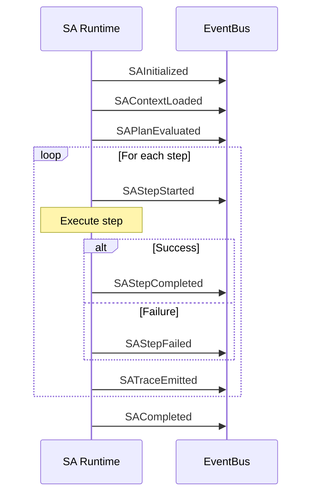

> [!FROZEN]
> **MPLP Protocol v1.0.0 — Frozen Specification**
> **Freeze Date**: 2025-12-03
> **Status**: FROZEN (no breaking changes permitted)
> **Governance**: MPLP Protocol Governance Committee (MPGC)
> **License**: Apache-2.0
> **Note**: Any normative change requires a new protocol version.

# SA Events Specification

## 1. Purpose

This document specifies the **mandatory and recommended events** for the Single-Agent (SA) Profile. These events enable observability, debugging, and learning sample extraction.

## 2. Event Families in Scope

The SA Profile utilizes the following Event Families:

| Family | Usage | Primary Events |
|:---|:---|:---|
| `RuntimeExecutionEvent` | SA lifecycle | `SAInitialized`, `SAStepStarted`, etc. |
| `GraphUpdateEvent` | State changes | Plan/Context status updates |
| `TraceEvent` | Trace emission | `SATraceEmitted` |
| `CostAndBudgetEvent` | Resource tracking | Token usage, cost |

## 3. Mandatory Events (Normative)

**Requirement Level**: MUST emit

### 3.1 Event Matrix

| Phase | Trigger | Event Type | Required Fields | Schema |
|:---|:---|:---|:---|:---|
| Initialize | SA created | `SAInitialized` | `sa_id`, `timestamp` | [sa-event.schema.json] |
| LoadContext | Context bound | `SAContextLoaded` | `sa_id`, `context_id` | [sa-event.schema.json] |
| EvaluatePlan | Plan parsed | `SAPlanEvaluated` | `sa_id`, `plan_id`, `step_count` | [sa-event.schema.json] |
| ExecuteStep | Step starts | `SAStepStarted` | `sa_id`, `step_id`, `agent_role` | [sa-event.schema.json] |
| ExecuteStep | Step succeeds | `SAStepCompleted` | `sa_id`, `step_id`, `status`, `duration_ms` | [sa-event.schema.json] |
| EmitTrace | Trace written | `SATraceEmitted` | `sa_id`, `trace_id`, `events_written` | [sa-event.schema.json] |
| Complete | SA terminates | `SACompleted` | `sa_id`, `status`, `total_duration_ms` | [sa-event.schema.json] |

### 3.2 Event Lifecycle Flow



## 4. Recommended Events (Normative - SHOULD)

**Requirement Level**: SHOULD emit

| Scenario | Event Type | Rationale |
|:---|:---|:---|
| Step failure | `SAStepFailed` | Debug and retry logic |
| Token usage | `CostAndBudgetEvent` | LLM cost tracking |
| Tool call | `ToolExecutionEvent` | Tool audit trail |
| LLM call | `LLMCallEvent` | Model performance tracking |

## 5. Event Schemas

### 5.1 SAInitialized

```json
{
  "$schema": "https://schemas.mplp.dev/v1.0/events/mplp-sa-event.schema.json",
  "event_type": "SAInitialized",
  "event_family": "RuntimeExecutionEvent",
  "sa_id": "sa-550e8400-e29b-41d4-a716-446655440000",
  "timestamp": "2025-12-07T00:00:00.000Z",
  "payload": {
    "runtime_version": "1.0.0",
    "capabilities": ["code.write", "code.review"]
  }
}
```

### 5.2 SAContextLoaded

```json
{
  "event_type": "SAContextLoaded",
  "event_family": "RuntimeExecutionEvent",
  "sa_id": "sa-550e8400-e29b-41d4-a716-446655440000",
  "timestamp": "2025-12-07T00:00:01.000Z",
  "payload": {
    "context_id": "ctx-550e8400",
    "context_title": "Refactor Auth Service",
    "context_status": "active"
  }
}
```

### 5.3 SAPlanEvaluated

```json
{
  "event_type": "SAPlanEvaluated",
  "event_family": "RuntimeExecutionEvent",
  "sa_id": "sa-550e8400-e29b-41d4-a716-446655440000",
  "timestamp": "2025-12-07T00:00:02.000Z",
  "payload": {
    "plan_id": "plan-550e8400",
    "plan_title": "Fix Login Bug",
    "step_count": 5,
    "execution_order": ["s1", "s2", "s3", "s4", "s5"]
  }
}
```

### 5.4 SAStepStarted

```json
{
  "event_type": "SAStepStarted",
  "event_family": "RuntimeExecutionEvent",
  "sa_id": "sa-550e8400-e29b-41d4-a716-446655440000",
  "timestamp": "2025-12-07T00:00:03.000Z",
  "payload": {
    "step_id": "s1",
    "step_description": "Read error logs",
    "agent_role": "debugger",
    "order_index": 0
  }
}
```

### 5.5 SAStepCompleted

```json
{
  "event_type": "SAStepCompleted",
  "event_family": "RuntimeExecutionEvent",
  "sa_id": "sa-550e8400-e29b-41d4-a716-446655440000",
  "timestamp": "2025-12-07T00:00:05.000Z",
  "payload": {
    "step_id": "s1",
    "status": "completed",
    "duration_ms": 2000,
    "tokens_used": 450,
    "output_summary": "Found NullPointerException in AuthService.java:125"
  }
}
```

### 5.6 SAStepFailed

```json
{
  "event_type": "SAStepFailed",
  "event_family": "RuntimeExecutionEvent",
  "sa_id": "sa-550e8400-e29b-41d4-a716-446655440000",
  "timestamp": "2025-12-07T00:00:05.000Z",
  "payload": {
    "step_id": "s2",
    "status": "failed",
    "error_code": "TOOL_EXECUTION_ERROR",
    "error_message": "Permission denied accessing /var/log/auth.log",
    "retryable": true
  }
}
```

### 5.7 SATraceEmitted

```json
{
  "event_type": "SATraceEmitted",
  "event_family": "TraceEvent",
  "sa_id": "sa-550e8400-e29b-41d4-a716-446655440000",
  "timestamp": "2025-12-07T00:00:10.000Z",
  "payload": {
    "trace_id": "trace-550e8400",
    "events_written": 5,
    "segments_created": 3
  }
}
```

### 5.8 SACompleted

```json
{
  "event_type": "SACompleted",
  "event_family": "RuntimeExecutionEvent",
  "sa_id": "sa-550e8400-e29b-41d4-a716-446655440000",
  "timestamp": "2025-12-07T00:05:00.000Z",
  "payload": {
    "status": "completed",
    "plan_id": "plan-550e8400",
    "steps_executed": 5,
    "steps_succeeded": 5,
    "steps_failed": 0,
    "total_duration_ms": 300000,
    "total_tokens_used": 2500
  }
}
```

## 6. Module Mapping

| Module | Profile Action | Event Type |
|:---|:---|:---|
| Context | Bind Context | `SAContextLoaded` |
| Plan | Evaluate Plan | `SAPlanEvaluated` |
| Plan | Start Step | `SAStepStarted` |
| Plan | Complete Step | `SAStepCompleted` |
| Trace | Write Trace | `SATraceEmitted` |

## 7. Event Processing

### 7.1 Event Handler Pattern

```typescript
interface SAEventHandler {
  handleSAInitialized(event: SAInitialized): Promise<void>;
  handleSAStepCompleted(event: SAStepCompleted): Promise<void>;
  handleSACompleted(event: SACompleted): Promise<void>;
}

class SAEventProcessor implements SAEventHandler {
  async handleSAStepCompleted(event: SAStepCompleted): Promise<void> {
    // Update trace
    await this.trace.addSegment({
      segment_id: uuidv4(),
      label: `Step: ${event.payload.step_id}`,
      status: event.payload.status,
      attributes: {
        duration_ms: event.payload.duration_ms,
        tokens_used: event.payload.tokens_used
      }
    });
    
    // Extract learning sample if applicable
    if (event.payload.status === 'completed') {
      await this.learningCollector.captureStepSample(event);
    }
  }
}
```

## 8. Related Documents

**Profiles**:
- [SA Profile](sa-profile.md) - Full profile specification
- [MAP Events](map-events.md) - Multi-agent events

**Schemas**:
- `schemas/v2/events/mplp-sa-event.schema.json`
- `schemas/v2/events/mplp-event-core.schema.json`

---

**Document Status**: Normative (Event Specification)  
**Profile**: SA Profile  
**Mandatory Events**: 7  
**Recommended Events**: 4