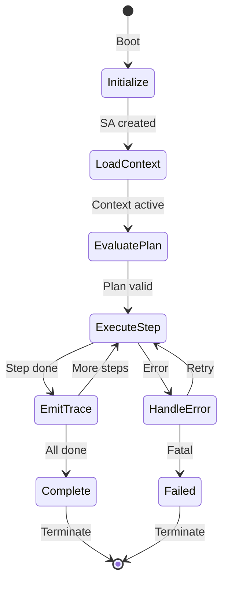
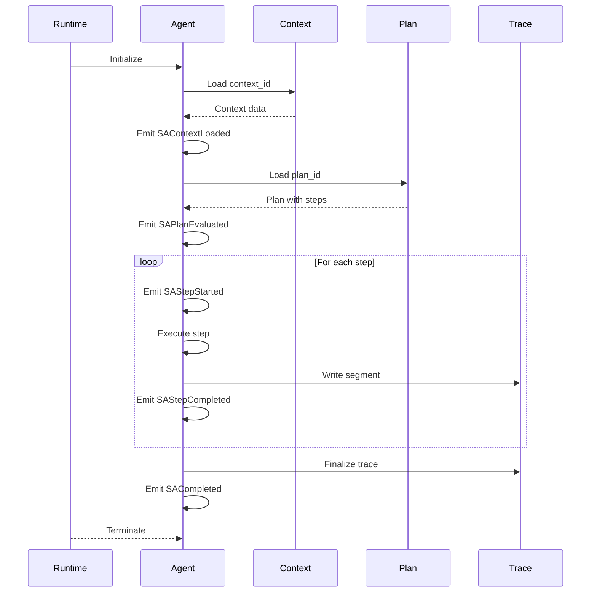

---
title: Sa Profile
description: Single-Agent (SA) Profile specification as the baseline execution mode for MPLP. Defines minimal modules, invariants, and lifecycle for autonomous agents.
keywords: [MPLP, Multi-Agent Lifecycle Protocol, Agent OS Protocol, AI Agent, Observable, Governed, Vendor-neutral, SA Profile, single-agent execution, autonomous agent, MPLP baseline, agent lifecycle, required modules, agent profile]
sidebar_label: Sa Profile
sidebar_position: 1
---
> [!FROZEN]
> **MPLP Protocol v1.0.0  Frozen Specification**
> **Freeze Date**: 2025-12-03
> **Status**: FROZEN (no breaking changes permitted)
> **Governance**: MPLP Protocol Governance Committee (MPGC)
> **License**: Apache-2.0
> **Note**: Any normative change requires a new protocol version.

# Single-Agent (SA) Profile

## 1. Purpose

The **Single-Agent (SA) Profile** is the baseline execution mode for MPLP. It defines the minimal set of modules, invariants, and events required to run a single autonomous agent within a project context.

**Design Principle**: "One agent, one context, one plan complete traceability"

## 2. Profile Classification

| Attribute | Value |
|:---|:---|
| **Profile ID** | `mplp:profile:sa:1.0.0` |
| **Requirement Level** | REQUIRED (base profile) |
| **Extends** | (base) |
| **Extended By** | MAP Profile |

## 3. Required Modules

**All SA-compliant runtimes MUST implement**:

| Module | Requirement | Usage |
|:---|:---:|:---|
| [Context](../02-modules/context-module.md) | REQUIRED | Environment and constraints |
| [Plan](../02-modules/plan-module.md) | REQUIRED | Task decomposition |
| [Trace](../02-modules/trace-module.md) | REQUIRED | Execution audit trail |
| [Role](../02-modules/role-module.md) | REQUIRED | Agent identity |
| [Core](../02-modules/core-module.md) | REQUIRED | Protocol manifest |

**Optional modules**:

| Module | Recommendation | Usage |
|:---|:---:|:---|
| [Confirm](../02-modules/confirm-module.md) | RECOMMENDED | User approval |
| [Dialog](../02-modules/dialog-module.md) | OPTIONAL | User conversation |
| [Extension](../02-modules/extension-module.md) | OPTIONAL | Plugin system |

## 4. Invariants

**From**: `schemas/v2/invariants/sa-invariants.yaml`

### 4.1 Context Binding

| ID | Rule | Description |
|:---|:---|:---|
| `sa_requires_context` | `context_id` is UUID v4 | SA requires valid Context |
| `sa_context_must_be_active` | `status == 'active'` | Context must be active |

### 4.2 Plan Integrity

| ID | Rule | Description |
|:---|:---|:---|
| `sa_plan_context_binding` | `plan.context_id == context.context_id` | Plan bound to Context |
| `sa_plan_has_steps` | `steps.length >= 1` | At least one step |
| `sa_steps_have_valid_ids` | `steps[*].step_id` is UUID v4 | Valid step IDs |
| `sa_steps_have_agent_role` | `steps[*].agent_role` non-empty | Role specified |

### 4.3 Traceability

| ID | Rule | Description |
|:---|:---|:---|
| `sa_trace_not_empty` | `events.length >= 1` | At least one event |
| `sa_trace_context_binding` | `trace.context_id == context.context_id` | Trace bound to Context |
| `sa_trace_plan_binding` | `trace.plan_id == plan.plan_id` | Trace bound to Plan |

### 4.4 Validation Code

```typescript
function validateSAProfile(sa: SARuntime): ValidationResult {
  const errors: string[] = [];
  
  // Context binding
  if (!sa.context?.context_id) {
    errors.push('sa_requires_context: Missing context_id');
  }
  if (sa.context?.status !== 'active') {
    errors.push('sa_context_must_be_active: Context not active');
  }
  
  // Plan binding
  if (sa.plan?.context_id !== sa.context?.context_id) {
    errors.push('sa_plan_context_binding: Plan not bound to Context');
  }
  if (!sa.plan?.steps?.length) {
    errors.push('sa_plan_has_steps: Plan has no steps');
  }
  
  // Step validation
  for (const step of sa.plan?.steps || []) {
    if (!step.agent_role) {
      errors.push(`sa_steps_have_agent_role: Step ${step.step_id} missing role`);
    }
  }
  
  return { valid: errors.length === 0, errors };
}
```

## 5. Execution Lifecycle

### 5.1 State Machine



### 5.2 Phase Descriptions

| Phase | Description | Events Emitted |
|:---|:---|:---|
| **Initialize** | Boot agent runtime | `SAInitialized` |
| **LoadContext** | Validate and bind Context | `SAContextLoaded` |
| **EvaluatePlan** | Parse and validate Plan | `SAPlanEvaluated` |
| **ExecuteStep** | Run step (LLM, tool) | `SAStepStarted`, `SAStepCompleted` |
| **EmitTrace** | Persist to PSG | `SATraceEmitted` |
| **Complete** | Finalize | `SACompleted` |

### 5.3 Sequence Diagram



## 6. Mandatory Events

**From**: `schemas/v2/events/mplp-sa-event.schema.json`

### 6.1 Event Table

| Phase | Event Type | Required Fields |
|:---|:---|:---|
| Initialize | `SAInitialized` | `sa_id`, `timestamp` |
| LoadContext | `SAContextLoaded` | `sa_id`, `context_id` |
| EvaluatePlan | `SAPlanEvaluated` | `sa_id`, `plan_id`, `step_count` |
| ExecuteStep | `SAStepStarted` | `sa_id`, `step_id`, `agent_role` |
| ExecuteStep | `SAStepCompleted` | `sa_id`, `step_id`, `status`, `duration_ms` |
| EmitTrace | `SATraceEmitted` | `sa_id`, `trace_id`, `events_written` |
| Complete | `SACompleted` | `sa_id`, `status`, `total_duration_ms` |

### 6.2 Recommended Events

| Scenario | Event Type | Rationale |
|:---|:---|:---|
| Step failure | `SAStepFailed` | Debug and retry logic |
| Token usage | `CostAndBudgetEvent` | Cost tracking |
| Tool invocation | `ToolExecutionEvent` | Tool audit |

### 6.3 Event Examples

**SAStepCompleted**:
```json
{
  "event_type": "SAStepCompleted",
  "event_family": "RuntimeExecutionEvent",
  "sa_id": "sa-550e8400-e29b-41d4-a716-446655440000",
  "timestamp": "2025-12-07T00:00:05.000Z",
  "payload": {
    "step_id": "step-123",
    "agent_role": "coder",
    "status": "completed",
    "duration_ms": 1500,
    "tokens_used": 450
  }
}
```

**SACompleted**:
```json
{
  "event_type": "SACompleted",
  "event_family": "RuntimeExecutionEvent",
  "sa_id": "sa-550e8400-e29b-41d4-a716-446655440000",
  "timestamp": "2025-12-07T00:05:00.000Z",
  "payload": {
    "status": "completed",
    "plan_id": "plan-123",
    "steps_executed": 5,
    "steps_succeeded": 5,
    "steps_failed": 0,
    "total_duration_ms": 30000
  }
}
```

## 7. Module Interactions

### 7.1 Data Flow

```
Context > Plan > Trace    
     owner_role          agent_role   segments   
         > Role <?
```

### 7.2 Module Binding Table

| From | Field | To | Constraint |
|:---|:---|:---|:---|
| Plan | `context_id` | Context | MUST match |
| Trace | `context_id` | Context | MUST match |
| Trace | `plan_id` | Plan | MUST match |
| Plan.Step | `agent_role` | Role | MUST exist |
| Context | `owner_role` | Role | SHOULD exist |

## 8. Usage Scenarios

### 8.1 Code Refactoring

```
Context: "Refactor auth service" 
     Plan: "Fix login bug" 
             Step 1: "Read error logs" (agent_role: debugger)
             Step 2: "Identify root cause" (agent_role: debugger)
             Step 3: "Write fix" (agent_role: coder)
             Step 4: "Test fix" (agent_role: tester)
```

### 8.2 Data Analysis

```
Context: "Quarterly report analysis" 
     Plan: "Generate Q4 report" 
             Step 1: "Query database" (agent_role: analyst)
             Step 2: "Process data" (agent_role: analyst)
             Step 3: "Create visualizations" (agent_role: reporter)
```

## 9. SDK Examples

### 9.1 TypeScript

```typescript
interface SARuntime {
  sa_id: string;
  context: Context;
  plan: Plan;
  trace: Trace;
  status: 'initializing' | 'running' | 'completed' | 'failed';
}

async function runSAProfile(context_id: string, plan_id: string): Promise<void> {
  const sa: SARuntime = {
    sa_id: uuidv4(),
    context: await loadContext(context_id),
    plan: await loadPlan(plan_id),
    trace: createTrace(context_id, plan_id),
    status: 'initializing'
  };
  
  // Validate SA invariants
  const validation = validateSAProfile(sa);
  if (!validation.valid) {
    throw new Error(`SA validation failed: ${validation.errors.join(', ')}`);
  }
  
  // Emit initialization events
  await emit({ event_type: 'SAInitialized', sa_id: sa.sa_id });
  await emit({ event_type: 'SAContextLoaded', sa_id: sa.sa_id, context_id });
  await emit({ event_type: 'SAPlanEvaluated', sa_id: sa.sa_id, plan_id });
  
  sa.status = 'running';
  
  // Execute steps
  for (const step of sa.plan.steps) {
    await emit({ event_type: 'SAStepStarted', sa_id: sa.sa_id, step_id: step.step_id });
    
    try {
      await executeStep(step);
      await emit({ event_type: 'SAStepCompleted', sa_id: sa.sa_id, step_id: step.step_id, status: 'completed' });
    } catch (error) {
      await emit({ event_type: 'SAStepFailed', sa_id: sa.sa_id, step_id: step.step_id, error: error.message });
      throw error;
    }
  }
  
  // Complete
  sa.status = 'completed';
  await emit({ event_type: 'SACompleted', sa_id: sa.sa_id, status: 'completed' });
}
```

## 10. Related Documents

**Architecture**:
- [L1 Core Protocol](../01-architecture/l1-core-protocol.md)
- [Orchestration](../01-architecture/cross-cutting-kernel-duties/orchestration.md)

**Profiles**:
- [MAP Profile](map-profile.md) - Multi-agent extension
- [SA Events](sa-events.md) - Event details

**Invariants**:
- `schemas/v2/invariants/sa-invariants.yaml`

---

**Document Status**: Normative (Core Profile)  
**Profile ID**: `mplp:profile:sa:1.0.0`  
**Required Modules**: Context, Plan, Trace, Role, Core  
**Invariant Count**: 9 normative rules  
**Event Count**: 7 mandatory event types
---

 2025 Bangshi Beijing Network Technology Limited Company
Licensed under the Apache License, Version 2.0.
