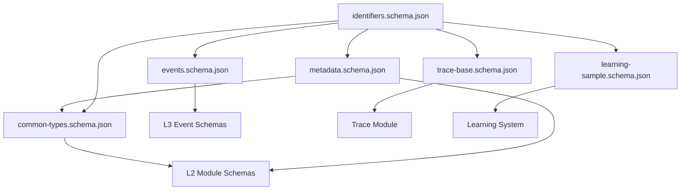

---
title: Common Schemas Reference
description: Reference for MPLP common schemas including identifiers, metadata, base events, and trace context. Defines foundational data structures shared across all modules.
keywords: [MPLP, Multi-Agent Lifecycle Protocol, Agent OS Protocol, AI Agent, Observable, Governed, Vendor-neutral, common schemas, MPLP schemas, identifiers, metadata, base event, trace context, UUID v4, CloudEvents]
sidebar_label: Common Schemas Reference
---
> [!FROZEN]
> **MPLP Protocol v1.0.0  Frozen Specification**
> **Freeze Date**: 2025-12-03
> **Status**: FROZEN (no breaking changes permitted)
> **Governance**: MPLP Protocol Governance Committee (MPGC)
> **License**: Apache-2.0
> **Note**: Any normative change requires a new protocol version.

# Common Schemas Reference

## 1. Purpose

This document describes the **common schema definitions** shared across all MPLP modules. These foundational schemas ensure consistency in identifiers, metadata, events, and tracing across the protocol.

**Source Directory**: `schemas/v2/common/`

## 2. Schema Overview

| Schema File | Title | Purpose |
|:---|:---|:---|
| `identifiers.schema.json` | MPLP Identifier | UUID v4 identifier standard |
| `metadata.schema.json` | MPLP Metadata | Common metadata structure |
| `events.schema.json` | MPLP Base Event | Base event model (CloudEvents-based) |
| `common-types.schema.json` | MPLP Common Types | Shared type definitions |
| `trace-base.schema.json` | MPLP Trace Base | W3C Trace Context fields |
| `learning-sample.schema.json` | MPLP Learning Sample | Structured learning data format |

---

## 3. Identifiers Schema

**File**: `identifiers.schema.json`

### 3.1 Definition

All MPLP identifiers use **UUID v4** format for global uniqueness and collision-free generation in distributed environments.

**Pattern**: `^[0-9a-f]{8}-[0-9a-f]{4}-4[0-9a-f]{3}-[89ab][0-9a-f]{3}-[0-9a-f]{12}$`

### 3.2 Usage

Used for: `context_id`, `plan_id`, `trace_id`, `event_id`, `confirm_id`, `role_id`, `step_id`, etc.

### 3.3 Examples

```json
"123e4567-e89b-12d3-a456-426614174000"
"550e8400-e29b-41d4-a716-446655440000"
```

---

## 4. Metadata Schema

**File**: `metadata.schema.json`

### 4.1 Required Fields

| Field | Type | Description |
|:---|:---|:---|
| **`protocol_version`** | String (SemVer) | MPLP protocol version |
| **`schema_version`** | String (SemVer) | Schema version used |

### 4.2 Optional Fields

| Field | Type | Description |
|:---|:---|:---|
| `created_at` | ISO 8601 datetime | Object creation time |
| `created_by` | String | Creator identifier |
| `updated_at` | ISO 8601 datetime | Last update time |
| `updated_by` | String | Last updater identifier |
| `tags` | Array of strings | Tags for indexing/search |
| `cross_cutting` | Array of enums | Cross-cutting concerns enabled |

### 4.3 Cross-Cutting Concerns Enum

The 9 governance plane concerns:

```
coordination, error-handling, event-bus, orchestration, 
performance, protocol-version, security, state-sync, transaction
```

### 4.4 Example

```json
{
  "protocol_version": "1.0.0",
  "schema_version": "1.0.0",
  "created_at": "2025-01-28T15:30:00.000Z",
  "created_by": "agent-planner",
  "tags": ["production", "high-priority"],
  "cross_cutting": ["security", "transaction"]
}
```

---

## 5. Events Schema

**File**: `events.schema.json`

Base model for all MPLP events, designed based on **CloudEvents v1.0** core fields.

### 5.1 Required Fields

| Field | Type | Description |
|:---|:---|:---|
| **`event_id`** | UUID v4 | Unique event identifier |
| **`event_type`** | String | Event type (dot-separated) |
| **`source`** | String | Event source module/component |
| **`timestamp`** | ISO 8601 datetime | Event occurrence time |

### 5.2 Optional Fields

| Field | Type | Description |
|:---|:---|:---|
| `trace_id` | UUID v4 | Associated trace identifier |
| `data` | Object or null | Event-specific business data |

### 5.3 Event Type Pattern

Pattern: `^[a-z][a-z0-9]*(?:\.[a-z][a-z0-9]*)*$`

Examples: `execution.started`, `plan.created`, `vsl.transition.applied`

### 5.4 Example

```json
{
  "event_id": "550e8400-e29b-41d4-a716-446655440001",
  "event_type": "execution.completed",
  "source": "runtime.ael",
  "timestamp": "2025-01-28T15:30:00.000Z",
  "trace_id": "550e8400-e29b-41d4-a716-446655440000",
  "data": { "status": "success", "duration_ms": 1234 }
}
```

---

## 6. Common Types Schema

**File**: `common-types.schema.json`

Shared type definitions for cross-module consistency.

### 6.1 Definitions

| Type | Description |
|:---|:---|
| `MplpId` | Reference to identifiers.schema.json |
| `Ref` | Standard reference to another MPLP object |
| `BaseMeta` | Reference to metadata.schema.json |

### 6.2 Ref Object

A standard way to reference other MPLP objects.

**Required**: `id`, `module`

| Field | Type | Description |
|:---|:---|:---|
| **`id`** | UUID v4 | Referenced object ID |
| **`module`** | Enum | Module name |
| `description` | String | Reference description |

**Module Enum**:
```
context, plan, confirm, trace, role, extension, dialog, collab, core, network
```

### 6.3 Example

```json
{
  "id": "550e8400-e29b-41d4-a716-446655440000",
  "module": "plan",
  "description": "Parent plan reference"
}
```

---

## 7. Trace Base Schema

**File**: `trace-base.schema.json`

Common base fields for Trace/Span structures, based on **W3C Trace Context** standard.

### 7.1 Required Fields

| Field | Type | Description |
|:---|:---|:---|
| **`trace_id`** | UUID v4 | Complete execution chain ID |
| **`span_id`** | UUID v4 | Current step/operation ID |

### 7.2 Optional Fields

| Field | Type | Description |
|:---|:---|:---|
| `parent_span_id` | UUID v4 | Parent span ID (omit for root) |
| `context_id` | UUID v4 | Associated Context ID |
| `attributes` | Object | Additional key-value metadata |

### 7.3 Example

```json
{
  "trace_id": "550e8400-e29b-41d4-a716-446655440000",
  "span_id": "550e8400-e29b-41d4-a716-446655440001",
  "parent_span_id": "550e8400-e29b-41d4-a716-446655440002",
  "context_id": "550e8400-e29b-41d4-a716-446655440003",
  "attributes": {
    "module": "plan",
    "operation": "create",
    "user_id": "user-123"
  }
}
```

---

## 8. Learning Sample Schema

**File**: `learning-sample.schema.json`

Structured format for collecting learning data from MPLP runtime executions.

### 8.1 Required Fields

| Field | Type | Description |
|:---|:---|:---|
| **`sample_id`** | UUID v4 | Unique sample identifier |
| **`project_id`** | String | Project identifier |
| **`success_flag`** | Boolean | Whether action succeeded |
| **`timestamps`** | Object | Execution timeline |

### 8.2 Core Optional Fields

| Field | Type | Description |
|:---|:---|:---|
| `intent_before` | Object | Original intent representation |
| `plan` | Object | Plan used |
| `delta_intents` | Array | Delta intents proposed/applied |
| `graph_before` | Object | Graph state before change |
| `graph_after` | Object | Graph state after change |
| `pipeline_path` | Array | Pipeline stages traversed |

### 8.3 Metrics Fields

| Field | Type | Description |
|:---|:---|:---|
| `token_usage` | Object | LLM token consumption |
| `execution_time_ms` | Number | Execution time (ms) |
| `impact_score` | Number (0-1) | Impact score |

### 8.4 Feedback Fields

| Field | Type | Description |
|:---|:---|:---|
| `user_feedback` | Object | Human feedback on result |
| `error_info` | Object | Error details if failed |
| `governance_decisions` | Array | Governance rules evaluated |

### 8.5 Token Usage Structure

```json
{
  "total_tokens": 15000,
  "prompt_tokens": 10000,
  "completion_tokens": 5000,
  "by_agent": [
    { "agent_id": "planner", "role": "orchestrator", "tokens": 8000 },
    { "agent_id": "coder", "role": "executor", "tokens": 7000 }
  ]
}
```

### 8.6 User Feedback Structure

```json
{
  "decision": "approve",  // approve, reject, override, unknown
  "comment": "Looks good",
  "rating": 4.5  // 0-5
}
```

---

## 9. Schema Relationships



## 10. Related Documents

**Architecture**:
- [L1 Core Protocol](../01-architecture/l1-core-protocol.md)
- [Cross-Cutting Kernel Duties](../01-architecture/cross-cutting-kernel-duties/index.md)

**Modules**:
- [Trace Module](../02-modules/trace-module.md)
- [Context Module](../02-modules/context-module.md)

**Observability**:
- [Event Taxonomy](../04-observability/event-taxonomy.md)
- [Observability Invariants](../04-observability/observability-invariants.md)

**Learning**:
- [Learning Sample Schema](../05-learning/learning-sample-schema.md)

---

**Document Status**: Normative (Common Schemas Reference)  
**Total Schemas**: 6 foundational schemas  
**Standards**: UUID v4, CloudEvents v1.0, W3C Trace Context, ISO 8601
---

 2025 Bangshi Beijing Network Technology Limited Company
Licensed under the Apache License, Version 2.0.
