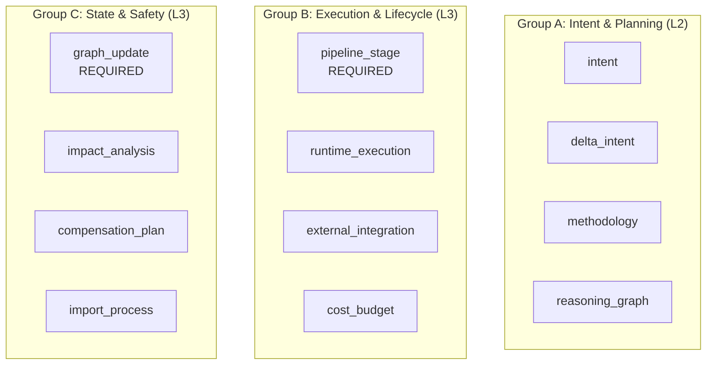
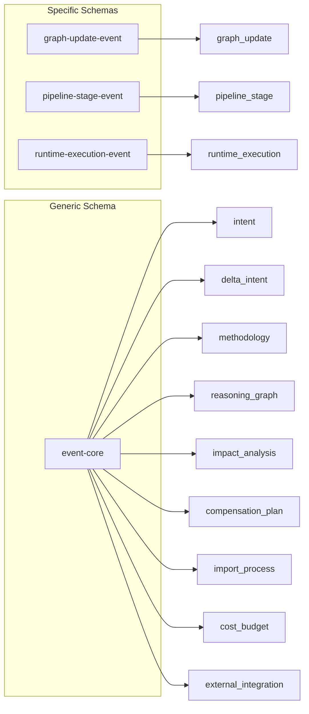

---
title: Event Taxonomy
description: MPLP Event Taxonomy defining the 12 Event Families for observability. Classifies events into Intent & Planning, Execution & Lifecycle, and State & Safety groups.
keywords: [MPLP, Multi-Agent Lifecycle Protocol, Agent OS Protocol, AI Agent, Observable, Governed, Vendor-neutral, Event Taxonomy, MPLP events, event families, observability events, intent events, execution events, state events, event classification]
sidebar_label: Event Taxonomy
---
> [!FROZEN]
> **MPLP Protocol v1.0.0  Frozen Specification**
> **Freeze Date**: 2025-12-03
> **Status**: FROZEN (no breaking changes permitted)
> **Governance**: MPLP Protocol Governance Committee (MPGC)
> **License**: Apache-2.0
> **Note**: Any normative change requires a new protocol version.

# Event Taxonomy

## 1. Purpose

The **Event Taxonomy** defines the classification system for all MPLP observability events. It organizes **12 Event Families** into semantic groups and maps them to physical schemas.

## 2. Event Family Classification

### 2.1 Complete Family List

| ID | Title | Compliance | Schema |
|:---|:---|:---:|:---|
| `graph_update` | GraphUpdateEvent | **REQUIRED** | mplp-graph-update-event.schema.json |
| `pipeline_stage` | PipelineStageEvent | **REQUIRED** | mplp-pipeline-stage-event.schema.json |
| `runtime_execution` | RuntimeExecutionEvent | RECOMMENDED | mplp-runtime-execution-event.schema.json |
| `import_process` | ImportProcessEvent | RECOMMENDED | mplp-event-core.schema.json |
| `intent` | IntentEvent | RECOMMENDED | mplp-event-core.schema.json |
| `cost_budget` | CostAndBudgetEvent | RECOMMENDED | mplp-event-core.schema.json |
| `external_integration` | ExternalIntegrationEvent | RECOMMENDED | mplp-event-core.schema.json |
| `delta_intent` | DeltaIntentEvent | Optional | mplp-event-core.schema.json |
| `impact_analysis` | ImpactAnalysisEvent | Optional | mplp-event-core.schema.json |
| `compensation_plan` | CompensationPlanEvent | Optional | mplp-event-core.schema.json |
| `methodology` | MethodologyEvent | Optional | mplp-event-core.schema.json |
| `reasoning_graph` | ReasoningGraphEvent | Optional | mplp-event-core.schema.json |

### 2.2 Family Groups



## 3. Group A: Intent & Planning

### 3.1 intent

**Purpose**: Capture user's raw requests and intentions

| Field | Type | Description |
|:---|:---|:---|
| `intent_id` | UUID | Intent identifier |
| `source` | Enum | Input source (ui, api, cli) |
| `raw_text` | String | Original user input |
| `parsed_intent` | Object | Structured intent |

**Example**:
```json
{
  "event_type": "intent_received",
  "event_family": "intent",
  "payload": {
    "intent_id": "int-001",
    "source": "ui",
    "raw_text": "Fix the login bug in auth.ts",
    "parsed_intent": {
      "action": "fix",
      "target": "auth.ts",
      "issue": "login bug"
    }
  }
}
```

### 3.2 delta_intent

**Purpose**: Track modifications to existing intents

| Field | Type | Description |
|:---|:---|:---|
| `original_intent_id` | UUID | Original intent reference |
| `delta_type` | Enum | add, modify, remove |
| `changes` | Object | Specific changes |

### 3.3 methodology

**Purpose**: Track agent's approach selection

| Field | Type | Description |
|:---|:---|:---|
| `method_id` | String | Methodology identifier |
| `name` | String | Method name |
| `rationale` | String | Why this approach |

### 3.4 reasoning_graph

**Purpose**: Capture chain-of-thought reasoning

| Field | Type | Description |
|:---|:---|:---|
| `thought_chain` | Array | Reasoning steps |
| `conclusion` | String | Final decision |
| `confidence` | Number | Confidence score |

## 4. Group B: Execution & Lifecycle

### 4.1 pipeline_stage (REQUIRED)

**Purpose**: Track Plan/Step lifecycle transitions

| Field | Type | Description |
|:---|:---|:---|
| **`stage_id`** | UUID | Stage identifier |
| **`resource_type`** | Enum | plan, step, context |
| **`resource_id`** | UUID | Resource reference |
| **`from_status`** | String | Previous status |
| **`to_status`** | String | New status |

**Trigger Points**:
- Plan: draft proposed approved in_progress completed
- Step: pending running completed/failed

**Example**:
```json
{
  "event_type": "pipeline_stage_transition",
  "event_family": "pipeline_stage",
  "payload": {
    "stage_id": "stage-001",
    "resource_type": "plan",
    "resource_id": "plan-550e8400",
    "from_status": "proposed",
    "to_status": "approved",
    "reason": "User approval via Confirm"
  }
}
```

### 4.2 runtime_execution (RECOMMENDED)

**Purpose**: Track low-level execution details

| Field | Type | Description |
|:---|:---|:---|
| `execution_id` | UUID | Execution identifier |
| `executor_type` | Enum | llm, tool, agent |
| `operation` | String | Operation name |
| `duration_ms` | Number | Execution time |
| `status` | Enum | success, failure, timeout |

**Example**:
```json
{
  "event_type": "llm_call_completed",
  "event_family": "runtime_execution",
  "payload": {
    "execution_id": "exec-001",
    "executor_type": "llm",
    "operation": "generate_code",
    "model": "gpt-4",
    "duration_ms": 2500,
    "tokens_in": 500,
    "tokens_out": 200,
    "status": "success"
  }
}
```

### 4.3 external_integration

**Purpose**: Track external system interactions

| Field | Type | Description |
|:---|:---|:---|
| `integration_id` | String | Integration identifier |
| `system` | String | External system name |
| `operation` | String | Operation performed |
| `response_status` | Number | HTTP status or code |

### 4.4 cost_budget

**Purpose**: Track token usage and financial metrics

| Field | Type | Description |
|:---|:---|:---|
| `tokens_used` | Number | Tokens consumed |
| `cost_usd` | Number | Estimated cost |
| `budget_remaining` | Number | Remaining budget |
| `model` | String | Model identifier |

**Example**:
```json
{
  "event_type": "token_usage_recorded",
  "event_family": "cost_budget",
  "payload": {
    "plan_id": "plan-001",
    "model": "gpt-4",
    "tokens_used": 1500,
    "cost_usd": 0.045,
    "budget_remaining": 49.955,
    "cumulative_tokens": 15000
  }
}
```

## 5. Group C: State & Safety

### 5.1 graph_update (REQUIRED)

**Purpose**: Track PSG structural changes

| Field | Type | Description |
|:---|:---|:---|
| **`update_id`** | UUID | Update identifier |
| **`operation`** | Enum | create, update, delete |
| **`node_type`** | String | Node type affected |
| **`node_id`** | UUID | Node identifier |
| `previous_state` | Object | State before change |
| `new_state` | Object | State after change |

**Trigger Points**:
- Node created/updated/deleted
- Edge added/removed
- Attribute modified

**Example**:
```json
{
  "event_type": "node_created",
  "event_family": "graph_update",
  "payload": {
    "update_id": "upd-001",
    "operation": "create",
    "node_type": "plan_step",
    "node_id": "step-550e8400",
    "new_state": {
      "step_id": "step-550e8400",
      "description": "Read error logs",
      "status": "pending"
    }
  }
}
```

### 5.2 impact_analysis

**Purpose**: Track predicted side-effects

| Field | Type | Description |
|:---|:---|:---|
| `impact_id` | UUID | Analysis identifier |
| `affected_resources` | Array | Resources impacted |
| `risk_level` | Enum | low, medium, high, critical |
| `recommendations` | Array | Suggested actions |

### 5.3 compensation_plan

**Purpose**: Track rollback planning

| Field | Type | Description |
|:---|:---|:---|
| `compensation_id` | UUID | Plan identifier |
| `reason` | String | Why compensation needed |
| `steps` | Array | Rollback steps |

### 5.4 import_process

**Purpose**: Track project initialization

| Field | Type | Description |
|:---|:---|:---|
| `import_id` | UUID | Import identifier |
| `source_type` | Enum | git, local, zip |
| `files_scanned` | Number | Files processed |
| `cards_generated` | Number | Semantic cards created |

## 6. Schema Mapping



## 7. Related Documents

**Observability**:
- [Observability Overview](observability-overview.md) - Architecture
- [Module Event Matrix](module-event-matrix.md) - Module mapping
- [Event Taxonomy YAML](event-taxonomy.yaml) - Machine-readable

**Schemas**:
- `schemas/v2/events/mplp-event-core.schema.json`
- `schemas/v2/events/mplp-graph-update-event.schema.json`
- `schemas/v2/events/mplp-pipeline-stage-event.schema.json`
- `schemas/v2/events/mplp-runtime-execution-event.schema.json`

---

**Document Status**: Normative (Event Classification)  
**Total Families**: 12  
**Required**: pipeline_stage, graph_update  
**Recommended**: runtime_execution, import_process, intent, cost_budget, external_integration  
**Optional**: delta_intent, impact_analysis, compensation_plan, methodology, reasoning_graph
---

 2025 Bangshi Beijing Network Technology Limited Company
Licensed under the Apache License, Version 2.0.
