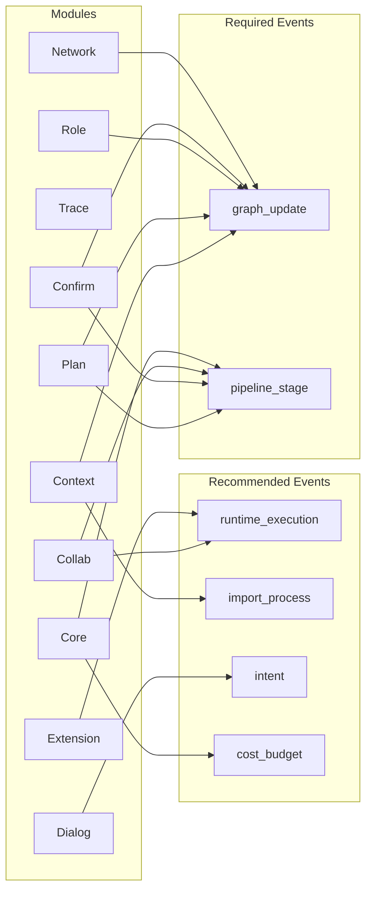
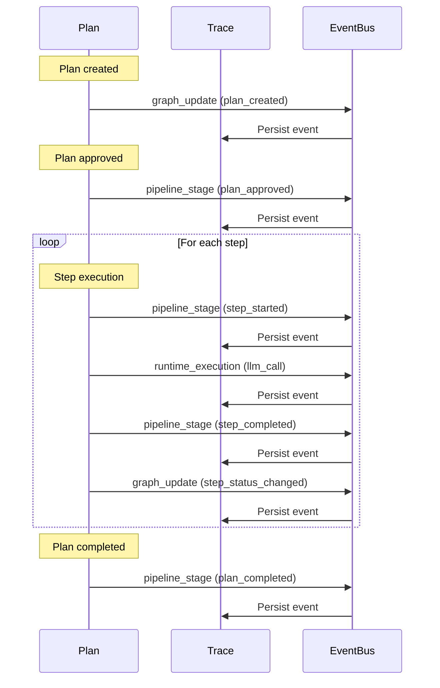

> [!FROZEN]
> **MPLP Protocol v1.0.0  Frozen Specification**
> **Freeze Date**: 2025-12-03
> **Status**: FROZEN (no breaking changes permitted)
> **Governance**: MPLP Protocol Governance Committee (MPGC)
> **License**: Apache-2.0
> **Note**: Any normative change requires a new protocol version.

# Module Event Matrix

## 1. Purpose

The **Module Event Matrix** defines which L2 Modules are responsible for emitting which Event Families. It serves as a guide for implementers to ensure complete observability coverage.

## 2. Emission Matrix

### 2.1 Module Event Family Mapping

| Module | Primary Events | Secondary Events | Notes |
|:---|:---|:---|:---|
| **Context** | `import_process`, `graph_update` | `intent` | Context initialization and state |
| **Plan** | `pipeline_stage`, `graph_update` | `methodology`, `impact_analysis` | Plan lifecycle and DAG changes |
| **Trace** | (Consumer - stores all events) | `cost_budget` | Central event persistence |
| **Role** | `graph_update` | - | Role definitions and bindings |
| **Confirm** | `pipeline_stage`, `graph_update` | `reasoning_graph` | Approval workflow events |
| **Dialog** | `intent`, `delta_intent` | - | User interaction capture |
| **Collab** | `pipeline_stage`, `runtime_execution` | `reasoning_graph` | Session lifecycle |
| **Extension** | `runtime_execution`, `external_integration` | - | Plugin execution |
| **Network** | `graph_update` | `runtime_execution` | Topology changes |
| **Core** | `pipeline_stage` | `cost_budget`, `compensation_plan` | Protocol-level events |

### 2.2 Visual Matrix



## 3. Trigger Points

### 3.1 Context Module

| Trigger | Event Family | Event Type |
|:---|:---|:---|
| Context created | `graph_update` | `context_created` |
| Context activated | `pipeline_stage` | `context_activated` |
| World state updated | `graph_update` | `world_state_updated` |
| Project imported | `import_process` | `import_completed` |

### 3.2 Plan Module

| Trigger | Event Family | Event Type |
|:---|:---|:---|
| Plan created | `graph_update` | `plan_created` |
| Plan status changed | `pipeline_stage` | `plan_status_changed` |
| Step added | `graph_update` | `step_added` |
| Step started | `pipeline_stage` | `step_started` |
| Step completed | `pipeline_stage` | `step_completed` |
| Step failed | `pipeline_stage` | `step_failed` |
| DAG modified | `graph_update` | `dag_edge_added` |

### 3.3 Confirm Module

| Trigger | Event Family | Event Type |
|:---|:---|:---|
| Confirm created | `graph_update` | `confirm_created` |
| Decision added | `pipeline_stage` | `confirm_decision_added` |
| Confirm resolved | `pipeline_stage` | `confirm_resolved` |

### 3.4 Dialog Module

| Trigger | Event Family | Event Type |
|:---|:---|:---|
| Message received | `intent` | `user_message_received` |
| Intent parsed | `intent` | `intent_extracted` |
| Change requested | `delta_intent` | `modification_requested` |

### 3.5 Collab Module

| Trigger | Event Family | Event Type |
|:---|:---|:---|
| Session started | `pipeline_stage` | `session_started` |
| Turn dispatched | `runtime_execution` | `turn_dispatched` |
| Turn completed | `runtime_execution` | `turn_completed` |
| Session completed | `pipeline_stage` | `session_completed` |

### 3.6 Extension Module

| Trigger | Event Family | Event Type |
|:---|:---|:---|
| Extension registered | `graph_update` | `extension_registered` |
| Extension activated | `runtime_execution` | `extension_activated` |
| Tool invoked | `runtime_execution` | `tool_execution_started` |
| Tool completed | `runtime_execution` | `tool_execution_completed` |
| External call | `external_integration` | `external_api_call` |

## 4. Event Flow Example

### 4.1 Plan Execution Flow



## 5. Compliance Requirements

### 5.1 Required Emissions

Every MPLP-compliant module MUST emit:

| Module | Required Events |
|:---|:---|
| Plan | `pipeline_stage` on status change, `graph_update` on DAG change |
| Context | `graph_update` on state change |
| Confirm | `pipeline_stage` on decision |

### 5.2 Recommended Emissions

Modules SHOULD emit for complete observability:

| Module | Recommended Events |
|:---|:---|
| Dialog | `intent` on user input |
| Extension | `runtime_execution` on tool call |
| Core | `cost_budget` on token usage |

## 6. SDK Implementation

```typescript
class ModuleventEmitter {
  constructor(
    private moduleName: string,
    private eventBus: EventBus
  ) {}
  
  emitGraphUpdate(operation: string, nodeType: string, nodeId: string): void {
    this.eventBus.emit({
      event_id: uuidv4(),
      event_type: `${nodeType}_${operation}`,
      event_family: 'graph_update',
      timestamp: new Date().toISOString(),
      payload: {
        module: this.moduleName,
        operation,
        node_type: nodeType,
        node_id: nodeId
      }
    });
  }
  
  emitPipelineStage(resourceType: string, resourceId: string, fromStatus: string, toStatus: string): void {
    this.eventBus.emit({
      event_id: uuidv4(),
      event_type: `${resourceType}_status_changed`,
      event_family: 'pipeline_stage',
      timestamp: new Date().toISOString(),
      payload: {
        module: this.moduleName,
        resource_type: resourceType,
        resource_id: resourceId,
        from_status: fromStatus,
        to_status: toStatus
      }
    });
  }
}

// Usage in Plan Module
const planEmitter = new ModuleventEmitter('plan', eventBus);
planEmitter.emitGraphUpdate('create', 'plan', plan.plan_id);
planEmitter.emitPipelineStage('plan', plan.plan_id, 'draft', 'proposed');
```

## 7. Related Documents

**Observability**:
- [Observability Overview](observability-overview.md) - Architecture
- [Event Taxonomy](event-taxonomy.md) - Family definitions

**Modules**:
- [Trace Module](../02-modules/trace-module.md) - Event consumer
- [Module Interactions](../02-modules/module-interactions.md) - Module dependencies

---

**Document Status**: Normative (Implementation Guide)  
**Modules Covered**: 10  
**Required Events**: graph_update, pipeline_stage  
**Trigger Points Documented**: 25+
---

 2025 Bangshi Beijing Network Technology Limited Company
Licensed under the Apache License, Version 2.0.
