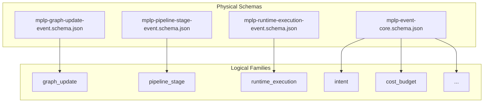
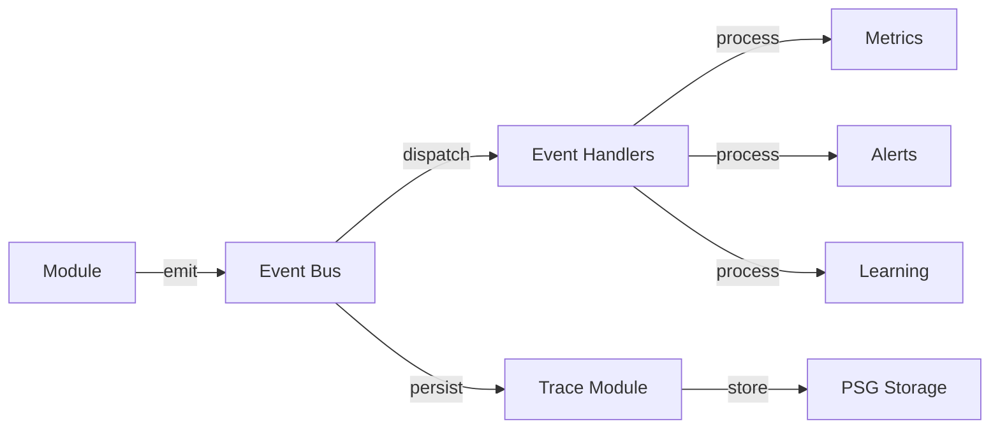

> [!FROZEN]
> **MPLP Protocol v1.0.0  Frozen Specification**
> **Freeze Date**: 2025-12-03
> **Status**: FROZEN (no breaking changes permitted)
> **Governance**: MPLP Protocol Governance Committee (MPGC)
> **License**: Apache-2.0
> **Note**: Any normative change requires a new protocol version.

# Observability Overview

## 1. Purpose

The **MPLP Observability Layer** provides comprehensive visibility into agent execution, state changes, and system health. It defines a structured event system that enables debugging, auditing, learning signal extraction, and compliance verification.

**Design Principle**: "Every significant action is observable and traceable"

## 2. Architecture: "3 Physical, 12 Logical"

MPLP v1.0 adopts a pragmatic approach to observability:

### 2.1 Overview

| Layer | Description |
|:---|:---|
| **3 Physical Schemas** | Distinct structural requirements |
| **12 Logical Families** | Semantic intent classification |
| **1 Generic Core** | Flexible base for optional families |



### 2.2 Physical Schemas

**Located in**: `schemas/v2/events/`

| Schema | Purpose | Used By |
|:---|:---|:---|
| **mplp-graph-update-event.schema.json** | PSG structural mutations | Context, Plan, Confirm |
| **mplp-pipeline-stage-event.schema.json** | Lifecycle transitions | Core, Pipeline, Trace |
| **mplp-runtime-execution-event.schema.json** | Execution tracking | Trace, Extension, Collab |
| **mplp-event-core.schema.json** | Generic base | All other families |

### 2.3 Logical Event Families

**12 Families organized in 3 groups**:

| Group | Families | Compliance |
|:---|:---|:---|
| **A: Intent & Planning** | intent, delta_intent, methodology, reasoning_graph | Optional |
| **B: Execution & Lifecycle** | pipeline_stage, runtime_execution, external_integration, cost_budget | Required/Recommended |
| **C: State & Safety** | graph_update, impact_analysis, compensation_plan, import_process | Required/Recommended |

## 3. Compliance Requirements

### 3.1 Required Events (MUST)

| Family | Schema | Description |
|:---|:---|:---|
| **pipeline_stage** | mplp-pipeline-stage-event.schema.json | Plan/Step lifecycle transitions |
| **graph_update** | mplp-graph-update-event.schema.json | PSG structural changes |

### 3.2 Recommended Events (SHOULD)

| Family | Schema | Description |
|:---|:---|:---|
| **runtime_execution** | mplp-runtime-execution-event.schema.json | Agent/Tool/LLM execution |
| **cost_budget** | mplp-event-core.schema.json | Token usage and cost |
| **external_integration** | mplp-event-core.schema.json | External system calls |
| **import_process** | mplp-event-core.schema.json | Project initialization |
| **intent** | mplp-event-core.schema.json | User intentions |

### 3.3 Optional Events (MAY)

| Family | Schema | Description |
|:---|:---|:---|
| **delta_intent** | mplp-event-core.schema.json | Change requests |
| **impact_analysis** | mplp-event-core.schema.json | Side-effect prediction |
| **compensation_plan** | mplp-event-core.schema.json | Rollback planning |
| **methodology** | mplp-event-core.schema.json | Approach selection |
| **reasoning_graph** | mplp-event-core.schema.json | Chain-of-thought |

## 4. Event Core Schema

**From**: `schemas/v2/events/mplp-event-core.schema.json`

### 4.1 Required Fields

| Field | Type | Description |
|:---|:---|:---|
| **`event_id`** | UUID v4 | Unique event identifier |
| **`event_type`** | String | Specific subtype (e.g., "step_completed") |
| **`event_family`** | Enum | Family classification |
| **`timestamp`** | ISO 8601 | Event occurrence time |

### 4.2 Optional Fields

| Field | Type | Description |
|:---|:---|:---|
| `project_id` | UUID v4 | Project context |
| `payload` | Object | Event-specific data |

### 4.3 Event Family Enum

```json
[
  "import_process",
  "intent",
  "delta_intent",
  "impact_analysis",
  "compensation_plan",
  "methodology",
  "reasoning_graph",
  "pipeline_stage",
  "graph_update",
  "runtime_execution",
  "cost_budget",
  "external_integration"
]
```

## 5. Profile-Level Events

In addition to core observability, profiles define their own events:

### 5.1 SA Profile Events

**Schema**: `schemas/v2/events/mplp-sa-event.schema.json`

| Event Type | Description |
|:---|:---|
| `SAInitialized` | Agent instance created |
| `SAContextLoaded` | Context bound |
| `SAPlanEvaluated` | Plan parsed |
| `SAStepStarted` | Step execution begin |
| `SAStepCompleted` | Step execution end |
| `SATraceEmitted` | Trace persisted |
| `SACompleted` | Agent terminated |

### 5.2 MAP Profile Events

**Schema**: `schemas/v2/events/mplp-map-event.schema.json`

| Event Type | Description |
|:---|:---|
| `MAPSessionStarted` | Session created |
| `MAPRolesAssigned` | Roles bound |
| `MAPTurnDispatched` | Turn token issued |
| `MAPTurnCompleted` | Turn finished |
| `MAPBroadcastSent` | Fan-out |
| `MAPBroadcastReceived` | Fan-in |
| `MAPSessionCompleted` | Session ended |

## 6. Integration with Trace Module

All emitted events MUST be written to the **Trace Module**:



### 6.1 Trace Structure

```json
{
  "trace_id": "trace-550e8400",
  "context_id": "ctx-550e8400",
  "plan_id": "plan-550e8400",
  "status": "completed",
  "events": [
    { "event_type": "SAInitialized", "event_family": "runtime_execution", ... },
    { "event_type": "pipeline_stage_started", "event_family": "pipeline_stage", ... },
    { "event_type": "graph_update", "event_family": "graph_update", ... }
  ]
}
```

## 7. SDK Example

### 7.1 Event Emission

```typescript
interface MPLPEvent {
  event_id: string;
  event_type: string;
  event_family: EventFamily;
  timestamp: string;
  project_id?: string;
  payload?: Record<string, any>;
}

type EventFamily = 
  | 'import_process' | 'intent' | 'delta_intent' 
  | 'impact_analysis' | 'compensation_plan' | 'methodology'
  | 'reasoning_graph' | 'pipeline_stage' | 'graph_update'
  | 'runtime_execution' | 'cost_budget' | 'external_integration';

async function emitEvent(event: MPLPEvent): Promise<void> {
  // Validate event against schema
  const schema = getSchemaForFamily(event.event_family);
  validate(event, schema);
  
  // Dispatch to event bus
  await eventBus.emit(event);
  
  // Persist to trace
  await traceModule.append(event);
}
```

## 8. Compliance Checklist

To be **MPLP v1.0 Compliant**, a Runtime MUST:

- [ ] Emit all **Required** event families (pipeline_stage, graph_update)
- [ ] Validate emitted events against **Physical Schemas**
- [ ] Persist events to the **Trace Module**
- [ ] Include all **Required Fields** (event_id, event_type, event_family, timestamp)
- [ ] Use correct **event_family** enum values

## 9. Related Documents

**Observability**:
- [Event Taxonomy](event-taxonomy.md) - Detailed family definitions
- [Module Event Matrix](module-event-matrix.md) - Module-to-event mapping
- [Runtime Trace Format](runtime-trace-format.md) - Export format

**Modules**:
- [Trace Module](../02-modules/trace-module.md) - Event persistence

**Schemas**:
- `schemas/v2/events/mplp-event-core.schema.json`
- `schemas/v2/events/mplp-graph-update-event.schema.json`
- `schemas/v2/events/mplp-pipeline-stage-event.schema.json`
- `schemas/v2/events/mplp-runtime-execution-event.schema.json`

---

**Document Status**: Normative (Observability Layer)  
**Physical Schemas**: 4 (3 specific + 1 generic)  
**Logical Families**: 12  
**Required Families**: pipeline_stage, graph_update  
**Compliance**: Required fields in all events
---

 2025 Bangshi Beijing Network Technology Limited Company
Licensed under the Apache License, Version 2.0.
