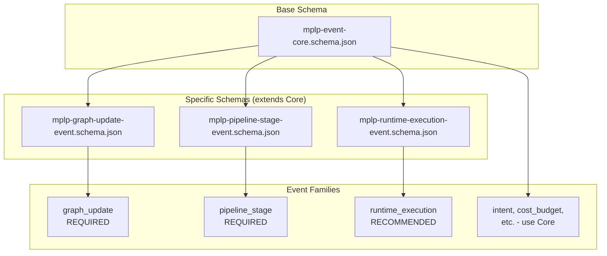

---
title: Physical Schemas Reference
description: "Reference for the 3 Physical Event Schemas in MPLP: GraphUpdateEvent, PipelineStageEvent, and RuntimeExecutionEvent. Defines structural requirements for core event families."
keywords: [MPLP, Multi-Agent Lifecycle Protocol, Agent OS Protocol, AI Agent, Observable, Governed, Vendor-neutral, Physical Schemas, GraphUpdateEvent, PipelineStageEvent, RuntimeExecutionEvent, event schemas, MPLP events, schema reference]
sidebar_label: Physical Schemas Reference
---
> [!FROZEN]
> **MPLP Protocol v1.0.0  Frozen Specification**
> **Freeze Date**: 2025-12-03
> **Status**: FROZEN (no breaking changes permitted)
> **Governance**: MPLP Protocol Governance Committee (MPGC)
> **License**: Apache-2.0
> **Note**: Any normative change requires a new protocol version.

# Physical Schemas Reference

## 1. Purpose

This document provides a detailed reference for the **3 Physical Event Schemas** used in MPLP v1.0 Observability. These schemas define the structural requirements for required and recommended event families.

## 2. Schema Overview

| Schema | File | Compliance | Used By |
|:---|:---|:---:|:---|
| **GraphUpdateEvent** | mplp-graph-update-event.schema.json | **REQUIRED** | graph_update family |
| **PipelineStageEvent** | mplp-pipeline-stage-event.schema.json | **REQUIRED** | pipeline_stage family |
| **RuntimeExecutionEvent** | mplp-runtime-execution-event.schema.json | RECOMMENDED | runtime_execution family |
| **EventCore** | mplp-event-core.schema.json | Base | All other families |

## 3. GraphUpdateEvent Schema

**Path**: `schemas/v2/events/mplp-graph-update-event.schema.json`

**Purpose**: Track PSG (Protocol State Graph) structural mutations

**Compliance**: **REQUIRED** for v1.0

### 3.1 Field Definitions

| Field | Type | Required | Description |
|:---|:---|:---:|:---|
| `event_id` | UUID v4 | | Inherited from EventCore |
| `event_type` | String | | Inherited from EventCore |
| `event_family` | `"graph_update"` | | Must be exactly "graph_update" |
| `timestamp` | ISO 8601 | | Inherited from EventCore |
| **`graph_id`** | UUID v4 | | PSG identifier |
| **`update_kind`** | Enum | | Type of mutation |
| **`node_delta`** | Integer | | Node count change (+/-) |
| **`edge_delta`** | Integer | | Edge count change (+/-) |
| `source_module` | String | | Emitting module name |
| `payload` | Object | | Additional data |

### 3.2 update_kind Enum

| Value | Description | Example |
|:---|:---|:---|
| `node_add` | New node created | Plan step added |
| `node_update` | Node modified | Step status changed |
| `node_delete` | Node removed | Step deleted |
| `edge_add` | New edge created | Dependency added |
| `edge_update` | Edge modified | Edge label changed |
| `edge_delete` | Edge removed | Dependency removed |
| `bulk` | Multiple changes | Import batch |

### 3.3 JSON Example

```json
{
  "event_id": "evt-550e8400-e29b-41d4-a716-446655440001",
  "event_type": "node_add",
  "event_family": "graph_update",
  "timestamp": "2025-12-07T00:00:00.000Z",
  "graph_id": "psg-550e8400-e29b-41d4-a716-446655440000",
  "update_kind": "node_add",
  "node_delta": 1,
  "edge_delta": 2,
  "source_module": "plan",
  "payload": {
    "node_type": "plan_step",
    "node_id": "step-001",
    "node_label": "Read error logs",
    "connected_to": ["step-002", "step-003"]
  }
}
```

### 3.4 Validation Code

```typescript
interface GraphUpdateEvent {
  event_id: string;
  event_type: string;
  event_family: 'graph_update';
  timestamp: string;
  graph_id: string;
  update_kind: 'node_add' | 'node_update' | 'node_delete' | 'edge_add' | 'edge_update' | 'edge_delete' | 'bulk';
  node_delta: number;
  edge_delta: number;
  source_module?: string;
  payload?: Record<string, any>;
}

function validateGraphUpdateEvent(event: any): event is GraphUpdateEvent {
  return (
    event.event_family === 'graph_update' &&
    typeof event.graph_id === 'string' &&
    typeof event.update_kind === 'string' &&
    typeof event.node_delta === 'number' &&
    typeof event.edge_delta === 'number'
  );
}
```

---

## 4. PipelineStageEvent Schema

**Path**: `schemas/v2/events/mplp-pipeline-stage-event.schema.json`

**Purpose**: Track Plan/Step lifecycle transitions

**Compliance**: **REQUIRED** for v1.0

### 4.1 Field Definitions

| Field | Type | Required | Description |
|:---|:---|:---:|:---|
| `event_id` | UUID v4 | | Inherited from EventCore |
| `event_type` | String | | Inherited from EventCore |
| `event_family` | `"pipeline_stage"` | | Must be exactly "pipeline_stage" |
| `timestamp` | ISO 8601 | | Inherited from EventCore |
| **`pipeline_id`** | UUID v4 | | Pipeline instance ID |
| **`stage_id`** | String | | Stage identifier |
| **`stage_status`** | Enum | | Current stage status |
| `stage_name` | String | | Human-readable name |
| `stage_order` | Integer | | Sequential order |
| `payload` | Object | | Additional data |

### 4.2 stage_status Enum

| Value | Description | Example |
|:---|:---|:---|
| `pending` | Not yet started | Plan awaiting approval |
| `running` | Currently executing | Step in progress |
| `completed` | Successfully finished | Step done |
| `failed` | Execution failed | Step error |
| `skipped` | Intentionally bypassed | Optional step skipped |

### 4.3 JSON Example

```json
{
  "event_id": "evt-550e8400-e29b-41d4-a716-446655440002",
  "event_type": "step_status_changed",
  "event_family": "pipeline_stage",
  "timestamp": "2025-12-07T00:01:00.000Z",
  "pipeline_id": "plan-550e8400-e29b-41d4-a716-446655440000",
  "stage_id": "step-001",
  "stage_name": "Read error logs",
  "stage_status": "completed",
  "stage_order": 1,
  "payload": {
    "from_status": "running",
    "to_status": "completed",
    "duration_ms": 5000,
    "executor_role": "debugger"
  }
}
```

### 4.4 Validation Code

```typescript
interface PipelineStageEvent {
  event_id: string;
  event_type: string;
  event_family: 'pipeline_stage';
  timestamp: string;
  pipeline_id: string;
  stage_id: string;
  stage_status: 'pending' | 'running' | 'completed' | 'failed' | 'skipped';
  stage_name?: string;
  stage_order?: number;
  payload?: Record<string, any>;
}

function validatePipelineStageEvent(event: any): event is PipelineStageEvent {
  return (
    event.event_family === 'pipeline_stage' &&
    typeof event.pipeline_id === 'string' &&
    typeof event.stage_id === 'string' &&
    ['pending', 'running', 'completed', 'failed', 'skipped'].includes(event.stage_status)
  );
}
```

---

## 5. RuntimeExecutionEvent Schema

**Path**: `schemas/v2/events/mplp-runtime-execution-event.schema.json`

**Purpose**: Track agent, tool, and LLM execution lifecycle

**Compliance**: RECOMMENDED

### 5.1 Field Definitions

| Field | Type | Required | Description |
|:---|:---|:---:|:---|
| `event_id` | UUID v4 | | Inherited from EventCore |
| `event_type` | String | | Inherited from EventCore |
| `event_family` | `"runtime_execution"` | | Must be exactly "runtime_execution" |
| `timestamp` | ISO 8601 | | Inherited from EventCore |
| **`execution_id`** | UUID v4 | | Execution instance ID |
| **`executor_kind`** | Enum | | Type of executor |
| **`status`** | Enum | | Execution status |
| `executor_role` | String | | Role identifier |
| `payload` | Object | | Additional data |

### 5.2 executor_kind Enum

| Value | Description | Example |
|:---|:---|:---|
| `agent` | MPLP agent instance | SA runtime |
| `tool` | External tool | file_read, curl |
| `llm` | Language model | gpt-4, claude |
| `worker` | Background worker | Async processor |
| `external` | External system | API gateway |

### 5.3 status Enum

| Value | Description |
|:---|:---|
| `pending` | Queued for execution |
| `running` | Currently executing |
| `completed` | Successfully finished |
| `failed` | Execution error |
| `cancelled` | Manually stopped |

### 5.4 JSON Example

```json
{
  "event_id": "evt-550e8400-e29b-41d4-a716-446655440003",
  "event_type": "llm_call_completed",
  "event_family": "runtime_execution",
  "timestamp": "2025-12-07T00:00:05.000Z",
  "execution_id": "exec-550e8400",
  "executor_kind": "llm",
  "executor_role": "coder",
  "status": "completed",
  "payload": {
    "model": "gpt-4",
    "tokens_in": 500,
    "tokens_out": 200,
    "duration_ms": 3000,
    "cost_usd": 0.021
  }
}
```

### 5.5 Validation Code

```typescript
interface RuntimeExecutionEvent {
  event_id: string;
  event_type: string;
  event_family: 'runtime_execution';
  timestamp: string;
  execution_id: string;
  executor_kind: 'agent' | 'tool' | 'llm' | 'worker' | 'external';
  status: 'pending' | 'running' | 'completed' | 'failed' | 'cancelled';
  executor_role?: string;
  payload?: Record<string, any>;
}

function validateRuntimeExecutionEvent(event: any): event is RuntimeExecutionEvent {
  return (
    event.event_family === 'runtime_execution' &&
    typeof event.execution_id === 'string' &&
    ['agent', 'tool', 'llm', 'worker', 'external'].includes(event.executor_kind) &&
    ['pending', 'running', 'completed', 'failed', 'cancelled'].includes(event.status)
  );
}
```

---

## 6. EventCore Schema (Base)

**Path**: `schemas/v2/events/mplp-event-core.schema.json`

**Purpose**: Base structure inherited by all event families

### 6.1 Field Definitions

| Field | Type | Required | Description |
|:---|:---|:---:|:---|
| **`event_id`** | UUID v4 | | Unique event identifier |
| **`event_type`** | String | | Specific event subtype |
| **`event_family`** | Enum | | Family classification |
| **`timestamp`** | ISO 8601 | | Event occurrence time |
| `project_id` | UUID v4 | | Project context |
| `payload` | Object | | Event-specific data |

### 6.2 event_family Enum

```json
[
  "import_process",
  "intent",
  "delta_intent",
  "impact_analysis",
  "compensation_plan",
  "methodology",
  "reasoning_graph",
  "pipeline_stage",
  "graph_update",
  "runtime_execution",
  "cost_budget",
  "external_integration"
]
```

---

## 7. Schema Relationships



## 8. Related Documents

**Observability**:
- [Observability Overview](observability-overview.md) - Architecture
- [Event Taxonomy](event-taxonomy.md) - Family definitions
- [Module Event Matrix](module-event-matrix.md) - Module mapping

**Schemas**:
- `schemas/v2/events/mplp-event-core.schema.json`
- `schemas/v2/events/mplp-graph-update-event.schema.json`
- `schemas/v2/events/mplp-pipeline-stage-event.schema.json`
- `schemas/v2/events/mplp-runtime-execution-event.schema.json`

---

**Document Status**: Normative (Schema Reference)  
**Physical Schemas**: 4 (1 base + 3 specific)  
**Required Schemas**: GraphUpdateEvent, PipelineStageEvent  
**Recommended Schemas**: RuntimeExecutionEvent
---

 2025 Bangshi Beijing Network Technology Limited Company
Licensed under the Apache License, Version 2.0.
