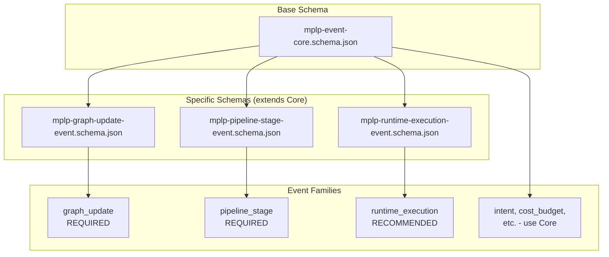

> **Scope**: Inherited (from /docs/04-observability/)
> **Non-Goals**: Inherited (from /docs/04-observability/)

# Physical Schemas Reference

> **Status**: Normative
> **Version**: 1.0.0
> **Authority**: MPGC
> **Protocol**: MPLP v1.0.0 (Frozen)

## 5. RuntimeExecutionEvent Schema

**Path**: `schemas/v2/events/mplp-runtime-execution-event.schema.json`

**Purpose**: Track agent, tool, and LLM execution lifecycle

**Compliance**: RECOMMENDED

### 5.1 Field Definitions

| Field | Type | Required | Description |
|:---|:---|:---:|:---|
| `event_id` | UUID v4 | | Inherited from EventCore |
| `event_type` | String | | Inherited from EventCore |
| `event_family` | `"runtime_execution"` | | Must be exactly "runtime_execution" |
| `timestamp` | ISO 8601 | | Inherited from EventCore |
| **`execution_id`** | UUID v4 | | Execution instance ID |
| **`executor_kind`** | Enum | | Type of executor |
| **`status`** | Enum | | Execution status |
| `executor_role` | String | | Role identifier |
| `payload` | Object | | Additional data |

### 5.2 executor_kind Enum

| Value | Description | Example |
|:---|:---|:---|
| `agent` | MPLP agent instance | SA runtime |
| `tool` | External tool | file_read, curl |
| `llm` | Language model | gpt-4, claude |
| `worker` | Background worker | Async processor |
| `external` | External system | API gateway |

### 5.3 status Enum

| Value | Description |
|:---|:---|
| `pending` | Queued for execution |
| `running` | Currently executing |
| `completed` | Successfully finished |
| `failed` | Execution error |
| `cancelled` | Manually stopped |

### 5.4 JSON Example

```json
{
  "event_id": "evt-550e8400-e29b-41d4-a716-446655440003",
  "event_type": "llm_call_completed",
  "event_family": "runtime_execution",
  "timestamp": "2025-12-07T00:00:05.000Z",
  "execution_id": "exec-550e8400",
  "executor_kind": "llm",
  "executor_role": "coder",
  "status": "completed",
  "payload": {
    "model": "gpt-4",
    "tokens_in": 500,
    "tokens_out": 200,
    "duration_ms": 3000,
    "cost_usd": 0.021
  }
}
```

### 5.5 Validation Code

```typescript
interface RuntimeExecutionEvent {
  event_id: string;
  event_type: string;
  event_family: 'runtime_execution';
  timestamp: string;
  execution_id: string;
  executor_kind: 'agent' | 'tool' | 'llm' | 'worker' | 'external';
  status: 'pending' | 'running' | 'completed' | 'failed' | 'cancelled';
  executor_role?: string;
  payload?: Record<string, any>;
}

function validateRuntimeExecutionEvent(event: any): event is RuntimeExecutionEvent {
  return (
    event.event_family === 'runtime_execution' &&
    typeof event.execution_id === 'string' &&
    ['agent', 'tool', 'llm', 'worker', 'external'].includes(event.executor_kind) &&
    ['pending', 'running', 'completed', 'failed', 'cancelled'].includes(event.status)
  );
}
```

## 7. Schema Relationships



## 8. Related Documents

**Observability**:
- [Observability Overview](observability-overview.md) - Architecture
- [Event Taxonomy](event-taxonomy.md) - Family definitions
- [Module Event Matrix](module-event-matrix.md) - Module mapping

**Schemas**:
- `schemas/v2/events/mplp-event-core.schema.json`
- `schemas/v2/events/mplp-graph-update-event.schema.json`
- `schemas/v2/events/mplp-pipeline-stage-event.schema.json`
- `schemas/v2/events/mplp-runtime-execution-event.schema.json`

---

**Document Status**: Normative (Schema Reference)  
**Physical Schemas**: 4 (1 base + 3 specific)  
**Required Schemas**: GraphUpdateEvent, PipelineStageEvent  
**Recommended Schemas**: RuntimeExecutionEvent