---
title: Learning Collection Points
description: Specification of Learning Collection Points in MPLP. Defines triggers and moments in the agent lifecycle (intent, execution, governance) for capturing learning samples.
keywords: [MPLP, Multi-Agent Lifecycle Protocol, Agent OS Protocol, AI Agent, Observable, Governed, Vendor-neutral, Learning Collection Points, learning samples, data collection, agent lifecycle, intent resolution, execution completion, user feedback, MPLP learning]
sidebar_label: Learning Collection Points
---
> [!FROZEN]
> **MPLP Protocol v1.0.0  Frozen Specification**
> **Freeze Date**: 2025-12-03
> **Status**: FROZEN (no breaking changes permitted)
> **Governance**: MPLP Protocol Governance Committee (MPGC)
> **License**: Apache-2.0
> **Note**: Any normative change requires a new protocol version.

# Learning Collection Points

## 1. Purpose

**Collection Points** define the specific moments in the agent execution lifecycle when **Learning Samples** should be captured. They serve as the bridge between real-time execution and offline learning.

**Design Principle**: Generate samples at **decision boundaries** and **outcome observations**oments where meaningful learning signals can be extracted.

---

## 2. Collection Point Taxonomy

```mermaid
graph TD
    subgraph "Intent & Planning"
        CP1[intent_resolution]
        CP2[plan_generation]
        CP3[plan_revision]
    end
    
    subgraph "Execution"
        CP4[execution_completion]
        CP5[pipeline_stage_completion]
        CP6[pipeline_failure]
    end
    
    subgraph "Governance"
        CP7[user_feedback]
        CP8[confirm_decision_finalized]
    end
    
    subgraph "Multi-Agent"
        CP9[map_session_completion]
        CP10[coordination_handoff]
    end
    
    CP1 --> LSIntent[LearningSampleIntent]
    CP2 --> LSIntent
    CP3 --> LSDelta[LearningSampleDelta]
    CP4 --> LSCore[LearningSampleCore]
    CP5 --> LSPipeline[LearningSamplePipelineOutcome]
    CP6 --> LSPipeline
    CP7 --> LSCore
    CP8 --> LSConfirm[LearningSampleConfirmDecision]
    CP9 --> LSMAP[LearningSampleMAP]
    CP10 --> LSMAP
```



---

## 3. Collection Point Matrix

| Collection Point | Trigger Event | Sample Family | Phase | Priority |
|:---|:---|:---|:---|:---:|
| `intent_resolution` | `IntentEvent`, `SAPlanEvaluated` | `intent` | Planning | HIGH |
| `plan_generation` | `SAPlanEvaluated` | `intent` | Planning | HIGH |
| `plan_revision` | `DeltaIntentEvent` | `delta` | Planning | HIGH |
| `execution_completion` | `SAStepCompleted`, `RuntimeExecutionEvent` | `core` | Execution | HIGH |
| `pipeline_stage_completion` | `PipelineStageEvent(completed)` | `pipeline_outcome` | Execution | MEDIUM |
| `pipeline_failure` | `PipelineStageEvent(failed)` | `pipeline_outcome` | Execution | HIGH |
| `user_feedback` | `ConfirmDecisionAdded` | `core`, `confirm_decision` | Governance | HIGH |
| `confirm_decision_finalized` | `ConfirmDecisionAdded` | `confirm_decision` | Governance | MEDIUM |
| `map_session_completion` | `MAPSessionCompleted` | `multi_agent_coordination` | Multi-Agent | MEDIUM |
| `coordination_handoff` | `MAPTurnCompleted` | `multi_agent_coordination` | Multi-Agent | LOW |

---

## 4. Detailed Specifications

### 4.1 Intent Resolution Point

**Purpose**: Capture how user/business intent is clarified and converted.

**Trigger Events**:
- `IntentEvent` Raw intent captured
- `SAPlanEvaluated` Intent successfully converted to Plan

**Data Sources**:
- User prompt / request text
- Dialog clarification turns (if any)
- Generated Plan structure

**Output Sample**: `LearningSampleIntent`

**JSON Example**:
```json
{
  "sample_id": "ls-intent-001",
  "family": "intent",
  "project_id": "proj-alpha",
  "input": {
    "user_request": "Create a REST API for user management",
    "context_summary": "Node.js project, Express framework"
  },
  "output": {
    "intent_model": {
      "goal": "Create CRUD endpoints for User entity",
      "constraints": ["Use Express Router", "Include validation"]
    },
    "generated_plan_id": "plan-001"
  },
  "meta": {
    "collected_at": "2025-12-06T10:00:00Z",
    "collection_point": "intent_resolution"
  }
}
```

---

### 4.2 Plan Revision Point

**Purpose**: Capture corrections to improve future planning accuracy.

**Trigger Events**:
- `DeltaIntentEvent` User modifies or rejects a Plan

**Data Sources**:
- Original Plan
- User feedback / rejection reason
- Revised Plan (if created)

**Output Sample**: `LearningSampleDelta`

**JSON Example**:
```json
{
  "sample_id": "ls-delta-001",
  "family": "delta",
  "project_id": "proj-alpha",
  "input": {
    "original_plan_id": "plan-001",
    "original_plan_summary": "3-step user API creation"
  },
  "state": {
    "user_feedback": "Add pagination support to GET endpoint"
  },
  "output": {
    "revised_plan_id": "plan-002",
    "changes_made": ["Added pagination step", "Updated step dependencies"]
  },
  "meta": {
    "collected_at": "2025-12-06T10:05:00Z",
    "collection_point": "plan_revision",
    "feedback_type": "enhancement_request"
  }
}
```

---

### 4.3 Execution Completion Point

**Purpose**: Capture successful input/output pairs for supervised learning.

**Trigger Events**:
- `SAStepCompleted` Step finished execution
- `RuntimeExecutionEvent(status=completed)` Tool/agent completed

**Data Sources**:
- Step input parameters
- Step output / artifacts produced
- Execution duration

**Output Sample**: `LearningSampleCore`

**JSON Example**:
```json
{
  "sample_id": "ls-core-001",
  "family": "core",
  "project_id": "proj-alpha",
  "input": {
    "step_id": "step-003",
    "step_description": "Generate user model schema",
    "agent_role": "code-generator"
  },
  "output": {
    "status": "completed",
    "artifacts": ["src/models/User.ts"],
    "duration_ms": 2500
  },
  "meta": {
    "collected_at": "2025-12-06T10:10:00Z",
    "collection_point": "execution_completion"
  }
}
```

---

### 4.4 User Feedback Point

**Purpose**: Capture explicit RLHF signals from human evaluation.

**Trigger Events**:
- `ConfirmDecisionAdded` User approves/rejects
- Explicit rating submission

**Data Sources**:
- Target artifact / action
- Decision (approve/reject/override)
- Rating (if provided)
- Comment / reasoning

**Output Sample**: `LearningSampleCore` with `user_feedback` populated

**JSON Example**:
```json
{
  "sample_id": "ls-core-002",
  "family": "core",
  "project_id": "proj-alpha",
  "input": {
    "action_type": "file_modification",
    "target": "src/models/User.ts"
  },
  "output": {
    "status": "completed",
    "risk_label": "high"
  },
  "user_feedback": {
    "decision": "approve",
    "rating": 4,
    "comment": "Good implementation, minor style issues"
  },
  "meta": {
    "collected_at": "2025-12-06T10:15:00Z",
    "collection_point": "user_feedback"
  }
}
```

---

### 4.5 Pipeline Stage Completion Point

**Purpose**: Capture stage-level patterns for pipeline optimization.

**Trigger Events**:
- `PipelineStageEvent(status=completed)`
- `PipelineStageEvent(status=failed)`

**Data Sources**:
- Pipeline structure
- Stage configuration
- Success/failure status
- Error details (if failed)

**Output Sample**: `LearningSamplePipelineOutcome`

---

### 4.6 MAP Session Completion Point

**Purpose**: Capture multi-agent collaboration patterns.

**Trigger Events**:
- `MAPSessionCompleted`
- `MAPTurnCompleted` (for handoff points)

**Data Sources**:
- Session configuration
- Participant roles
- Coordination mode
- Outcome metrics

**Output Sample**: `LearningSampleMAP`

---

## 5. Collection Priority and Compliance

### 5.1 v1.0 Compliance

| Priority | Collection Points | Compliance |
|:---|:---|:---:|
| **HIGH** | `execution_completion`, `user_feedback`, `intent_resolution`, `plan_revision`, `pipeline_failure` | RECOMMENDED |
| **MEDIUM** | `plan_generation`, `pipeline_stage_completion`, `confirm_decision_finalized`, `map_session_completion` | OPTIONAL |
| **LOW** | `coordination_handoff` | OPTIONAL |

> **Note**: All collection points are RECOMMENDED, not REQUIRED for v1.0 compliance. However, runtimes that implement learning SHOULD prioritize HIGH collection points.

### 5.2 Privacy Considerations

- Scrub PII before sample storage
- Apply access controls to sample repositories
- Document data retention policies
- Consider differential privacy for sensitive domains

---

## 6. Storage Patterns

### 6.1 Inline Emission

Samples emitted directly during execution:

```
Execution [Trigger Event] Sample Generated Sample Store
```

### 6.2 Post-Processing

Samples generated from replay/analysis:

```
Trace Records Batch Analysis Sample Generation Sample Store
```

### 6.3 Recommended Storage

- **Vector Database**: For RAG-based retrieval (e.g., Pinecone, Weaviate)
- **Data Lake**: For batch training pipelines (JSONL format)
- **Local Files**: For development/debugging

---

## 7. References

- [Learning Overview](learning-overview.md)
- [Learning Taxonomy](learning-taxonomy.yaml)
- [Learning Sample Schema](learning-sample-schema.md)
- `schemas/v2/invariants/learning-invariants.yaml`

---

**End of Learning Collection Points Specification**
---

 2025 Bangshi Beijing Network Technology Limited Company
Licensed under the Apache License, Version 2.0.
