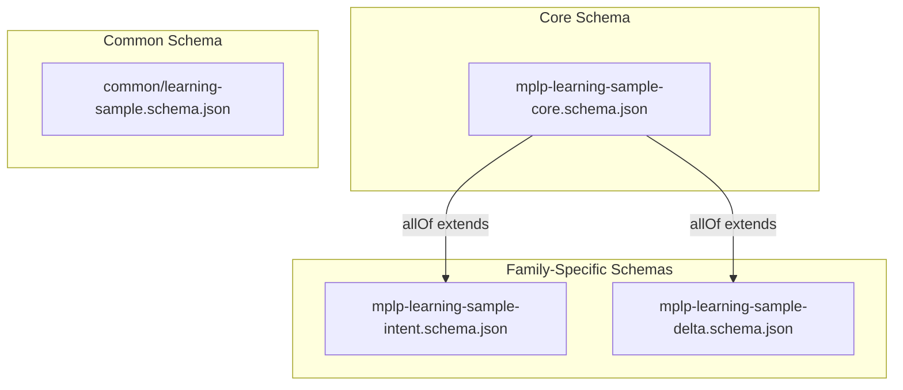

> [!FROZEN]
> **MPLP Protocol v1.0.0  Frozen Specification**
> **Freeze Date**: 2025-12-03
> **Status**: FROZEN (no breaking changes permitted)
> **Governance**: MPLP Protocol Governance Committee (MPGC)
> **License**: Apache-2.0
> **Note**: Any normative change requires a new protocol version.

# Learning Sample Schema Reference

## 1. Purpose

This document provides the **normative reference** for all Learning Sample schemas defined in the MPLP v1.0 protocol. Content is derived directly from the frozen JSON schemas in `schemas/v2/learning/`.

---

## 2. Schema Architecture



**Schema Hierarchy**:
- **Core Schema**: Defines universal fields for all learning samples
- **Family-Specific Schemas**: Extend core with specialized input/state/output structures
- **Common Schema**: Alternative structure with additional metrics fields

---

## 3. Core Schema (`mplp-learning-sample-core.schema.json`)

**Schema ID**: `https://mplp.dev/schemas/v1.0/learning/mplp-learning-sample-core.schema.json`

### 3.1 Required Fields

| Field | Type | Description |
|:---|:---|:---|
| `sample_id` | `string (uuid)` | Unique identifier of the learning sample (UUID v4) |
| `sample_family` | `string` | LearningSample family identifier (e.g., `intent_resolution`, `delta_impact`, `pipeline_outcome`, `confirm_decision`, `graph_evolution`, `multi_agent_coordination`) |
| `created_at` | `string (date-time)` | ISO 8601 timestamp when sample was generated |
| `input` | `object` | Abstracted representation of input conditions, intent, context |
| `output` | `object` | Abstracted representation of actual outcomes, decisions, changes |

### 3.2 Optional Fields

| Field | Type | Description |
|:---|:---|:---|
| `state` | `object` | Snapshot of relevant system state before execution (PSG summary, config, roles) |
| `meta` | `object` | Metadata, labels, quality signals, provenance IDs |

### 3.3 Meta Object Structure

| Field | Type | Description |
|:---|:---|:---|
| `source_flow_id` | `string` | Flow ID that generated this sample (e.g., FLOW-01, SA-01, MAP-01) |
| `source_event_ids` | `array<uuid>` | Observability event IDs referenced by this sample |
| `project_id` | `string (uuid)` | Project context identifier |
| `human_feedback_label` | `enum` | Human quality assessment: `approved`, `rejected`, `not_reviewed` |
| `quality_score` | `number (0.0-1.0)` | Automated quality score |

---

## 4. Intent Resolution Schema (`mplp-learning-sample-intent.schema.json`)

**Schema ID**: `https://mplp.dev/schemas/v1.0/learning/mplp-learning-sample-intent.schema.json`

**Family**: `intent_resolution`

Extends Core Schema via `allOf` reference.

### 4.1 Input Fields

| Field | Type | Required | Description |
|:---|:---|:---:|:---|
| `intent_id` | `string` | | Intent identifier from IntentEvent or Plan.intent_model |
| `raw_request_summary` | `string` | | Abstracted summary of original user request (PII-scrubbed if needed) |
| `constraints_summary` | `string` | | Key constraints mentioned (timeline, budget, resources) |
| `dialog_turns_count` | `integer` | | Number of dialog exchanges before intent resolution |

### 4.2 State Fields

| Field | Type | Description |
|:---|:---|:---|
| `project_phase` | `string` | Project state: greenfield, brownfield, maintenance, etc. |
| `psg_node_count` | `integer` | PSG size before intent application |
| `existing_plan_count` | `integer` | Number of existing plans in context |

### 4.3 Output Fields

| Field | Type | Required | Description |
|:---|:---|:---:|:---|
| `final_intent_summary` | `string` | | Refined/clarified intent after resolution process |
| `plan_id` | `string (uuid)` | | Generated Plan identifier (if plan created) |
| `plan_step_count` | `integer` | | Number of steps in generated plan |
| `resolution_quality_label` | `enum` | | Quality label: `good`, `acceptable`, `bad`, `unknown` |

### 4.4 Meta Extensions

| Field | Type | Description |
|:---|:---|:---|
| `clarification_rounds` | `integer` | Clarification rounds needed before resolution |
| `ambiguity_flags` | `array<string>` | Detected ambiguity types (vague_scope, missing_constraints, etc.) |

---

## 5. Delta Impact Schema (`mplp-learning-sample-delta.schema.json`)

**Schema ID**: `https://mplp.dev/schemas/v1.0/learning/mplp-learning-sample-delta.schema.json`

**Family**: `delta_impact`

Extends Core Schema via `allOf` reference.

### 5.1 Input Fields

| Field | Type | Required | Description |
|:---|:---|:---:|:---|
| `delta_id` | `string` | | Delta Intent identifier |
| `intent_id` | `string` | | Original intent being modified |
| `change_summary` | `string` | | Abstracted summary of requested change |
| `delta_type` | `enum` | | Type: `refinement`, `correction`, `expansion`, `reduction`, `pivot` |

### 5.2 State Fields

| Field | Type | Description |
|:---|:---|:---|
| `affected_artifact_count` | `integer` | Number of artifacts potentially affected |
| `risk_level` | `enum` | Risk level: `low`, `medium`, `high`, `critical` |
| `psg_complexity_score` | `number` | PSG complexity metric before change |

### 5.3 Output Fields

| Field | Type | Required | Description |
|:---|:---|:---:|:---|
| `actual_impact_summary` | `string` | | Summary of actual impact after analysis |
| `impact_scope` | `enum` | | Scope: `local`, `module`, `system`, `global` |
| `comp_plan_required` | `boolean` | | Whether compensation plan was needed |
| `comp_plan_applied` | `boolean` | | Whether compensation was actually applied |
| `rollback_used` | `boolean` | | Whether rollback mechanism was triggered |

### 5.4 Meta Extensions

| Field | Type | Description |
|:---|:---|:---|
| `impact_analysis_duration_ms` | `integer` | Time spent on impact analysis |
| `predicted_vs_actual_accuracy` | `enum` | Prediction accuracy: `accurate`, `underestimated`, `overestimated` |

---

## 6. Common Learning Sample Schema (`common/learning-sample.schema.json`)

**Schema ID**: `https://schemas.mplp.dev/v1.0/common/learning-sample.schema.json`

This is an alternative comprehensive schema with additional fields for metrics and governance.

### 6.1 Required Fields

| Field | Type | Description |
|:---|:---|:---|
| `sample_id` | `$ref identifiers.schema.json` | Unique identifier |
| `project_id` | `string` | Project identifier |
| `success_flag` | `boolean` | Whether the action/intent succeeded |
| `timestamps.started_at` | `date-time` | Execution start time (required) |

### 6.2 Intent & Plan Fields

| Field | Type | Description |
|:---|:---|:---|
| `intent_before` | `object` | Structured representation of the original intent |
| `plan` | `object` | Structured representation of the plan used |
| `delta_intents` | `array<object>` | Array of delta intents proposed/applied |

### 6.3 Graph State Fields

| Field | Type | Description |
|:---|:---|:---|
| `graph_before` | `object` | Snapshot/summary of knowledge graph before change |
| `graph_after` | `object` | Snapshot/summary of knowledge graph after change |

### 6.4 Execution Metrics

| Field | Type | Description |
|:---|:---|:---|
| `pipeline_path` | `array<string>` | Sequence of pipeline stages traversed |
| `execution_time_ms` | `number` | Execution time in milliseconds |
| `impact_score` | `number (0.0-1.0)` | Impact score |

### 6.5 Token Usage Object

```json
{
  "token_usage": {
    "total_tokens": 12500,
    "prompt_tokens": 8000,
    "completion_tokens": 4500,
    "by_agent": [
      { "agent_id": "agent-001", "role": "planner", "tokens": 5000 },
      { "agent_id": "agent-002", "role": "executor", "tokens": 7500 }
    ]
  }
}
```

### 6.6 User Feedback Object

| Field | Type | Values |
|:---|:---|:---|
| `decision` | `enum` | `approve`, `reject`, `override`, `unknown` |
| `comment` | `string` | Human comment |
| `rating` | `number` | 0-5 rating scale |

### 6.7 Error Info Object

```json
{
  "error_info": {
    "error_code": "VALIDATION_ERROR",
    "error_message": "Schema validation failed",
    "stack_trace": "..."
  }
}
```

### 6.8 Governance and Extensions

| Field | Type | Description |
|:---|:---|:---|
| `governance_decisions` | `array<object>` | Governance rules evaluated during execution |
| `metadata` | `object` | Additional metadata (extensibility point) |
| `vendor_extensions` | `object` | Vendor-specific extensions (MUST NOT conflict with core fields) |

---

## 7. Sample Families Reference

Based on Core Schema `sample_family` examples:

| Family ID | Description | Primary Schema |
|:---|:---|:---|
| `intent_resolution` | User intent clarification and plan generation | `mplp-learning-sample-intent.schema.json` |
| `delta_impact` | Change effect analysis and compensation planning | `mplp-learning-sample-delta.schema.json` |
| `pipeline_outcome` | Pipeline stage success/failure patterns | Core Schema |
| `confirm_decision` | Approval/rejection decisions and reasoning | Core Schema |
| `graph_evolution` | PSG structural changes over time | Core Schema |
| `multi_agent_coordination` | SA/MAP collaboration patterns | Core Schema |

---

## 8. Schema References

- **Core Schema**: `schemas/v2/learning/mplp-learning-sample-core.schema.json`
- **Intent Schema**: `schemas/v2/learning/mplp-learning-sample-intent.schema.json`
- **Delta Schema**: `schemas/v2/learning/mplp-learning-sample-delta.schema.json`
- **Common Schema**: `schemas/v2/common/learning-sample.schema.json`
- **Invariants**: `schemas/v2/invariants/learning-invariants.yaml`

---

**End of Learning Sample Schema Reference**
---

 2025 Bangshi Beijing Network Technology Limited Company
Licensed under the Apache License, Version 2.0.
