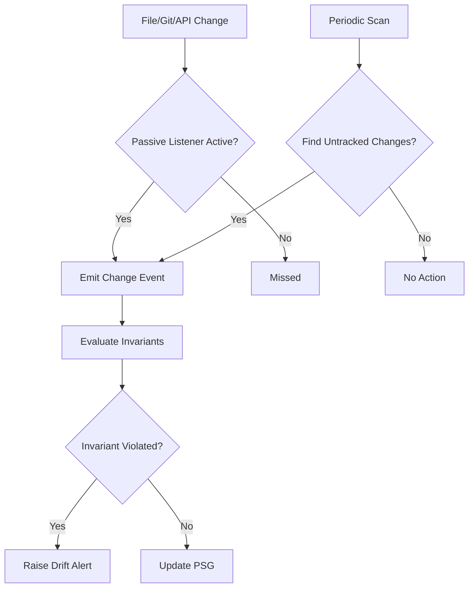
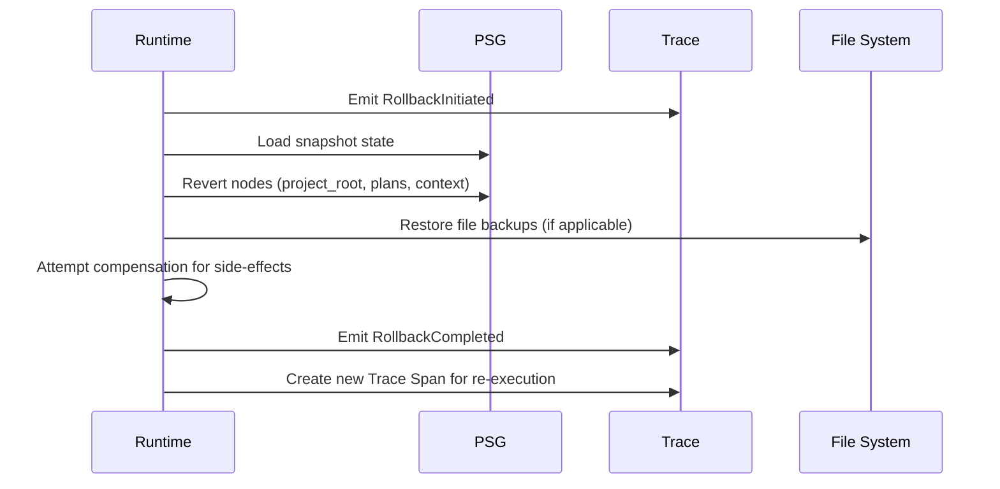

---
title: Drift And Rollback
description: Specification for Drift Detection and Rollback mechanisms in MPLP runtimes. Defines strategies for detecting state divergence and restoring PSG consistency.
keywords: [MPLP, Multi-Agent Lifecycle Protocol, Agent OS Protocol, AI Agent, Observable, Governed, Vendor-neutral, Drift Detection, Rollback, MPLP runtime, state divergence, PSG snapshots, compensation logic, drift types, rollback procedure]
sidebar_label: Drift and Rollback
---
> [!FROZEN]
> **MPLP Protocol v1.0.0  Frozen Specification**
> **Freeze Date**: 2025-12-03
> **Status**: FROZEN (no breaking changes permitted)
> **Governance**: MPLP Protocol Governance Committee (MPGC)
> **License**: Apache-2.0
> **Note**: Any normative change requires a new protocol version.

# Drift Detection & Rollback Mechanisms

## 1. Purpose

This document specifies the **Drift Detection** and **Rollback** mechanisms for MPLP runtimes. These mechanisms ensure the Project Semantic Graph (PSG) remains accurate and provide transactional safety for agent actions.

**Related Crosscuts**:
- **error-handling**: Failure detection and recovery
- **transaction**: Atomicity and rollback support
- **state-sync**: PSG consistency invariant

---

> [!NOTE]
> **Standards Mapping (Informative)**
> Drift Detection mechanisms serve as a technical **enablement** for NIST AI RMF risk management controls.
> This documentation does not claim compliance or certification. See the canonical positioning at [mplp.io/standards/positioning](https://mplp.io/standards/positioning).

## 2. Drift Detection

### 2.1 Definition

**Drift** is defined as a divergence between:
- **Actual State**: The real-world state (files, git, external resources)
- **Expected State**: The state recorded in PSG or defined by Plan/Invariants

### 2.2 Drift Types

| Type | Description | Detection Method | Invariant Example |
|:---|:---|:---|:---|
| **File Drift** | File content changes on disk | File watchers, checksum comparison | |
| **Git Drift** | Branch changes, new commits, merges | Git hooks, `git status` polling | |
| **Resource Drift** | External API state changes | Periodic health checks | |
| **Structural Drift** | PSG structure violates schema | Schema validation | `sa_plan_has_steps` |
| **State Drift** | Lifecycle state invalid | Invariant evaluation | `sa_context_must_be_active` |
| **Execution Drift** | Runtime behavior violates rules | Event monitoring | `map_turn_completion_matches_dispatch` |

### 2.3 Detection Strategies

#### 2.3.1 Passive Detection
Listen for L4 Integration events in real-time:
- `file_update_event` File system changes
- `git_event` Version control changes
- `GraphUpdateEvent` PSG structural changes
- `RuntimeExecutionEvent` Execution state changes

**Pros**: Low-overhead, real-time  
**Cons**: May miss events if listener is down

#### 2.3.2 Active Detection
Periodically scan the workspace:
- Recommended interval: 5 minutes
- Full checksum comparison of tracked files
- Git status validation

**Pros**: Catches missed events  
**Cons**: Higher overhead

#### 2.3.3 Invariant-Based Detection

**Compliance**: **REQUIRED** for v1.0

Monitor events and evaluate invariants on every update:

```
1. Monitor: Listen for GraphUpdateEvent and RuntimeExecutionEvent
2. Check: Evaluate relevant Invariants against the PSG
3. Alert: If invariant violated, raise Drift Alert
```

**Invariant Sources**:
- `schemas/v2/invariants/sa-invariants.yaml`
- `schemas/v2/invariants/map-invariants.yaml`
- `schemas/v2/invariants/observability-invariants.yaml`

### 2.4 Hybrid Strategy (Recommended)

Runtimes SHOULD implement a hybrid approach:



### 2.5 Drift Response

When drift is detected, the Runtime MUST:

1. **Emit Event**: `DriftDetectedEvent` (Generic Core Event)
   ```json
   {
     "event_type": "drift.detected",
     "drift_type": "file_drift",
     "affected_path": "src/utils.py",
     "severity": "warning"
   }
   ```

2. **Log to Trace**: Record the violation in the Trace

3. **Analyze Impact**: Determine if drift invalidates the current Plan
   - Example: If `utils.py` changed, does "Refactor utils.py" step need re-planning?

4. **Resolve**:
   - **Auto-Update**: If safe, update PSG to match reality
   - **Block**: If drift conflicts with active agent work, pause and request user intervention
   - **Halt**: If critical (e.g., security violation), suspend execution

---

## 3. Rollback Mechanisms

### 3.1 Purpose

**Rollback** provides transactional safety for agent actions. If a multi-step Plan fails midway, the system reverts to a consistent state, preventing a "broken build" scenario.

### 3.2 Snapshot Mechanism

**Compliance**: **REQUIRED** for v1.0

Before executing a Plan, the Runtime MUST maintain **Snapshots**:

#### 3.2.1 Snapshot Granularity
- **Minimum**: At Pipeline Stage boundaries
- **Recommended**: At Plan execution start

#### 3.2.2 Snapshot Contents

| Target | Snapshot Method |
|:---|:---|
| **PSG State** | Serialize graph to JSON checkpoint |
| **File System (Git)** | Create temporary branch or stash |
| **File System (Non-Git)** | Create backup copies |

#### 3.2.3 Storage Options
- Full copies (simple, more storage)
- Delta logs (efficient, more complex)

### 3.3 Rollback Triggers

A rollback is triggered by:

| Trigger | Source | Severity |
|:---|:---|:---|
| **Plan Failure** | Critical step fails, no recovery path | High |
| **User Rejection** | User rejects outcome during Confirm | Medium |
| **Policy Violation** | Safety violation detected (e.g., unauthorized access) | Critical |
| **Manual Abort** | User explicitly cancels operation | Medium |
| **Transaction Abort** | Failure in multi-step atomic operation | High |
| **User Request** | Explicit `IntentEvent` to undo | Medium |

### 3.4 Rollback Procedure



### 3.5 Consistency Requirements

**When performing rollback**:

1. **Trace Integrity**: The Trace MUST NOT be deleted
   - Rollback itself is an event appended to the Trace
   - Preserves audit trail

2. **PSG Reversion**: Restore to snapshot state
   - `project_root` nodes
   - `plans` nodes
   - `context` nodes

3. **Event Compensation**: Best-effort for external side-effects
   - If external API calls were made, attempt inverse operations
   - Example: `delete_repo` to undo `create_repo`
   - If automatic compensation fails, alert user with action log

### 3.6 Rollback Events

A Rollback operation produces:

| Event | Purpose |
|:---|:---|
| `RollbackInitiated` | Marks start of rollback |
| `RollbackCompleted` | Marks successful completion |
| New **Trace Span** | Represents re-execution path |

### 3.7 Compensation Logic

For side effects that cannot be simply reverted:

```typescript
interface CompensationAction {
  original_action: string;
  compensation_action: string;
  status: 'pending' | 'completed' | 'failed';
  error?: string;
}

// Example compensation registry
const compensations: Record<string, string> = {
  'create_file': 'delete_file',
  'create_branch': 'delete_branch',
  'api.create_resource': 'api.delete_resource'
};
```

---

## 4. Cross-Cutting Integration

### 4.1 Error Handling Integration

```
Drift Detected Error Classification Recovery Strategy 
                              (if unrecoverable) 
                               Trigger Rollback
```

### 4.2 Transaction Integration

- Rollback uses `GraphUpdateEvent` with `update_kind: "bulk"`
- Snapshot restore emits compensating `GraphUpdateEvent`

### 4.3 State Sync Integration

- PSG as single source of truth
- All drift detection verifies against PSG
- Rollback restores PSG to checkpoint

---

## 5. Compliance Summary

| Requirement | Level | Description |
|:---|:---|:---|
| Invariant-based drift detection | **MUST** | Evaluate invariants on PSG updates |
| PSG snapshots at stage boundaries | **MUST** | Enable rollback capability |
| DriftDetectedEvent emission | **MUST** | Audit trail for detected drift |
| Rollback event emission | **MUST** | Audit trail for rollback operations |
| Trace preservation on rollback | **MUST** | Never delete trace history |
| External compensation | **SHOULD** | Best-effort for side-effects |
| Hybrid detection strategy | **SHOULD** | Passive + Active detection |

---

## 6. Related Documents

**Runtime**:
- [Runtime Glue Overview](runtime-glue-overview.md) - L3 architecture
- [ModuleSG Paths](module-psg-paths.md) - PSG node mappings
- [Crosscut PSG Binding](crosscut-psg-event-binding.md) - Event bindings

**Invariants**:
- [SA Invariants](../03-profiles/sa-profile.md)
- [MAP Invariants](../03-profiles/map-profile.md)
- [Observability Invariants](../04-observability/observability-invariants.md)

**Cross-Cutting**:
- [Error Handling](../01-architecture/cross-cutting-kernel-duties/error-handling.md)
- [Transaction](../01-architecture/cross-cutting-kernel-duties/transaction.md)
- [State Sync](../01-architecture/cross-cutting-kernel-duties/state-sync.md)

---

**Document Status**: Normative (Runtime Drift & Rollback)  
**Detection**: Passive + Active + Invariant-based (hybrid)  
**Rollback**: PSG snapshots + compensation logic
---

 2025 Bangshi Beijing Network Technology Limited Company
Licensed under the Apache License, Version 2.0.
