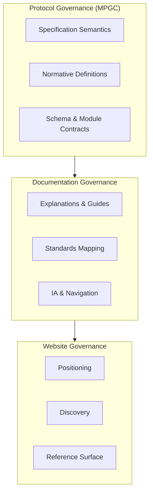

# External Governance & Trust Overview

> **Status**: FROZEN
> **Version**: 1.0.0
> **Authority**: Documentation Governance + Website Governance
> **Last Updated**: 2025-12-21

> [!NOTE]
> **Purpose**
>
> This page is the **external entry point** for evaluators, investors, architects, and contributors.
> It summarizes MPLP governance in under 5 minutes of reading.

---

## What MPLP Is

**Multi-Agent Lifecycle Protocol (MPLP)** is an open standard defining:

- **Lifecycle semantics** for AI agents (creation → execution → termination)
- **State management** (immutable trace, drift detection)
- **Governance hooks** (policy enforcement, human-in-the-loop)
- **Coordination primitives** (multi-agent collaboration)

MPLP is **The Agent OS Protocol** — infrastructure for agents, not the agents themselves.

---

## What MPLP Is NOT

> [!IMPORTANT]
> **Explicit Non-Claims**

| MPLP Is NOT | Why This Matters |
|:------------|:-----------------|
| A product | No commercial entity sells "MPLP" |
| A certification body | MPLP does not certify implementations |
| A compliance guarantee | Adopters are responsible for regulatory compliance |
| A vendor endorsement | Ecosystem listings are informational only |
| A complete AI safety solution | MPLP provides primitives, not policies |

---

## Governance Structure

MPLP governance operates in **three distinct layers**:

| Layer | Authority | Scope |
|:------|:----------|:------|
| **Protocol (MPGC)** | MPLP Protocol Governance Committee | Specification, schemas, normative definitions |
| **Documentation** | Documentation Maintainers | Explanations, mappings, guides |
| **Website** | Website Maintainers | Positioning, discovery, links |

**Key Principle**: Lower layers cannot override higher layers.

---

## Semantic Freeze & Change Control

### Current Status
- **Protocol Version**: 1.0.0 (FROZEN)
- **Change Process**: RFC → MPGC Review → Semantic Difflog

### Change Authority

| Change Type | Authority Required |
|:------------|:-------------------|
| New module definition | MPGC |
| Schema modification | MPGC |
| Documentation structure | Documentation Governance |
| Website navigation | Website Governance |
| Typo fix | No escalation |

---

## Evidence & Verification

MPLP provides **verifiable claims**, not just statements.

| Claim | Evidence Location |
|:------|:------------------|
| "Specification exists" | [Architecture](/docs/architecture/architecture-overview), [Modules](/docs/modules/core-module) |
| "Governance is defined" | [Governance Layers](/docs/governance/GOVERNANCE_LAYERS) |
| "Standards are mapped" | [ISO](/docs/standards/iso-mapping), [NIST](/docs/standards/nist-mapping) |
| "Code matches docs" | [Repo-Docs-Code Alignment](/docs/index/REPO_DOCS_CODE_ALIGNMENT) |
| "Behavior is testable" | [Golden Flows](/docs/golden-flows) |

---

## Standards Relationship (Summary)

MPLP provides **technical primitives** that facilitate alignment with:

| Standard | Relationship Type | Detail |
|:---------|:------------------|:-------|
| ISO/IEC 42001 | Mapping / Enablement | [ISO Mapping](/docs/standards/iso-mapping) |
| NIST AI RMF | Mapping / Enablement | [NIST Mapping](/docs/standards/nist-mapping) |

> [!CAUTION]
> **Non-Claim**: MPLP does not constitute certification or formal compliance.
> Responsibility for regulatory compliance remains with the adopter.

---

## Why You Can Trust This Project

| Trust Factor | Evidence |
|:-------------|:---------|
| **Semantic Consistency** | Three-entry model (Website ↔ Docs ↔ Repo) |
| **Governance Clarity** | Explicit authority layers with change control |
| **Verifiability** | Golden Flows, Alignment Index, Trace Replay |
| **Transparency** | All governance artifacts are public |
| **Non-Marketing** | No CTAs, no conversion, no endorsements |

---

## Next Steps for Evaluators

| Your Role | Start Here |
|:----------|:-----------|
| **Investor / Board** | [How to Evaluate MPLP](/docs/governance/HOW_TO_EVALUATE_MPLP) |
| **Enterprise Architect** | [Enterprise Evaluation](/docs/governance/agentos-protocol) |
| **Contributor** | [Governance Layers](/docs/governance/GOVERNANCE_LAYERS) |
| **Auditor** | [Golden Flows](/docs/golden-flows) |

---

## Legal Disclaimers

> [!WARNING]
> **Standard Disclaimer**

- MPLP is provided "as-is" without warranty of any kind.
- Documentation is informational; it does not constitute legal or compliance advice.
- Third-party implementations are not endorsed, certified, or guaranteed by MPLP.
- Adopters must independently verify suitability for their use cases.

---

**MPLP Documentation Governance + Website Governance**
**2025-12-21**
