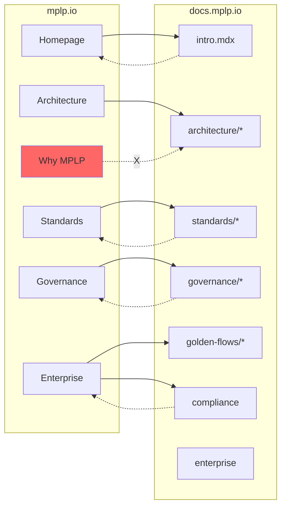

# MPLP Website → Documentation Routing Table

**Version**: 1.1
**Status**: FROZEN
**Date**: 2025-12-21
**Authority**: MPLP Website Governance
**Phase**: G1 Updated (Deep Linking)

---

## 1. Purpose

This document defines the **semantic routing graph** between the MPLP Website (mplp.io)
and the MPLP Documentation site (docs.mplp.io).

It specifies which website pages MAY/MUST link to which Docs pages, and which cross-references
are PROHIBITED to prevent semantic ambiguity.

---

## 2. Website → Docs Deep Link Matrix (G1)

### 2.1 Standards Pages (Precise Anchoring)

| Website Page | Website Section | Docs Target | Anchor Text | Link Type |
|:-------------|:----------------|:------------|:------------|:----------|
| `/standards/positioning` | Standards Relationship | `/docs/standards/positioning` | "Standards Mapping" | Informative |
| `/standards/positioning` | ISO Section | `/docs/standards/iso-mapping` | "ISO 42001 Mapping" | Informative |
| `/standards/positioning` | NIST Section | `/docs/standards/nist-mapping` | "NIST AI RMF Mapping" | Informative |

> [!IMPORTANT]
> **Anchor Text Rules**:
> - ✅ Use: "Mapping", "Alignment", "Enablement", "Compatibility"
> - ❌ Avoid: "Compliance", "Certification", "Meets Requirements"

---

### 2.2 Governance Pages (Precise Anchoring)

| Website Page | Website Section | Docs Target | Anchor Text | Link Type |
|:-------------|:----------------|:------------|:------------|:----------|
| `/governance/overview` | Layers | `/docs/governance/GOVERNANCE_LAYERS` | "Governance Layers" | Reference |
| `/governance/overview` | Statement | `/docs/governance/GOVERNANCE_STATEMENT` | "Governance Statement" | Reference |
| `/governance/agentos-protocol` | Full | `/docs/governance/agentos-protocol` | "Protocol Definition" | Specification |
| `/governance/evidence-chain` | Full | `/docs/governance/evidence-chain` | "Evidence Structure" | Specification |
| `/governance/governed-stack` | Full | `/docs/governance/governed-stack` | "Stack Definition" | Specification |

---

### 2.3 Evaluation Pages (Precise Anchoring)

| Website Page | Website Section | Docs Target | Anchor Text | Link Type |
|:-------------|:----------------|:------------|:------------|:----------|
| `/enterprise` | Conformance | `/docs/guides/conformance-guide` | "Conformance Guide" | Informative |
| `/enterprise` | Evidence | `/docs/golden-flows` | "Golden Flows (Validation)" | Normative |
| `/enterprise` | Traceability | `/docs/index/REPO_DOCS_CODE_ALIGNMENT` | "Code Alignment Index" | Reference |
| `/adoption` | Signals | `/docs/adoption` | "Adoption Signals" | Informative |

---

### 2.4 Specification Pages (Precise Anchoring)

| Website Page | Docs Target | Anchor Text | Link Type |
|:-------------|:------------|:------------|:----------|
| `/` (Homepage) | `/docs/intro` | "Documentation" | Entry |
| `/architecture` | `/docs/architecture/architecture-overview` | "Architecture Specification" | Normative |
| `/modules` | `/docs/modules/core-module` | "Module Specifications" | Normative |
| `/profiles` | `/docs/profiles/sa-profile` | "Profile Specifications" | Normative |
| `/observability` | `/docs/observability/observability-overview` | "Observability Specification" | Normative |
| `/sdk` | `/docs/sdk/ts-sdk-guide` | "SDK Documentation" | Reference |
| `/getting-started` | `/docs/guides/quickstart-5min` | "5-Minute Quickstart" | Tutorial |

---

## 3. Prohibited Routes (Website → Docs)

| Website Page | Prohibited Docs Target | Reason |
|:-------------|:-----------------------|:-------|
| ANY | `/docs/governance/DOCS_*` | Internal governance artifacts |
| `/about` | `/docs/*` | Positioning pages must be self-contained |
| `/why-mplp` | `/docs/*` | Why narratives belong to website only |
| ANY | Blog/News interpretation | No temporal specification references |

---

## 4. Docs → Website Required Deferral

### 4.1 Required Deferral Links (Docs → Website)

| Docs Page Type | Required Website Link | Purpose |
|:---------------|:----------------------|:--------|
| `intro.mdx` | `mplp.io` | Positioning deferral |
| `/docs/standards/*` | `mplp.io/standards/positioning` | Interpretation deferral |
| `/docs/governance/*` | `mplp.io` | Authority deferral |
| `/docs/compliance` | `mplp.io/enterprise` | Evaluation context |
| `/docs/enterprise` | `mplp.io/enterprise` | Evaluation context |

### 4.2 Prohibited Routes (Docs → Website)

| Docs Page Type | Prohibited Website Link | Reason |
|:---------------|:------------------------|:-------|
| ANY | Marketing pages | Docs must not endorse |
| Specification pages | Blog/News | No temporal references |

---

## 5. Cross-Reference Topology (Updated)

---

## 6. Governance

Changes to this routing table require:
1. Website Governance review
2. If semantic boundary affected → MPGC notification
3. Updated freeze artifacts

---

**MPLP Website Governance**
**2025-12-21**
