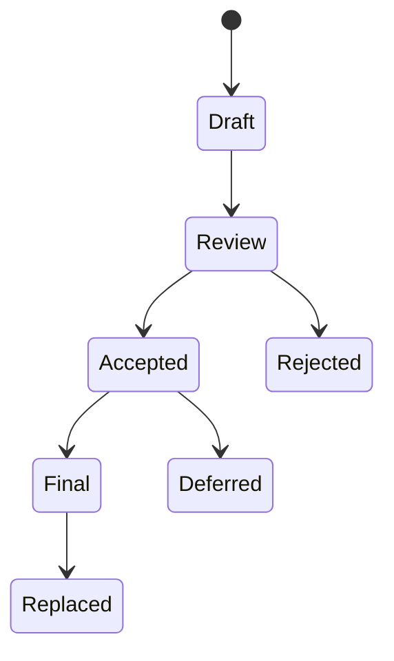

---
title: MIP Process
description: The MPLP Improvement Proposal (MIP) process. Guidelines for proposing new features, protocol changes, and community standards.
keywords: [MPLP, Multi-Agent Lifecycle Protocol, Agent OS Protocol, AI Agent, Observable, Governed, Vendor-neutral, MIP Process, MPLP Improvement Proposals, protocol governance, feature proposals, community standards, contribution guide]
sidebar_label: MIP Process
---
> [!FROZEN]
> **MPLP Protocol v1.0.0  Frozen Specification**
> **Freeze Date**: 2025-12-03
> **Status**: FROZEN (no breaking changes permitted)
> **Governance**: MPLP Protocol Governance Committee (MPGC)
> **License**: Apache-2.0
> **Note**: Any normative change requires a new protocol version.

# MIP Process (MPLP Improvement Proposals)

**Status**: Active
**Version**: 1.0.0

## 1. Purpose

The MIP (MPLP Improvement Proposal) process is the primary mechanism for proposing new features, changes to the protocol specification, or community standards.

## 2. MIP Types

| Type | Description |
|:---|:---|
| **Standards Track** | Describes a new feature or implementation for the protocol |
| **Informational** | Provides guidelines or information, does not propose a standard |
| **Process** | Describes a process (or an event in a process) |

## 3. MIP Status

| Status | Description |
|:---|:---|
| **Draft** | The author is writing the proposal |
| **Review** | Community is reviewing the proposal |
| **Accepted** | Approved for implementation |
| **Rejected** | Proposal denied |
| **Final** | Implementation complete, part of the standard |
| **Deferred** | Postponed for future consideration |
| **Replaced** | Superseded by a newer MIP |

## 4. Contributing a MIP

1. Fork the repository
2. Copy `mips/mip-template.md`
3. Fill in the required sections:
   - **Title**: Short descriptive title
   - **Author**: Name/Email
   - **Status**: Draft
   - **Abstract**: Summary of the proposal
   - **Motivation**: Why is this needed?
   - **Specification**: Technical details
   - **Backward Compatibility**: Impact on existing systems
4. Submit a Pull Request to the `mips/` directory

## 5. Review Process

1. **Submission**: Author submits PR with MIP markdown file
2. **Discussion**: Community discusses via GitHub Issues/PR comments
3. **Voting**: MPGC members vote on acceptance
4. **Decision**: MIP is accepted, rejected, or deferred

---

 2025 Bangshi Beijing Network Technology Limited Company
Licensed under the Apache License, Version 2.0.
