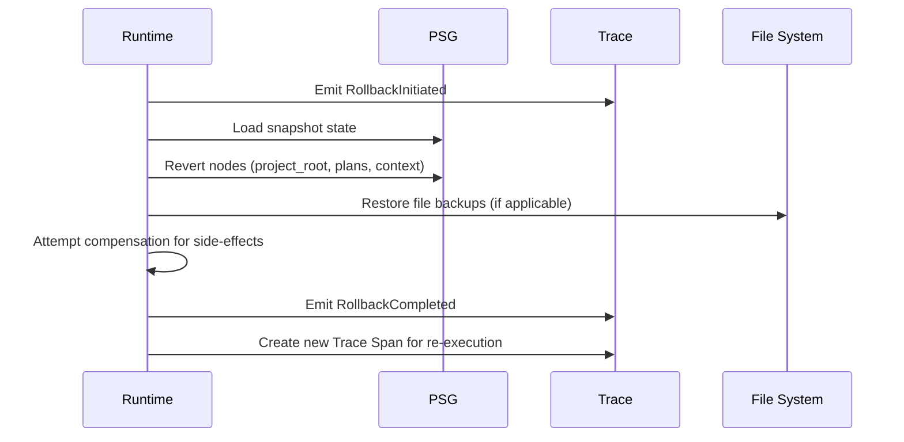

> **Scope**: Inherited (from /docs/14-runtime/)
> **Non-Goals**: Inherited (from /docs/14-runtime/)

# Drift And Rollback

> **Status**: Normative
> **Version**: 1.0.0
> **Authority**: MPGC
> **Protocol**: MPLP v1.0.0 (Frozen)

## 1. Scope

This specification defines the normative requirements for **Drift Detection & Rollback Mechanisms**.

## 2. Non-Goals

This specification does not mandate specific implementation details beyond the defined interfaces and invariants.

## 1. Purpose

This document specifies the **Drift Detection** and **Rollback** mechanisms for MPLP runtimes. These mechanisms ensure the Project Semantic Graph (PSG) remains accurate and provide transactional safety for agent actions.

**Related Crosscuts**:
- **error-handling**: Failure detection and recovery
- **transaction**: Atomicity and rollback support
- **state-sync**: PSG consistency invariant

## 3. Rollback Mechanisms

### 3.1 Purpose

**Rollback** provides transactional safety for agent actions. If a multi-step Plan fails midway, the system reverts to a consistent state, preventing a "broken build" scenario.

### 3.2 Snapshot Mechanism

**Compliance**: **REQUIRED** for v1.0

Before executing a Plan, the Runtime MUST maintain **Snapshots**:

#### 3.2.1 Snapshot Granularity
- **Minimum**: At Pipeline Stage boundaries
- **Recommended**: At Plan execution start

#### 3.2.2 Snapshot Contents

| Target | Snapshot Method |
|:---|:---|
| **PSG State** | Serialize graph to JSON checkpoint |
| **File System (Git)** | Create temporary branch or stash |
| **File System (Non-Git)** | Create backup copies |

#### 3.2.3 Storage Options
- Full copies (simple, more storage)
- Delta logs (efficient, more complex)

### 3.3 Rollback Triggers

A rollback is triggered by:

| Trigger | Source | Severity |
|:---|:---|:---|
| **Plan Failure** | Critical step fails, no recovery path | High |
| **User Rejection** | User rejects outcome during Confirm | Medium |
| **Policy Violation** | Safety violation detected (e.g., unauthorized access) | Critical |
| **Manual Abort** | User explicitly cancels operation | Medium |
| **Transaction Abort** | Failure in multi-step atomic operation | High |
| **User Request** | Explicit `IntentEvent` to undo | Medium |

### 3.4 Rollback Procedure



### 3.5 Consistency Requirements

**When performing rollback**:

1. **Trace Integrity**: The Trace MUST NOT be deleted
   - Rollback itself is an event appended to the Trace
   - Preserves audit trail

2. **PSG Reversion**: Restore to snapshot state
   - `project_root` nodes
   - `plans` nodes
   - `context` nodes

3. **Event Compensation**: Best-effort for external side-effects
   - If external API calls were made, attempt inverse operations
   - Example: `delete_repo` to undo `create_repo`
   - If automatic compensation fails, alert user with action log

### 3.6 Rollback Events

A Rollback operation produces:

| Event | Purpose |
|:---|:---|
| `RollbackInitiated` | Marks start of rollback |
| `RollbackCompleted` | Marks successful completion |
| New **Trace Span** | Represents re-execution path |

### 3.7 Compensation Logic

For side effects that cannot be simply reverted:

```typescript
interface CompensationAction {
  original_action: string;
  compensation_action: string;
  status: 'pending' | 'completed' | 'failed';
  error?: string;
}

// Example compensation registry
const compensations: Record<string, string> = {
  'create_file': 'delete_file',
  'create_branch': 'delete_branch',
  'api.create_resource': 'api.delete_resource'
};
```

## 5. Compliance Summary

| Requirement | Level | Description |
|:---|:---|:---|
| Invariant-based drift detection | **MUST** | Evaluate invariants on PSG updates |
| PSG snapshots at stage boundaries | **MUST** | Enable rollback capability |
| DriftDetectedEvent emission | **MUST** | Audit trail for detected drift |
| Rollback event emission | **MUST** | Audit trail for rollback operations |
| Trace preservation on rollback | **MUST** | Never delete trace history |
| External compensation | **SHOULD** | Best-effort for side-effects |
| Hybrid detection strategy | **SHOULD** | Passive + Active detection |

**Document Status**: Normative (Runtime Drift & Rollback)  
**Detection**: Passive + Active + Invariant-based (hybrid)  
**Rollback**: PSG snapshots + compensation logic