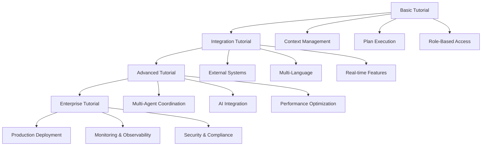

# MPLP Tutorials

**Multi-Agent Protocol Lifecycle Platform - Comprehensive Tutorials v1.0.0-alpha**

[](./README.md)
[](./examples.md)
[](./quick-start.md)
[](../zh-CN/developers/tutorials.md)

---

## 🎯 Tutorials Overview

Welcome to the MPLP comprehensive tutorial series! These step-by-step guides will take you from basic concepts to advanced multi-agent system development. Each tutorial builds upon previous knowledge and includes working code examples, best practices, and real-world scenarios.

### **Learning Path**


### **Tutorial Categories**
- **Beginner Tutorials**: Core concepts and basic implementation
- **Intermediate Tutorials**: Integration patterns and advanced features
- **Advanced Tutorials**: Multi-agent coordination and optimization
- **Enterprise Tutorials**: Production deployment and enterprise features

---

## 🚀 Basic Tutorial: Building Your First MPLP Application

### **Tutorial Overview**
**Duration**: 30 minutes  
**Prerequisites**: Completed [Quick Start Guide](./quick-start.md)  
**What You'll Build**: A task management system with context sharing and plan execution

### **Step 1: Project Setup**
```bash
# Create new project
mkdir mplp-task-manager
cd mplp-task-manager

# Initialize project
npm init -y
npm install @mplp/core @mplp/context @mplp/plan @mplp/role @mplp/confirm @mplp/trace
npm install -D typescript @types/node ts-node

# Create TypeScript configuration
cat > tsconfig.json << EOF
{
  "compilerOptions": {
    "target": "ES2020",
    "module": "commonjs",
    "lib": ["ES2020"],
    "outDir": "./dist",
    "rootDir": "./src",
    "strict": true,
    "esModuleInterop": true,
    "skipLibCheck": true,
    "forceConsistentCasingInFileNames": true
  },
  "include": ["src/**/*"],
  "exclude": ["node_modules", "dist"]
}
EOF
```

### **Step 2: Configuration Setup**
```typescript
// src/config.ts
import { MPLPConfiguration } from '@mplp/core';

export const config: MPLPConfiguration = {
  core: {
    protocolVersion: '1.0.0-alpha',
    environment: 'development',
    logLevel: 'info'
  },
  modules: {
    context: { enabled: true },
    plan: { enabled: true },
    role: { enabled: true },
    confirm: { enabled: true },
    trace: { enabled: true }
  },
  database: {
    type: 'memory', // For tutorial simplicity
    options: {}
  },
  cache: {
    type: 'memory',
    options: {}
  }
};
```

### **Step 3: Task Management Service**
```typescript
// src/task-manager.ts
import { MPLPClient } from '@mplp/core';
import { config } from './config';

export interface Task {
  taskId: string;
  title: string;
  description: string;
  priority: 'low' | 'medium' | 'high';
  status: 'pending' | 'in_progress' | 'completed' | 'cancelled';
  assignedTo?: string;
  dueDate?: Date;
  dependencies?: string[];
}

export class TaskManager {
  private client: MPLPClient;

  constructor() {
    this.client = new MPLPClient(config);
  }

  async initialize(): Promise<void> {
    await this.client.initialize();
    console.log('✅ Task Manager initialized');
  }

  async createTask(task: Omit<Task, 'taskId' | 'status'>): Promise<Task> {
    const taskId = `task-${Date.now()}-${Math.random().toString(36).substr(2, 9)}`;
    
    // Create context for task coordination
    const context = await this.client.context.createContext({
      contextId: `ctx-${taskId}`,
      contextType: 'task_management',
      contextData: {
        taskId,
        title: task.title,
        description: task.description,
        priority: task.priority,
        assignedTo: task.assignedTo,
        dueDate: task.dueDate?.toISOString(),
        dependencies: task.dependencies || [],
        createdAt: new Date().toISOString()
      },
      createdBy: 'task-manager'
    });

    const fullTask: Task = {
      taskId,
      ...task,
      status: 'pending'
    };

    console.log(`📋 Task created: ${taskId} - ${task.title}`);
    return fullTask;
  }

  async executeTask(taskId: string): Promise<void> {
    const contextId = `ctx-${taskId}`;
    
    // Get task context
    const context = await this.client.context.getContext(contextId);
    if (!context) {
      throw new Error(`Task not found: ${taskId}`);
    }

    // Create execution plan
    const plan = await this.client.plan.createPlan({
      planId: `plan-${taskId}`,
      contextId: contextId,
      planType: 'sequential_workflow',
      planSteps: [
        {
          stepId: 'step-001',
          operation: 'validate_task',
          parameters: { taskId },
          estimatedDuration: 5
        },
        {
          stepId: 'step-002',
          operation: 'check_dependencies',
          parameters: { dependencies: context.contextData.dependencies },
          estimatedDuration: 10
        },
        {
          stepId: 'step-003',
          operation: 'execute_task_logic',
          parameters: { 
            taskId,
            priority: context.contextData.priority,
            assignedTo: context.contextData.assignedTo
          },
          estimatedDuration: 30
        },
        {
          stepId: 'step-004',
          operation: 'update_status',
          parameters: { taskId, status: 'completed' },
          estimatedDuration: 5
        }
      ],
      createdBy: 'task-manager'
    });

    // Start tracing
    const trace = await this.client.trace.startTrace({
      traceId: `trace-${taskId}`,
      contextId: contextId,
      planId: plan.planId,
      traceType: 'task_execution',
      operation: 'execute_task',
      startedBy: 'task-manager'
    });

    console.log(`⚡ Executing task: ${taskId}`);

    // Execute plan
    const result = await this.client.plan.executePlan(plan.planId, {
      traceId: trace.traceId,
      executionMode: 'sequential',
      timeoutSeconds: 120
    });

    // End trace
    await this.client.trace.endTrace(trace.traceId);

    if (result.executionStatus === 'completed') {
      console.log(`✅ Task completed: ${taskId}`);
      
      // Update context with completion
      await this.client.context.updateContext(contextId, {
        contextData: {
          ...context.contextData,
          status: 'completed',
          completedAt: new Date().toISOString(),
          executionDuration: result.totalDuration
        },
        updatedBy: 'task-manager'
      });
    } else {
      console.log(`❌ Task failed: ${taskId} - ${result.error}`);
      throw new Error(`Task execution failed: ${result.error}`);
    }
  }

  async getTaskStatus(taskId: string): Promise<Task | null> {
    const contextId = `ctx-${taskId}`;
    const context = await this.client.context.getContext(contextId);
    
    if (!context) {
      return null;
    }

    return {
      taskId,
      title: context.contextData.title,
      description: context.contextData.description,
      priority: context.contextData.priority,
      status: context.contextData.status || 'pending',
      assignedTo: context.contextData.assignedTo,
      dueDate: context.contextData.dueDate ? new Date(context.contextData.dueDate) : undefined,
      dependencies: context.contextData.dependencies || []
    };
  }

  async listTasks(): Promise<Task[]> {
    const contexts = await this.client.context.searchContexts({
      contextType: 'task_management',
      limit: 100
    });

    return contexts.results.map(context => ({
      taskId: context.contextData.taskId,
      title: context.contextData.title,
      description: context.contextData.description,
      priority: context.contextData.priority,
      status: context.contextData.status || 'pending',
      assignedTo: context.contextData.assignedTo,
      dueDate: context.contextData.dueDate ? new Date(context.contextData.dueDate) : undefined,
      dependencies: context.contextData.dependencies || []
    }));
  }
}
```

### **Step 4: Main Application**
```typescript
// src/app.ts
import { TaskManager } from './task-manager';

async function main() {
  console.log('🚀 Starting MPLP Task Manager Tutorial...');
  
  const taskManager = new TaskManager();
  await taskManager.initialize();

  try {
    // Create some sample tasks
    const task1 = await taskManager.createTask({
      title: 'Setup Development Environment',
      description: 'Install and configure MPLP development tools',
      priority: 'high',
      assignedTo: 'developer-001'
    });

    const task2 = await taskManager.createTask({
      title: 'Write Unit Tests',
      description: 'Create comprehensive unit tests for task manager',
      priority: 'medium',
      assignedTo: 'developer-002',
      dependencies: [task1.taskId]
    });

    const task3 = await taskManager.createTask({
      title: 'Deploy to Staging',
      description: 'Deploy task manager to staging environment',
      priority: 'low',
      assignedTo: 'devops-001',
      dependencies: [task1.taskId, task2.taskId]
    });

    console.log('\n📋 Created Tasks:');
    const tasks = await taskManager.listTasks();
    tasks.forEach(task => {
      console.log(`  - ${task.taskId}: ${task.title} (${task.priority}) -> ${task.assignedTo}`);
    });

    // Execute tasks in dependency order
    console.log('\n⚡ Executing Tasks:');
    
    // Execute task1 (no dependencies)
    await taskManager.executeTask(task1.taskId);
    
    // Execute task2 (depends on task1)
    await taskManager.executeTask(task2.taskId);
    
    // Execute task3 (depends on task1 and task2)
    await taskManager.executeTask(task3.taskId);

    // Show final status
    console.log('\n📊 Final Task Status:');
    const finalTasks = await taskManager.listTasks();
    finalTasks.forEach(task => {
      console.log(`  - ${task.title}: ${task.status}`);
    });

    console.log('\n🎉 Tutorial completed successfully!');

  } catch (error) {
    console.error('❌ Tutorial failed:', error);
  }
}

main().catch(console.error);
```

### **Step 5: Run the Tutorial**
```bash
# Create directory structure
mkdir src

# Copy the code files above into src/

# Run the tutorial
npx ts-node src/app.ts

# Expected output:
# 🚀 Starting MPLP Task Manager Tutorial...
# ✅ Task Manager initialized
# 📋 Task created: task-1725456789123-abc123 - Setup Development Environment
# 📋 Task created: task-1725456789456-def456 - Write Unit Tests
# 📋 Task created: task-1725456789789-ghi789 - Deploy to Staging
# 
# 📋 Created Tasks:
#   - task-1725456789123-abc123: Setup Development Environment (high) -> developer-001
#   - task-1725456789456-def456: Write Unit Tests (medium) -> developer-002
#   - task-1725456789789-ghi789: Deploy to Staging (low) -> devops-001
# 
# ⚡ Executing Tasks:
# ⚡ Executing task: task-1725456789123-abc123
# ✅ Task completed: task-1725456789123-abc123
# ⚡ Executing task: task-1725456789456-def456
# ✅ Task completed: task-1725456789456-def456
# ⚡ Executing task: task-1725456789789-ghi789
# ✅ Task completed: task-1725456789789-ghi789
# 
# 📊 Final Task Status:
#   - Setup Development Environment: completed
#   - Write Unit Tests: completed
#   - Deploy to Staging: completed
# 
# 🎉 Tutorial completed successfully!
```

---

## 🔧 Integration Tutorial: Connecting External Systems

### **Tutorial Overview**
**Duration**: 45 minutes  
**Prerequisites**: Completed Basic Tutorial  
**What You'll Build**: Integration with external APIs and databases

### **Step 1: External Service Integration**
```typescript
// src/integrations/external-api.ts
import { MPLPClient } from '@mplp/core';

export class ExternalAPIIntegration {
  private client: MPLPClient;

  constructor(client: MPLPClient) {
    this.client = client;
  }

  async integrateWithCRM(customerId: string): Promise<any> {
    // Create context for CRM integration
    const context = await this.client.context.createContext({
      contextId: `crm-integration-${customerId}`,
      contextType: 'external_integration',
      contextData: {
        integrationType: 'crm',
        customerId: customerId,
        integrationStarted: new Date().toISOString()
      },
      createdBy: 'integration-service'
    });

    // Create integration plan
    const plan = await this.client.plan.createPlan({
      planId: `crm-plan-${customerId}`,
      contextId: context.contextId,
      planType: 'external_integration',
      planSteps: [
        {
          stepId: 'authenticate',
          operation: 'crm_authenticate',
          parameters: { apiKey: process.env.CRM_API_KEY },
          estimatedDuration: 10
        },
        {
          stepId: 'fetch_customer',
          operation: 'crm_fetch_customer',
          parameters: { customerId },
          estimatedDuration: 20
        },
        {
          stepId: 'sync_data',
          operation: 'crm_sync_data',
          parameters: { customerId },
          estimatedDuration: 30
        }
      ],
      createdBy: 'integration-service'
    });

    // Execute integration
    const result = await this.client.plan.executePlan(plan.planId);
    
    if (result.executionStatus === 'completed') {
      console.log(`✅ CRM integration completed for customer: ${customerId}`);
      return result.executionResult;
    } else {
      throw new Error(`CRM integration failed: ${result.error}`);
    }
  }
}
```

### **Step 2: Database Integration**
```typescript
// src/integrations/database.ts
import { MPLPClient } from '@mplp/core';

export class DatabaseIntegration {
  private client: MPLPClient;

  constructor(client: MPLPClient) {
    this.client = client;
  }

  async syncWithDatabase(tableName: string, data: any[]): Promise<void> {
    const context = await this.client.context.createContext({
      contextId: `db-sync-${tableName}-${Date.now()}`,
      contextType: 'database_sync',
      contextData: {
        tableName,
        recordCount: data.length,
        syncStarted: new Date().toISOString()
      },
      createdBy: 'database-service'
    });

    const plan = await this.client.plan.createPlan({
      planId: `db-plan-${tableName}-${Date.now()}`,
      contextId: context.contextId,
      planType: 'parallel_workflow',
      planSteps: data.map((record, index) => ({
        stepId: `sync-record-${index}`,
        operation: 'database_upsert',
        parameters: { tableName, record },
        estimatedDuration: 5
      })),
      createdBy: 'database-service'
    });

    const result = await this.client.plan.executePlan(plan.planId, {
      executionMode: 'parallel',
      maxParallelSteps: 10
    });

    if (result.executionStatus === 'completed') {
      console.log(`✅ Database sync completed for table: ${tableName}`);
    } else {
      throw new Error(`Database sync failed: ${result.error}`);
    }
  }
}
```

---

## 🎯 Advanced Tutorial: Multi-Agent Coordination

### **Tutorial Overview**
**Duration**: 60 minutes  
**Prerequisites**: Completed Integration Tutorial  
**What You'll Build**: Coordinated multi-agent system with role-based collaboration

### **Step 1: Agent Coordination System**
```typescript
// src/agents/coordination-system.ts
import { MPLPClient } from '@mplp/core';

export interface Agent {
  agentId: string;
  agentType: string;
  capabilities: string[];
  status: 'idle' | 'busy' | 'offline';
  currentTask?: string;
}

export class MultiAgentCoordinator {
  private client: MPLPClient;
  private agents: Map<string, Agent> = new Map();

  constructor(client: MPLPClient) {
    this.client = client;
  }

  async registerAgent(agent: Agent): Promise<void> {
    // Create context for agent registration
    const context = await this.client.context.createContext({
      contextId: `agent-${agent.agentId}`,
      contextType: 'agent_registration',
      contextData: {
        agentId: agent.agentId,
        agentType: agent.agentType,
        capabilities: agent.capabilities,
        registeredAt: new Date().toISOString()
      },
      createdBy: 'coordination-system'
    });

    // Assign role to agent
    await this.client.role.assignRole({
      userId: agent.agentId,
      roleId: `agent-${agent.agentType}`,
      assignedBy: 'coordination-system',
      contextId: context.contextId
    });

    this.agents.set(agent.agentId, agent);
    console.log(`🤖 Agent registered: ${agent.agentId} (${agent.agentType})`);
  }

  async coordinateTask(taskDescription: string, requiredCapabilities: string[]): Promise<string> {
    // Find suitable agents
    const suitableAgents = Array.from(this.agents.values()).filter(agent =>
      agent.status === 'idle' &&
      requiredCapabilities.every(cap => agent.capabilities.includes(cap))
    );

    if (suitableAgents.length === 0) {
      throw new Error('No suitable agents available');
    }

    // Create coordination context
    const coordinationId = `coordination-${Date.now()}`;
    const context = await this.client.context.createContext({
      contextId: coordinationId,
      contextType: 'multi_agent_coordination',
      contextData: {
        taskDescription,
        requiredCapabilities,
        availableAgents: suitableAgents.map(a => a.agentId),
        coordinationStarted: new Date().toISOString()
      },
      createdBy: 'coordination-system'
    });

    // Create coordination plan
    const plan = await this.client.plan.createPlan({
      planId: `coord-plan-${coordinationId}`,
      contextId: context.contextId,
      planType: 'multi_agent_workflow',
      planSteps: [
        {
          stepId: 'agent-selection',
          operation: 'select_optimal_agent',
          parameters: { 
            availableAgents: suitableAgents.map(a => a.agentId),
            requiredCapabilities
          },
          estimatedDuration: 10
        },
        {
          stepId: 'task-assignment',
          operation: 'assign_task_to_agent',
          parameters: { taskDescription },
          estimatedDuration: 5
        },
        {
          stepId: 'monitor-execution',
          operation: 'monitor_agent_execution',
          parameters: { monitoringInterval: 5000 },
          estimatedDuration: 60
        }
      ],
      createdBy: 'coordination-system'
    });

    // Execute coordination
    const result = await this.client.plan.executePlan(plan.planId);

    if (result.executionStatus === 'completed') {
      console.log(`✅ Task coordination completed: ${coordinationId}`);
      return coordinationId;
    } else {
      throw new Error(`Task coordination failed: ${result.error}`);
    }
  }

  async getCoordinationStatus(coordinationId: string): Promise<any> {
    const context = await this.client.context.getContext(coordinationId);
    return context?.contextData;
  }
}
```

### **Step 2: Specialized Agents**
```typescript
// src/agents/specialized-agents.ts
export class DataProcessingAgent {
  constructor(private agentId: string, private coordinator: MultiAgentCoordinator) {}

  async processData(data: any[]): Promise<any> {
    console.log(`📊 ${this.agentId}: Processing ${data.length} records`);
    
    // Simulate data processing
    await new Promise(resolve => setTimeout(resolve, 2000));
    
    return {
      processedRecords: data.length,
      processingTime: 2000,
      agentId: this.agentId
    };
  }
}

export class ValidationAgent {
  constructor(private agentId: string, private coordinator: MultiAgentCoordinator) {}

  async validateData(data: any[]): Promise<boolean> {
    console.log(`✅ ${this.agentId}: Validating ${data.length} records`);
    
    // Simulate validation
    await new Promise(resolve => setTimeout(resolve, 1000));
    
    return true; // All valid for demo
  }
}

export class ReportingAgent {
  constructor(private agentId: string, private coordinator: MultiAgentCoordinator) {}

  async generateReport(processedData: any): Promise<string> {
    console.log(`📋 ${this.agentId}: Generating report`);
    
    // Simulate report generation
    await new Promise(resolve => setTimeout(resolve, 1500));
    
    return `Report generated by ${this.agentId} at ${new Date().toISOString()}`;
  }
}
```

---

## 🔗 Related Resources

- **[Developer Resources Overview](./README.md)** - Complete developer guide
- **[Quick Start Guide](./quick-start.md)** - Get started quickly
- **[Code Examples](./examples.md)** - Working code samples
- **[SDK Documentation](./sdk.md)** - Language-specific guides
- **[Community Resources](./community-resources.md)** - Community support

---

**Tutorials Version**: 1.0.0-alpha  
**Last Updated**: September 4, 2025  
**Next Review**: December 4, 2025  
**Status**: Learning Ready  

**⚠️ Alpha Notice**: These tutorials provide comprehensive learning paths for MPLP v1.0 Alpha development. Additional tutorials and interactive learning features will be added in Beta release based on developer feedback and learning analytics.
