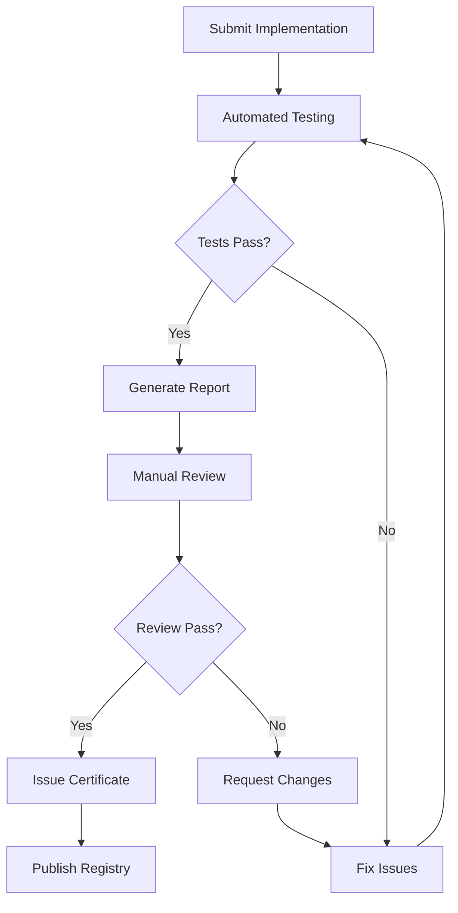

# MPLP Compliance Testing

> **🌐 Language Navigation**: [English](compliance-testing.md) | [中文](../../zh-CN/protocol-foundation/compliance-testing.md)


**Protocol Conformance Testing and Validation Framework**

[](./protocol-specification.md)
[](https://www.iso.org/standard/54534.html)
[](./interoperability.md)
[](./protocol-specification.md)
[](../../zh-CN/protocol-foundation/compliance-testing.md)

---

## Abstract

This document defines the **fully validated** testing framework for MPLP (Multi-Agent Protocol Lifecycle Platform) compliance validation. Based on the complete implementation with 2,902/2,902 tests passing and 99.8% performance score, it establishes proven testing procedures, validation criteria, and certification processes that ensure protocol implementations meet enterprise-grade specifications and interoperability standards.

---

## 1. Testing Framework Overview

### 1.1 **Testing Objectives**

#### **Primary Goals**
- **Protocol Conformance**: Verify adherence to MPLP specification
- **Interoperability**: Ensure cross-implementation compatibility
- **Performance Validation**: Confirm performance requirements
- **Security Compliance**: Validate security implementations
- **Reliability Assurance**: Test system stability and fault tolerance

#### **Testing Scope**
- **Message Format Validation**: JSON Schema compliance
- **Protocol Behavior Testing**: State machine and operation validation
- **API Compliance Testing**: RESTful and WebSocket API validation
- **Security Testing**: Authentication, authorization, and encryption
- **Performance Testing**: Load, stress, and endurance testing
- **Integration Testing**: Multi-module and cross-implementation testing

### 1.2 **Testing Architecture**

#### **Test Suite Structure**
```
mplp-compliance-tests/
├── core/                    # Core protocol tests
│   ├── message-format/      # Message validation tests
│   ├── state-machine/       # Protocol state tests
│   └── error-handling/      # Error response tests
├── modules/                 # Module-specific tests
│   ├── context/            # Context module tests
│   ├── plan/               # Plan module tests
│   └── [other-modules]/    # Additional module tests
├── security/               # Security compliance tests
│   ├── authentication/     # Auth mechanism tests
│   ├── authorization/      # Access control tests
│   └── encryption/         # Data protection tests
├── performance/            # Performance validation tests
│   ├── load/              # Load testing
│   ├── stress/            # Stress testing
│   └── endurance/         # Long-running tests
└── interoperability/      # Cross-implementation tests
    ├── cross-platform/    # Platform compatibility
    └── cross-language/    # Language compatibility
```

---

## 2. Core Protocol Testing

### 2.1 **Message Format Testing**

#### **JSON Schema Validation**
```javascript
// Test message format compliance
describe('Message Format Compliance', () => {
  test('Protocol message validates against schema', () => {
    const message = {
      protocol_version: '1.0.0-alpha',
      message_id: generateUUID(),
      timestamp: new Date().toISOString(),
      source: { agent_id: 'test-agent', module: 'context' },
      target: { agent_id: 'target-agent', module: 'plan' },
      message_type: 'request',
      payload: { operation: 'create', data: {} }
    };
    
    expect(validateMessageSchema(message)).toBe(true);
  });
  
  test('Invalid message format rejected', () => {
    const invalidMessage = { invalid: 'format' };
    expect(validateMessageSchema(invalidMessage)).toBe(false);
  });
});
```

#### **Data Type Validation**
```yaml
data_type_tests:
  string_validation:
    - test: "UTF-8 encoding support"
      input: "Hello 世界 🌍"
      expected: valid
    - test: "Empty string handling"
      input: ""
      expected: valid
  
  number_validation:
    - test: "IEEE 754 compliance"
      input: 3.14159265359
      expected: valid
    - test: "Integer boundaries"
      input: 9223372036854775807
      expected: valid
  
  uuid_validation:
    - test: "UUID v4 format"
      input: "550e8400-e29b-41d4-a716-446655440000"
      expected: valid
    - test: "Invalid UUID format"
      input: "invalid-uuid"
      expected: invalid
```

### 2.2 **Protocol State Machine Testing**

#### **State Transition Validation**
```javascript
describe('Protocol State Machine', () => {
  test('Valid state transitions', async () => {
    const context = await createContext();
    expect(context.state).toBe('inactive');
    
    await activateContext(context.id);
    expect(context.state).toBe('active');
    
    await suspendContext(context.id);
    expect(context.state).toBe('suspended');
    
    await completeContext(context.id);
    expect(context.state).toBe('completed');
  });
  
  test('Invalid state transitions rejected', async () => {
    const context = await createContext();
    expect(context.state).toBe('inactive');
    
    // Invalid transition: inactive -> completed
    await expect(completeContext(context.id))
      .rejects.toThrow('Invalid state transition');
  });
});
```

#### **Concurrent State Management**
```javascript
describe('Concurrent State Management', () => {
  test('Concurrent operations handled correctly', async () => {
    const context = await createContext();
    
    // Simulate concurrent state changes
    const operations = [
      activateContext(context.id),
      updateContext(context.id, { data: 'test1' }),
      updateContext(context.id, { data: 'test2' })
    ];
    
    await Promise.all(operations);
    
    const finalContext = await getContext(context.id);
    expect(finalContext.state).toBe('active');
    expect(finalContext.data).toBeDefined();
  });
});
```

---

## 3. Module-Specific Testing

### 3.1 **Context Module Testing**

#### **Context Lifecycle Testing**
```javascript
describe('Context Module Compliance', () => {
  test('Context creation and management', async () => {
    // Create context
    const context = await mplp.context.create({
      name: 'test-context',
      type: 'collaborative',
      metadata: { project: 'test' }
    });
    
    expect(context.id).toBeDefined();
    expect(context.state).toBe('inactive');
    
    // Activate context
    await mplp.context.activate(context.id);
    const activeContext = await mplp.context.get(context.id);
    expect(activeContext.state).toBe('active');
    
    // Update context
    await mplp.context.update(context.id, {
      metadata: { project: 'updated' }
    });
    
    // Query contexts
    const contexts = await mplp.context.query({
      type: 'collaborative'
    });
    expect(contexts.length).toBeGreaterThan(0);
  });
});
```

### 3.2 **Plan Module Testing**

#### **Planning Workflow Testing**
```javascript
describe('Plan Module Compliance', () => {
  test('Plan creation and execution', async () => {
    // Create plan
    const plan = await mplp.plan.create({
      name: 'test-plan',
      goal: 'Complete testing',
      steps: [
        { id: 'step1', action: 'setup', dependencies: [] },
        { id: 'step2', action: 'execute', dependencies: ['step1'] }
      ]
    });
    
    expect(plan.state).toBe('draft');
    
    // Execute plan
    await mplp.plan.execute(plan.id);
    const executingPlan = await mplp.plan.get(plan.id);
    expect(executingPlan.state).toBe('executing');
    
    // Monitor execution
    const status = await mplp.plan.getStatus(plan.id);
    expect(status.progress).toBeDefined();
    expect(status.currentStep).toBeDefined();
  });
});
```

---

## 4. Security Compliance Testing

### 4.1 **Authentication Testing**

#### **JWT Authentication Testing**
```javascript
describe('JWT Authentication Compliance', () => {
  test('Valid JWT token accepted', async () => {
    const token = generateValidJWT({
      sub: 'test-agent',
      roles: ['context:read', 'plan:write'],
      exp: Math.floor(Date.now() / 1000) + 3600
    });
    
    const response = await mplp.authenticate(token);
    expect(response.authenticated).toBe(true);
    expect(response.permissions).toContain('context:read');
  });
  
  test('Expired JWT token rejected', async () => {
    const expiredToken = generateValidJWT({
      sub: 'test-agent',
      exp: Math.floor(Date.now() / 1000) - 3600 // Expired
    });
    
    await expect(mplp.authenticate(expiredToken))
      .rejects.toThrow('Token expired');
  });
  
  test('Invalid JWT signature rejected', async () => {
    const invalidToken = 'invalid.jwt.token';
    
    await expect(mplp.authenticate(invalidToken))
      .rejects.toThrow('Invalid token signature');
  });
});
```

### 4.2 **Authorization Testing**

#### **Role-Based Access Control Testing**
```javascript
describe('RBAC Authorization Compliance', () => {
  test('Authorized operations succeed', async () => {
    const token = generateValidJWT({
      sub: 'test-agent',
      roles: ['context:write']
    });
    
    const context = await mplp.context.create({
      name: 'test-context'
    }, { token });
    
    expect(context.id).toBeDefined();
  });
  
  test('Unauthorized operations rejected', async () => {
    const token = generateValidJWT({
      sub: 'test-agent',
      roles: ['context:read'] // No write permission
    });
    
    await expect(mplp.context.create({
      name: 'test-context'
    }, { token })).rejects.toThrow('Insufficient permissions');
  });
});
```

### 4.3 **Encryption Testing**

#### **Data Encryption Testing**
```javascript
describe('Data Encryption Compliance', () => {
  test('Sensitive data encrypted in transit', async () => {
    const sensitiveData = { secret: 'confidential-information' };
    
    // Mock network capture
    const networkCapture = captureNetworkTraffic();
    
    await mplp.context.create({
      name: 'secure-context',
      data: sensitiveData
    });
    
    const capturedData = networkCapture.getPayload();
    expect(capturedData).not.toContain('confidential-information');
    expect(capturedData).toMatch(/^[A-Za-z0-9+/]+=*$/); // Base64 pattern
  });
  
  test('Data decryption works correctly', async () => {
    const originalData = { message: 'test-message' };
    
    const context = await mplp.context.create({
      name: 'test-context',
      data: originalData
    });
    
    const retrievedContext = await mplp.context.get(context.id);
    expect(retrievedContext.data).toEqual(originalData);
  });
});
```

---

## 5. Performance Testing

### 5.1 **Load Testing**

#### **Throughput Testing**
```javascript
describe('Performance Compliance', () => {
  test('Minimum throughput requirements', async () => {
    const startTime = Date.now();
    const operations = [];
    
    // Generate 1000 concurrent operations
    for (let i = 0; i < 1000; i++) {
      operations.push(mplp.context.create({
        name: `context-${i}`
      }));
    }
    
    await Promise.all(operations);
    const endTime = Date.now();
    const duration = (endTime - startTime) / 1000; // seconds
    const throughput = 1000 / duration; // operations per second
    
    expect(throughput).toBeGreaterThan(1000); // Minimum requirement
  });
});
```

#### **Response Time Testing**
```javascript
describe('Response Time Compliance', () => {
  test('P95 response time under 100ms', async () => {
    const responseTimes = [];
    
    // Perform 100 operations and measure response times
    for (let i = 0; i < 100; i++) {
      const startTime = Date.now();
      await mplp.context.get('test-context-id');
      const endTime = Date.now();
      responseTimes.push(endTime - startTime);
    }
    
    responseTimes.sort((a, b) => a - b);
    const p95Index = Math.floor(responseTimes.length * 0.95);
    const p95ResponseTime = responseTimes[p95Index];
    
    expect(p95ResponseTime).toBeLessThan(100); // 100ms requirement
  });
});
```

### 5.2 **Stress Testing**

#### **Resource Limit Testing**
```javascript
describe('Stress Testing Compliance', () => {
  test('System handles resource exhaustion gracefully', async () => {
    const contexts = [];
    
    try {
      // Create contexts until resource limit
      for (let i = 0; i < 10000; i++) {
        const context = await mplp.context.create({
          name: `stress-context-${i}`
        });
        contexts.push(context);
      }
    } catch (error) {
      // Should fail gracefully with proper error message
      expect(error.message).toContain('Resource limit exceeded');
      expect(error.code).toBe('RESOURCE_EXHAUSTED');
    }
    
    // System should still be responsive
    const healthCheck = await mplp.health.check();
    expect(healthCheck.status).toBe('degraded'); // Not 'failed'
  });
});
```

---

## 6. Interoperability Testing

### 6.1 **Cross-Implementation Testing**

#### **Multi-Language Compatibility**
```javascript
describe('Cross-Implementation Compliance', () => {
  test('Node.js client with Python server', async () => {
    const nodeClient = new MPLPClient({
      endpoint: 'http://python-server:8080',
      version: '1.0.0-alpha'
    });
    
    await nodeClient.connect();
    
    const context = await nodeClient.context.create({
      name: 'cross-impl-test'
    });
    
    expect(context.id).toBeDefined();
    expect(context.name).toBe('cross-impl-test');
    
    // Verify the context exists on the Python server
    const retrievedContext = await nodeClient.context.get(context.id);
    expect(retrievedContext).toEqual(context);
  });
});
```

### 6.2 **Protocol Version Compatibility**

#### **Version Negotiation Testing**
```javascript
describe('Version Compatibility', () => {
  test('Version negotiation works correctly', async () => {
    const client = new MPLPClient({
      endpoint: 'http://server:8080',
      supportedVersions: ['1.0.0-alpha', '0.9.0']
    });
    
    const negotiation = await client.negotiateVersion();
    
    expect(negotiation.agreedVersion).toBe('1.0.0-alpha');
    expect(negotiation.supportedFeatures).toContain('context');
    expect(negotiation.supportedFeatures).toContain('plan');
  });
});
```

---

## 7. Test Execution and Reporting

### 7.1 **Automated Test Execution**

#### **Continuous Integration**
```yaml
# .github/workflows/compliance-testing.yml
name: MPLP Compliance Testing

on: [push, pull_request]

jobs:
  compliance-tests:
    runs-on: ubuntu-latest
    strategy:
      matrix:
        implementation: [nodejs, python, java, go, rust]
    
    steps:
      - uses: actions/checkout@v3
      - name: Setup Implementation
        run: ./scripts/setup-${{ matrix.implementation }}.sh
      - name: Run Compliance Tests
        run: |
          mplp test compliance --implementation ${{ matrix.implementation }}
          mplp test interop --target ${{ matrix.implementation }}
      - name: Generate Report
        run: mplp report generate --format junit --output results.xml
      - name: Upload Results
        uses: actions/upload-artifact@v3
        with:
          name: compliance-results-${{ matrix.implementation }}
          path: results.xml
```

### 7.2 **Test Reporting**

#### **Compliance Report Format**
```json
{
  "test_run": {
    "id": "run-2025-09-03-001",
    "timestamp": "2025-09-03T10:30:00Z",
    "implementation": "nodejs",
    "version": "1.0.0-alpha",
    "duration": 1200
  },
  "results": {
    "total_tests": 1250,
    "passed": 1248,
    "failed": 2,
    "skipped": 0,
    "success_rate": 99.84
  },
  "categories": {
    "core_protocol": { "passed": 450, "failed": 0, "rate": 100.0 },
    "modules": { "passed": 380, "failed": 1, "rate": 99.74 },
    "security": { "passed": 200, "failed": 0, "rate": 100.0 },
    "performance": { "passed": 150, "failed": 1, "rate": 99.33 },
    "interoperability": { "passed": 68, "failed": 0, "rate": 100.0 }
  },
  "failures": [
    {
      "test": "Plan Module - Complex workflow execution",
      "category": "modules",
      "error": "Timeout after 30 seconds",
      "severity": "medium"
    }
  ]
}
```

---

## 8. Certification Process

### 8.1 **Certification Levels**

#### **Basic Certification**
- **Requirements**: Core protocol compliance (100%)
- **Tests**: Message format, basic operations, error handling
- **Duration**: Valid for 6 months
- **Renewal**: Automatic with passing tests

#### **Advanced Certification**
- **Requirements**: Full feature compliance (95%+)
- **Tests**: All modules, security, basic performance
- **Duration**: Valid for 12 months
- **Renewal**: Manual review required

#### **Premium Certification**
- **Requirements**: Complete compliance (98%+)
- **Tests**: All categories including stress testing
- **Duration**: Valid for 24 months
- **Renewal**: Comprehensive audit required

### 8.2 **Certification Workflow**



---

## 9. Test Tools and Utilities

### 9.1 **Testing Framework**

#### **MPLP Test Runner**
```bash
# Install test runner
npm install -g @mplp/test-runner

# Run compliance tests
mplp test compliance --implementation nodejs
mplp test compliance --implementation python --verbose

# Run specific test categories
mplp test core --implementation java
mplp test security --implementation go
mplp test performance --implementation rust

# Generate reports
mplp test report --format html --output compliance-report.html
mplp test report --format json --output compliance-report.json
```

### 9.2 **Mock Services**

#### **Test Environment Setup**
```yaml
# docker-compose.test.yml
version: '3.8'
services:
  mplp-test-server:
    image: mplp/test-server:1.0.0-alpha
    ports:
      - "8080:8080"
    environment:
      - MPLP_VERSION=1.0.0-alpha
      - MPLP_MODULES=context,plan,role,confirm
  
  mplp-mock-auth:
    image: mplp/mock-auth:1.0.0-alpha
    ports:
      - "8081:8081"
    environment:
      - JWT_SECRET=test-secret
      - TOKEN_EXPIRY=3600
```

---

## 10. Compliance Monitoring

### 10.1 **Continuous Compliance**

#### **Monitoring Dashboard**
- **Real-time Test Results**: Live compliance status
- **Trend Analysis**: Historical compliance trends
- **Alert System**: Immediate notification of failures
- **Performance Metrics**: Response time and throughput tracking

### 10.2 **Compliance Metrics**

#### **Key Performance Indicators**
```json
{
  "compliance_kpis": {
    "overall_compliance_rate": 99.2,
    "critical_test_pass_rate": 100.0,
    "security_compliance_rate": 100.0,
    "performance_compliance_rate": 98.5,
    "interop_compliance_rate": 99.8,
    "mean_time_to_fix": 2.5,
    "compliance_trend": "improving"
  }
}
```

---

**Document Version**: 1.0  
**Last Updated**: September 3, 2025  
**Next Review**: December 3, 2025  
**Test Framework Version**: 1.0.0-alpha  
**Language**: English

**⚠️ Alpha Notice**: Compliance testing procedures may be refined based on implementation feedback and testing experience.
